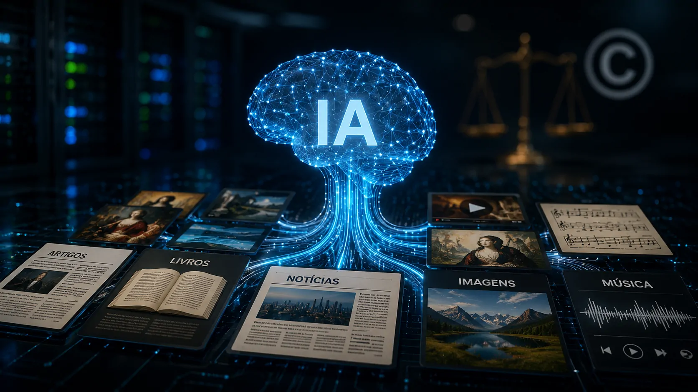
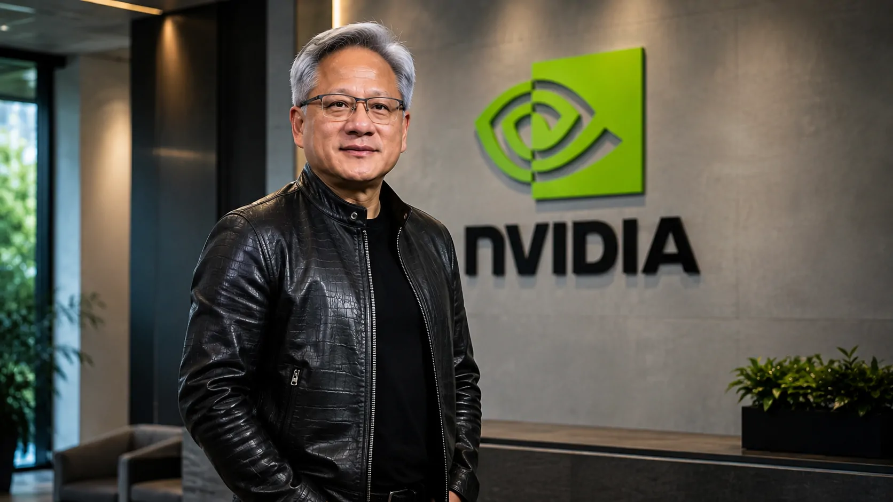
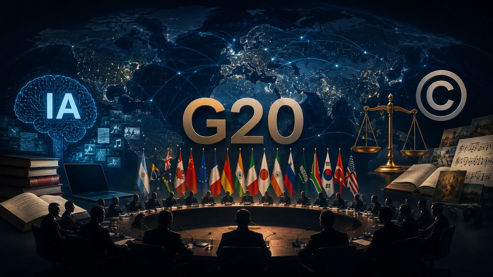

*Os Estados Unidos querem levar ao G20 uma visão regulatória mais favorável ao treinamento de inteligência artificial com obras protegidas por direitos autorais. A proposta surge enquanto as principais empresas de IA enfrentam processos de criadores e enquanto governos tentam definir até onde a inovação pode avançar sem alterar o equilíbrio do mercado de conteúdo.*

## EUA levam o treinamento de IA para a agenda do G20

Os **Estados Unidos** querem que os países do **G20** desenvolvam regras que permitam às empresas de inteligência artificial utilizar conteúdo protegido por direitos autorais no treinamento de seus modelos, preservando mecanismos de proteção para os criadores.

A posição foi apresentada pelo secretário de Comércio dos EUA, **Howard Lutnick**, durante uma reunião do G20 voltada à tecnologia, realizada na Carolina do Norte. Segundo a proposta americana, os países deveriam considerar o princípio de **fair use**, conceito do direito autoral dos Estados Unidos que permite determinados usos de obras protegidas sem autorização, dependendo das circunstâncias.

A discussão ganha peso porque o treinamento de modelos de IA depende de grandes volumes de dados. Sistemas capazes de gerar texto, imagens e outros conteúdos são desenvolvidos a partir da análise de materiais que podem incluir livros, músicas, obras visuais e textos publicados.

### O ponto central da proposta americana

Lutnick defendeu uma estrutura que tente proteger artistas e inventores sem criar barreiras que, na visão dos EUA, possam limitar a próxima geração de inovação tecnológica.

O governo americano, porém, não apresentou no encontro uma proposta detalhada de como essa proteção deveria funcionar na prática. Isso significa que a discussão ainda está no campo das diretrizes e da orientação regulatória, e não de uma regra internacional já aprovada.

## Por que o copyright virou um problema estratégico para a IA

*O treinamento de modelos de IA depende de grandes volumes de dados, tornando a origem e o status jurídico dos conteúdos uma questão estratégica para a indústria.*

O conflito entre **IA e direitos autorais** deixou de ser apenas uma discussão jurídica entre empresas e criadores e passou a envolver a própria competitividade da indústria tecnológica.

Empresas como **OpenAI**, **Anthropic**, **Google** e **Meta** enfrentam processos nos Estados Unidos relacionados ao uso de obras de autores, editoras, organizações de mídia e outros criadores. Os processos questionam se o uso desses materiais para desenvolver sistemas de IA pode ocorrer sem autorização ou licenciamento.

### A disputa sobre o que acontece durante o treinamento

Treinar um modelo significa expô-lo a grandes quantidades de dados para que ele identifique padrões e desenvolva capacidades de geração. O debate jurídico está justamente em determinar se essa utilização de obras protegidas constitui uma forma permitida de uso ou se exige autorização dos detentores dos direitos.

A indústria de IA sustenta que o treinamento produz sistemas capazes de gerar resultados novos e que esse processo pode ser considerado transformativo. Criadores e empresas de conteúdo, por outro lado, argumentam que suas obras podem estar sendo utilizadas como matéria-prima comercial sem remuneração adequada.

### O papel do fair use

O **fair use** é especialmente relevante porque faz parte do sistema jurídico americano, mas não representa automaticamente uma regra internacional. Outros países possuem legislações próprias e podem estabelecer limites diferentes para mineração de dados, treinamento de modelos e utilização de obras protegidas.

É justamente essa diferença que torna a discussão no G20 estratégica. Uma eventual convergência entre grandes economias poderia reduzir incertezas para empresas que desenvolvem modelos globais, mas também poderia pressionar países a encontrar novos mecanismos de proteção para criadores.

## O governo dos EUA também apoia a OpenAI em disputa judicial

A pressão internacional acontece no mesmo dia em que o **Departamento de Justiça dos Estados Unidos** apresentou uma manifestação favorável à **OpenAI** em sua disputa com o **The New York Times** e outros veículos de imprensa.

O governo americano argumentou que o treinamento de modelos de linguagem com material protegido pode, em termos gerais, se enquadrar em **fair use**. A manifestação foi apresentada em um processo que questiona o uso de trabalhos jornalísticos no desenvolvimento dos modelos utilizados pelo ChatGPT.

Esse movimento dá uma dimensão adicional à posição apresentada no G20. Não se trata apenas de defender uma determinada política para outros países, mas de sustentar também uma interpretação favorável às empresas de IA dentro de uma disputa jurídica doméstica.

### Uma disputa que pode definir precedentes

As decisões judiciais sobre treinamento de IA podem influenciar a forma como empresas estruturam seus bancos de dados, negociam licenças e desenvolvem novos modelos.

O problema é que ainda não existe uma interpretação única capaz de encerrar todas as disputas. Casos diferentes podem envolver tipos distintos de conteúdo, formas diferentes de acesso aos dados e circunstâncias específicas de utilização.

Para acompanhar como governos estão tratando a governança tecnológica, o cenário também pode ser comparado com movimentos regulatórios recentes, como o avanço de **novas regras para o uso de IA em setores sensíveis** analisado pelo Notícia Tech em **[uma decisão brasileira que estabeleceu novas regras para o uso de IA por médicos e instituições de saúde](https://noticiatech.com.br/inteligencia-artificial/brasil-cria-novas-regras-uso-ia-medicos-instituicoes-saude/)**.

## Jensen Huang alerta contra regras baseadas em danos teóricos

*O debate regulatório coloca líderes da indústria de IA diante de governos que precisam equilibrar inovação, riscos e interesses econômicos.*

A discussão no G20 não ficou restrita aos direitos autorais. **Jensen Huang**, CEO da **Nvidia**, defendeu que os governos evitem criar regras de inteligência artificial baseadas principalmente em danos considerados teóricos.

Huang argumentou que a regulamentação deveria se concentrar em problemas reais associados à tecnologia. A posição acompanha uma preocupação recorrente entre empresas do setor: normas excessivamente restritivas podem aumentar custos, retardar lançamentos e limitar a capacidade de competição das companhias americanas.

### O conflito regulatório vai além do copyright

A questão dos direitos autorais faz parte de um debate maior sobre como governos devem regular sistemas de IA sem impedir o desenvolvimento tecnológico.

Para empresas que investem bilhões de dólares em modelos, infraestrutura e pesquisa, a previsibilidade regulatória tem valor estratégico. Regras diferentes em cada país podem aumentar a complexidade de operação e criar vantagens ou desvantagens competitivas entre mercados.

Ao mesmo tempo, para criadores, editoras e organizações de mídia, uma legislação permissiva pode alterar a economia de produção e distribuição de conteúdo. A questão central passa a ser quem controla os dados usados para construir os modelos e em quais condições esses dados podem ser explorados comercialmente.

## O que pode mudar para empresas que desenvolvem IA

Uma eventual convergência regulatória favorável ao treinamento com conteúdo protegido poderia reduzir parte da incerteza enfrentada pelas empresas de inteligência artificial, especialmente aquelas que operam modelos em escala global.

Isso não significa necessariamente que todas as empresas poderiam utilizar qualquer conteúdo sem restrições. A proposta apresentada pelos EUA combina a defesa do **fair use** com a necessidade de proteger criadores, e a forma de transformar esse princípio em regras concretas continua em aberto.

### Licenciamento pode continuar relevante

Mesmo em um cenário mais favorável ao treinamento de modelos, empresas podem continuar buscando acordos comerciais com detentores de direitos. Licenciamento pode oferecer acesso previsível a determinados conteúdos e reduzir riscos jurídicos relacionados à utilização de materiais específicos.

Para empresas que utilizam IA comercialmente, essa discussão também importa porque pode influenciar quais modelos estarão disponíveis, como seus fornecedores obtêm dados e quais garantias jurídicas serão oferecidas aos clientes corporativos.

### O impacto sobre o mercado de conteúdo

A disputa pode criar uma nova divisão entre empresas que defendem o treinamento amplo de modelos e organizações que buscam transformar seus conteúdos em ativos licenciáveis para a indústria de IA.

Essa mudança seria relevante para editoras, veículos jornalísticos, plataformas de conteúdo e empresas que possuem grandes acervos digitais. O conteúdo que antes era monetizado principalmente por publicidade, assinaturas ou venda direta pode ganhar uma nova dimensão econômica como fonte potencial para sistemas de IA.

## G20 pode se tornar um novo campo de disputa sobre IA

*O G20 reúne diferentes interesses econômicos e regulatórios em uma discussão que pode influenciar o ambiente global para o desenvolvimento de IA.*

A discussão mostra que a disputa pelo futuro da inteligência artificial não acontece apenas entre **OpenAI**, **Google**, **Anthropic**, **Meta** e outras empresas. Governos também estão tentando definir as condições econômicas e jurídicas que determinarão quem poderá desenvolver modelos e com quais dados.

O G20 reúne algumas das maiores economias do mundo. Por isso, uma discussão regulatória nesse fórum pode ter importância maior do que uma regra isolada, mesmo que qualquer consenso ainda dependa das legislações nacionais de cada país.

### A próxima disputa será sobre os limites da inovação

A posição americana sinaliza uma tentativa de colocar **inovação tecnológica e competitividade** no centro da discussão regulatória. O contraponto será definir como artistas, jornalistas, escritores e outros criadores poderão preservar seus direitos diante de sistemas capazes de transformar grandes volumes de conteúdo em novos produtos.

O ponto mais importante, portanto, não é apenas saber se o G20 aceitará ou rejeitará a proposta americana. O que está em jogo é a criação de um modelo regulatório capaz de determinar como dados e conteúdo poderão circular entre a economia tradicional e a nova indústria de IA.

Esse debate tende a ganhar importância à medida que os processos judiciais avancem e que governos transformem princípios gerais em regras concretas. Para as empresas, isso significa acompanhar não apenas a evolução dos modelos, mas também a legislação que definirá quais dados poderão alimentar a próxima geração de sistemas de inteligência artificial.

A discussão também se conecta ao avanço da **governança de IA nas empresas**, tema que já começa a mudar a forma como organizações avaliam riscos, controles e responsabilidades na adoção de sistemas inteligentes, como mostra a análise do Notícia Tech sobre **[por que agentes de IA estão exigindo uma nova estrutura de governança nas empresas](https://noticiatech.com.br/inteligencia-artificial/microsoft-governanca-agentes-ia-empresas/)**.

O próximo capítulo dessa disputa será definido pela combinação entre tribunais, governos e empresas. Se a interpretação defendida pelos EUA ganhar espaço internacional, o acesso a conteúdo protegido poderá se tornar uma das bases regulatórias da corrida global pela inteligência artificial. Se os mecanismos de proteção aos criadores prevalecerem, a indústria poderá ter de adaptar seus modelos de treinamento, custos e estratégias de aquisição de dados.

---