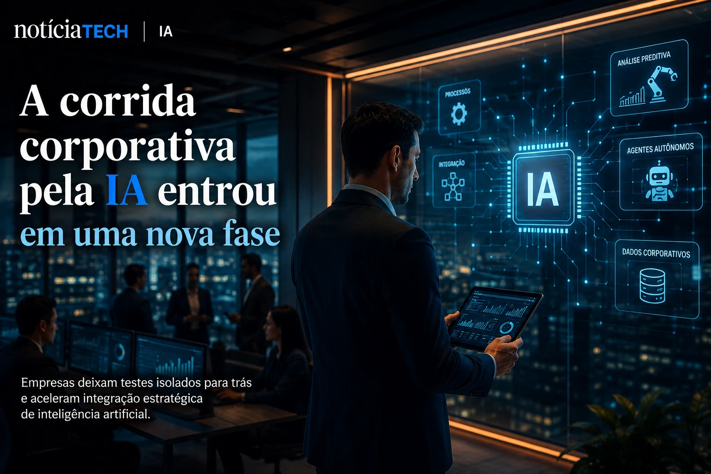
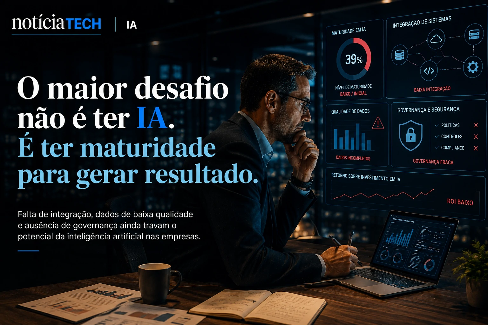
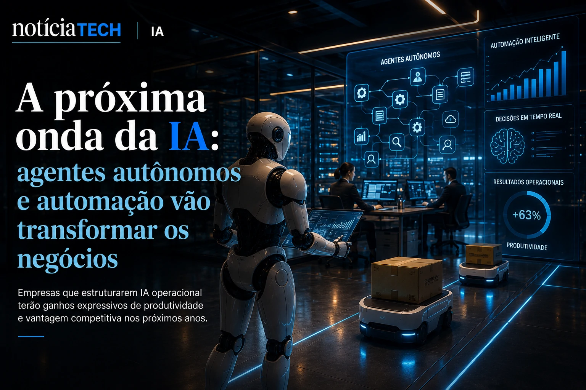

*O mercado corporativo entrou oficialmente na fase de consolidação da inteligência artificial. Depois da corrida inicial por ferramentas generativas, agentes autônomos e automação inteligente, empresas agora enfrentam uma nova realidade: possuir acesso à IA já não é diferencial competitivo. O verdadeiro desafio passou a ser transformar inteligência artificial em produtividade real, eficiência operacional e crescimento sustentável.*

*Relatórios divulgados nas últimas semanas mostram que o Brasil vive um paradoxo tecnológico. Enquanto executivos aceleram investimentos em IA, grande parte das organizações ainda opera com baixa maturidade estratégica, integração limitada e dificuldade para gerar retorno concreto sobre os investimentos realizados.*

## A corrida corporativa pela IA entrou em uma nova fase

A adoção de **Inteligência Artificial** deixou de ser uma iniciativa experimental para se tornar prioridade operacional em empresas de diversos setores.

Segundo estudos recentes sobre maturidade em IA corporativa, organizações brasileiras já avançaram no acesso às ferramentas, mas ainda estão distantes da integração profunda nos processos centrais do negócio.

O principal movimento observado em 2026 é a migração da chamada “IA de produtividade individual” para a “IA operacional corporativa”.

Na prática, isso significa que empresas começaram a perceber que apenas disponibilizar ferramentas como assistentes generativos para funcionários não produz impacto relevante sem integração com:

- fluxos internos;
- dados corporativos;
- automação de processos;
- sistemas legados;
- governança operacional.

Esse cenário marca uma mudança importante dentro do mercado global de tecnologia.

Durante os últimos dois anos, companhias investiram fortemente em testes rápidos com IA generativa. Agora, a pressão passou a ser por retorno financeiro mensurável.

Segundo análises recentes sobre tendências de IA para empresas, o foco corporativo deixou de ser “experimentar IA” e passou a ser “operacionalizar IA”.

Esse movimento também fortalece o crescimento de novas categorias tecnológicas, incluindo:

- agentes autônomos;
- automação multimodal;
- IA contextual;
- análise preditiva;
- copilotos corporativos;
- integração de IA com ERPs e CRMs.

Dentro desse novo cenário, empresas que conseguirem integrar inteligência artificial aos processos centrais tendem a ampliar produtividade e reduzir custos operacionais de maneira estrutural.

Para aprofundar o avanço da automação corporativa no Brasil, vale conferir também:

- [Empresas começam a substituir softwares tradicionais por agentes de IA](https://noticiatech.com.br/automacao/empresas-come%C3%A7am-a-substituir-softwares-tradicionais-por-agentes-de-ia/)

## O maior problema das empresas não é acesso à IA — é maturidade estratégica

Apesar da explosão de interesse por **IA**, os estudos mais recentes revelam um problema crítico: a maioria das empresas ainda não sabe como estruturar a tecnologia internamente.

Pesquisas divulgadas em maio apontam que mais de 60% das empresas brasileiras ainda operam abaixo do nível intermediário de maturidade em IA corporativa.

Isso significa que muitas organizações:

- utilizam IA de forma isolada;
- não possuem governança;
- não estruturaram processos internos;
- carecem de integração entre departamentos;
- ainda não transformaram dados em inteligência operacional.

O problema não está mais na disponibilidade da tecnologia.

Hoje, ferramentas avançadas estão acessíveis para empresas de praticamente qualquer porte.

A dificuldade real está em:

### Integração com sistemas legados

Muitas companhias ainda operam em estruturas antigas que dificultam integração com modelos modernos de IA.

### Qualidade de dados

Sem dados organizados, confiáveis e estruturados, os sistemas de IA produzem respostas inconsistentes e pouco úteis.

### Capacitação interna

Empresas enfrentam falta de profissionais preparados para operar inteligência artificial em nível estratégico.

### Governança e segurança

Com o crescimento da IA generativa, cresce também a preocupação com compliance, privacidade e vazamento de dados corporativos.

Esse cenário explica por que muitas empresas anunciaram iniciativas de IA nos últimos anos, mas poucas conseguiram gerar transformação operacional profunda.

A nova disputa corporativa agora acontece em torno da maturidade organizacional — e não apenas da adoção tecnológica.

## A próxima onda será dominada por agentes autônomos e IA operacional

Os próximos ciclos da transformação digital devem ser liderados pela chamada “IA operacional”.

Especialistas apontam que 2026 marca o início da expansão massiva dos agentes autônomos dentro das empresas.

Diferente dos chatbots tradicionais, esses sistemas conseguem:

- executar tarefas completas;
- analisar múltiplos contextos;
- interagir entre plataformas;
- tomar decisões operacionais;
- automatizar fluxos complexos.

Isso muda completamente o papel da IA dentro das organizações.

A inteligência artificial deixa de funcionar apenas como ferramenta auxiliar e passa a atuar como camada operacional integrada ao negócio.

Segundo previsões recentes, empresas que conseguirem estruturar IA de forma eficiente poderão alcançar ganhos significativos de produtividade até o final da década.

Ao mesmo tempo, cresce o debate sobre impactos no mercado de trabalho.

Relatórios recentes mostram que parte das empresas ainda superestima a capacidade atual da IA para justificar cortes operacionais.

Na prática, o cenário mais provável no curto prazo não é substituição total de profissionais, mas transformação profunda das funções corporativas.

Profissionais que aprenderem a operar junto da IA tendem a ganhar produtividade, enquanto empresas que demorarem para estruturar governança, dados e automação podem perder competitividade rapidamente.

A nova economia digital começa a ser moldada não apenas por quem possui acesso à inteligência artificial, mas por quem consegue transformar IA em vantagem operacional escalável.

---