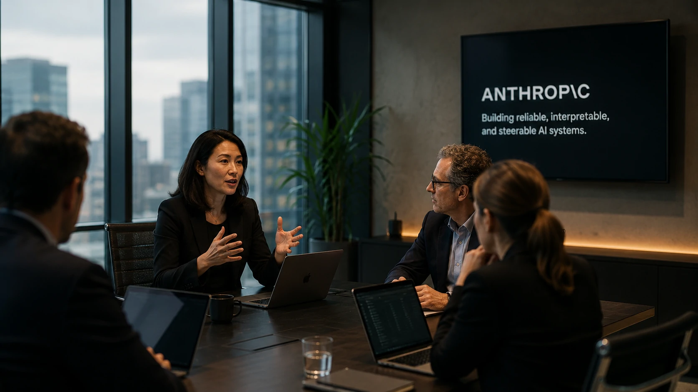
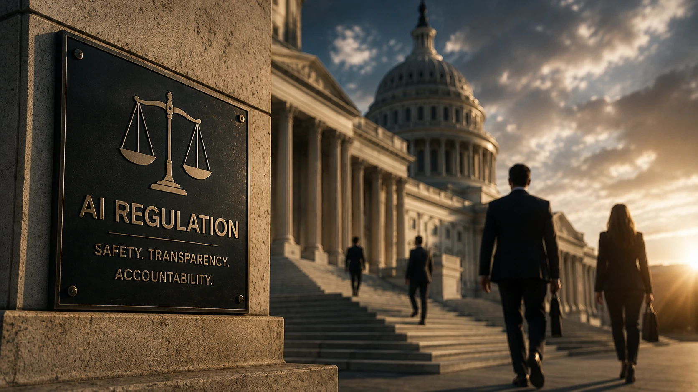
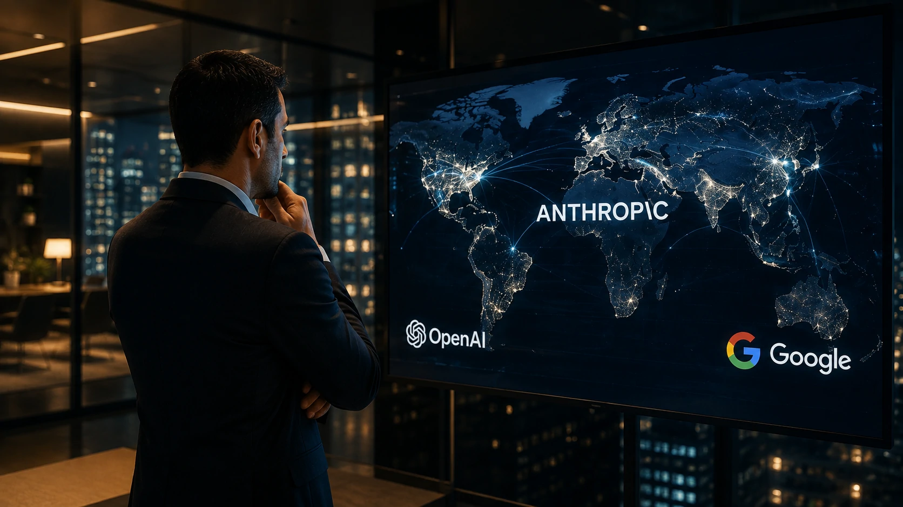

*Enquanto o mercado acompanha a disputa tecnológica entre **OpenAI**, **Google** e outras gigantes da inteligência artificial, um movimento silencioso da **Anthropic** indica que a próxima fase dessa corrida pode ser definida muito além da qualidade dos modelos. A empresa decidiu fortalecer sua atuação política justamente quando governos aumentam a pressão sobre o desenvolvimento da IA, sinalizando uma mudança estratégica que pode influenciar todo o setor.*

## A Anthropic está ampliando sua influência além da tecnologia

*Executivos da **Anthropic** reforçam a importância das relações institucionais em um momento de maior pressão regulatória sobre a inteligência artificial.*

A criação de uma liderança global dedicada ao relacionamento com governos representa uma mudança importante na estratégia da **Anthropic**. Em vez de concentrar esforços exclusivamente na evolução dos modelos de IA, a empresa passa a investir também na capacidade de participar das discussões que definirão as regras do mercado.

Essa decisão acontece em um momento de intenso debate sobre segurança, transparência e responsabilidade na inteligência artificial. Nos Estados Unidos, o tema ganhou ainda mais relevância após sucessivos episódios envolvendo riscos associados a agentes autônomos e ao avanço acelerado dos modelos generativos.

### A corrida pela IA entrou em uma nova etapa

Durante os últimos anos, a disputa esteve concentrada em capacidade computacional, desempenho dos modelos e velocidade de inovação.

Agora, fatores como governança, relacionamento institucional e influência sobre futuras regulamentações começam a ganhar peso semelhante ao desenvolvimento tecnológico.

### O objetivo vai além da conformidade regulatória

Para empresas que disputam liderança global, participar das discussões regulatórias significa reduzir incertezas e antecipar mudanças que poderão afetar produtos, investimentos e expansão internacional.

Esse movimento aproxima a **Anthropic** das estratégias adotadas por grandes empresas de tecnologia quando mercados entram em fases de maior maturidade.

## O impacto pode alcançar OpenAI, Google e todo o ecossistema de IA

A decisão da **Anthropic** não altera apenas sua estrutura interna. Ela amplia a pressão competitiva sobre empresas que também disputam protagonismo na inteligência artificial.

Historicamente, **OpenAI** e **Google** concentraram grande parte da atenção pública por causa dos avanços tecnológicos de seus modelos.

Agora, o diferencial competitivo pode incluir outro elemento: a capacidade de dialogar diretamente com governos e participar da construção das futuras políticas para IA.

Como consequência, cresce a possibilidade de que outras empresas adotem estruturas semelhantes nos próximos meses.

Esse cenário complementa movimentos recentes já analisados pelo **Notícia Tech**, como a crescente preocupação com segurança apresentada em [Casa Branca reúne OpenAI, Google, Anthropic e Meta para discutir testes de segurança em IA](https://noticiatech.com.br/inteligencia-artificial/casa-branca-openai-google-anthropic-meta-testes-seguranca-ia/) e a intensificação da concorrência apresentada em [DeepSeek lança modelo mais barato e aumenta a pressão sobre OpenAI e Anthropic](https://noticiatech.com.br/inteligencia-artificial/deepseek-modelo-ia-mais-barato-mercado-openai-anthropic/).

### Governança começa a valer tanto quanto inovação

Até recentemente, investidores observavam principalmente capacidade técnica.

Hoje, a habilidade de navegar por ambientes regulatórios complexos passa a representar uma vantagem competitiva igualmente importante.

### Empresas observam o movimento com atenção

Para organizações que utilizam IA em processos internos, automação e atendimento, mudanças regulatórias podem afetar desde contratos até requisitos de conformidade.

Esse novo contexto explica por que decisões aparentemente administrativas passam a receber tanta atenção do mercado.

## O movimento da Anthropic revela uma transformação maior no mercado

*Governança, segurança e relacionamento institucional tornam-se fatores cada vez mais relevantes para empresas que disputam a liderança da inteligência artificial.*

A principal mensagem dessa decisão é clara: **a corrida pela inteligência artificial deixou de ser apenas tecnológica**.

Modelos mais rápidos, infraestrutura robusta e bilhões de dólares em investimentos continuam importantes, mas passam a dividir espaço com uma nova frente competitiva: a influência sobre o ambiente regulatório.

Essa mudança pode redefinir a forma como investidores, governos e grandes clientes corporativos avaliam empresas de IA.

### O mercado está entrando em uma fase de maturidade

Nos primeiros anos da IA generativa, a prioridade era lançar modelos cada vez mais capazes.

Agora, governos discutem padrões mínimos de segurança, responsabilidade, auditoria e transparência.

Isso faz com que empresas precisem desenvolver competências que antes eram secundárias.

### O efeito pode chegar às empresas brasileiras

Embora a notícia tenha origem no mercado internacional, seus efeitos tendem a alcançar organizações brasileiras que utilizam soluções baseadas em **OpenAI**, **Anthropic**, **Google** e outros fornecedores globais.

À medida que regulações evoluem, clientes corporativos passam a exigir mais garantias relacionadas à proteção de dados, explicabilidade e gestão de riscos.

Esse movimento reforça tendências observadas em análises recentes do **Notícia Tech**, como a evolução da arquitetura corporativa apresentada em [Arquitetura de IA empresarial: guia completo sobre MCP, RAG, APIs, agentes, workflows e copilotos](https://noticiatech.com.br/inteligencia-artificial/arquitetura-ia-empresarial-mcp-rag-apis-agentes-workflows-copilotos/) e o crescimento da preocupação com plataformas seguras mostrado em [Microsoft lança plataforma de segurança para agentes de IA e amplia proteção corporativa](https://noticiatech.com.br/inteligencia-artificial/microsoft-plataforma-seguranca-agentes-ia-empresas/).

## O futuro da liderança em IA dependerá de muito mais do que modelos avançados

*A próxima etapa da inteligência artificial será definida pela combinação entre inovação tecnológica, governança e capacidade de adaptação às novas regras do mercado.*

A estratégia adotada pela **Anthropic** sugere que a liderança da inteligência artificial será disputada em diferentes frentes simultaneamente.

Enquanto **OpenAI**, **Google**, **Meta**, **Microsoft** e outras empresas continuam investindo bilhões em infraestrutura e desenvolvimento de modelos, cresce a percepção de que diálogo institucional e governança também serão diferenciais competitivos.

### Empresas deverão combinar inovação e conformidade

Organizações que pretendem expandir suas soluções globalmente precisarão equilibrar velocidade de inovação com requisitos regulatórios cada vez mais rigorosos.

Isso pode acelerar investimentos em equipes jurídicas, especialistas em políticas públicas, segurança e governança tecnológica.

### O movimento pode antecipar uma tendência para toda a indústria

Se outras gigantes seguirem o mesmo caminho, cargos voltados exclusivamente para relações governamentais poderão se tornar comuns entre empresas de inteligência artificial.

Nesse cenário, a disputa pela liderança deixa de acontecer apenas entre laboratórios e passa também pelas mesas de negociação onde serão definidas as regras do mercado.

Para empresas que acompanham a evolução da IA, o anúncio da **Anthropic** representa mais do que uma mudança organizacional. Ele indica que a próxima fase da inteligência artificial será construída pela combinação entre inovação, confiança, governança e capacidade de adaptação a um ambiente regulatório cada vez mais complexo. Entender esse movimento desde agora pode ajudar organizações a antecipar tendências que influenciarão investimentos, estratégias digitais e adoção corporativa de IA nos próximos anos.

---