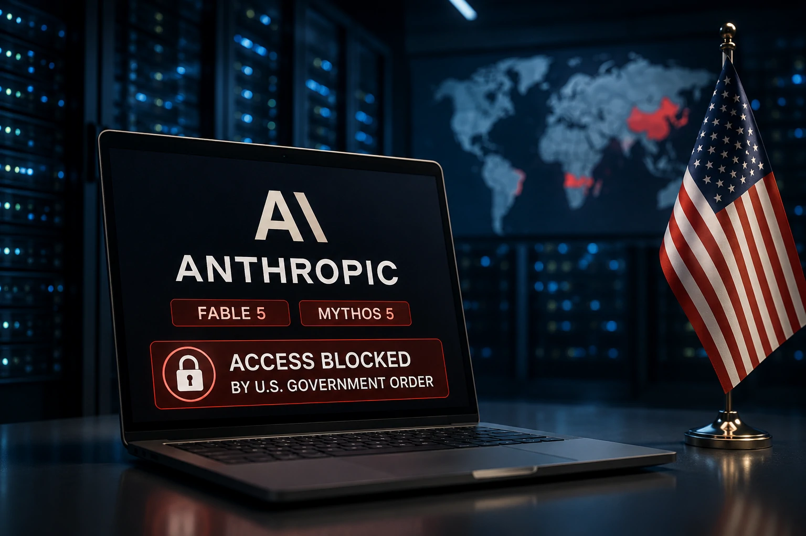
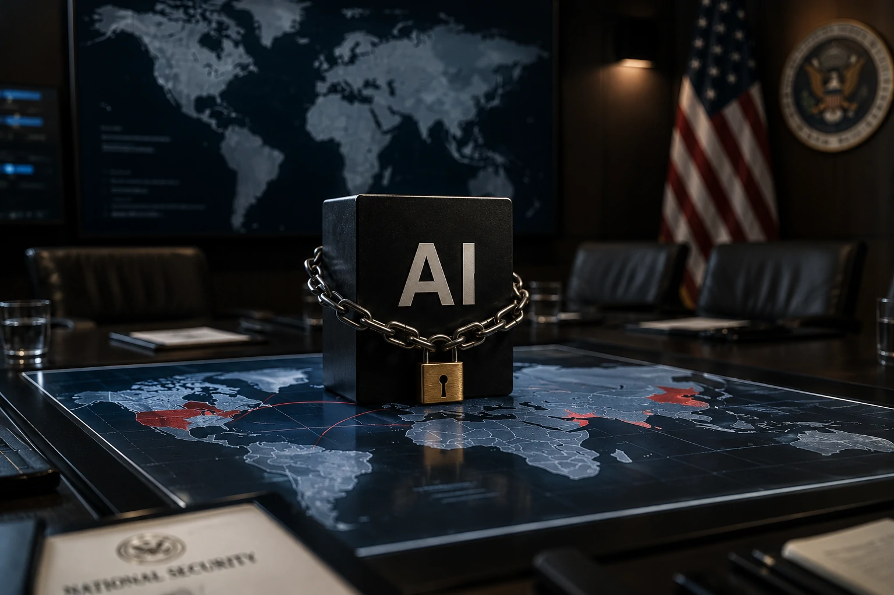
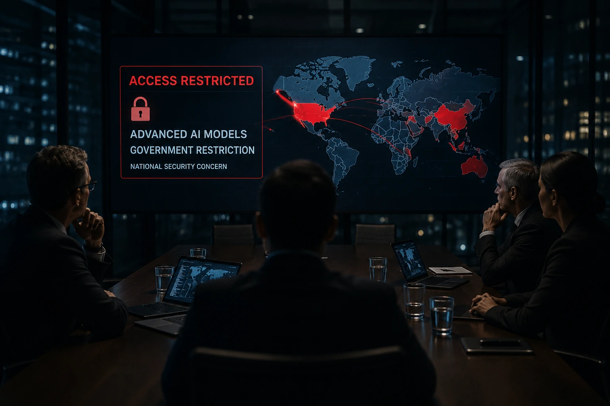

*Durante anos, a disputa global por inteligência artificial esteve concentrada em chips, data centers e capacidade computacional. Agora, uma nova etapa começou. Pela primeira vez, um governo está tratando modelos avançados de IA como ativos estratégicos comparáveis a tecnologias sensíveis de defesa e segurança nacional.*

## O bloqueio dos modelos da Anthropic marca uma mudança histórica na indústria de IA

*Os modelos Fable 5 e Mythos 5 estão no centro da nova disputa geopolítica pela inteligência artificial.*

O governo dos **Estados Unidos** determinou que a **Anthropic** suspendesse o acesso aos seus modelos mais avançados, **Fable 5** e **Mythos 5**, para cidadãos estrangeiros.

A medida foi justificada por preocupações relacionadas à segurança nacional e ao potencial uso dessas tecnologias em atividades consideradas sensíveis, especialmente no campo da cibersegurança.

Diante da impossibilidade de implementar rapidamente restrições seletivas por nacionalidade, a **Anthropic** optou por interromper temporariamente o acesso aos modelos para todos os usuários.

### O que são os modelos Fable 5 e Mythos 5?

Os modelos representam o nível mais avançado da linha de inteligência artificial da empresa.

Segundo informações divulgadas pela própria **Anthropic**, eles possuem capacidades significativamente superiores em raciocínio, engenharia de software, pesquisa científica e análise de sistemas complexos.

### Por que o governo americano interveio?

Autoridades americanas demonstraram preocupação com a possibilidade de que esses sistemas fossem utilizados para identificar vulnerabilidades em softwares, acelerar ataques cibernéticos ou auxiliar operações consideradas estratégicas.

O caso mostra que o debate sobre IA deixou de ser apenas tecnológico e passou a integrar diretamente a agenda de segurança nacional.

## A inteligência artificial está se tornando um ativo estratégico dos países

*Governos começam a tratar modelos avançados de IA como recursos estratégicos comparáveis a infraestrutura crítica.*

A principal consequência desta decisão vai muito além da **Anthropic**.

O episódio sinaliza que os governos começam a enxergar modelos avançados de IA da mesma forma que enxergam tecnologias militares, semicondutores de ponta ou sistemas de criptografia avançada.

Nos últimos anos, os Estados Unidos já haviam restringido exportações de chips da **Nvidia** para determinados mercados.

Agora, o foco parece migrar da infraestrutura para os próprios modelos.

### O fim da era da IA totalmente global?

Até recentemente, a narrativa dominante sugeria que modelos de IA seriam distribuídos globalmente sem grandes barreiras geográficas.

A decisão envolvendo a **Anthropic** sugere um cenário diferente.

Países podem começar a limitar quem pode utilizar determinados sistemas, criando uma divisão tecnológica semelhante à observada em setores estratégicos da economia global.

### O que isso significa para empresas?

Empresas multinacionais passam a enfrentar um novo risco.

Além de escolher fornecedores de IA, será necessário avaliar questões regulatórias, geopolíticas e de soberania tecnológica.

Essa tendência reforça debates já explorados em temas como [AI Operations e governança de agentes de IA](https://noticiatech.com.br/inteligencia-artificial/ai-operations-governanca-agentes-ia-empresas/) e na evolução da infraestrutura que conecta agentes inteligentes aos sistemas corporativos através do [MCP](https://noticiatech.com.br/inteligencia-artificial/mcp-infraestrutura-conecta-agentes-ia-sistemas-corporativos/).

## A disputa entre governos e empresas de IA está se intensificando

*O relacionamento entre laboratórios de IA e governos entra em uma nova fase de tensão estratégica.*

O caso também evidencia o aumento das tensões entre grandes laboratórios de IA e governos.

A **Anthropic** afirmou que recebeu justificativas limitadas para a decisão e demonstrou preocupação com a falta de transparência sobre os riscos apontados pelas autoridades.

Isso cria um precedente importante para todo o setor.

Se um governo pode restringir o acesso a modelos específicos por razões estratégicas, outras empresas poderão enfrentar exigências semelhantes.

### OpenAI, Google e Microsoft podem enfrentar situações parecidas?

A resposta é sim.

À medida que sistemas avançados se tornam mais poderosos, governos tendem a aumentar a supervisão regulatória.

Isso afeta empresas como **OpenAI**, **Google**, **Microsoft**, **Meta** e qualquer organização que desenvolva modelos considerados críticos para a competitividade nacional.

O tema se conecta diretamente à crescente disputa descrita em [Guerra das Interfaces: Apple, OpenAI, Google e Microsoft](https://noticiatech.com.br/inteligencia-artificial/guerra-interfaces-agentes-ia-apple-openai-google-microsoft/), onde o controle da camada de inteligência se torna cada vez mais estratégico.

### Uma nova corrida tecnológica

A competição já não ocorre apenas entre empresas.

Ela passa a ocorrer entre países.

Na prática, governos começam a disputar quem terá acesso aos sistemas mais avançados, quem poderá utilizá-los e sob quais condições.

## O verdadeiro impacto pode aparecer nos próximos anos

A decisão envolvendo a **Anthropic** pode ser lembrada como um dos momentos mais importantes da história recente da inteligência artificial.

Ela marca a transição de uma indústria orientada apenas por inovação para um setor cada vez mais influenciado por interesses geopolíticos.

Se essa tendência continuar, a próxima grande disputa da IA não será apenas sobre quem possui os melhores modelos.

Será sobre quem tem autorização para utilizá-los.

Nesse cenário, inteligência artificial deixa de ser apenas uma ferramenta tecnológica e passa a ocupar o centro das estratégias econômicas, militares e diplomáticas das maiores potências do mundo.

---