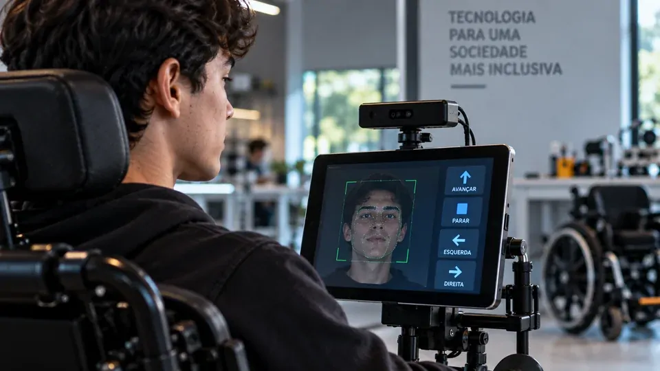
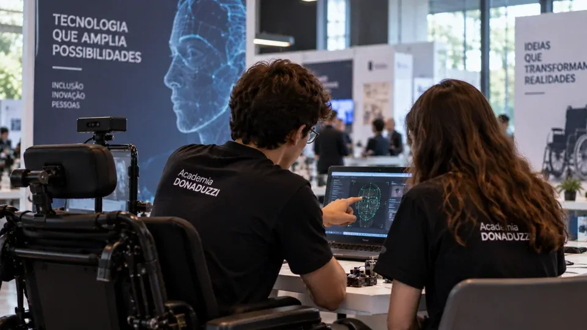
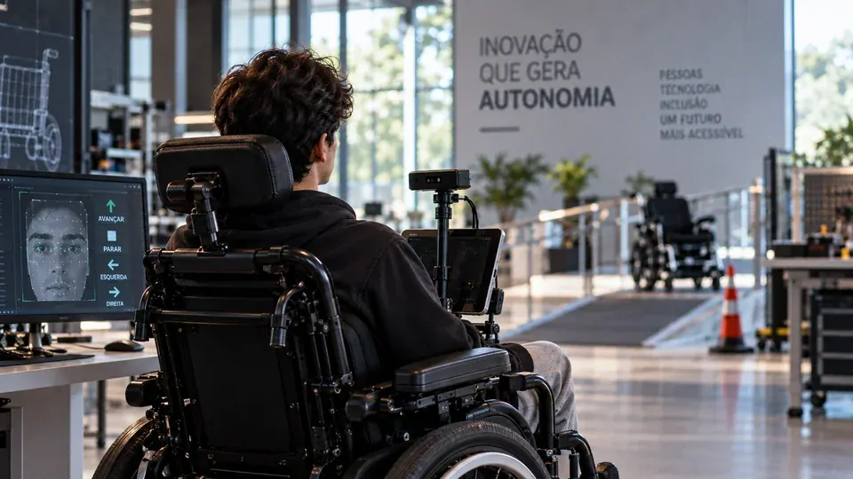

*Em Toledo, no Oeste do Paraná, dois estudantes transformaram uma dificuldade de acessibilidade em um projeto de inteligência artificial. O Face Control reconhece expressões faciais e as converte em comandos para uma cadeira de rodas, enquanto a equipe avança da fase de protótipos para o primeiro modelo em tamanho real.*

## Uma ideia criada para resolver um problema concreto

O **Face Control** é um sistema de inteligência artificial e visão computacional desenvolvido pelos estudantes **Fernando Miguel Koch** e **Laura Garbozza**, da **Academia Donaduzzi**, em Toledo, no Oeste do Paraná. A tecnologia interpreta expressões faciais e as transforma em instruções para uma cadeira de rodas motorizada.

O projeto começou em **abril de 2025**, depois que os estudantes passaram a investigar as dificuldades enfrentadas por pessoas com deficiência motora severa que não conseguem utilizar mecanismos convencionais de controle.

A pesquisa levou a uma constatação importante: soluções baseadas em voz ou movimentos da cabeça podem não atender a todos os usuários. A partir disso, os estudantes buscaram uma alternativa que reduzisse a dependência da fala e de movimentos corporais amplos.

O resultado foi uma abordagem na qual o próprio rosto passa a funcionar como uma interface de controle. Em vez de pressionar botões ou utilizar comandos de voz, o usuário pode executar expressões previamente reconhecidas pelo sistema.

Essa lógica coloca a **inteligência artificial aplicada à acessibilidade** em um contexto diferente do uso corporativo mais comum. Aqui, o objetivo não é simplesmente automatizar uma tarefa, mas transformar uma capacidade física disponível em uma forma de interação com uma máquina.

## Como a IA transforma expressões faciais em comandos

*O sistema desenvolvido pelos estudantes utiliza visão computacional para interpretar expressões faciais e convertê-las em comandos.*

O funcionamento do Face Control depende da combinação entre **inteligência artificial** e **visão computacional**, tecnologia utilizada para permitir que sistemas interpretem informações presentes em imagens e vídeos.

Na prática, o sistema foi desenvolvido para reconhecer determinadas expressões e associá-las a ações específicas da cadeira. Um dos exemplos apresentados é **levantar as sobrancelhas para fazer o equipamento andar para frente**. Outro comando utiliza **abrir a boca para fazer a cadeira parar**.

O ponto central não está em simplesmente reconhecer um rosto. A tecnologia precisa distinguir uma expressão específica e associá-la a uma instrução de controle. Isso transforma a câmera e o processamento de imagem em uma espécie de interface entre o usuário e o equipamento.

Depois de **seis protótipos produzidos com impressão 3D**, o Face Control chegou a **98,5% de precisão** no reconhecimento das expressões faciais utilizadas nos comandos. O número é relevante porque demonstra que os estudantes já conseguiram validar tecnicamente parte importante da proposta antes da construção do equipamento em escala real.

Ainda assim, precisão de reconhecimento não significa que a cadeira esteja pronta para uso comercial. A próxima etapa precisa avaliar o sistema integrado ao equipamento motorizado, em situações mais próximas das encontradas no cotidiano.

## Seis protótipos levaram o projeto até a próxima etapa

A evolução do Face Control ocorreu de forma incremental. Em vez de partir diretamente para uma cadeira completa, os estudantes utilizaram protótipos produzidos por **impressão 3D** para desenvolver e testar a solução.

Esse processo permitiu transformar uma ideia inicial em um sistema capaz de reconhecer os comandos com **98,5% de precisão**. A sequência de protótipos também mostra uma característica importante da inovação aplicada: o primeiro modelo não precisa ser o produto final.

### Da experimentação ao protótipo em tamanho real

Com investimento do **Biopark**, por meio da área de Pesquisa, Desenvolvimento e Inovação, a equipe agora trabalha na adaptação da tecnologia para uma **cadeira de rodas motorizada em tamanho real**.

Essa mudança é importante porque aumenta a complexidade do projeto. O sistema deixa de ser avaliado apenas como uma solução de reconhecimento e passa a precisar funcionar integrado a um equipamento físico capaz de transportar uma pessoa.

A nova etapa também permitirá observar questões que não podem ser totalmente respondidas pelos protótipos iniciais, como funcionamento em condições reais, resposta dos comandos e viabilidade técnica da solução.

Para o ecossistema de inovação, esse é o ponto em que uma demonstração tecnológica começa a enfrentar os desafios de transformar software, sensores e hardware em um produto utilizável.

## O projeto já recebeu reconhecimento científico

*O Face Control foi desenvolvido no ambiente educacional da Academia Donaduzzi e apresentado em eventos científicos.*

O Face Control também avançou no ambiente científico antes mesmo de chegar ao protótipo em tamanho real. Entre **26 e 29 de agosto de 2026**, o projeto foi apresentado na **Feira de Ciência, Engenharia e Tecnologia (FECET)**, considerada a maior feira científica pré-universitária do Paraná.

Na FECET, o projeto recebeu duas premiações: o **Prêmio Destaque Revista Eureka Científica** e o **4º lugar geral**. O reconhecimento veio ao lado de outros trabalhos desenvolvidos por estudantes da Academia Donaduzzi em áreas como biotecnologia e saúde.

O projeto também recebeu uma **moção de aplausos da Câmara Municipal de Toledo** e já havia sido reconhecido na Mostra de Projetos da Academia Donaduzzi e na Feira Científica do Núcleo de Atividades de Altas Habilidades/Superdotação (FENAAHs).

A trajetória mostra que o Face Control não surgiu como uma simples demonstração escolar isolada. A proposta passou por desenvolvimento, prototipagem, testes e apresentação em ambientes científicos, enquanto começa a receber recursos para avançar tecnicamente.

O caso também se conecta a um movimento mais amplo de aplicações brasileiras de inteligência artificial. O próprio **Notícia Tech** já mostrou como sistemas de IA desenvolvidos ou utilizados no Brasil estão sendo direcionados a problemas específicos, como no caso da tecnologia usada para **[prever secas rápidas com dados de satélites](https://noticiatech.com.br/inteligencia-artificial/ia-brasileira-satelites-prever-secas-rapidas/)**.

## A acessibilidade é onde a tecnologia precisa provar seu valor

*O próximo desafio do Face Control é levar o sistema dos protótipos para uma cadeira motorizada em tamanho real.*

O aspecto mais relevante do Face Control está na tentativa de transformar reconhecimento facial em **tecnologia assistiva**. A proposta parte de uma necessidade concreta: oferecer uma forma alternativa de controle para pessoas que não conseguem utilizar determinados mecanismos convencionais.

Isso muda também a forma de avaliar o projeto. Em uma aplicação desse tipo, alcançar uma alta precisão no reconhecimento é apenas uma parte do problema. O sistema precisa funcionar de maneira confiável quando estiver conectado a um equipamento que se movimenta com uma pessoa.

Por isso, a construção do protótipo em tamanho real representa uma etapa decisiva. É nela que será possível verificar se o conceito desenvolvido pelos estudantes consegue manter seu desempenho quando submetido a condições mais próximas do uso cotidiano.

A questão também envolve segurança, ergonomia e adaptação às necessidades dos usuários. Esses aspectos ainda fazem parte da etapa de desenvolvimento e não permitem afirmar que o Face Control já seja uma solução comercial disponível.

## O próximo teste é transformar precisão em autonomia

A próxima fase do **Face Control** será justamente descobrir quanto da precisão obtida nos protótipos pode ser preservada quando a tecnologia estiver integrada a uma cadeira de rodas motorizada real.

Esse processo pode exigir novos ciclos de testes e ajustes. Uma tecnologia assistiva precisa considerar não apenas se o algoritmo reconhece corretamente uma expressão, mas também se a interação é compreensível, consistente e adequada ao usuário.

O investimento do **Biopark** permite que o projeto avance nessa direção. A equipe poderá avaliar aspectos técnicos e estudar a viabilidade de transformar o desenvolvimento em uma solução destinada ao público geral.

Esse caminho é particularmente interessante porque mostra uma característica importante da **IA aplicada**: o valor de um algoritmo aumenta quando ele consegue sair do ambiente de demonstração e resolver um problema específico no mundo físico.

O Brasil também começa a acumular exemplos de IA aplicada a áreas que vão além dos assistentes digitais e da automação empresarial. No setor de saúde, por exemplo, projetos que utilizam IA para apoiar o monitoramento de unidades hospitalares mostram outra frente dessa transformação, como o sistema de **[UTIs inteligentes que utiliza IA em tempo real](https://noticiatech.com.br/inteligencia-artificial/sus-utis-inteligentes-central-ia-tempo-real/)**.

No caso de Fernando e Laura, entretanto, o próximo passo ainda é mais concreto: fazer com que uma expressão facial reconhecida por um sistema de IA consiga comandar, de forma confiável, uma cadeira de rodas em tamanho real.

É justamente nessa passagem — **do protótipo para a aplicação prática** — que o Face Control poderá mostrar se a ideia desenvolvida em um ambiente escolar consegue se transformar em uma tecnologia assistiva capaz de enfrentar as exigências do mundo real.

---