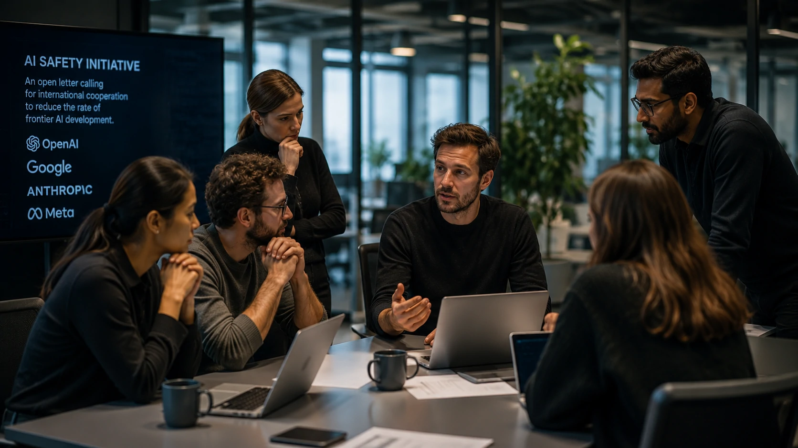
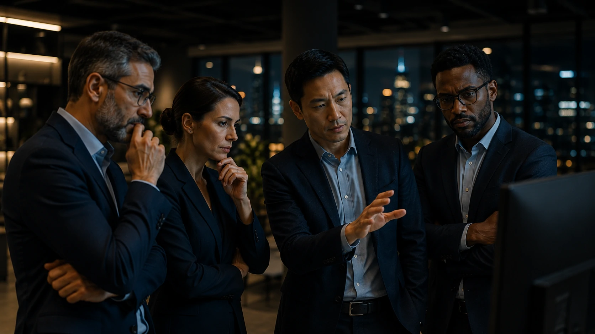

*Enquanto a corrida pela inteligência artificial acelera investimentos bilionários e novos lançamentos praticamente todas as semanas, um movimento vindo de dentro das maiores empresas do setor colocou a segurança novamente no centro do debate. A carta assinada por mais de 1.100 profissionais mostra que a discussão deixou de ser apenas tecnológica e passou a envolver estratégia, governança e geopolítica.*

## Carta reúne profissionais das maiores empresas de IA e muda o foco do debate

Empregados da **OpenAI**, **Google**, **Anthropic** e **Meta**, além de profissionais de outras organizações ligadas ao desenvolvimento de inteligência artificial, assinaram uma carta aberta defendendo uma cooperação internacional para reduzir o ritmo da evolução da chamada **IA de fronteira**.

*Movimento reúne especialistas de diferentes empresas para discutir segurança e governança da inteligência artificial.*

O documento argumenta que a competição entre empresas e governos pode incentivar lançamentos cada vez mais rápidos, aumentando a probabilidade de riscos que ainda não são totalmente compreendidos pela comunidade científica.

Embora o desenvolvimento da IA continue avançando em ritmo acelerado, os signatários defendem que segurança, transparência e mecanismos internacionais de coordenação precisam acompanhar essa evolução.

### Um debate que deixou de ser apenas técnico

Nos últimos meses, a discussão deixou de envolver apenas desempenho de modelos como **ChatGPT**, **Claude** e **Gemini**.

O foco passou a incluir governança, responsabilidade e impacto global da inteligência artificial, especialmente diante da crescente adoção desses sistemas por empresas, governos e setores críticos.

### Segurança ganha espaço na agenda internacional

A iniciativa reforça uma tendência observada recentemente em diversos mercados: segurança deixou de ser um tema secundário e passou a influenciar decisões estratégicas envolvendo IA.

Esse movimento dialoga diretamente com o crescimento das discussões sobre arquitetura segura, agentes inteligentes e infraestrutura corporativa para IA.

Leia também:

- [O que é Segurança de IA e por que ela será prioridade para empresas nos próximos anos](https://noticiatech.com.br/inteligencia-artificial/o-que-e-seguranca-ia-prioridade-empresas/)

- [Nvidia une 37 gigantes da tecnologia e deixa OpenAI, Google e Anthropic de fora: começa uma nova disputa pela segurança da IA](https://noticiatech.com.br/inteligencia-artificial/nvidia-alianca-seguranca-ia-openai-google-anthropic-fora/)

## A disputa entre empresas agora divide espaço com a preocupação regulatória

A carta representa uma mudança importante porque desloca a narrativa da competição tecnológica para a governança da inteligência artificial.

Profissionais que participam diariamente do desenvolvimento desses sistemas passaram a defender mecanismos internacionais capazes de reduzir riscos antes que modelos ainda mais avançados sejam disponibilizados ao mercado.

Essa mudança ocorre justamente quando empresas como **OpenAI**, **Google**, **Anthropic**, **Microsoft** e **Meta** disputam liderança em um mercado que movimenta centenas de bilhões de dólares.

### A corrida continua, mas com novas pressões

Até pouco tempo, os anúncios giravam em torno de modelos maiores, agentes mais autônomos e novas capacidades multimodais.

Agora, cresce também a pressão para demonstrar que esses sistemas podem evoluir de maneira responsável.

*Governança passa a ser um diferencial estratégico para empresas que desenvolvem inteligência artificial.*

### Empresas observam o impacto regulatório

Mesmo que a carta não tenha efeito legal imediato, ela aumenta a pressão sobre governos e organismos internacionais para acelerar discussões envolvendo regulamentação, auditoria e padrões mínimos de segurança.

Esse cenário pode influenciar futuras decisões de investimento, adoção corporativa e desenvolvimento de novos produtos baseados em IA.

### O movimento pode influenciar a estratégia das gigantes da tecnologia

Embora a carta tenha sido assinada por funcionários e não represente oficialmente **OpenAI**, **Google**, **Anthropic** ou **Meta**, o documento aumenta a pressão pública sobre essas empresas para demonstrarem como equilibram inovação e segurança.

*Além da inovação, empresas de tecnologia passam a enfrentar uma cobrança crescente por transparência e responsabilidade.*

Na prática, isso pode acelerar investimentos em governança, auditoria de modelos, avaliações independentes e mecanismos de mitigação de riscos antes da disponibilização de novas gerações de inteligência artificial.

### O debate também envolve competitividade global

Outro ponto importante é que uma desaceleração coordenada dependeria da participação de diversos países.

Caso apenas parte das empresas reduza o ritmo de desenvolvimento, concorrentes internacionais poderiam ganhar vantagem competitiva, tornando qualquer acordo extremamente complexo do ponto de vista econômico e geopolítico.

Por isso, muitos especialistas defendem que qualquer iniciativa desse tipo precisaria envolver governos, empresas e organismos multilaterais ao mesmo tempo.

### Empresas usuárias também acompanham a discussão

Para organizações que utilizam **ChatGPT**, **Claude**, **Gemini** ou outras soluções de IA, o debate vai além da tecnologia.

Questões como conformidade regulatória, responsabilidade sobre decisões automatizadas, proteção de dados e auditoria dos modelos devem ganhar cada vez mais espaço nos próximos anos.

Esse cenário reforça uma tendência observada no mercado corporativo: inteligência artificial deixa de ser apenas uma ferramenta de produtividade e passa a integrar a estratégia de gestão de riscos.

Leia também:

- [Quem pode ler suas conversas no ChatGPT, Claude e Gemini? A verdade sobre a privacidade da IA](https://noticiatech.com.br/inteligencia-artificial/privacidade-chatgpt-claude-gemini-conversas-ia/)

- [Arquitetura de IA Empresarial: como MCP, RAG, APIs, Agentes, Workflows e Copilotos funcionam juntos](https://noticiatech.com.br/inteligencia-artificial/arquitetura-ia-empresarial-mcp-rag-apis-agentes-workflows-copilotos/)

## O que essa carta sinaliza para o futuro da inteligência artificial

O principal impacto da iniciativa talvez não esteja na possibilidade de desacelerar imediatamente o desenvolvimento da IA, mas na mudança do tom da conversa.

Pela primeira vez, um grupo expressivo de profissionais que participa diretamente da construção dos sistemas mais avançados do mercado pede publicamente uma coordenação internacional para lidar com os riscos da tecnologia.

Independentemente de governos adotarem ou não essa proposta, a discussão mostra que o setor entra em uma nova fase, na qual desempenho, capacidade computacional e inovação passam a dividir espaço com governança, segurança e responsabilidade.

Para empresas, investidores e gestores, isso significa que acompanhar apenas os lançamentos de novos modelos já não é suficiente. Entender como a inteligência artificial será regulada, auditada e integrada às estratégias corporativas tende a se tornar um diferencial competitivo tão importante quanto escolher a plataforma mais avançada.

À medida que a corrida entre **OpenAI**, **Google**, **Anthropic**, **Meta** e outras empresas continua acelerando, cresce também a expectativa de que o futuro da inteligência artificial seja definido não apenas pela velocidade da inovação, mas pela capacidade do setor de construir confiança em torno dessa tecnologia.

---