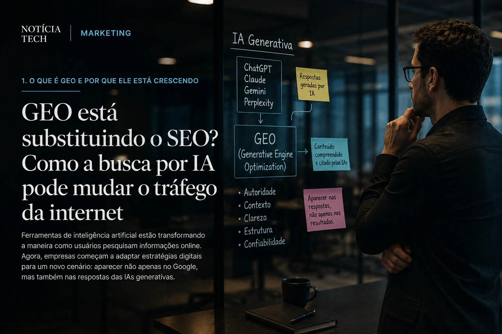

*Ferramentas de inteligência artificial estão transformando a maneira como usuários pesquisam informações online. Agora, empresas começam a adaptar estratégias digitais para um novo cenário: aparecer não apenas no Google, mas também nas respostas das IAs generativas.*

# GEO está substituindo o SEO? Como a busca por IA pode mudar o tráfego da internet

Durante mais de duas décadas, o **SEO** dominou o marketing digital. Empresas investiram bilhões para posicionar sites nas primeiras páginas do Google, disputar palavras-chave e conquistar tráfego orgânico.

Mas uma nova transformação começa a surgir no mercado digital.

Com o avanço das plataformas de **inteligência artificial generativa**, cresce rapidamente um novo conceito chamado **GEO (Generative Engine Optimization)**, estratégia focada em otimizar conteúdos para aparecer nas respostas de IAs como **ChatGPT**, **Gemini**, **Claude** e outros sistemas conversacionais.

O movimento pode redefinir a forma como usuários encontram informações na internet — e também mudar completamente a lógica do tráfego digital.

## O que é GEO e por que ele está crescendo

*Empresas começam a adaptar conteúdos para sistemas de busca movidos por inteligência artificial.*

O conceito de **GEO** surgiu a partir de uma mudança simples, mas extremamente importante: usuários estão começando a substituir buscas tradicionais por respostas geradas por IA.

Em vez de pesquisar:
> “melhores ferramentas de automação”

o usuário agora pergunta diretamente para a IA:
> “Qual a melhor ferramenta de automação para pequenas empresas?”

E a inteligência artificial entrega uma resposta pronta, resumida e contextualizada.

Isso altera completamente o comportamento de navegação.

No modelo tradicional de **SEO**, o Google funciona como intermediário entre usuário e site. Já na busca generativa, a IA passa a entregar respostas completas sem que o usuário necessariamente clique em páginas externas.

É exatamente aí que nasce o GEO.

O objetivo agora não é apenas ranquear no Google, mas fazer com que conteúdos sejam:
- compreendidos por modelos de IA;
- citados em respostas generativas;
- reconhecidos como fontes confiáveis;
- utilizados como referência por sistemas conversacionais.

Esse novo cenário está fazendo empresas de tecnologia, agências de marketing e produtores de conteúdo repensarem suas estratégias digitais.

## A mudança no comportamento do usuário

*A experiência conversacional está mudando a forma como pessoas consomem informação online.*

A mudança não acontece apenas na tecnologia. Ela também está acontecendo no comportamento humano.

Ferramentas de IA generativa oferecem uma experiência muito mais rápida e prática para o usuário médio. Em vez de abrir dezenas de links, comparar resultados e navegar por múltiplas páginas, a pessoa simplesmente conversa com a IA.

Isso cria uma experiência:
- mais fluida;
- mais personalizada;
- mais contextual;
- mais eficiente para buscas complexas.

Grandes empresas já perceberam essa tendência.

**Google**, **Microsoft**, **OpenAI** e outras gigantes estão acelerando investimentos em mecanismos de busca conversacionais justamente porque entendem que o comportamento do usuário está mudando.

O próprio Google já começou a integrar respostas geradas por IA dentro dos resultados de pesquisa tradicionais.

Isso significa que, no futuro, muitos sites podem perder parte do tráfego orgânico tradicional caso não adaptem seus conteúdos para esse novo modelo.

Para criadores de conteúdo e empresas digitais, essa transformação pode ser uma das maiores mudanças do marketing online desde o surgimento do SEO moderno.

## O SEO vai acabar?

*Especialistas acreditam que GEO e SEO devem coexistir durante os próximos anos.*

Apesar do crescimento do GEO, especialistas acreditam que o **SEO tradicional** não deve desaparecer completamente.

Na prática, o que deve acontecer é uma convivência entre os dois modelos.

O SEO continuará importante para:
- indexação;
- descoberta de páginas;
- buscas comerciais;
- tráfego de intenção direta;
- e-commerce;
- pesquisas locais.

Mas o GEO começa a ganhar força principalmente em conteúdos:
- informativos;
- educacionais;
- explicativos;
- comparativos;
- conversacionais.

Isso deve obrigar empresas a produzirem conteúdos mais:
- contextualizados;
- profundos;
- confiáveis;
- estruturados semanticamente;
- escritos para humanos e para IA.

A tendência também aumenta a importância de:
- autoridade digital;
- reputação da marca;
- qualidade editorial;
- experiência prática;
- profundidade temática.

Em outras palavras, conteúdos superficiais produzidos apenas para ranquear palavras-chave podem perder espaço para materiais realmente úteis e bem estruturados.

## O impacto para empresas e produtores de conteúdo

A ascensão do GEO pode criar um novo mercado bilionário dentro do marketing digital.

Nos próximos anos, empresas provavelmente começarão a contratar especialistas focados em:
- otimização para IA;
- estruturação semântica;
- dados contextuais;
- conteúdo conversacional;
- autoridade editorial;
- integração com plataformas generativas.

Isso também deve transformar:
- blogs;
- portais de notícia;
- e-commerces;
- agências de marketing;
- estratégias de inbound;
- produção de conteúdo corporativo.

Para projetos editoriais como o **Notícia Tech**, essa mudança pode representar uma grande oportunidade.

Blogs especializados, com autoridade em nichos específicos e conteúdo aprofundado, tendem a ganhar relevância em sistemas generativos que priorizam fontes confiáveis e contextualizadas.

A disputa pelo topo do Google pode estar começando a dividir espaço com uma nova corrida: aparecer dentro das respostas da inteligência artificial.
