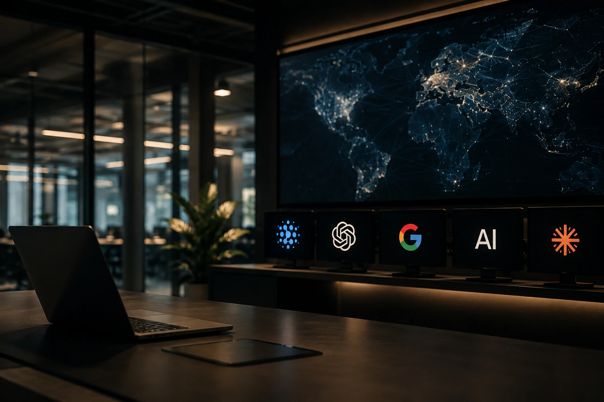
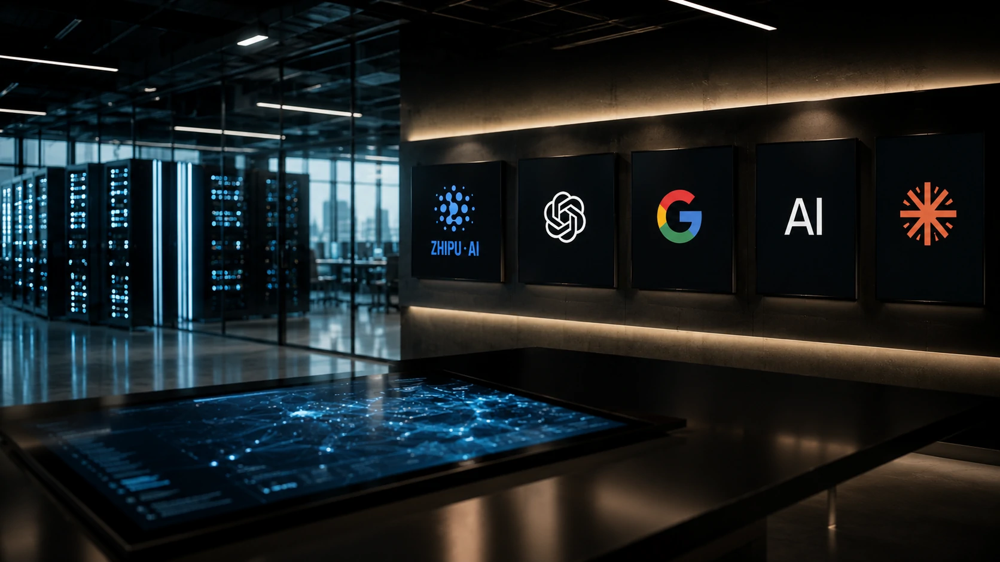
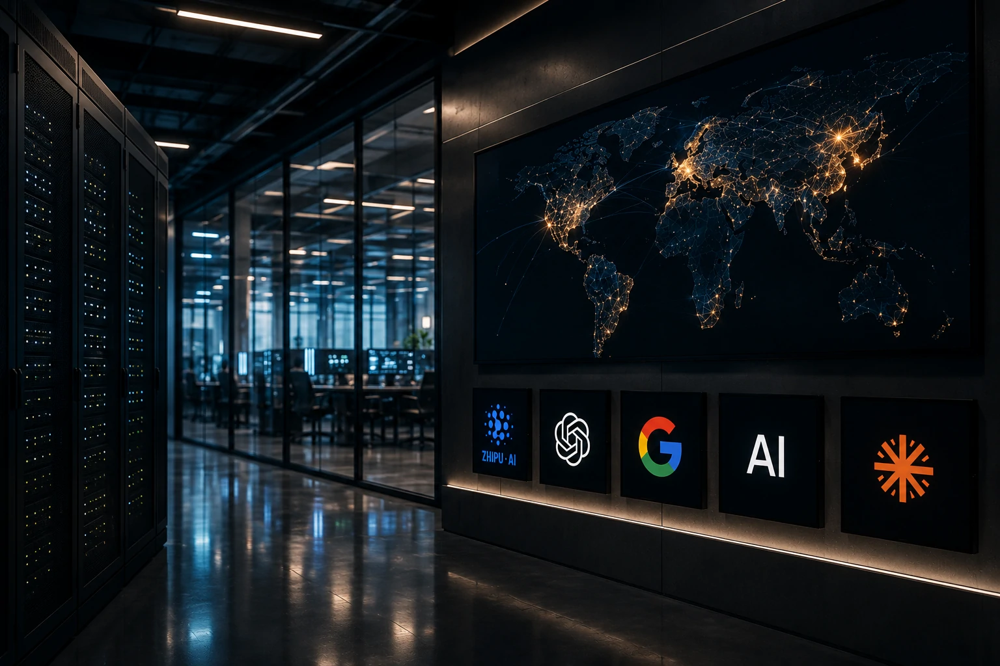

*O lançamento do **GLM-5.2** mostra que a corrida pela inteligência artificial deixou de ser disputada apenas entre empresas norte-americanas. A chegada do novo modelo da **Zhipu AI** reforça o crescimento do ecossistema chinês de IA e amplia a competição por empresas que buscam modelos cada vez mais eficientes para aplicações corporativas.*

## O GLM-5.2 representa um novo avanço da inteligência artificial chinesa

O **GLM-5.2** é a nova geração de modelos de linguagem desenvolvida pela **Zhipu AI**. Seu lançamento demonstra que a indústria chinesa continua reduzindo a distância tecnológica em relação a empresas como **OpenAI**, **Google** e **Anthropic**, ampliando a concorrência no mercado global de inteligência artificial.

*O avanço do GLM-5.2 reforça a presença da China na corrida mundial pela inteligência artificial.*

Nos últimos anos, a evolução dos modelos chineses deixou de ser um movimento regional para se tornar um fator estratégico da indústria global. Empresas e investidores passaram a acompanhar esses lançamentos com maior atenção, principalmente porque a competição influencia preços, velocidade de inovação e disponibilidade de soluções para o mercado corporativo.

### O que torna o GLM-5.2 relevante

O interesse em torno do **GLM-5.2** não está apenas nos resultados divulgados em benchmarks.

O modelo foi desenvolvido para competir diretamente em tarefas utilizadas diariamente por empresas, incluindo geração de texto, programação, raciocínio, interpretação de documentos, automação de processos e suporte a agentes inteligentes.

Esse posicionamento coloca a **Zhipu AI** entre os laboratórios que disputam espaço em um mercado cada vez mais estratégico para transformação digital.

### A corrida deixou de ter poucos protagonistas

Até pouco tempo, a liderança da inteligência artificial estava concentrada em poucas empresas.

Hoje, esse cenário começa a mudar.

Além de **OpenAI**, **Google** e **Anthropic**, empresas chinesas passaram a lançar modelos cada vez mais competitivos, ampliando as opções disponíveis para organizações que desejam incorporar inteligência artificial em seus processos de negócio.

## A concorrência entre laboratórios acelera a inovação corporativa

A chegada do **GLM-5.2** beneficia o mercado porque aumenta a competição entre fornecedores de inteligência artificial e acelera o ritmo de evolução tecnológica.

*Empresas passam a contar com mais alternativas para projetos de inteligência artificial.*

Quando novos modelos conseguem competir em desempenho, todo o mercado tende a reagir.

Laboratórios aceleram pesquisas, ampliam investimentos em infraestrutura, reduzem custos operacionais e adicionam novos recursos para manter vantagem competitiva.

### Mais opções para empresas

Na prática, empresas deixam de depender exclusivamente de um número reduzido de fornecedores.

Isso aumenta a possibilidade de escolher plataformas considerando fatores como desempenho, custo, integração com sistemas existentes, requisitos regulatórios e necessidades específicas de cada projeto.

Essa dinâmica já pode ser observada em outras frentes da corrida pela inteligência artificial.

Recentemente, o **Notícia Tech** mostrou como a **Mistral AI** passou a desafiar empresas consolidadas ao ampliar sua estratégia para o mercado corporativo:

https://noticiatech.com.br/inteligencia-artificial/mistral-ai-dispara-buscas-desafia-openai-anthropic-google-ia-corporativa-2026/

Outro movimento relevante foi a evolução do **Gemini Spark**, que evidencia como os grandes laboratórios estão direcionando seus investimentos para agentes inteligentes e automação empresarial:

https://noticiatech.com.br/inteligencia-artificial/google-gemini-spark-agentes-ia-mercado-corporativo/

A entrada do **GLM-5.2** amplia ainda mais esse cenário competitivo e reforça que a próxima fase da inteligência artificial será marcada por uma disputa cada vez mais intensa entre empresas de diferentes regiões do mundo.

## O impacto do GLM-5.2 vai além dos benchmarks

O avanço do **GLM-5.2** demonstra que a disputa pela liderança da inteligência artificial deixou de ser medida apenas por rankings de desempenho. O mercado corporativo passou a avaliar fatores como custo operacional, infraestrutura disponível, segurança, conformidade regulatória e capacidade de integração com sistemas empresariais.

*As decisões corporativas sobre inteligência artificial envolvem muito mais do que desempenho em testes técnicos.*

Embora benchmarks sejam importantes para medir capacidades específicas, eles representam apenas uma parte do processo de decisão.

### Empresas procuram plataformas completas

Organizações que adotam inteligência artificial em larga escala normalmente analisam critérios como:

- estabilidade da plataforma;
- frequência de atualizações;
- segurança dos dados;
- documentação técnica;
- suporte empresarial;
- facilidade de integração com CRMs, ERPs e APIs;
- custo total de operação.

Na prática, um modelo tecnicamente superior nem sempre será a escolha ideal caso apresente limitações para implantação em ambientes corporativos.

### A competição tende a beneficiar os clientes

O aumento do número de laboratórios capazes de desenvolver modelos avançados cria um ambiente mais competitivo.

Essa disputa normalmente resulta em:

- redução de custos;
- evolução mais rápida dos modelos;
- maior oferta de recursos;
- melhoria da qualidade dos serviços;
- maior velocidade na inovação.

Para empresas, esse cenário representa mais alternativas para escolher soluções alinhadas aos seus objetivos estratégicos.

## A inteligência artificial entra em uma nova fase da competição global

A chegada do **GLM-5.2** reforça que a liderança da inteligência artificial continuará sendo disputada por empresas de diferentes países. O mercado passa a conviver com um ecossistema mais competitivo, reduzindo a concentração tecnológica observada nos últimos anos.

O fortalecimento da **Zhipu AI** também demonstra que a China continua investindo fortemente em pesquisa, infraestrutura e desenvolvimento de modelos próprios.

Essa estratégia amplia a capacidade do país de competir em setores considerados estratégicos para a economia digital, incluindo agentes inteligentes, automação empresarial e plataformas generativas.

### O que muda para empresas

Para gestores e profissionais de tecnologia, acompanhar esses movimentos deixa de ser apenas uma curiosidade sobre novos modelos.

A evolução da concorrência pode impactar diretamente:

- custos de projetos de IA;
- escolha de fornecedores;
- velocidade de inovação;
- disponibilidade de recursos;
- estratégias de transformação digital.

Quanto maior a concorrência entre laboratórios, maior tende a ser a velocidade de evolução das soluções disponíveis para o mercado corporativo.

### A corrida pela IA está apenas começando

O lançamento do **GLM-5.2** não define um vencedor na disputa global pela inteligência artificial.

Ele sinaliza que o mercado entrou em uma nova fase, na qual empresas chinesas passam a disputar espaço de forma cada vez mais consistente com laboratórios tradicionais.

Para organizações que utilizam inteligência artificial, essa mudança amplia as possibilidades de adoção e acelera o surgimento de novas soluções voltadas para produtividade, automação e tomada de decisão.

Nos próximos meses, a tendência é que **OpenAI**, **Google**, **Anthropic**, **Mistral AI** e **Zhipu AI** intensifiquem ainda mais seus lançamentos, mantendo a corrida tecnológica em ritmo acelerado e tornando o mercado de inteligência artificial corporativa um dos mais dinâmicos da economia digital.

---