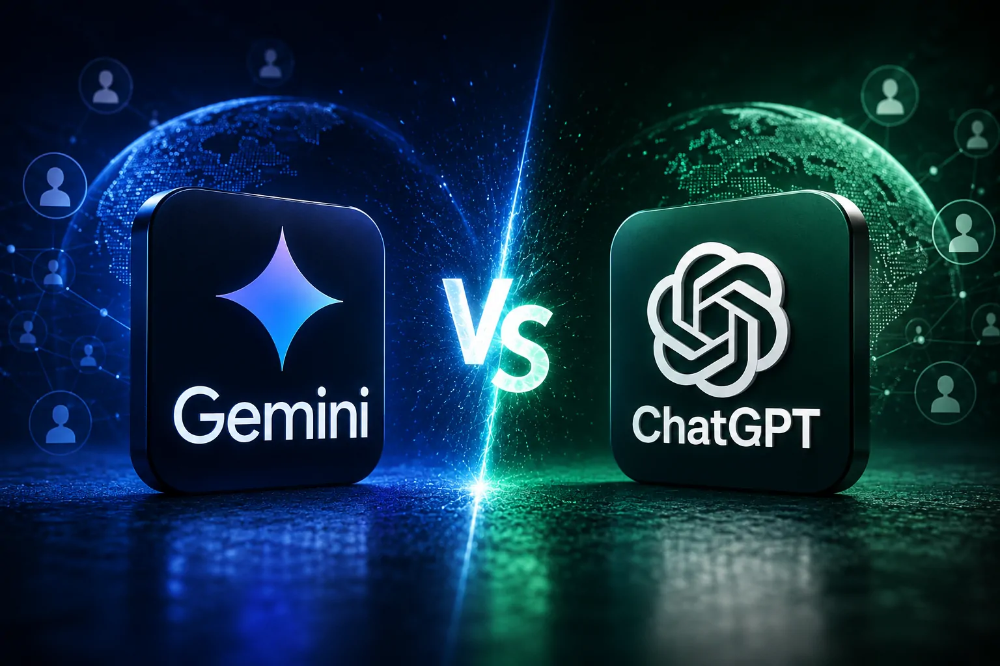
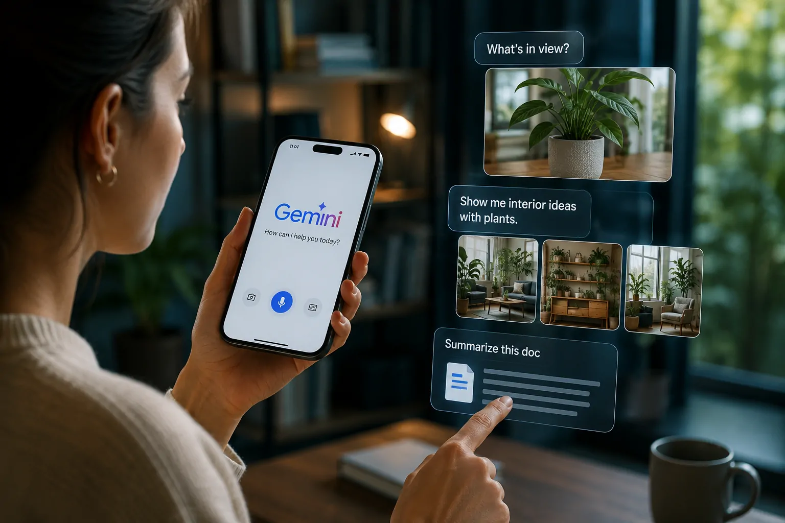
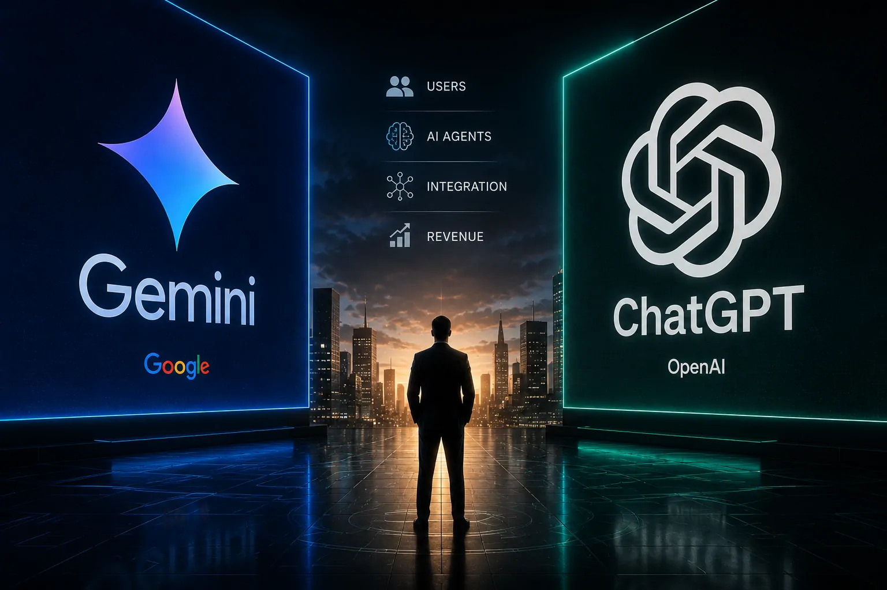

*O Gemini ultrapassou 1 bilhão de usuários mensais e colocou o Google em uma posição muito mais próxima da OpenAI na corrida dos assistentes de inteligência artificial. O número chama atenção pelo tamanho, mas seu significado mais importante está na mudança da disputa: a próxima batalha não será apenas por usuários, mas por frequência de uso, distribuição, agentes e receita.*

## Gemini alcança uma escala que muda a disputa

### O marco de 1 bilhão de usuários

O **Google** informou que o **Gemini** ultrapassou 1 bilhão de usuários mensais em agosto de 2026. O marco transforma o assistente de IA em um dos produtos de maior escala da empresa e representa uma aceleração expressiva em relação aos 950 milhões divulgados poucas semanas antes.

O crescimento também chama atenção pela velocidade. Em fevereiro, o **Gemini** tinha ultrapassado 750 milhões de usuários mensais. Em poucos meses, o serviço avançou para uma escala comparável à do **ChatGPT**.

### O que o número realmente representa

O número de 1 bilhão se refere ao aplicativo **Gemini**, incluindo suas experiências na web e em dispositivos móveis. Ele não significa que todas as pessoas que utilizam recursos de IA dentro do **Google Search**, **Workspace** ou outros serviços estejam sendo somadas à mesma métrica.

Essa distinção é importante porque o ecossistema de IA do **Google** é maior do que o aplicativo Gemini. O marco mostra, porém, que o produto já conseguiu gerar uma audiência própria gigantesca, sem depender apenas da exposição dentro de outros serviços.

## ChatGPT e Gemini chegam a um novo equilíbrio

*Gemini e ChatGPT atingiram uma escala de usuários que torna a competição entre Google e OpenAI mais equilibrada.*

### A vantagem histórica do ChatGPT diminui

O **ChatGPT** foi o produto que popularizou os assistentes generativos em escala global e construiu uma vantagem inicial difícil de ignorar. A chegada do **Gemini** ao patamar de 1 bilhão de usuários reduz, entretanto, uma das diferenças mais visíveis entre as duas plataformas.

A disputa deixa de ser uma história simples de pioneirismo contra um concorrente em crescimento. Agora, **OpenAI** e **Google** possuem produtos capazes de alcançar uma audiência de escala global.

### A métrica de usuários não decide a liderança

Isso não significa que **Gemini** e **ChatGPT** tenham exatamente o mesmo nível de utilização ou valor econômico. Usuários mensais mostram alcance, mas não revelam frequência, retenção, duração das sessões, uso profissional ou quanto cada usuário gera de receita.

É justamente nesse ponto que a próxima etapa da competição ganha importância. O vencedor não será necessariamente quem tiver mais usuários, mas quem conseguir transformar essa audiência em utilização recorrente e negócios sustentáveis.

## A distribuição é a maior vantagem do Google

### Android amplia o alcance do Gemini

O **Google** possui uma vantagem estrutural que a **OpenAI** não consegue reproduzir facilmente: distribuição. O Gemini está conectado ao ecossistema Android e pode alcançar usuários por meio de dispositivos e serviços que já fazem parte da rotina digital de bilhões de pessoas.

O aplicativo também avançou no **iPhone**, mostrando que seu crescimento não depende exclusivamente do sistema operacional do Google. Essa expansão reduz a dependência de um único canal e aumenta o alcance potencial do produto.

### Search e Workspace ampliam o ecossistema

O Google também controla propriedades como **Search**, **Chrome**, **Gmail**, **Drive**, **YouTube** e **Workspace**. A integração da IA nesses ambientes cria múltiplos pontos de contato entre o usuário e o Gemini.

Essa diferença é estratégica. Enquanto a **OpenAI** precisa expandir o ecossistema do ChatGPT por meio de produtos, parcerias e dispositivos, o Google já possui uma infraestrutura de distribuição global. O desafio passa a ser transformar essa vantagem em preferência real pelo Gemini.

## O Gemini cresce além do chatbot

*O crescimento do Gemini está associado a uma experiência que combina texto, voz, imagens e interação multimodal.*

### Voz e multimodalidade ganham espaço

O Google revelou que 63% dos usuários do Gemini interagem diretamente por voz. A empresa também informou que o serviço gera mais de 150 milhões de imagens por dia, mostrando que a utilização está avançando para além do tradicional campo de perguntas e respostas.

Outro dado relevante é o uso de recursos multimodais. Parte das interações envolve câmera e compartilhamento de tela, aproximando o assistente de tarefas realizadas no mundo real.

### A estratégia aponta para agentes

O movimento também se conecta à evolução dos **agentes de IA**. Em vez de simplesmente responder a uma pergunta, os assistentes passam a executar tarefas, interpretar contexto e interagir com diferentes serviços.

Essa mudança é importante para empresas porque a IA deixa de ser apenas uma interface de consulta e passa a atuar dentro de processos. O movimento já aparece no mercado com soluções que levam agentes para fluxos corporativos, como mostra a análise do **ChatGPT Work** sobre a entrada da OpenAI na era dos agentes para produtividade empresarial.

**[ChatGPT Work e a era dos agentes de IA para produtividade corporativa](https://noticiatech.com.br/inteligencia-artificial/chatgpt-work-era-agentes-ia-produtividade-corporativa/)**

## A batalha agora será por retenção e receita

### Um bilhão de usuários não garante liderança

Chegar a 1 bilhão de usuários é um marco de distribuição, mas não resolve a questão econômica. Para **Google** e **OpenAI**, o próximo desafio é descobrir quanto dessa audiência pode ser convertida em usuários frequentes e clientes pagantes.

A diferença entre uma plataforma de IA popular e uma plataforma de negócios pode estar justamente na retenção. Um usuário que utiliza o assistente diariamente para trabalho, pesquisa, programação ou automação tem muito mais valor estratégico do que alguém que experimenta a ferramenta ocasionalmente.

### Empresas podem definir a próxima fase

No mercado corporativo, a disputa tende a ficar ainda mais complexa. O **Gemini** pode aproveitar a integração com **Workspace**, enquanto o **ChatGPT** busca ampliar sua presença diretamente nos fluxos de trabalho das empresas.

Esse movimento transforma a competição em uma disputa por infraestrutura de trabalho. A plataforma que conseguir se tornar parte dos processos diários terá mais chances de capturar receita recorrente e criar custos de mudança para seus clientes.

Essa transformação também se relaciona ao avanço dos agentes de IA na automação de processos empresariais, que amplia o papel dos modelos para além da simples conversa e aproxima a tecnologia de tarefas operacionais.

**[Como os agentes de IA estão transformando a automação de processos nas empresas](https://noticiatech.com.br/automacao/agentes-ia-transformando-automacao-processos-empresas-alem-chatgpt-work/)**

## O próximo campo de batalha será a IA que executa tarefas

### Chatbots deixam de ser o principal diferencial

O marco de 1 bilhão mostra que o mercado de assistentes de IA já alcançou uma escala que poucos imaginavam no início da atual corrida generativa. Por isso, simplesmente oferecer uma interface para conversar com um modelo deixou de ser suficiente para diferenciar os principais concorrentes.

O próximo diferencial será a capacidade de transformar inteligência artificial em uma camada operacional. Isso significa conectar modelos a aplicativos, dados, ferramentas, dispositivos e processos que permitam executar ações.

### Google e OpenAI entram em uma disputa mais ampla

*Com Gemini e ChatGPT em escala semelhante, a competição avança para agentes, integração e monetização.*

O **Google** chega a essa nova fase com uma vantagem de distribuição difícil de igualar. A **OpenAI**, por outro lado, possui uma marca construída diretamente em torno da inteligência artificial e uma enorme base de usuários do ChatGPT.

A disputa, portanto, ficou mais equilibrada justamente quando o mercado começa a mudar de natureza. O número de usuários continua importante, mas a próxima medida de liderança será a capacidade de transformar esses usuários em uma plataforma indispensável para trabalho, produtividade e execução de tarefas.

O Gemini ter alcançado 1 bilhão de usuários não significa que o ChatGPT perdeu sua liderança. Significa algo mais relevante: **a diferença de escala deixou de ser suficiente para explicar quem está vencendo a corrida da IA**.

A partir de agora, Google e OpenAI terão de provar quem consegue transformar uma audiência de bilhões em uma posição dominante na próxima camada da computação.

---