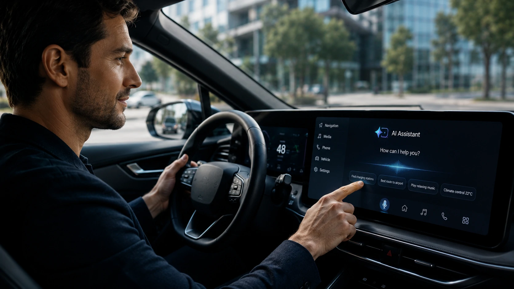
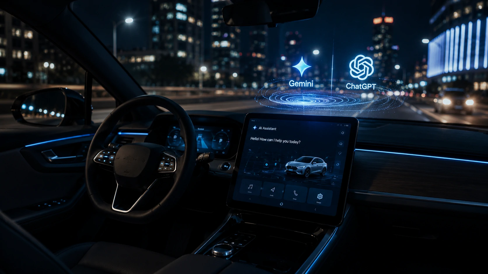
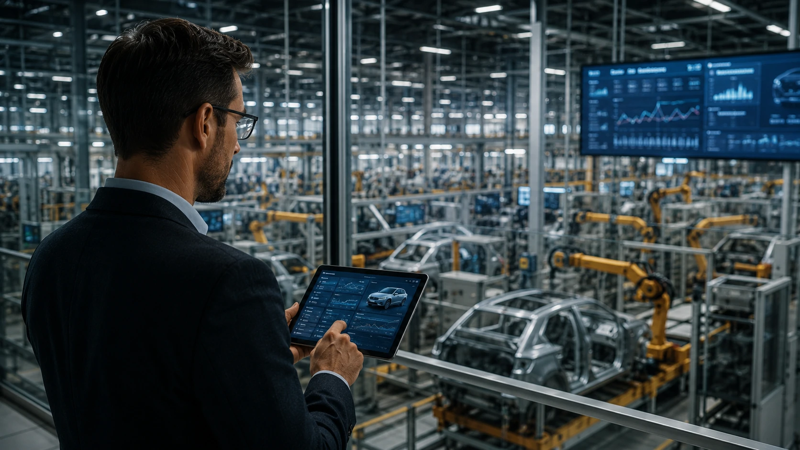

*Os carros estão deixando de ser apenas meios de transporte para se transformar em plataformas inteligentes conectadas. A chegada de modelos como **Google Gemini** e **ChatGPT** ao setor automotivo representa uma mudança estratégica que aproxima veículos da mesma experiência conversacional já presente em smartphones, computadores e assistentes digitais. Para fabricantes, empresas e consumidores, esse movimento inaugura uma nova etapa da mobilidade baseada em inteligência artificial.*

## A inteligência artificial embarcada transforma o carro em um assistente inteligente

*Modelos generativos começam a ocupar um papel central na experiência de condução dos veículos conectados.*

Os avanços recentes mostram que **Google Gemini** e **ChatGPT** caminham para se tornar parte da arquitetura dos veículos definidos por software. Em vez de depender exclusivamente de menus, botões e comandos limitados, os motoristas passam a interagir por meio de linguagem natural.

Essa evolução aproxima a experiência automotiva da realidade já observada em dispositivos pessoais. O veículo deixa de responder apenas a comandos específicos e passa a compreender contexto, intenção e preferências do usuário.

Para a indústria, isso representa uma mudança estrutural. O software assume papel cada vez mais relevante, enquanto a inteligência artificial amplia a capacidade de personalização e integração entre diferentes serviços digitais.

### Conversas naturais substituem comandos complexos

Em vez de memorizar frases específicas, o motorista poderá solicitar informações ou executar ações utilizando linguagem cotidiana.

Entre os exemplos estão:

- solicitar rotas mais eficientes;
- encontrar postos de recarga ou combustível;
- controlar climatização e entretenimento;
- resumir mensagens recebidas;
- obter informações sobre o destino da viagem.

Essa interação reduz distrações e torna a utilização dos recursos do veículo mais intuitiva.

### O veículo passa a compreender contexto

A principal diferença entre assistentes tradicionais e modelos generativos está na capacidade de interpretar contexto.

Ao considerar localização, histórico, preferências e intenção do usuário, a IA consegue entregar respostas mais úteis durante a viagem.

Esse avanço acompanha uma tendência observada em outras áreas da tecnologia, como a expansão dos agentes inteligentes apresentada pelo **Notícia Tech** em:

[Google lança Gemini Spark e acelera disputa pelos agentes de IA no mercado corporativo](https://noticiatech.com.br/inteligencia-artificial/google-gemini-spark-agentes-ia-mercado-corporativo/)

## A indústria automotiva acelera a corrida pelos veículos definidos por software

*Fabricantes enxergam a inteligência artificial como um diferencial competitivo para a próxima geração de automóveis.*

A adoção de **Gemini**, **ChatGPT** e outras soluções generativas demonstra que a competição entre montadoras não será definida apenas por motores, autonomia ou design.

Cada vez mais, a experiência digital oferecida ao motorista passa a influenciar decisões de compra e fidelização.

Nesse cenário, fabricantes investem em plataformas capazes de receber atualizações constantes, adicionar novas funcionalidades e integrar serviços baseados em inteligência artificial.

### A IA amplia o valor dos veículos conectados

Os novos sistemas podem oferecer recursos como manutenção preditiva, diagnóstico inteligente, recomendações personalizadas e integração com calendários, aplicativos corporativos e dispositivos móveis.

Isso cria novas oportunidades para fabricantes desenvolverem serviços por assinatura e ampliarem receitas após a venda do veículo.

Ao mesmo tempo, empresas que operam frotas podem utilizar esses recursos para aumentar eficiência operacional, reduzir custos e melhorar a experiência dos motoristas.

### A mobilidade inteligente fortalece novos ecossistemas digitais

A chegada da IA embarcada também aproxima a indústria automotiva do ecossistema de plataformas inteligentes.

Tecnologias como integração entre agentes, processamento contextual e comunicação entre diferentes sistemas tornam-se cada vez mais importantes para viabilizar veículos realmente conectados.

Esse movimento dialoga diretamente com outro tema acompanhado pelo **Notícia Tech**, que mostra como novas arquiteturas estão permitindo maior integração entre aplicações inteligentes:

[Como implementar MCP nas empresas e integrar agentes de IA em escala](https://noticiatech.com.br/inteligencia-artificial/como-implementar-mcp-empresas-arquitetura-integracao-agentes-ia/)

## A inteligência artificial embarcada cria novas oportunidades para empresas

*Além de melhorar a experiência dos motoristas, a IA embarcada abre espaço para novos modelos de negócios e serviços digitais.*

A chegada de **Google Gemini** e **ChatGPT** aos veículos também representa uma oportunidade para empresas que desenvolvem software, administram frotas ou utilizam automóveis como parte de suas operações.

A inteligência artificial deixa de atuar apenas como interface para o motorista e passa a apoiar decisões operacionais, reduzir custos e ampliar a eficiência dos processos.

Com veículos cada vez mais conectados, fabricantes e empresas poderão utilizar dados em tempo real para criar serviços inteligentes capazes de evoluir continuamente por meio de atualizações remotas.

### Frotas corporativas ganham eficiência operacional

Empresas que administram grandes frotas poderão utilizar IA para acompanhar indicadores operacionais, prever necessidades de manutenção e fornecer suporte inteligente aos motoristas.

Entre as aplicações mais promissoras estão:

- monitoramento preventivo dos veículos;
- planejamento inteligente de rotas;
- redução do consumo de combustível ou energia;
- atendimento automatizado aos condutores;
- análise de desempenho das operações.

Essa combinação reduz custos e melhora a disponibilidade da frota.

### A integração entre plataformas será cada vez mais importante

O avanço da IA embarcada também aumenta a necessidade de integração entre diferentes sistemas corporativos.

Veículos poderão trocar informações com plataformas de logística, ERPs, CRMs e assistentes inteligentes, criando fluxos automatizados que reduzem tarefas manuais.

Essa tendência acompanha a evolução da automação inteligente já analisada pelo **Notícia Tech** em:

[O que é automação de processos com IA e como ela transforma empresas](https://noticiatech.com.br/automacao/o-que-e-automacao-processos-ia-empresas/)

Outro movimento relacionado é o crescimento das plataformas de automação empresarial impulsionadas por inteligência artificial, tema abordado em:

[n8n vs Zapier: qual plataforma de automação com IA escolher em 2026?](https://noticiatech.com.br/ferramentas/n8n-vs-zapier-automacao-ia-empresas-2026/)

## A disputa pela IA automotiva está apenas começando

Os primeiros anúncios envolvendo **Google Gemini**, **ChatGPT** e veículos inteligentes demonstram que a inteligência artificial embarcada será um dos principais fatores de diferenciação da indústria automotiva durante os próximos anos.

Mais do que adicionar um assistente virtual ao painel do carro, fabricantes buscam transformar o veículo em uma plataforma inteligente capaz de compreender contexto, aprender preferências dos usuários e integrar diferentes serviços digitais.

### O software passa a definir o valor do veículo

Historicamente, desempenho mecânico, conforto e design eram os principais critérios de competitividade.

Agora, a experiência digital passa a ocupar posição semelhante.

Atualizações contínuas, integração com ecossistemas de IA e novos serviços baseados em software poderão influenciar diretamente o valor percebido pelos consumidores.

Essa transformação aproxima o setor automotivo do modelo já adotado por empresas de tecnologia, nas quais inovação contínua e evolução do software tornam-se parte do produto.

### O futuro da mobilidade será cada vez mais inteligente

A chegada de modelos generativos aos automóveis indica que a próxima geração de veículos será construída em torno da inteligência artificial.

Para consumidores, isso significa uma experiência mais personalizada, conectada e intuitiva.

Para fabricantes, representa uma nova corrida por inovação, diferenciação tecnológica e geração de receitas por meio de serviços digitais.

Para empresas, abre oportunidades de utilizar veículos conectados como parte de estratégias mais amplas de automação, produtividade e transformação digital.

À medida que **Google**, **OpenAI** e outros grandes desenvolvedores ampliam seus investimentos em IA, os automóveis tendem a deixar de ser apenas meios de transporte para se tornar plataformas inteligentes integradas ao cotidiano das pessoas e das organizações.

---