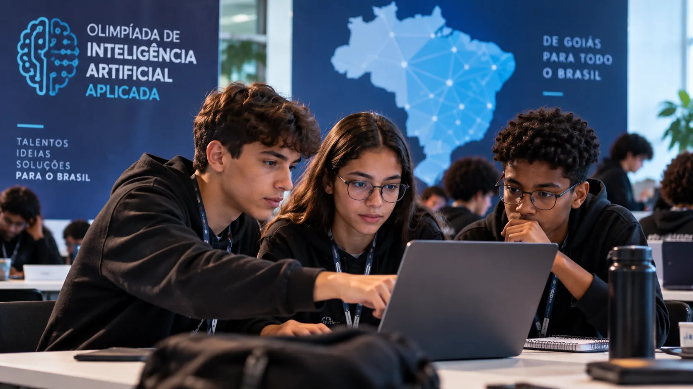
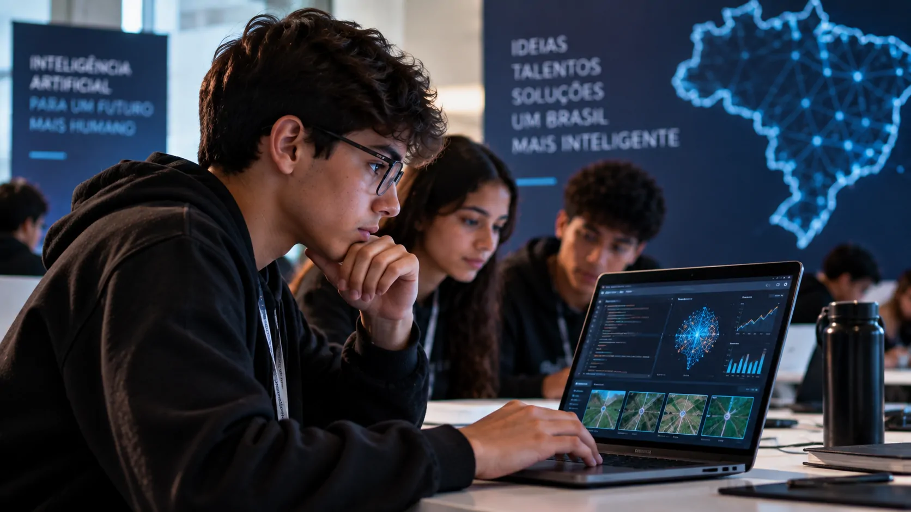
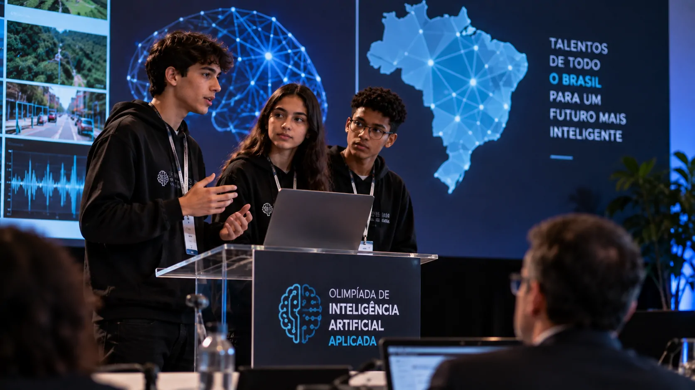

*A Olimpíada de Inteligência Artificial Aplicada de Goiás mudou de escala em 2026. Na terceira edição, a competição deixou de ser regional e passou a ter alcance nacional, permitindo a participação de estudantes de escolas públicas e privadas de diferentes estados em desafios práticos de inteligência artificial.*

## Goiás amplia o alcance da Olimpíada de Inteligência Artificial

A **Olimpíada de Inteligência Artificial Aplicada** chega à terceira edição com uma mudança importante: a competição, antes regional, passou a aceitar estudantes de **todo o Brasil**.

A iniciativa é promovida pela **Secretaria de Estado de Ciência, Tecnologia e Inovação de Goiás** em parceria com o **Centro de Excelência em Inteligência Artificial (CEIA) da UFG**.

A proposta é estimular o aprendizado e o uso prático de **inteligência artificial** entre jovens. Para isso, a competição combina treinamento, mentoria e desafios que exigem a aplicação dos conhecimentos adquiridos.

### De uma iniciativa regional para uma competição nacional

A mudança não está apenas no número potencial de participantes. Ao abrir a competição para estudantes de outros estados, Goiás passa a colocar sua iniciativa de formação em IA em um contexto nacional.

O movimento também permite que estudantes de regiões diferentes tenham acesso à mesma estrutura de treinamento e competição, sem que a participação esteja limitada ao estado onde o projeto foi criado.

### Uma iniciativa ligada ao ecossistema de IA de Goiás

A participação do **CEIA-UFG** conecta a Olimpíada a um centro dedicado à pesquisa, desenvolvimento e aplicação de inteligência artificial.

O centro atua em projetos que envolvem diferentes setores e mantém uma atuação conjunta entre academia, governo e empresas, contexto que ajuda a explicar a presença da formação de novos talentos dentro desse ecossistema.

## Estudantes de todo o Brasil entram na disputa em 2026

*Em 2026, a competição deixa de ser regional e passa a receber estudantes de escolas públicas e privadas de todo o Brasil.*

A edição de 2026 é aberta a estudantes de **escolas públicas e privadas de todo o Brasil**. O público inclui alunos matriculados do 9º ano do ensino fundamental até o último ano do ensino médio.

A faixa etária definida para os estudantes é de **14 a 19 anos completos até o final de 2026**. A competição também conta com mentores, que podem ser professores, profissionais de tecnologia ou interessados na área que atendam aos requisitos definidos pela organização.

### Como as equipes são formadas

Cada equipe é formada por **três estudantes do mesmo estado** e liderada por um mentor ou tutor.

Essa regra mantém uma dimensão estadual dentro de uma competição que agora possui alcance nacional. Na prática, alunos de diferentes unidades da federação podem participar, mas cada equipe continua vinculada ao seu estado.

### O papel dos mentores

A presença de mentores acrescenta uma camada de acompanhamento ao processo. Em vez de concentrar a experiência apenas na resolução das provas, a estrutura inclui orientação durante a preparação.

Para estudantes que ainda estão no ensino básico, esse contato pode aproximar a aprendizagem de IA de profissionais que já possuem experiência acadêmica ou prática na área.

## Os desafios colocam diferentes áreas de IA em prática

A competição não trata inteligência artificial apenas como geração de textos ou imagens. A organização prevê desafios em diferentes áreas técnicas.

### Visão Computacional

A **Visão Computacional** envolve sistemas capazes de trabalhar com informações presentes em imagens. É uma área utilizada em diferentes aplicações tecnológicas e exige que os participantes compreendam como dados visuais podem ser processados por sistemas de IA.

### Processamento de Linguagem Natural

O **Processamento de Linguagem Natural** trabalha com dados relacionados à linguagem humana. A área está presente em aplicações como análise de textos, sistemas conversacionais e outras ferramentas que precisam interpretar informações linguísticas.

### Aprendizado de Máquina para Dados Tabulares

A terceira frente envolve **Aprendizado de Máquina para Dados Tabulares**, modalidade em que modelos trabalham com informações organizadas em estruturas semelhantes às encontradas em planilhas e bancos de dados.

A combinação das três áreas amplia o contato dos estudantes com diferentes formas de aplicação da IA, em vez de restringir a competição a uma única tecnologia.

## A formação prática pode aproximar jovens do mercado de IA

*Os desafios da Olimpíada aproximam conceitos de inteligência artificial de problemas que exigem análise e aplicação prática.*

A principal característica da competição está na tentativa de transformar conhecimento técnico em resolução de problemas. Esse aspecto pode ser relevante para estudantes que estão começando a conhecer as possibilidades profissionais relacionadas à IA.

O contato precoce com dados, modelos e diferentes aplicações também pode ajudar a mostrar que inteligência artificial não se resume aos sistemas generativos que ganharam popularidade nos últimos anos.

### Conhecimento aplicado a problemas concretos

A lógica da Olimpíada se aproxima de outras iniciativas brasileiras em que jovens e pesquisadores utilizam IA para resolver problemas específicos.

Um exemplo já publicado pelo **Notícia Tech** é o da **[engenheira que criou uma IA para transformar dados climáticos do Sertão da Paraíba em informações para produtores](https://noticiatech.com.br/inteligencia-artificial/engenheira-cria-ia-transforma-dados-clima-sertao-paraiba-produtores/)**.

Nesse tipo de aplicação, o valor da tecnologia está menos na novidade da ferramenta e mais na capacidade de transformar dados em uma solução útil.

### Uma porta de entrada para diferentes carreiras

Para os participantes da Olimpíada, a experiência pode apresentar caminhos diferentes dentro da tecnologia, como análise de dados, desenvolvimento de modelos e pesquisa em inteligência artificial.

Ainda não é possível afirmar que a competição produzirá efeitos mensuráveis sobre a formação profissional desses estudantes. Mas a expansão nacional cria uma estrutura maior para identificar jovens interessados nessas áreas.

## O cronograma mostra que a expansão ainda está em andamento

A primeira etapa classificatória da edição de 2026 ocorreu online entre **11 e 18 de setembro**. O resultado dessa fase está previsto para 21 de setembro.

O cronograma oficial prevê ainda um segundo período de treinamento online, entre 22 de setembro e 23 de outubro, antes das etapas presenciais.

### As próximas etapas serão presenciais

As etapas presenciais estão programadas para ocorrer entre **31 de outubro e 2 de novembro de 2026**.

Esse momento será importante porque permitirá observar a fase final de uma competição que, pela primeira vez, reúne participantes de diferentes estados sob uma mesma estrutura nacional.

### O que observar depois da primeira edição nacional

A expansão amplia o alcance da iniciativa, mas seus efeitos de longo prazo ainda dependerão da continuidade do projeto e dos resultados obtidos pelos participantes.

O principal ponto a acompanhar é se a Olimpíada conseguirá se consolidar como uma porta de entrada recorrente para estudantes interessados em **inteligência artificial** e outras áreas de tecnologia.

Esse movimento ganha relevância porque a formação de pessoas capazes de trabalhar com IA não depende apenas de ferramentas disponíveis. Também exige contato com problemas reais, conhecimento técnico e oportunidades para colocar esse conhecimento em prática.

## Goiás usa a Olimpíada para conectar educação e ecossistema de IA

*A etapa nacional amplia o espaço para que estudantes tenham contato com desafios de IA e com um ecossistema tecnológico ligado à pesquisa e inovação.*

A transformação da Olimpíada em uma competição nacional coloca **Goiás** em uma posição diferente dentro da formação de jovens interessados em IA. A iniciativa passa a alcançar estudantes de outras regiões sem abandonar a estrutura construída no estado.

Esse movimento ocorre em um ecossistema no qual o **CEIA-UFG** mantém projetos de pesquisa, desenvolvimento e aplicação de inteligência artificial em áreas como saúde, agronegócio, energia e logística.

### Da competição para a formação de talentos

A Olimpíada não deve ser confundida com um programa de formação profissional completo. Seu papel é mais específico: estimular o aprendizado e a prática de IA por meio de uma competição estruturada.

Ainda assim, competições desse tipo podem funcionar como pontos de contato entre estudantes e áreas tecnológicas que serão aprofundadas posteriormente em cursos técnicos, graduação, pesquisa ou trabalho.

### O alcance nacional muda a escala da iniciativa

A primeira edição nacional ainda está em andamento, portanto não há base para afirmar que a expansão já produziu um impacto permanente na formação de talentos.

O que já mudou é a escala da participação possível. Uma iniciativa criada em Goiás passou a receber estudantes de todo o país e a colocar diferentes regiões brasileiras dentro da mesma competição de inteligência artificial.

Esse é o principal desdobramento a acompanhar: não apenas quem vencerá a edição de 2026, mas se a expansão conseguirá transformar a Olimpíada em uma iniciativa contínua de aproximação entre **jovens, educação e inteligência artificial** no Brasil.

---