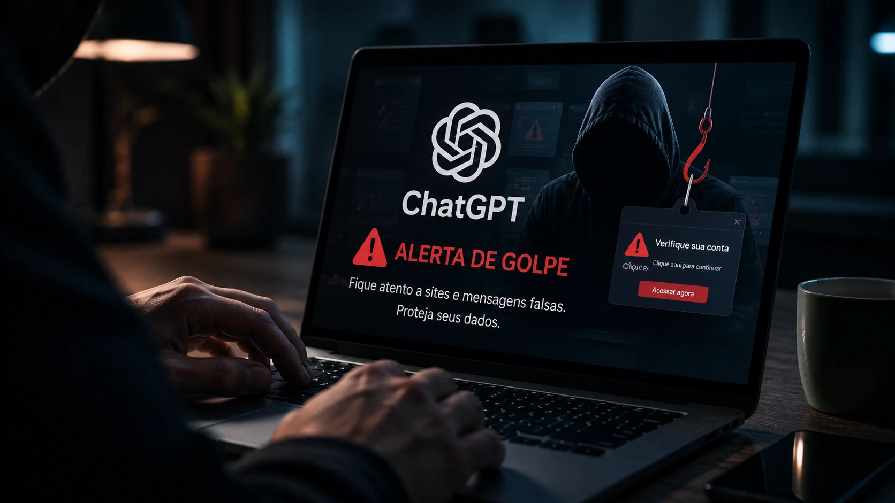
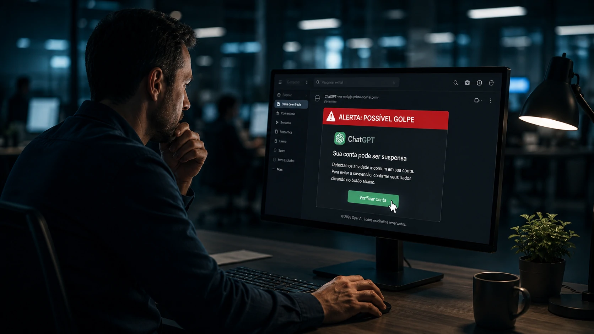
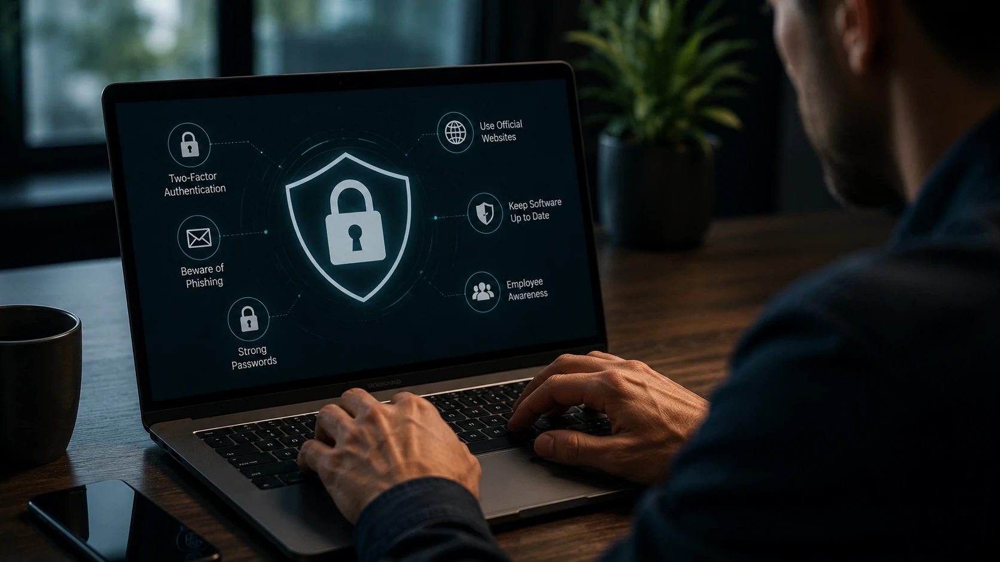

*O crescimento explosivo da inteligência artificial trouxe novas oportunidades para empresas, mas também abriu espaço para uma nova geração de golpes digitais. Especialistas alertam que criminosos estão explorando a popularidade do ChatGPT para aplicar ataques cada vez mais sofisticados.*

## A rápida adoção da inteligência artificial generativa criou um cenário preocupante para especialistas em segurança digital.

 Em 2026 o ChatGPT passou a figurar entre as marcas mais exploradas por criminosos em campanhas de phishing, ao lado de gigantes como Microsoft e Google.

O fenômeno representa uma mudança importante no cenário das ameaças digitais. Em vez de utilizar apenas bancos, redes sociais ou serviços financeiros como isca, grupos criminosos agora exploram a enorme confiança que milhões de pessoas depositam em ferramentas de inteligência artificial.

Para empresas que incorporaram IA em seus processos, o risco tornou-se ainda maior, já que credenciais corporativas passaram a ser um alvo extremamente valioso.

## ChatGPT entra definitivamente no radar do cibercrime

Até pouco tempo atrás, campanhas de phishing utilizavam principalmente marcas consolidadas do setor financeiro ou grandes plataformas de tecnologia.

Agora, especialistas observam uma mudança significativa.

Com centenas de milhões de usuários utilizando inteligência artificial diariamente, criminosos perceberam que a marca ChatGPT oferece enorme potencial para aumentar a taxa de sucesso dos golpes.

Entre as principais estratégias identificadas estão:

- páginas falsas simulando login do ChatGPT;
- e-mails oferecendo supostas atualizações premium;
- aplicativos falsificados;
- falsas promoções de planos pagos;
- extensões maliciosas para navegadores;
- mensagens em redes sociais prometendo recursos exclusivos.

Quanto maior a confiança na marca, maior tende a ser a eficácia da engenharia social.

## Por que esses golpes estão ficando muito mais perigosos?

O diferencial dos ataques atuais é o uso da própria inteligência artificial para criar campanhas extremamente convincentes.

Modelos generativos conseguem produzir textos praticamente perfeitos, adaptar o idioma da vítima e até personalizar mensagens utilizando informações disponíveis publicamente.

Isso reduz diversos sinais tradicionais que antes ajudavam usuários a identificar fraudes, como erros de português, traduções mal feitas ou mensagens genéricas.

Além disso, criminosos conseguem automatizar milhares de tentativas simultaneamente, aumentando significativamente o alcance das campanhas.

## Empresas passaram a ser o principal alvo

Embora usuários comuns continuem sendo vítimas frequentes, especialistas afirmam que o foco dos criminosos está migrando para organizações.

O motivo é simples.

Uma única credencial corporativa pode dar acesso a:

- sistemas internos;
- bancos de dados;
- documentos estratégicos;
- plataformas financeiras;
- ferramentas de automação;
- ambientes de desenvolvimento.

Empresas que utilizam IA diariamente apresentam uma superfície de ataque cada vez maior.

Esse cenário também acompanha a expansão acelerada da inteligência artificial no ambiente corporativo, onde plataformas como ChatGPT vêm sendo incorporadas aos fluxos de trabalho de diferentes equipes.

## Como identificar um golpe envolvendo o ChatGPT

Mesmo usuários experientes podem ser enganados por campanhas modernas de phishing.

Alguns sinais continuam sendo fundamentais para identificar tentativas de fraude:

- URL diferente do domínio oficial da OpenAI;
- pedidos para informar senha ou código de autenticação fora do site oficial;
- promessas de acesso gratuito ao ChatGPT Plus;
- ofertas de recursos "secretos" ou versões exclusivas;
- anexos enviados por e-mail sem solicitação;
- mensagens que criam senso de urgência para evitar que a vítima pense antes de agir.

Especialistas recomendam desconfiar sempre que houver pressão para realizar uma ação imediata.

## Como proteger sua conta e seus dados

A prevenção continua sendo a principal defesa contra esse tipo de ataque.

Algumas recomendações consideradas essenciais incluem:

### Utilize apenas os canais oficiais

Acesse o ChatGPT exclusivamente pelo site oficial da OpenAI ou pelos aplicativos publicados nas lojas oficiais.

Evite clicar em links recebidos por e-mail, mensagens instantâneas ou redes sociais.

### Ative a autenticação em dois fatores

A autenticação em dois fatores adiciona uma camada extra de proteção mesmo que sua senha seja comprometida.

### Nunca compartilhe códigos de verificação

Nenhum serviço oficial solicita códigos enviados por SMS ou aplicativos autenticadores por e-mail ou mensagens.

### Atualize navegadores e sistemas

Correções de segurança reduzem vulnerabilidades exploradas por criminosos.

### Oriente colaboradores

Empresas devem investir continuamente em treinamento de conscientização sobre phishing, engenharia social e uso seguro da inteligência artificial.

## O crescimento da IA também amplia os desafios da segurança digital

A popularização da inteligência artificial representa uma das maiores transformações tecnológicas da última década.

Ao mesmo tempo, ela amplia o interesse de grupos criminosos em explorar marcas de grande reconhecimento.

Ferramentas como o ChatGPT passaram a fazer parte da rotina de profissionais, estudantes, empresas e governos, tornando-se naturalmente um alvo valioso para campanhas de fraude.

Especialistas acreditam que esse movimento deve continuar crescendo nos próximos anos, exigindo que usuários desenvolvam novos hábitos de segurança digital.

Mais do que proteger contas individuais, será necessário fortalecer toda a cultura de cibersegurança dentro das organizações.

## O que essa tendência significa para empresas

O aumento dos golpes utilizando a marca ChatGPT mostra que a inteligência artificial entrou definitivamente no radar do cibercrime.

Para empresas, isso significa revisar políticas internas de segurança, reforçar treinamentos e estabelecer processos claros para utilização de ferramentas de IA.

Já para usuários comuns, a principal recomendação continua sendo verificar sempre a autenticidade dos serviços antes de informar qualquer dado pessoal ou realizar login.

À medida que a IA se torna mais presente na rotina de milhões de pessoas, também cresce a importância da educação digital para reduzir riscos e impedir que criminosos aproveitem a confiança construída por essas plataformas.

## Continue aprendendo no Notícia Tech

Se você acompanha a evolução da inteligência artificial no ambiente corporativo, estes conteúdos também podem interessar:

- [O que é segurança de IA e por que ela será prioridade nas empresas](/inteligencia-artificial/o-que-e-seguranca-ia-prioridade-empresas/)
- [Quem pode ler suas conversas no ChatGPT, Claude e Gemini?](/inteligencia-artificial/privacidade-chatgpt-claude-gemini-conversas-ia/)
- [OpenAI muda estratégia e aposta em modelos open weight](/inteligencia-artificial/openai-estrategia-ia-aberta-modelos-open-weight/)
- [Arquitetura de IA empresarial: guia completo sobre MCP, RAG e agentes](/inteligencia-artificial/arquitetura-ia-empresarial-mcp-rag-apis-agentes-workflows-copilotos/)

## Considerações finais

O crescimento dos golpes envolvendo o ChatGPT demonstra que a popularidade da inteligência artificial também traz novos desafios para a segurança digital.

À medida que criminosos utilizam técnicas cada vez mais sofisticadas de engenharia social e IA generativa, reconhecer sinais de fraude torna-se uma habilidade essencial para usuários e empresas.

Investir em conscientização, autenticação em dois fatores, validação de links e boas práticas de segurança continua sendo a melhor forma de reduzir riscos e aproveitar os benefícios da inteligência artificial com mais confiança.

---