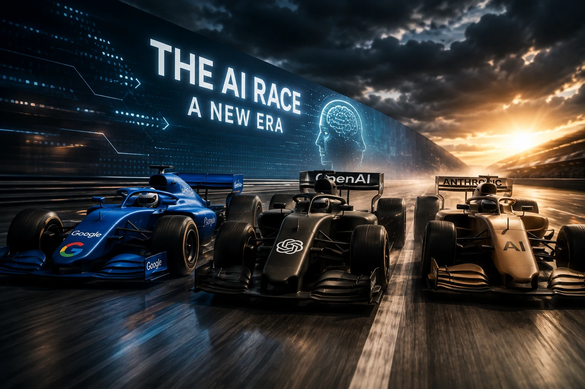
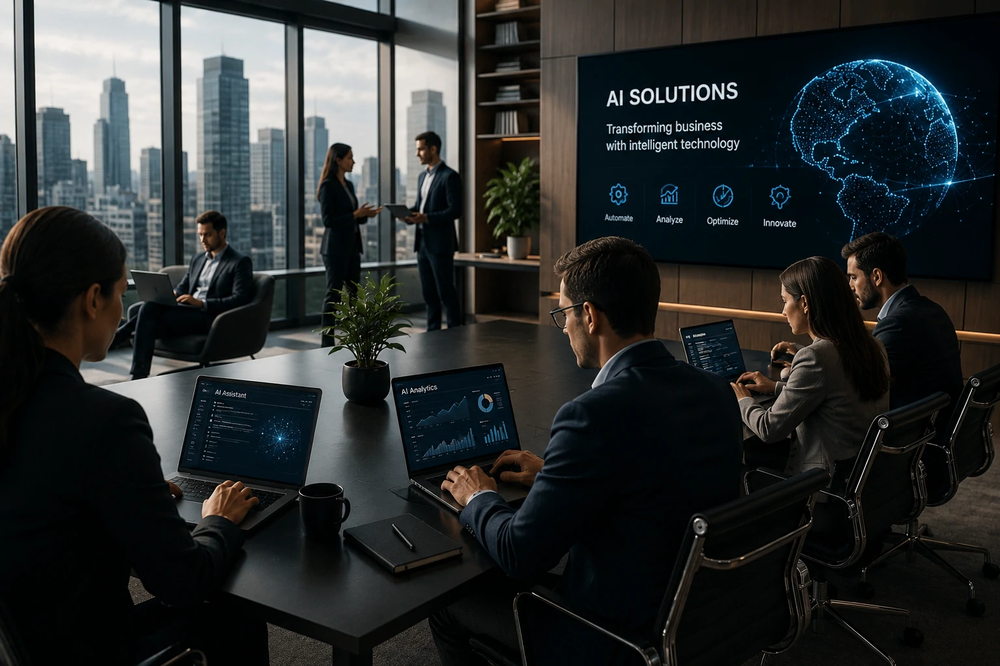
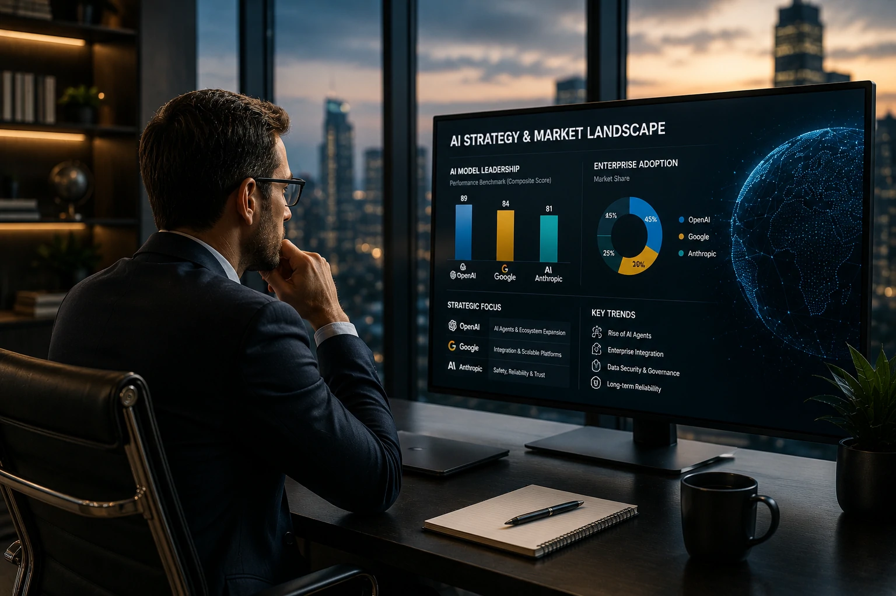

*O adiamento do **Gemini 3.5** chamou atenção por acontecer justamente quando **OpenAI** e **Anthropic** aceleram seus investimentos em inteligência artificial para empresas. Mais do que um atraso de produto, o movimento revela uma mudança importante na estratégia competitiva do **Google**, indicando que a disputa pela liderança da IA entrou em uma nova fase.*

O anúncio de que o **Google** adiou o lançamento do **Gemini 3.5** rapidamente ganhou repercussão porque ocorre em um momento de forte pressão competitiva. Enquanto a empresa reorganiza seu cronograma, concorrentes como **OpenAI** e **Anthropic** ampliam sua presença no mercado corporativo com novos modelos, agentes inteligentes e ferramentas voltadas para produtividade.

Muito além da notícia, esse movimento oferece pistas sobre como os grandes laboratórios estão redefinindo prioridades. A velocidade deixou de ser o único diferencial. Agora, desempenho, integração com ecossistemas empresariais e confiança das organizações passaram a determinar quem liderará a próxima etapa da inteligência artificial.

## O adiamento do Gemini 3.5 mostra que a corrida pela IA mudou

*O atraso do Gemini 3.5 evidencia que qualidade e estratégia passaram a valer mais do que velocidade.*

Durante os últimos anos, a competição era medida principalmente pela rapidez com que novos modelos eram apresentados ao mercado. Hoje, essa lógica mudou.

Empresas passaram a exigir soluções mais estáveis, capazes de integrar processos críticos e oferecer segurança para operações corporativas.

### O novo desafio do Google

O **Google** continua sendo uma das empresas mais influentes em inteligência artificial.

No entanto, a chegada do **ChatGPT**, seguida pelo crescimento do **Claude**, reduziu a vantagem histórica da companhia em pesquisa e inovação aplicada aos modelos generativos.

Isso explica por que lançar um modelo apenas "bom" deixou de ser suficiente.

### O custo de lançar antes da hora

Em um ambiente altamente competitivo, um lançamento abaixo das expectativas pode prejudicar reputação, adoção empresarial e participação de mercado.

Sob essa perspectiva, adiar o **Gemini 3.5** pode representar uma decisão estratégica para entregar uma plataforma mais madura.

## OpenAI e Anthropic aumentam a pressão sobre o mercado

O crescimento recente da **OpenAI** não está ligado apenas aos modelos de linguagem.

A empresa passou a concentrar esforços em agentes inteligentes capazes de executar tarefas complexas, automatizar processos e aumentar produtividade corporativa.

*Os investimentos em IA corporativa elevaram a pressão competitiva sobre todos os grandes laboratórios.*

### ChatGPT deixou de ser apenas um chatbot

O lançamento do **ChatGPT Work** mostrou que a estratégia da empresa está voltada para ambientes empresariais.

A competição entre **Google**, **OpenAI** e **Anthropic** não acontece apenas em benchmarks. Cada empresa também busca oferecer experiências diferentes para usuários e organizações, mostrando que a disputa vai além da qualidade técnica dos modelos. Essa diferença de posicionamento foi analisada pelo Notícia Tech em  

**[Por que ChatGPT Gemini e Claude parecem ter personalidades diferentes segundo a ciência](https://noticiatech.com.br/inteligencia-artificial/chatgpt-gemini-claude-personalidades-diferentes-ciencia/)**.

O foco agora é transformar a IA em um colaborador digital dentro das organizações.

### Anthropic amplia espaço entre empresas

Enquanto isso, a **Anthropic** fortalece sua posição ao investir em transparência, segurança e confiabilidade.

Essa estratégia aumenta sua atratividade entre organizações que precisam adotar IA em ambientes regulados e operações críticas.

## O impacto para empresas pode ser maior do que parece

*O atraso do **Gemini 3.5** reforça que a competição passa a ser definida pela capacidade de gerar valor para empresas.*

Para o mercado corporativo, o adiamento do **Gemini 3.5** não significa que o **Google** perdeu a disputa. Pelo contrário.

A decisão demonstra que os grandes laboratórios passaram a privilegiar qualidade, integração e confiabilidade antes de disponibilizar novos modelos em larga escala.

Empresas que estão investindo em inteligência artificial tendem a observar menos qual modelo chega primeiro e mais qual plataforma oferece melhores resultados no longo prazo.

### O mercado corporativo exige estabilidade

Nos primeiros anos da IA generativa, a inovação era suficiente para atrair usuários.

Agora, organizações procuram soluções que reduzam custos, automatizem processos e possam ser incorporadas às operações diárias sem riscos excessivos.

Esse cenário aumenta a importância de fatores como:

- desempenho consistente;
- segurança;
- governança;
- integração com sistemas corporativos;
- suporte para agentes inteligentes.

Não por acaso, o tema da governança de IA ganhou espaço entre empresas que desejam escalar o uso dessas tecnologias.

Quem ainda não acompanha essa tendência pode entender melhor neste artigo do Notícia Tech:

O adiamento do **Gemini 3.5** acontece justamente quando a **OpenAI** acelera sua expansão no mercado corporativo. Esse movimento faz parte de uma estratégia mais ampla da empresa para ampliar sua presença entre organizações, tema detalhado pelo Notícia Tech em 

**[OpenAI muda estratégia antes do IPO e amplia foco em empresas com inteligência artificial](https://noticiatech.com.br/inteligencia-artificial/openai-estrategia-ipo-foco-empresas-inteligencia-artificial/)**.

### A disputa deixou de ser apenas entre modelos

Outro aspecto importante é que a competição não acontece apenas entre **Gemini**, **ChatGPT** e **Claude**.

Na prática, a disputa envolve ecossistemas completos.

O **Google** aposta na integração com **Google Workspace**, **Google Cloud** e mecanismos de busca.

A **OpenAI** amplia seu ecossistema por meio de agentes inteligentes, APIs e produtividade empresarial.

Já a **Anthropic** busca diferenciação por meio de segurança, transparência e aplicações corporativas.

Isso significa que a decisão de uma empresa dificilmente será baseada apenas na qualidade de um modelo isolado.

## O atraso do Gemini pode redefinir a próxima fase da corrida da IA

O adiamento do **Gemini 3.5** ocorre em um momento em que praticamente todos os grandes laboratórios aceleram seus investimentos.

A expectativa do mercado é que os próximos meses tragam novos modelos, agentes mais autônomos e plataformas capazes de executar tarefas cada vez mais complexas.

### Menos anúncios e mais execução

Nos últimos dois anos, a corrida foi marcada por lançamentos frequentes.

Agora, investidores e empresas esperam resultados concretos.

Quem conseguir entregar produtividade, retorno financeiro e integração empresarial tende a conquistar maior participação de mercado.

### A inteligência artificial entra em uma nova etapa

A próxima fase provavelmente será definida menos por benchmarks e mais pela capacidade de transformar processos corporativos.

Empresas querem plataformas que:

- automatizem fluxos completos;
- auxiliem decisões estratégicas;
- reduzam custos operacionais;
- aumentem produtividade;
- funcionem de forma integrada ao ambiente de trabalho.

Nesse cenário, o atraso do **Gemini 3.5** pode ser lembrado futuramente não como um sinal de fraqueza, mas como um indicativo de que o **Google** decidiu priorizar qualidade em vez de velocidade.

Enquanto **OpenAI**, **Anthropic** e **Google** continuam elevando o nível da competição, empresas ganham acesso a plataformas cada vez mais maduras. Para gestores e profissionais de tecnologia, acompanhar esses movimentos deixou de ser apenas uma questão de curiosidade. Tornou-se parte da estratégia para decidir quais ferramentas poderão sustentar a próxima geração da transformação digital.

---