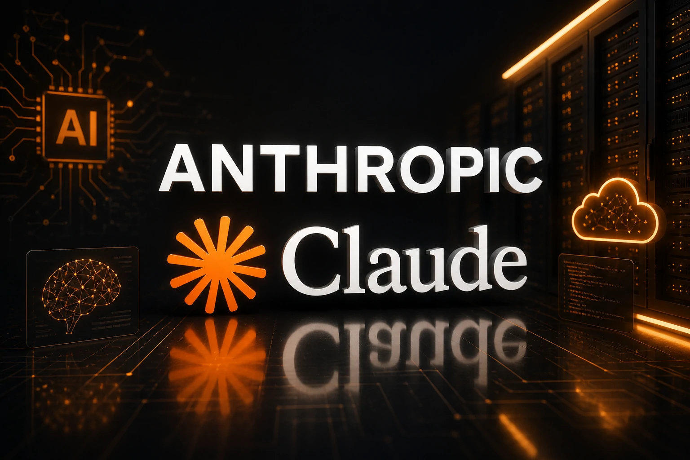
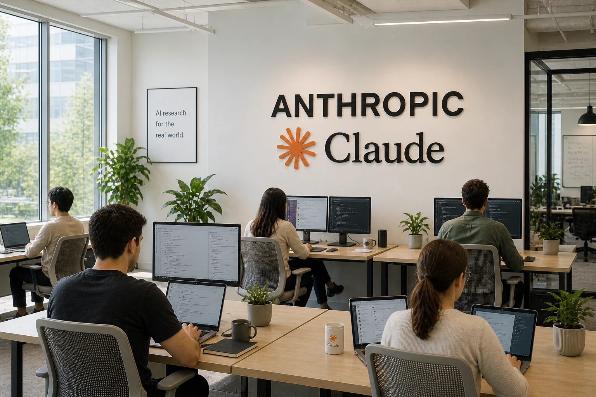

*O Google decidiu ampliar sua aposta na Anthropic, empresa criadora do Claude, um dos modelos de inteligência artificial que mais crescem no mercado corporativo. O movimento reforça a corrida global por infraestrutura, software e contratos empresariais — e pode acelerar mudanças importantes para empresas brasileiras.*

O mercado de inteligência artificial corporativa está ficando ainda mais competitivo.

A **__Google__** ampliou seu investimento na **__Anthropic__**, startup responsável pelo **__Claude__**, modelo que vem ganhando espaço em operações empresariais e disputando mercado diretamente com o **__ChatGPT__** e outras plataformas de IA. O movimento reforça uma mudança importante no setor: a disputa deixou de ser apenas sobre tecnologia e passou a ser sobre infraestrutura, adoção corporativa e domínio do software empresarial.

Para quem olha de fora, pode parecer apenas mais um investimento bilionário no setor.

Mas para empresas, isso é um sinal claro de transformação.

## Quem é a Anthropic e por que ela está crescendo tão rápido?

A **__Anthropic__** foi criada por ex-integrantes da **__OpenAI__**, liderados por **__Dario Amodei__**, com uma proposta diferente: construir inteligência artificial com foco em segurança, previsibilidade e uso empresarial.

Seu principal produto é o **__Claude__**.

Na prática, o Claude vem se posicionando como uma alternativa forte para empresas que precisam de IA aplicada em:

- análise documental  
- automação de atendimento  
- produção de conteúdo  
- suporte interno  
- operações técnicas  

O diferencial está no foco corporativo.

Enquanto muitas IAs ainda disputam atenção no mercado geral, a Anthropic avança diretamente em contratos empresariais.

## O que o Google ganha com isso?

O investimento vai além da participação financeira.

O Google fortalece seu ecossistema de IA dentro do **__Google Cloud__**.

Isso significa que, quanto mais empresas usam Claude, maior o consumo de infraestrutura do Google.

É um modelo poderoso.

A lógica é simples:

- IA gera demanda por nuvem  
- nuvem gera dependência operacional  
- dependência gera fidelização  

Essa movimentação acontece no mesmo momento em que a disputa entre grandes players acelera.

Microsoft, Amazon e OpenAI também estão ampliando suas apostas em inteligência artificial empresarial.

O mercado está se consolidando em torno de poucos grandes ecossistemas.

## O software corporativo está mudando

Durante anos, empresas compravam software baseado em funcionalidades.

Agora, o software está começando a vender inteligência.

ERPs, CRMs, plataformas de suporte e ferramentas de produtividade estão sendo redesenhados para incorporar IA como parte central da operação.

Esse movimento também aparece em outras frentes.

O próprio Google vem ampliando sua aposta em agentes de IA para empresas, mostrando que a automação corporativa está entrando em uma nova fase.

O modelo está mudando de:

software operacional

para:

software inteligente.

## O que isso significa para empresas brasileiras?

O impacto pode aparecer rapidamente no Brasil.

### Ferramentas mais eficientes

A concorrência acelera inovação.

Isso melhora:

- qualidade das respostas  
- precisão contextual  
- capacidade operacional  

### Mais opções no mercado

Com mais competição, empresas ganham poder de escolha.

Isso pode reduzir dependência de uma única plataforma.

### Pressão competitiva

Empresas que adotarem IA mais cedo podem ganhar eficiência operacional, reduzir custo e escalar mais rápido.

A principal mudança é estratégica.

A inteligência artificial deixou de ser um complemento.

Está se tornando parte central da operação empresarial.

E o investimento do Google na Anthropic reforça que essa transformação está apenas começando.

---