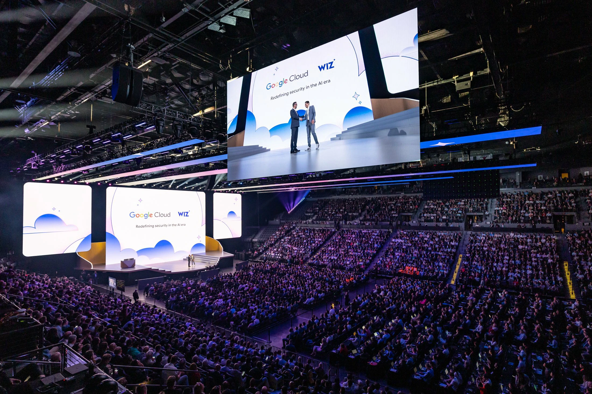

A inteligência artificial corporativa está entrando em uma nova fase.

O Google anunciou uma expansão estratégica de suas soluções empresariais de IA, colocando agentes autônomos no centro da operação de negócios.

A mudança mostra uma transformação importante no mercado.

A fase de testes com IA generativa começa a dar espaço para aplicações operacionais reais, com foco em produtividade, automação e escalabilidade.

O movimento coloca o Google em uma disputa direta com Microsoft e OpenAI dentro do ambiente corporativo.

Mas com uma estratégia clara: menos foco em simples assistentes e mais foco em agentes operacionais.

## O que o Google anunciou para empresas

O Google consolidou sua estratégia empresarial de inteligência artificial dentro do ecossistema Gemini Enterprise.

A proposta é integrar criação, automação e operação em um único ambiente corporativo.

Entre os principais recursos estão:

- criação de agentes personalizados  
- automação de processos empresariais  
- integração com sistemas internos  
- análise inteligente de dados  
- monitoramento operacional  

Na prática, isso reduz barreiras para empresas que querem implementar inteligência artificial sem grandes estruturas técnicas.

## O que muda com agentes de IA

Agentes de IA operam de forma diferente de chatbots tradicionais.

Enquanto assistentes respondem perguntas, agentes executam tarefas completas.

### Interpretação de objetivos

A IA entende contexto e metas.

### Execução em múltiplas etapas

Processos deixam de depender de comandos isolados.

### Integração operacional

Agentes podem acessar sistemas internos e executar fluxos.

### Automação em escala

Empresas conseguem automatizar tarefas repetitivas com mais velocidade.

Esse modelo reduz custos e aumenta eficiência.

## Por que o Google está acelerando esse mercado

O mercado corporativo se tornou o principal espaço de monetização da inteligência artificial.

Grandes empresas estão disputando quem lidera essa nova camada operacional.

O Google quer posicionar seus agentes como infraestrutura empresarial.

Isso muda a lógica da automação.

Antes, empresas compravam ferramentas.

Agora, passam a contratar operações automatizadas.

## O impacto para empresas

A adoção de agentes de IA pode mudar diretamente a estrutura operacional dos negócios.

### Redução de custos

Processos repetitivos passam a consumir menos tempo e menos equipe.

### Mais produtividade

Fluxos operacionais ganham velocidade.

### Melhor tomada de decisão

A análise de dados se torna mais rápida.

### Escalabilidade

Empresas conseguem crescer com estruturas mais enxutas.

O avanço do Google reforça um movimento claro do mercado.

A disputa da inteligência artificial deixou de ser apenas tecnológica.

Agora, o foco está em transformar IA em operação empresarial real.

E isso deve acelerar a pressão competitiva entre empresas que adotam automação e aquelas que ainda operam de forma tradicional.