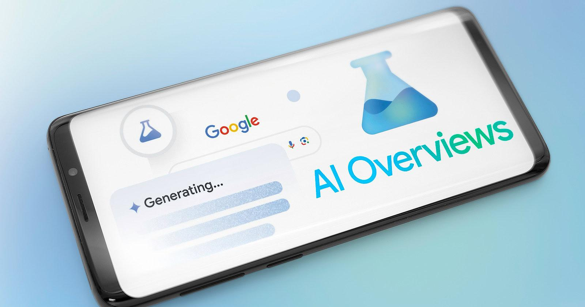

O Google começou a integrar inteligência artificial diretamente nos resultados de busca. A mudança altera como conteúdos aparecem e reduz a necessidade de o usuário clicar em vários sites, impactando diretamente empresas que dependem de tráfego orgânico.

## O Google está respondendo buscas sem precisar clicar em sites

A nova experiência de busca usa IA para gerar respostas completas na própria página.

Em vez de listar apenas links, o Google agora entrega resumos, explicações e respostas diretas.

Isso diminui o número de cliques e muda completamente a dinâmica de quem produz conteúdo.

## O que muda na prática para empresas e blogs

Antes, bastava aparecer bem posicionado no Google para receber tráfego.

Agora, mesmo estando em primeiro lugar, o usuário pode obter a resposta sem entrar no site.

Isso força empresas a criarem conteúdos mais úteis, diretos e diferenciados.

## O que o Google busca com essa mudança

O objetivo é manter o usuário dentro da própria plataforma pelo maior tempo possível.

Quanto mais respostas o Google entrega ali mesmo, menor a dependência de outros sites.

Isso aumenta retenção e fortalece o próprio ecossistema da empresa.

## O impacto real no mercado

A mudança já está afetando blogs, sites de conteúdo e negócios que dependem de SEO.

Conteúdos genéricos tendem a perder espaço, enquanto materiais mais profundos e específicos ganham mais relevância.

A disputa deixa de ser só por posição e passa a ser por valor entregue.

## O que isso significa na prática

Quem cria conteúdo precisa se adaptar.

Não basta mais responder o básico. É necessário aprofundar, trazer contexto e oferecer algo que a IA do Google não entrega facilmente.

A tendência é clara: conteúdo superficial perde espaço.