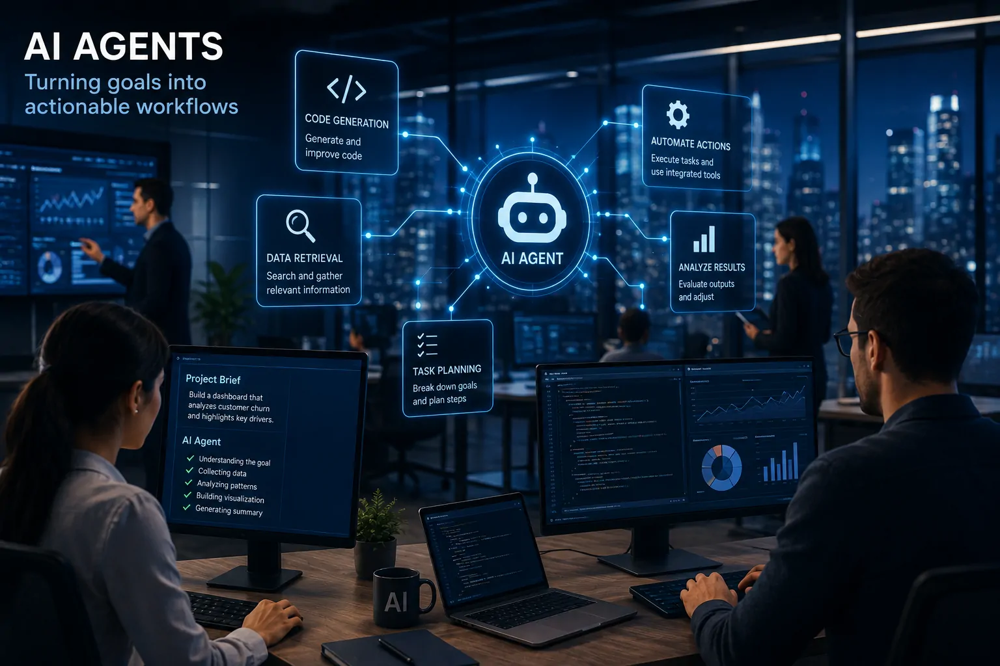
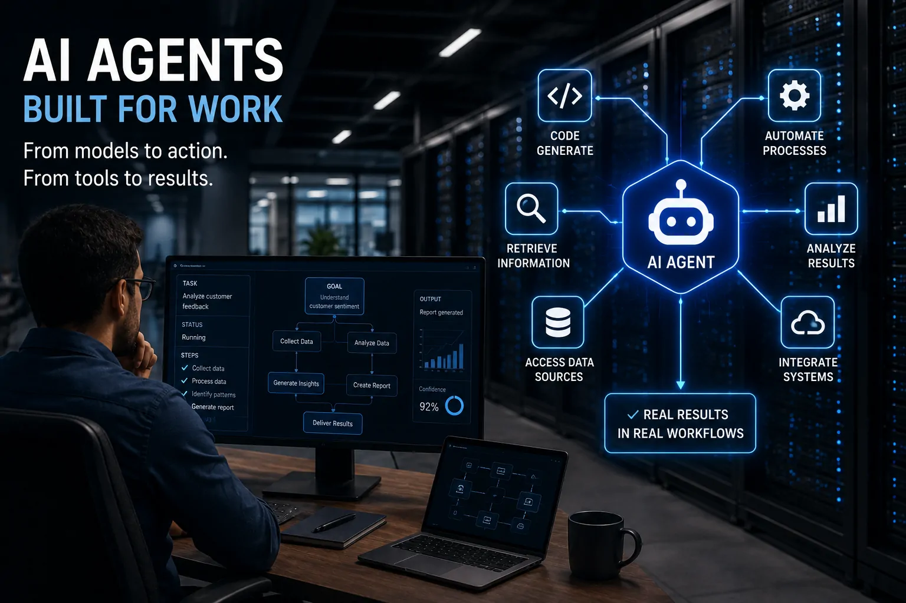
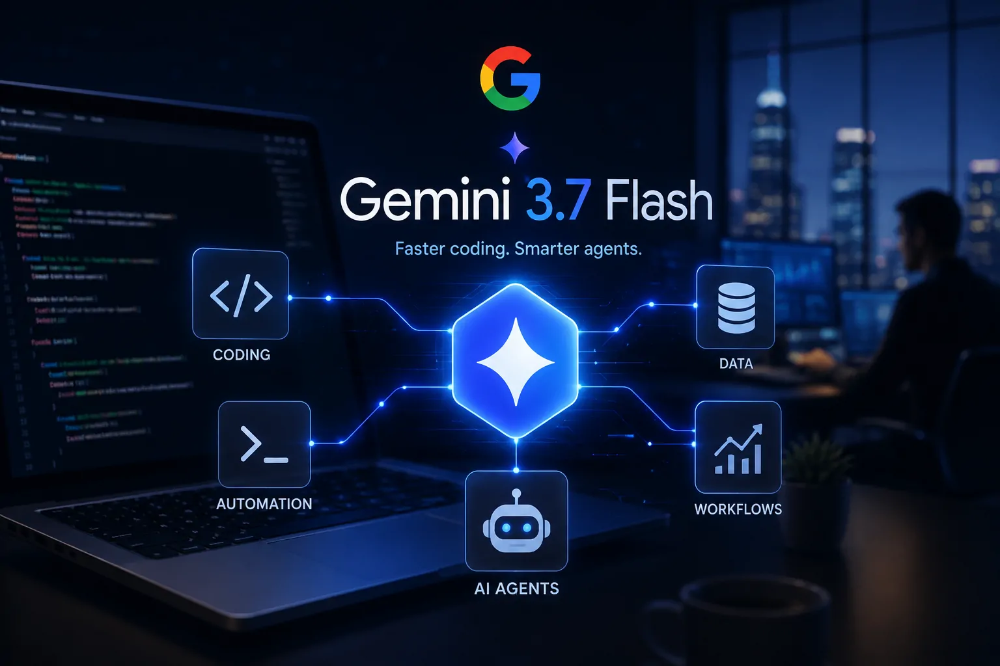

*O Google acaba de colocar uma nova peça em uma disputa que está mudando de natureza. Com o Gemini 3.7 Flash, a empresa não está apenas tentando melhorar uma IA que conversa com usuários: está reforçando sua posição na corrida por modelos capazes de programar, utilizar ferramentas e participar da execução de tarefas empresariais.*

## O Google lançou o Gemini 3.7 Flash com foco em codificação e agentes de IA

O **Google** lançou o **Gemini 3.7 Flash** em 13 de agosto de 2026, apresentando o novo modelo como uma opção voltada para **codificação, desenvolvimento de software e fluxos de trabalho com agentes de IA**. O movimento coloca o Google novamente no centro de uma disputa que envolve **OpenAI** e **Anthropic**. 

A mudança é importante porque a inteligência artificial está deixando de ser utilizada apenas como uma interface de perguntas e respostas. Os modelos estão sendo incorporados a sistemas capazes de executar tarefas, utilizar ferramentas e trabalhar em várias etapas de um processo.

Nesse cenário, o modelo deixa de ser apenas o componente que produz uma resposta. Ele passa a funcionar como o mecanismo de decisão de sistemas que podem realizar trabalho digital.

### O que o Gemini 3.7 Flash pretende fazer

O **Gemini 3.7 Flash** foi desenvolvido para lidar com tarefas nas quais velocidade e capacidade de execução precisam funcionar juntas. Entre os principais focos apresentados pelo Google estão programação, desenvolvimento de aplicações e tarefas executadas por agentes.

Um **LLM**, sigla para Large Language Model, é um modelo de linguagem treinado para compreender instruções e produzir texto, código e outros tipos de conteúdo. Quando esse modelo é conectado a ferramentas e regras de execução, ele pode se tornar parte de um agente.

Na prática, isso permite que uma solicitação deixe de terminar em uma resposta. Um sistema pode interpretar um problema, escrever código, consultar uma ferramenta, analisar o resultado e continuar a tarefa.

### Por que o lançamento acontece agora

O momento do lançamento não é acidental. A indústria de IA está avançando para uma fase em que o valor de um modelo depende cada vez mais de sua capacidade de participar de **processos reais de trabalho**.

Isso ajuda a explicar por que **AI Agents** aparece entre os conceitos em alta no relatório diário do Notícia Tech, com crescimento de **26,23%**, enquanto **Enterprise AI** registra crescimento de **18,84%**. Esses sinais mostram que agentes e inteligência artificial empresarial estão ganhando espaço simultaneamente. 

O **Gemini 3.7 Flash** entra exatamente nessa interseção: um modelo rápido o suficiente para aplicações frequentes e direcionado para tarefas que podem ser incorporadas aos fluxos digitais das empresas.

## O Gemini 3.7 Flash coloca o Google na disputa pela camada operacional da IA

*O Gemini 3.7 Flash amplia o foco do Google para sistemas capazes de combinar modelos de IA, código, ferramentas e execução de tarefas.*

O **Gemini 3.7 Flash** é relevante porque coloca o **Google** na disputa por uma camada mais estratégica da inteligência artificial: a execução de trabalho digital. A competição deixa de estar concentrada apenas em qual modelo responde melhor e passa a envolver qual plataforma consegue realizar mais tarefas de forma confiável.

Essa mudança aproxima a tecnologia do ambiente corporativo. Uma empresa pode utilizar um modelo para gerar código, analisar informações ou operar ferramentas, mas o verdadeiro ganho aparece quando essas capacidades são conectadas a um processo que precisa ser executado repetidamente.

É nesse ponto que entram os agentes. Eles transformam o modelo de linguagem em parte de um sistema operacional para tarefas digitais, criando uma ponte entre inteligência artificial e processos empresariais.

### A disputa deixa de ser apenas entre chatbots

Durante a primeira fase da inteligência artificial generativa, a competição era facilmente percebida nos chatbots. **ChatGPT**, **Gemini** e **Claude** disputavam usuários principalmente pela qualidade das respostas, capacidade de raciocínio e experiência de conversação.

Agora, a fronteira competitiva está avançando para aplicações que executam tarefas. O modelo precisa compreender uma instrução, decidir quais etapas são necessárias e, quando autorizado, utilizar ferramentas para chegar ao resultado.

Essa transformação também explica por que o mercado acompanha cada movimento de **OpenAI**, **Anthropic** e **Google**. Quem conseguir transformar seu modelo em uma plataforma confiável para executar trabalho pode conquistar uma posição mais profunda dentro das empresas.

O próprio avanço dos agentes já aparece no ecossistema editorial do **Notícia Tech**, que acompanha como eles estão deixando de ser apenas assistentes para assumir funções dentro de processos corporativos.

### Por que empresas estão olhando para essa nova camada

Para uma empresa, existe uma diferença importante entre utilizar IA para responder uma pergunta e utilizar IA para executar uma sequência de tarefas.

Um funcionário pode pedir a um chatbot que escreva uma função de programação. Em um sistema agentivo, o objetivo pode ser mais amplo: analisar uma solicitação, alterar o código, executar testes, identificar problemas e preparar o resultado para uma revisão humana.

Isso não significa que os agentes possam substituir automaticamente profissionais ou operar sem supervisão. Significa que uma parcela maior do trabalho digital pode ser transformada em processos parcialmente automatizados.

Essa evolução pode afetar especialmente áreas de tecnologia, operações, atendimento e desenvolvimento de software, porque são setores nos quais tarefas digitais podem ser divididas em etapas relativamente claras.

## A velocidade do modelo pode ser tão importante quanto sua inteligência

O **Gemini 3.7 Flash** também representa uma mudança importante na forma como empresas podem avaliar modelos de IA: para agentes, velocidade e eficiência podem ser tão relevantes quanto capacidade máxima de raciocínio.

Um agente pode realizar diversas chamadas ao modelo durante uma única tarefa. Se ele precisar consultar informações, gerar código, verificar resultados e executar novas ações, o sistema fará muito mais operações do que um usuário que simplesmente envia uma pergunta a um chatbot.

Esse processo é conhecido como **inferência**. É a etapa em que um modelo já treinado utiliza seus parâmetros para produzir uma resposta a partir de uma solicitação.

### Por que agentes mudam a importância do custo

Em uma aplicação empresarial, pequenas diferenças de velocidade e custo podem se tornar relevantes quando uma operação é repetida milhares de vezes.

Um modelo extremamente poderoso pode ser adequado para decisões complexas, mas talvez seja desnecessário para cada etapa de uma automação. Em muitos casos, empresas podem preferir modelos capazes de realizar tarefas específicas rapidamente e com custo previsível.

É por isso que o conceito de modelo **Flash** ganha importância. O objetivo não é necessariamente substituir todos os modelos de maior capacidade, mas oferecer uma alternativa adequada para tarefas que exigem muitas operações.

O Google posiciona o Gemini 3.7 Flash nesse espaço, combinando desempenho para codificação e tarefas agentivas com uma proposta voltada para uso frequente.

### O que muda para desenvolvedores

Para desenvolvedores, o lançamento amplia o número de opções disponíveis para construir aplicações baseadas em agentes.

A escolha, porém, não deve depender apenas de benchmarks. Em um sistema real, também importam **latência, custo, estabilidade, capacidade de seguir instruções, uso de ferramentas e integração com APIs**.

Essa combinação pode ser mais importante do que uma diferença isolada em um teste de desempenho. Um modelo que entrega respostas excelentes, mas demora ou custa demais para executar milhares de operações, pode ser menos interessante para uma aplicação empresarial.

É justamente por isso que o **Gemini 3.7 Flash** deve ser observado não apenas como uma nova versão do Gemini, mas como parte da tentativa do Google de disputar a infraestrutura que sustentará a próxima geração de agentes de IA.

## O Gemini 3.7 Flash pode mudar a forma como empresas usam agentes de IA

*Agentes de IA podem transformar modelos de linguagem em componentes capazes de participar diretamente de processos empresariais.*

A principal consequência do lançamento pode aparecer fora dos próprios chatbots. Se os agentes conseguirem executar tarefas com velocidade, precisão e custo controlado, empresas poderão começar a delegar à inteligência artificial partes cada vez maiores de processos digitais.

Isso não significa simplesmente colocar um chatbot para trabalhar sozinho. Um agente precisa receber permissões, acessar ferramentas, consultar informações e seguir regras definidas pela organização. Quanto maior sua autonomia, maior também a necessidade de controle.

Para as empresas, portanto, a discussão deixa de ser apenas **qual IA responde melhor** e passa a incluir uma pergunta mais importante: **qual modelo consegue executar trabalho de maneira confiável dentro da operação?**

### Do assistente de IA ao operador de processos

Um assistente tradicional depende de uma interação relativamente simples. O usuário faz uma solicitação, recebe uma resposta e decide qual será o próximo passo.

Um agente pode receber um objetivo mais amplo e dividir o trabalho em etapas. Ele pode consultar uma base de dados, utilizar uma ferramenta, produzir código, verificar uma informação e continuar a execução.

Essa diferença pode alterar a produtividade de equipes que realizam tarefas repetitivas em sistemas digitais.

Em desenvolvimento de software, por exemplo, um agente pode participar de diferentes etapas do ciclo de programação. Em operações, pode organizar informações e acionar ferramentas. Em atendimento, pode consultar sistemas internos antes de apresentar uma resposta.

O ganho potencial está justamente na capacidade de conectar várias ações.

### A autonomia também aumenta os riscos

Quanto mais autonomia um agente recebe, maior é o impacto de um erro.

Um chatbot que produz uma resposta incorreta pode ser corrigido pelo usuário antes de qualquer consequência. Um agente conectado a sistemas corporativos pode, dependendo das permissões concedidas, alterar informações, executar comandos ou iniciar processos.

Por isso, a adoção empresarial não depende apenas da qualidade do modelo.

Empresas também precisarão definir **permissões, registros de atividade, limites de atuação, mecanismos de aprovação e formas de auditoria**. A inteligência artificial pode executar mais tarefas, mas a organização precisa determinar claramente o que ela está autorizada a fazer.

Esse é um dos motivos pelos quais a corrida por agentes provavelmente será acompanhada por uma corrida paralela por segurança e governança.

## Google, OpenAI e Anthropic entram em uma disputa que pode definir a próxima fase da IA

O lançamento do Gemini 3.7 Flash aumenta a pressão competitiva porque o Google está atacando uma das áreas mais importantes da próxima geração de inteligência artificial: a capacidade de transformar modelos em sistemas que realizam tarefas.

A **OpenAI** possui uma posição forte no mercado de modelos generativos e aplicações de IA, enquanto a **Anthropic** ganhou espaço especialmente entre desenvolvedores e empresas. O Google, por sua vez, possui uma vantagem diferente: uma enorme infraestrutura tecnológica e um ecossistema de produtos que pode conectar seus modelos a serviços utilizados diariamente por organizações.

A disputa, portanto, não será decidida apenas por qual modelo obtém a maior pontuação em um benchmark.

### A vantagem pode estar no ecossistema

Um modelo de IA não funciona isoladamente em uma aplicação empresarial.

Ele precisa conversar com sistemas, bancos de dados, APIs e ferramentas. **API** é uma interface que permite que diferentes softwares troquem informações e comandos automaticamente.

Quanto mais simples for conectar o modelo a essas ferramentas, mais fácil será transformar a IA em parte de um processo real.

Esse ponto favorece empresas que possuem ecossistemas amplos. O Google pode combinar seus modelos com serviços de nuvem e outras ferramentas corporativas. A Microsoft possui uma posição semelhante por meio de seus produtos empresariais. OpenAI e Anthropic também buscam fortalecer suas plataformas para desenvolvedores.

O resultado é uma competição que começa a envolver não apenas o modelo, mas toda a infraestrutura ao seu redor.

### Por que isso importa para quem já usa IA

Para empresas que já utilizam ChatGPT, Claude ou Gemini, o avanço dos agentes pode significar uma mudança gradual na forma de contratar e avaliar ferramentas.

Em vez de escolher apenas um chatbot para os funcionários, uma organização poderá combinar diferentes modelos de acordo com a tarefa.

Um modelo pode ser utilizado para raciocínio complexo. Outro pode assumir tarefas rápidas e repetitivas. Um terceiro pode ser escolhido para programação ou análise de grandes volumes de informação.

Essa possibilidade aumenta a importância de arquiteturas de IA capazes de combinar diferentes componentes.

Para entender essa transformação, vale também acompanhar o avanço da **arquitetura de IA empresarial**, que trata justamente da integração entre modelos, dados, aplicações e processos dentro das organizações: **[Arquitetura de IA empresarial como construir uma infraestrutura inteligente para empresas](https://noticiatech.com.br/inteligencia-artificial/arquitetura-de-ia-empresarial-como-construir-uma-infraestrutura-inteligente-para-empresas/)**.

## O próximo campo de batalha será transformar agentes em infraestrutura de trabalho

*O avanço dos agentes pode transformar a inteligência artificial de uma ferramenta isolada em uma camada integrada à infraestrutura de trabalho das empresas.*

O lançamento do Gemini 3.7 Flash aponta para uma tendência maior: a inteligência artificial está caminhando para dentro dos processos.

Nos próximos meses, a competição deve se concentrar cada vez mais na capacidade de transformar modelos em agentes úteis, confiáveis e economicamente viáveis.

Isso pode levar a uma mudança importante na relação entre empresas e software. Em vez de apenas utilizar programas tradicionais para executar tarefas, organizações poderão utilizar agentes para operar diferentes ferramentas em conjunto.

### O que pode acontecer nos próximos meses

A primeira consequência provável é o aumento da quantidade de agentes experimentados por empresas.

Desenvolvedores terão mais modelos disponíveis para testar e comparar, enquanto empresas poderão avaliar quais tarefas realmente produzem retorno quando automatizadas.

A segunda consequência será a pressão sobre os preços e o desempenho. Se vários provedores oferecerem modelos capazes de realizar tarefas semelhantes, velocidade e custo se tornarão critérios cada vez mais importantes.

A terceira será o avanço da integração.

Agentes precisam acessar ferramentas para serem realmente úteis. Por isso, protocolos, APIs e padrões de comunicação entre modelos e softwares deverão ganhar ainda mais importância.

O mercado pode caminhar para arquiteturas nas quais diferentes modelos trabalham juntos, em vez de uma única IA tentar executar absolutamente todas as tarefas.

### Empresas terão de aprender a trabalhar com agentes

Isso também muda o papel dos profissionais.

A tendência não é simplesmente eliminar a participação humana, mas deslocar parte do trabalho para atividades de supervisão, definição de objetivos, validação de resultados e controle dos sistemas.

Profissionais que souberem estruturar processos para agentes poderão obter vantagem porque entenderão não apenas como conversar com uma IA, mas como transformar uma tarefa em um fluxo executável.

Para as empresas, isso significa que a adoção da tecnologia dependerá tanto de pessoas e processos quanto do modelo escolhido.

O **Gemini 3.7 Flash**, portanto, é importante porque aparece em um momento no qual a indústria começa a testar uma hipótese maior: se a IA pode deixar de ser apenas uma ferramenta de consulta e se tornar uma camada operacional do trabalho digital.

### A disputa pode ficar muito maior do que Google contra OpenAI

O lançamento não encerra nenhuma disputa. Pelo contrário, ele mostra que a competição está apenas mudando de fase.

Google, OpenAI e Anthropic continuarão aprimorando seus modelos, mas outras empresas também poderão disputar partes dessa infraestrutura, desde ferramentas de desenvolvimento até plataformas de automação e sistemas especializados.

Para os usuários, isso tende a significar mais opções.

Para desenvolvedores, mais alternativas para construir aplicações.

Para empresas, uma oportunidade de automatizar processos que antes exigiam intervenção humana em cada etapa, mas também uma nova responsabilidade: decidir onde a autonomia da IA realmente faz sentido.

O **Gemini 3.7 Flash** chega, portanto, como mais do que uma atualização da família Gemini. Ele representa a tentativa do Google de ocupar uma posição relevante na próxima etapa da inteligência artificial: **a transformação dos modelos em agentes capazes de executar trabalho**.

Se essa estratégia funcionar, a principal disputa da IA nos próximos meses poderá deixar de ser sobre quem tem o chatbot mais popular e passar a ser sobre **quem consegue colocar agentes confiáveis dentro das empresas**.

---