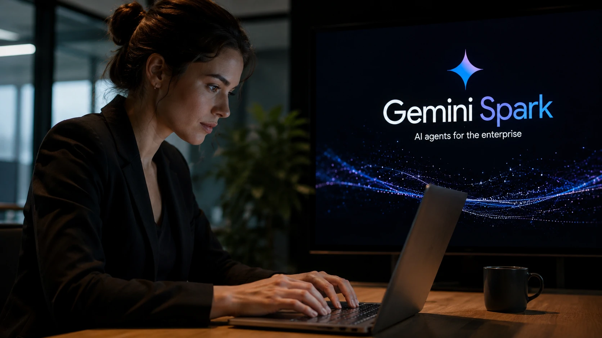
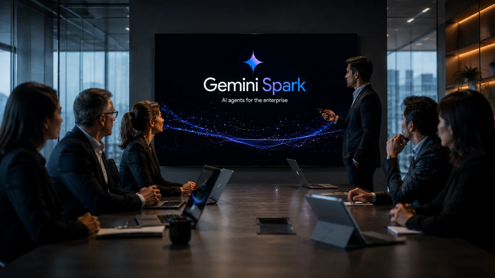
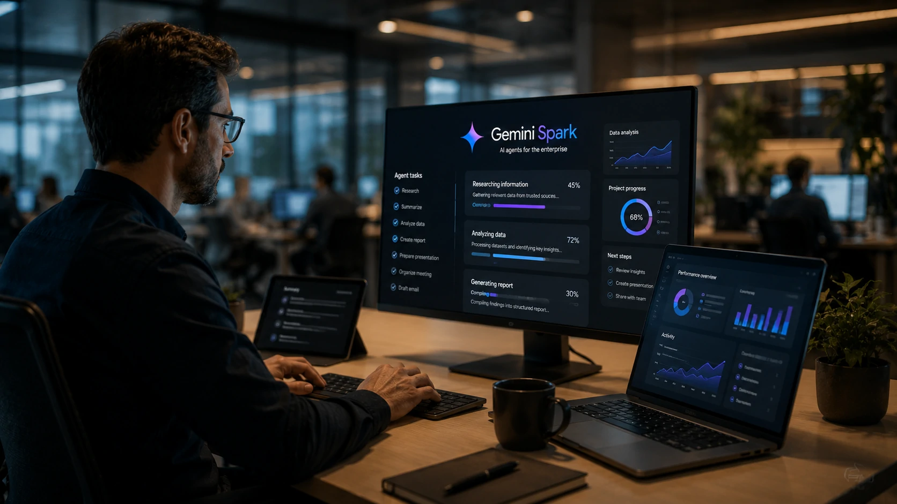

*Os agentes de inteligência artificial deixaram de ser apenas uma tendência tecnológica para se tornar uma das principais apostas das gigantes da tecnologia. O lançamento do **Gemini Spark** mostra que o **Google** pretende disputar diretamente um mercado liderado por soluções da **OpenAI**, **Anthropic** e **Microsoft**, oferecendo recursos voltados para produtividade e automação em escala corporativa.*

## Google aposta no Gemini Spark para ampliar sua estratégia de agentes de IA

O **Gemini Spark** representa um novo passo da estratégia do **Google** para transformar seus modelos de inteligência artificial em agentes capazes de executar tarefas cada vez mais complexas.

*O Gemini Spark amplia a estratégia do Google para agentes de IA voltados à produtividade.*

Diferentemente de um chatbot convencional, um agente inteligente consegue interpretar objetivos, dividir uma atividade em etapas, utilizar ferramentas disponíveis e entregar resultados com menor intervenção humana.

### Mais autonomia para tarefas complexas

O anúncio reforça uma mudança importante no setor.

Durante os últimos anos, empresas concentraram esforços em desenvolver modelos capazes de responder perguntas com maior precisão.

Agora, a disputa passou para outro nível.

O objetivo deixou de ser apenas gerar respostas e passou a ser executar tarefas completas utilizando diferentes ferramentas, documentos e aplicativos.

### A disputa deixou de ser apenas entre modelos

O lançamento mostra que o mercado já não compara apenas a qualidade dos modelos de linguagem.

Hoje, empresas analisam fatores como:

- capacidade de planejamento;
- integração com aplicativos;
- memória contextual;
- velocidade;
- custo operacional;
- segurança dos dados.

Essa mudança aproxima o conceito de agentes inteligentes da realidade corporativa e reforça tendências discutidas anteriormente pelo Notícia Tech em conteúdos como **[Como implementar MCP nas empresas](https://noticiatech.com.br/inteligencia-artificial/como-implementar-mcp-empresas-arquitetura-integracao-agentes-ia/)**.

## O mercado de agentes de IA entra em uma nova fase

A corrida pela liderança deixou de acontecer apenas entre modelos como **GPT**, **Claude** e **Gemini**.

*Google, OpenAI, Anthropic e Microsoft disputam a liderança na próxima geração de agentes inteligentes.*

Agora, cada empresa tenta construir um ecossistema completo capaz de executar processos inteiros utilizando inteligência artificial.

### O foco mudou da conversa para a execução

Esse movimento explica por que tantas empresas passaram a investir em agentes.

Enquanto um chatbot normalmente responde perguntas isoladas, um agente pode:

- organizar informações;
- pesquisar documentos;
- criar apresentações;
- resumir reuniões;
- executar fluxos de trabalho;
- interagir com outros sistemas.

Essa capacidade aumenta significativamente o potencial de automação nas organizações.

### Empresas buscam produtividade e redução de custos

Outro fator importante é o retorno financeiro.

Empresas procuram soluções capazes de reduzir atividades repetitivas, acelerar processos internos e aumentar a produtividade das equipes sem ampliar proporcionalmente os custos operacionais.

Essa tendência também fortalece tecnologias como o **MCP (Model Context Protocol)**, que facilita a comunicação entre agentes inteligentes e sistemas corporativos, assunto aprofundado no artigo **[Como funciona o MCP: guia completo para agentes de IA](https://noticiatech.com.br/inteligencia-artificial/como-funciona-mcp-guia-completo-agentes-ia/)**.

## Como o Gemini Spark pode impactar empresas e profissionais

O **Gemini Spark** pode acelerar a adoção de agentes inteligentes nas empresas ao reduzir a distância entre modelos de linguagem e ferramentas utilizadas diariamente pelas equipes.

*Os agentes de IA tendem a assumir tarefas operacionais enquanto profissionais concentram esforços em decisões estratégicas.*

Organizações que já utilizam plataformas do **Google Workspace** poderão incorporar agentes capazes de automatizar processos, apoiar decisões e reduzir atividades repetitivas.

### Principais aplicações no ambiente corporativo

Entre os casos de uso mais promissores estão:

- atendimento interno automatizado;
- criação de documentos;
- geração de apresentações;
- organização de reuniões;
- análise de grandes volumes de informação;
- apoio à tomada de decisão;
- automação de fluxos administrativos.

Essas aplicações demonstram que a próxima etapa da inteligência artificial está menos relacionada à criação de conteúdo e mais à execução de processos completos.

### A integração será um diferencial competitivo

Outro fator decisivo será a capacidade dos agentes acessarem diferentes sistemas corporativos.

Empresas dificilmente utilizarão agentes isolados.

A tendência é conectar plataformas de CRM, ERPs, bancos de dados, sistemas financeiros e ferramentas de colaboração para que um único agente consiga executar atividades que hoje exigem interação entre diversos profissionais.

Quanto maior essa integração, maior tende a ser o ganho de produtividade.

## A disputa entre Google, OpenAI e Anthropic está apenas começando

O lançamento do **Gemini Spark** reforça que a competição deixou de acontecer apenas na qualidade dos modelos de linguagem.

Agora, o objetivo é construir plataformas completas capazes de executar tarefas de maneira autônoma.

### Agentes passam a ser o novo campo de batalha

Nos próximos meses, a tendência é que **Google**, **OpenAI**, **Anthropic**, **Microsoft**, **Mistral AI** e outros desenvolvedores acelerem investimentos em agentes inteligentes cada vez mais especializados.

Essa disputa deverá impulsionar avanços em:

- autonomia;
- integração entre sistemas;
- memória contextual;
- segurança;
- governança;
- redução de custos operacionais.

Para empresas, isso significa mais opções na escolha de plataformas e maior pressão competitiva entre fornecedores.

### O desafio será transformar inovação em valor de negócio

Embora a evolução tecnológica seja rápida, o verdadeiro diferencial continuará sendo a capacidade de implementar essas soluções de forma estratégica.

Organizações que adotarem agentes de IA apenas pela novidade podem enfrentar dificuldades relacionadas à governança, segurança e integração.

Já empresas que definirem objetivos claros, processos bem estruturados e políticas de uso terão maiores chances de capturar ganhos consistentes de produtividade.

O avanço do **Gemini Spark** mostra que a corrida pela inteligência artificial entrou em uma nova etapa. O mercado passa a competir não apenas pelo melhor modelo de linguagem, mas pelo agente mais útil, integrado e capaz de executar tarefas reais. Para gestores e líderes de tecnologia, acompanhar essa transformação deixou de ser apenas uma questão de inovação e passou a fazer parte da estratégia de competitividade nos próximos anos.

---