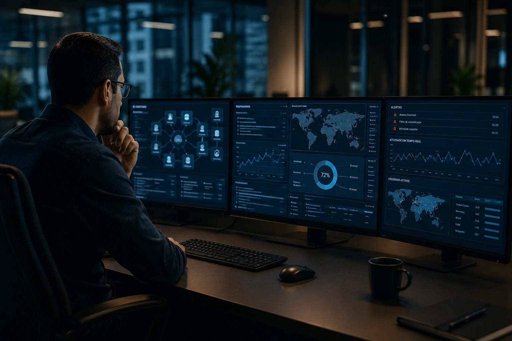

*Enquanto a atenção do mercado está voltada para a criação de agentes autônomos cada vez mais capazes, um novo desafio começa a preocupar executivos, equipes de tecnologia e líderes de transformação digital. O problema já não é construir agentes de IA. O desafio agora é governá-los sem comprometer segurança, compliance e controle operacional.*

## A corrida pelos agentes de IA entrou em uma nova fase

Empresas estão descobrindo que o principal obstáculo da **Agentic AI** não é tecnológico, mas organizacional.

*O crescimento da autonomia dos agentes aumenta a complexidade de supervisão corporativa.*

Nos últimos dois anos, organizações passaram a experimentar agentes capazes de executar tarefas completas sem intervenção humana constante.

A evolução foi impulsionada por modelos mais avançados, pela popularização de arquiteturas multiagentes e por protocolos de integração como o **MCP (Model Context Protocol)**.

Esse movimento já foi discutido no Notícia Tech em conteúdos como [O que é Agentic AI? Guia Completo sobre Agentes de IA](https://noticiatech.com.br/inteligencia-artificial/o-que-e-agentic-ai-guia-completo-agentes-ia/) e [Como Implementar MCP em Empresas](https://noticiatech.com.br/inteligencia-artificial/como-implementar-mcp-empresas-arquitetura-integracao-agentes-ia/).

### O que mudou em 2026?

O mercado saiu da fase experimental.

Agora empresas tentam integrar agentes a sistemas de vendas, atendimento, finanças, operações e análise de dados.

### O novo problema

Quanto maior a autonomia dos agentes, maior a dificuldade de controlar suas decisões, acessos e impactos.

## Por que a governança virou o maior desafio corporativo

Governança de agentes de IA tornou-se uma prioridade porque autonomia sem controle cria riscos reais para os negócios.

*Empresas buscam equilíbrio entre autonomia operacional e supervisão humana.*

Diferentemente de chatbots tradicionais, agentes modernos podem executar ações, acessar sistemas corporativos e interagir com múltiplas fontes de dados.

Isso significa que erros deixam de ser apenas respostas incorretas.

Eles podem gerar consequências operacionais.

### Riscos mais comuns

Entre os principais riscos identificados pelas empresas estão:

- acesso indevido a informações sensíveis;
- decisões não auditáveis;
- violações de compliance;
- erros financeiros automatizados;
- ações não autorizadas em sistemas corporativos.

### O desafio da rastreabilidade

Muitas organizações conseguem saber o resultado produzido por um agente.

Poucas conseguem explicar exatamente como aquele resultado foi produzido.

Essa falta de transparência se torna um problema crítico em ambientes regulados.

## Como MCP, Agentic AI e Shadow AI se conectam

A governança se torna mais complexa quando diferentes tecnologias passam a operar juntas.

*Integrações ampliam capacidades dos agentes, mas também aumentam a superfície de risco.*

O crescimento do **MCP** permite que agentes acessem aplicações, bancos de dados e ferramentas corporativas de forma cada vez mais integrada.

Ao mesmo tempo, cresce o fenômeno conhecido como **Shadow AI**, já explorado pelo Notícia Tech em [O que é Shadow AI? Guia Completo](https://noticiatech.com.br/inteligencia-artificial/o-que-e-shadow-ai-guia-completo/).

### O efeito cascata

Quando colaboradores utilizam agentes não autorizados e esses agentes acessam sistemas corporativos, a governança se torna praticamente impossível.

A empresa perde visibilidade sobre:

- quais modelos estão sendo utilizados;
- quais dados estão sendo compartilhados;
- quais decisões estão sendo tomadas.

### O risco invisível

Muitas organizações acreditam estar implementando IA de forma controlada.

Na prática, diferentes agentes podem estar operando simultaneamente sem qualquer padrão central de supervisão.

## O alerta para empresas que querem escalar IA

Empresas que desejam escalar agentes de IA precisam investir em governança antes de ampliar a autonomia dos sistemas.

A principal lição observada no mercado é simples: capacidade tecnológica não substitui controle operacional.

### O que empresas devem implementar agora

As iniciativas mais maduras estão adotando:

- inventário de agentes ativos;
- monitoramento contínuo;
- logs de auditoria;
- políticas de acesso;
- aprovação humana para ações críticas;
- métricas de desempenho e risco.

### O papel dos líderes de tecnologia

CIOs, CTOs e equipes de governança passam a assumir uma função semelhante à exercida durante a adoção da computação em nuvem.

O objetivo não é impedir inovação.

O objetivo é garantir que a inovação aconteça dentro de limites seguros.

## A próxima disputa da IA será sobre controle, não sobre capacidade

A próxima etapa da corrida da inteligência artificial não será vencida apenas por quem construir os agentes mais avançados.

Ela será vencida por quem conseguir operar esses agentes com segurança, transparência e previsibilidade.

Nos últimos anos, a discussão girou em torno da capacidade dos modelos.

Agora o debate começa a migrar para governança, auditoria e responsabilidade operacional.

À medida que agentes ganham autonomia para executar tarefas complexas, empresas descobrem uma realidade inevitável: criar agentes de IA pode ser relativamente simples. O verdadeiro diferencial competitivo será governá-los em escala sem perder controle do negócio.

---