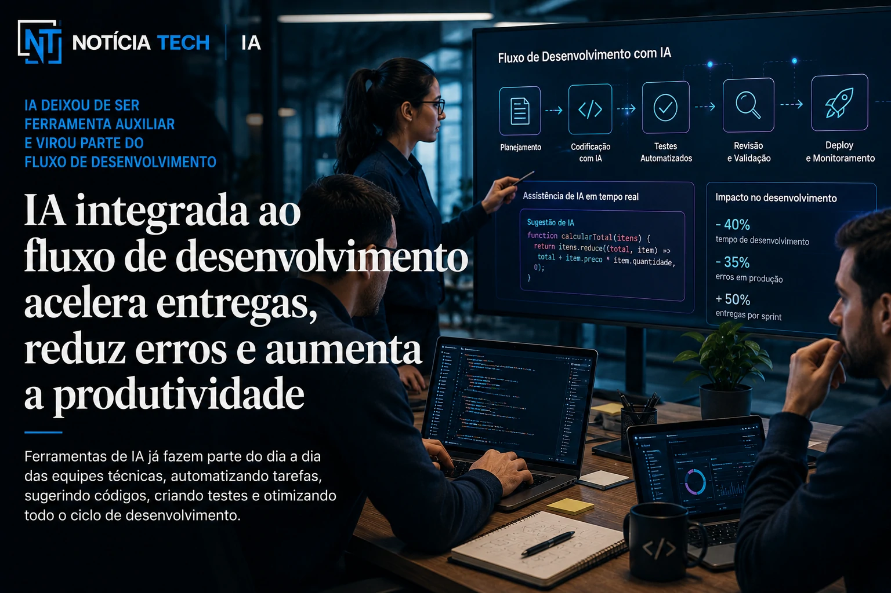

*O avanço das ferramentas de inteligência artificial para programação começou a mudar profundamente o mercado de desenvolvimento de software. Plataformas como **GitHub Copilot**, **Claude**, **Codex** e novos agentes de programação passaram a acelerar tarefas técnicas, automatizar partes do código e redefinir o papel dos programadores dentro das empresas.*

# A nova geração do desenvolvimento de software já começou

## IA deixou de ser ferramenta auxiliar e virou parte do fluxo de desenvolvimento

*Ferramentas de IA começaram a fazer parte da rotina de equipes de desenvolvimento.*

O mercado de tecnologia entrou em uma nova fase da engenharia de software.

Nos últimos anos, ferramentas baseadas em **IA generativa** deixaram de funcionar apenas como assistentes experimentais e passaram a integrar diretamente o fluxo de desenvolvimento das empresas.

Hoje, plataformas como:
- **GitHub Copilot**;
- **Claude Code**;
- **OpenAI Codex**;
- agentes autônomos de programação;

já conseguem:
- sugerir códigos completos;
- identificar erros;
- automatizar documentação;
- criar testes;
- acelerar debugging;
- interpretar bases de código;
- auxiliar arquiteturas de software.

Isso começou a mudar a velocidade de produção dentro das equipes técnicas.

Empresas que antes precisavam de semanas para determinadas entregas agora conseguem acelerar parte do processo utilizando IA como copiloto operacional.

O impacto é especialmente forte em:
- startups SaaS;
- empresas B2B;
- plataformas digitais;
- software corporativo;
- automação empresarial;
- produtos em nuvem.

# Programadores não desapareceram, mas o trabalho mudou

## O papel do desenvolvedor começou a migrar para supervisão estratégica

*Profissionais passaram a supervisionar, validar e orientar sistemas de IA para desenvolvimento.*

Uma das maiores dúvidas do mercado é:
a IA vai substituir programadores?

Até agora, o cenário aponta para algo diferente.

A inteligência artificial começou a automatizar tarefas repetitivas do desenvolvimento, mas ainda depende fortemente de supervisão humana.

Isso acontece porque sistemas atuais ainda possuem limitações importantes:
- erros de lógica;
- vulnerabilidades;
- problemas arquiteturais;
- inconsistências;
- baixa compreensão contextual;
- falhas em projetos complexos.

Na prática, o papel do desenvolvedor começou a mudar.

Os profissionais passaram a atuar mais em:
- supervisão;
- validação;
- arquitetura;
- integração;
- estratégia técnica;
- tomada de decisão;
- engenharia de contexto.

Enquanto isso, parte do trabalho operacional começou a ser acelerado pela IA.

Esse movimento lembra outras transformações tecnológicas da história:
- automação industrial;
- computação em nuvem;
- plataformas low-code;
- DevOps.

A tecnologia não eliminou totalmente profissionais, mas mudou profundamente as funções e habilidades mais valorizadas.

# Empresas começaram a produzir software mais rápido

## IA virou vantagem competitiva para startups e operações SaaS

*Empresas de tecnologia começaram a acelerar ciclos de desenvolvimento utilizando IA.*

A aceleração da produção de software começou a criar uma nova vantagem competitiva no mercado.

Startups e empresas SaaS passaram a utilizar IA para:
- lançar produtos mais rápido;
- reduzir tempo de desenvolvimento;
- acelerar MVPs;
- diminuir gargalos técnicos;
- automatizar manutenção;
- otimizar equipes enxutas.

Isso é especialmente importante em um cenário onde empresas disputam velocidade de inovação.

Muitas operações menores agora conseguem:
- desenvolver mais rápido;
- validar produtos antes;
- testar funcionalidades com menor custo;
- competir com estruturas maiores.

Ao mesmo tempo, grandes empresas começaram a integrar IA em:
- plataformas internas;
- engenharia corporativa;
- automação de testes;
- suporte técnico;
- manutenção de sistemas legados.

O impacto disso pode ser enorme no mercado brasileiro.

# O Brasil ainda está no início da adoção de IA para desenvolvimento

## Mercado brasileiro começou a acelerar treinamentos e integração

Apesar do avanço global, o uso estruturado de IA na engenharia de software ainda está em estágio inicial em muitas empresas brasileiras.

Grande parte das companhias ainda enfrenta:
- falta de capacitação;
- resistência cultural;
- medo de substituição;
- dúvidas sobre segurança;
- integração limitada;
- ausência de políticas internas.

Mesmo assim, a adoção começou a crescer rapidamente.

Empresas brasileiras já começaram a:
- treinar equipes técnicas;
- testar copilots de código;
- integrar IA em workflows;
- acelerar automação de desenvolvimento;
- criar processos híbridos entre IA e humanos.

O movimento também começou a impactar:
- freelancers;
- agências;
- software houses;
- startups;
- departamentos internos de tecnologia.

Isso pode criar um novo perfil de profissional no mercado brasileiro.

# A engenharia de software pode entrar em uma era AI-first

## O desenvolvimento tradicional começou a mudar

Uma das tendências mais fortes do setor é o surgimento de empresas “AI-first”.

Nesse modelo, a IA deixa de ser apenas ferramenta de apoio e passa a fazer parte da infraestrutura operacional do desenvolvimento.

Isso pode mudar:
- velocidade de entrega;
- estrutura das equipes;
- custos operacionais;
- produtividade técnica;
- criação de produtos digitais.

Nos próximos anos, o mercado deve avançar para:
- agentes autônomos de programação;
- manutenção automatizada;
- testes inteligentes;
- debugging preditivo;
- arquitetura assistida por IA;
- desenvolvimento multimodal.

Ao mesmo tempo, especialistas acreditam que o fator humano continuará essencial em:
- criatividade;
- estratégia;
- validação;
- segurança;
- experiência do usuário;
- tomada de decisão complexa.

O que parece cada vez mais claro é que a engenharia de software começou a entrar em uma nova fase — e empresas que aprenderem a integrar inteligência artificial ao desenvolvimento podem ganhar vantagem competitiva importante nos próximos anos.