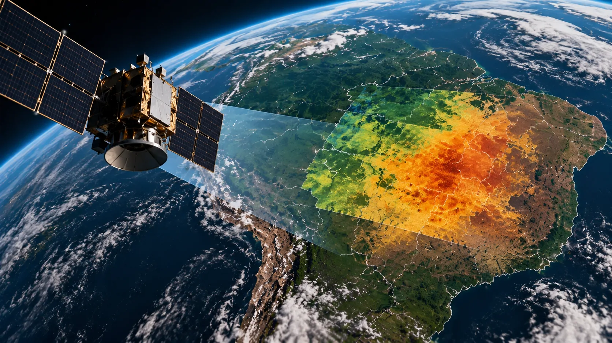
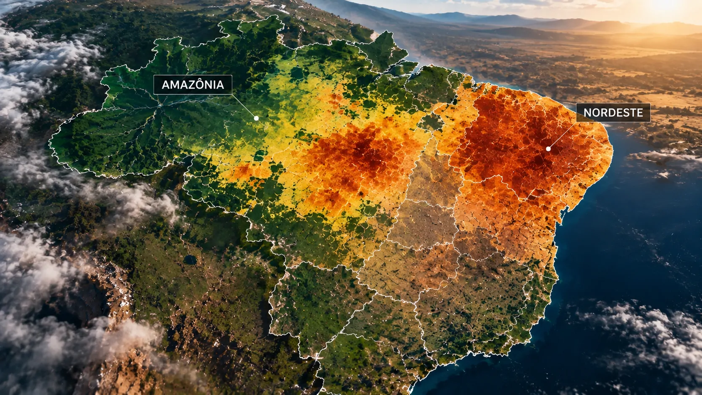
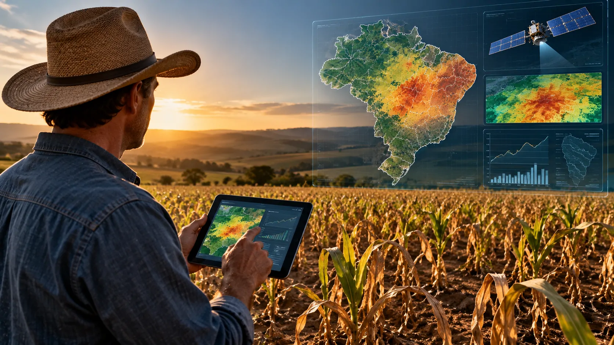

*Pesquisadores ligados ao Cemaden e ao INPE desenvolveram uma abordagem de aprendizado profundo que combina observações de satélite, dados meteorológicos e projeções climáticas para estimar como a umidade do solo pode evoluir e por quanto tempo secas rápidas podem persistir. A proposta aproxima inteligência artificial de uma das decisões mais difíceis do campo: identificar um problema climático enquanto ainda existe tempo para reagir.*

## O que a pesquisa brasileira está tentando prever

A pesquisa desenvolvida por pesquisadores do **Cemaden**, **INPE**, Universidade de Pádua, Instituto Nacional de Técnica Aeroespacial e Universidade Politécnica de Madrid busca estimar a evolução das chamadas **flash droughts**, ou secas rápidas. O trabalho foi apresentado em 31 de agosto de 2026, durante um fórum da **Comissão Econômica das Nações Unidas para a Europa (UNECE)**, em Genebra.

O ponto central não é apenas identificar que uma região está ficando seca. A abordagem procura estimar **condições futuras de umidade do solo** e calcular a duração projetada desses episódios de estiagem. Isso muda o problema de uma fotografia do cenário atual para uma tentativa de antecipação.

As secas rápidas são particularmente difíceis porque se estabelecem em pouco tempo. Em vez de uma estiagem que se agrava lentamente, a umidade disponível no solo pode cair rapidamente, criando uma janela menor para decisões relacionadas à agricultura, gestão de recursos hídricos e planejamento de riscos.

## Como a IA combina satélites e dados climáticos

*Dados de observação da Terra podem alimentar modelos de inteligência artificial capazes de estimar mudanças futuras na umidade do solo.*

A abordagem utiliza **deep learning**, ou aprendizado profundo, para combinar diferentes fontes de informação. Entre elas estão dados físicos obtidos por satélite, variáveis meteorológicas e projeções climáticas globais de longo prazo.

### O papel dos dados de satélite

Os satélites permitem observar grandes extensões do território sem depender exclusivamente de medições realizadas no solo. Para uma pesquisa que busca analisar a evolução espacial da umidade, essa cobertura é especialmente importante.

O modelo utiliza essas observações junto a outras variáveis para construir uma representação mais completa das condições ambientais. A vantagem está justamente na combinação: uma única fonte dificilmente consegue representar toda a complexidade de um fenômeno climático de rápida evolução.

### Por que o CMIP6 entra na equação

A pesquisa também incorpora projeções do **CMIP6**, conjunto de modelos utilizados para estudar diferentes cenários climáticos. Com isso, a inteligência artificial não fica limitada às condições observadas no presente.

A integração permite estimar como a umidade do solo pode se comportar em cenários futuros e, a partir daí, avaliar a duração potencial das secas rápidas. É uma aplicação de IA voltada menos para automação de tarefas e mais para **modelagem de risco climático**.

## O que torna as secas rápidas diferentes

Uma seca rápida não precisa esperar meses para produzir sinais relevantes. Seu principal traço é justamente a velocidade com que as condições de estiagem se estabelecem.

Essa característica cria um problema operacional para setores que dependem do clima. Quando a deterioração da umidade acontece rapidamente, decisões baseadas apenas em médias históricas ou observações atrasadas podem chegar tarde demais.

O trabalho brasileiro tenta reduzir parte dessa limitação ao combinar diferentes escalas de informação. A IA recebe dados observacionais e projeções para estimar não apenas a condição atual, mas também a possível trajetória do fenômeno.

Isso não significa que o modelo elimine a incerteza climática. O resultado é uma **projeção**, e não uma garantia de que determinado evento ocorrerá exatamente como calculado. Essa distinção é fundamental quando uma tecnologia preditiva passa a ser usada para decisões de alto impacto.

## Amazônia e Nordeste aparecem entre as áreas de atenção

*As projeções analisadas pelos pesquisadores indicam diferenças regionais na duração das secas rápidas, com destaque para Amazônia e Nordeste.*

Os resultados apresentados pelos pesquisadores indicam que a evolução das secas rápidas não deve ser uniforme em todo o território brasileiro. As modelagens apontam diferenças importantes entre os biomas e regiões analisados.

### A Amazônia chama atenção pela duração projetada

A **Amazônia** apresentou a maior tendência de aumento relativo na duração das secas rápidas nos cenários simulados. O resultado chama atenção porque associa um fenômeno normalmente relacionado à escassez de água a uma região conhecida pela forte influência do ciclo hidrológico.

A informação não significa que toda a Amazônia passará a enfrentar secas prolongadas de maneira uniforme. O resultado representa uma tendência identificada dentro dos cenários e modelos utilizados pela pesquisa.

### Nordeste continua como área sensível

O **Nordeste brasileiro** também aparece como uma região de alta atenção. A combinação entre vulnerabilidade climática e dependência de condições de umidade torna a capacidade de antecipar mudanças especialmente relevante.

Para o agronegócio, esse tipo de informação pode ganhar valor quando transformado em planejamento. A possibilidade de estimar antecipadamente mudanças na umidade do solo pode ajudar a orientar decisões sobre calendário, recursos hídricos e exposição ao risco, embora a pesquisa ainda não represente um sistema operacional de recomendação para produtores.

O avanço acompanha uma mudança maior no uso de inteligência artificial no país. Enquanto aplicações corporativas já avançam em diferentes setores, como mostra o levantamento sobre **[empresas brasileiras que estão usando IA em estágio avançado](https://noticiatech.com.br/inteligencia-artificial/empresas-brasileiras-usam-ia-nivel-avancado/)**, pesquisas como esta mostram a tecnologia sendo aplicada a problemas físicos que dependem de grandes volumes de dados.

## Do diagnóstico climático à antecipação do risco

A principal diferença estratégica da pesquisa está na tentativa de transformar dados ambientais em uma visão antecipada do risco. Em vez de utilizar a IA somente para classificar imagens ou encontrar padrões passados, os pesquisadores estão aplicando aprendizado profundo para estimar condições futuras.

Isso aproxima a inteligência artificial de sistemas de **previsão e adaptação climática**. Para órgãos públicos, empresas do agronegócio e setores dependentes de recursos naturais, antecipar uma mudança pode ser mais valioso do que simplesmente confirmar que ela já aconteceu.

O mesmo princípio aparece em outras pesquisas científicas que usam IA para transformar grandes volumes de dados em modelos mais úteis para decisão. No caso brasileiro, porém, o diferencial está na combinação entre observação por satélite, meteorologia e cenários climáticos aplicada especificamente às secas rápidas.

Ainda existe uma distância importante entre uma pesquisa preditiva e um sistema capaz de emitir alertas operacionais com precisão suficiente para orientar decisões individuais. Essa etapa exige validação, acompanhamento dos resultados e integração com estruturas de monitoramento já existentes.

## O que essa IA pode mudar para o campo

*O potencial da tecnologia está em transformar previsões sobre umidade e secas rápidas em informação útil para planejamento agrícola e gestão de risco.*

O impacto potencial para o **agronegócio** está menos em automatizar uma tarefa específica e mais em melhorar o horizonte de planejamento. Uma estimativa antecipada sobre a duração de uma seca pode ajudar a dimensionar riscos antes que os efeitos mais severos apareçam no campo.

Para empresas agrícolas, seguradoras, gestores de recursos hídricos e órgãos públicos, informações desse tipo podem ser incorporadas a modelos próprios de decisão. O ganho potencial está na possibilidade de cruzar risco climático com operações, logística, planejamento de safra e gestão de recursos.

Mas a tecnologia ainda precisa superar uma questão central: **previsibilidade não é certeza**. Quanto mais uma decisão depender do resultado de um modelo climático, mais importante se torna compreender seus limites, cenários e margem de incerteza.

O próximo passo relevante será observar se essa abordagem consegue sair do ambiente de pesquisa e contribuir para sistemas de monitoramento capazes de transformar projeções de umidade e duração de secas rápidas em informação operacional. Se isso acontecer, a IA deixará de ser apenas uma ferramenta de análise científica e poderá se tornar uma camada adicional de inteligência para antecipar riscos climáticos no Brasil.

---