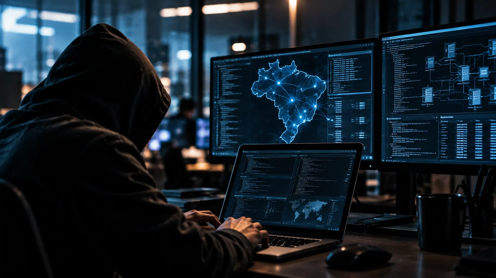

---
title: "IA está acelerando os ataques cibernéticos no Brasil; veja como os criminosos estão usando a tecnologia"
slug: "ia-acelera-ataques-ciberneticos-brasil"
date: "2026-09-15T00:10:00-03:00"
draft: false
author: "Por Aluisio Soares, fundador do blog Notícia Tech"
description: "Ataques cibernéticos impulsionados por automação avançam rapidamente no Brasil. Entenda como criminosos usam IA para reconhecer alvos, criar golpes, explorar falhas e ampliar a escala das invasões."
categories:
  - "IA"
cover:
  image: "capa.webp"
  alt: "Representação de uma inteligência artificial analisando uma rede corporativa sob ataque cibernético"
  caption: "A inteligência artificial está sendo incorporada a diferentes etapas das operações criminosas, reduzindo o tempo necessário para identificar e explorar alvos."
faq:
  - pergunta: "Como os criminosos estão usando inteligência artificial em ataques cibernéticos?"
    resposta_curta: "A IA pode acelerar reconhecimento de alvos, criação de conteúdo malicioso, engenharia social, análise de sistemas e diferentes etapas da execução de ataques."
    resposta_longa: "A principal mudança não é necessariamente a criação de um novo tipo de ataque, mas a automação de etapas que antes exigiam mais tempo e trabalho humano. Ferramentas baseadas em IA podem ajudar criminosos a identificar alvos, analisar caminhos de ataque, produzir mensagens convincentes e operar em maior escala."
  - pergunta: "Por que a IA torna os ataques cibernéticos mais perigosos para empresas?"
    resposta_curta: "Porque a automação reduz o tempo e o esforço necessários para preparar e executar ataques."
    resposta_longa: "Para empresas, o principal risco está na redução da janela de resposta. A Fortinet relata que o tempo entre a divulgação de vulnerabilidades críticas e sua exploração caiu para cerca de 24 a 48 horas em determinados surtos, aumentando a pressão sobre equipes de segurança."
  - pergunta: "Os ataques com IA atingem principalmente empresas?"
    resposta_curta: "Empresas estão entre os principais alvos porque concentram sistemas, credenciais, dados e recursos financeiros."
    resposta_longa: "Organizações podem ser atacadas por ransomware, roubo de credenciais, exploração de vulnerabilidades, phishing e outras técnicas. Funcionários também podem ser usados como porta de entrada por meio de engenharia social."

--- 

*O Brasil entrou em um cenário em que a velocidade passou a ser um dos principais fatores de risco da segurança digital. Um levantamento citado pela Exame aponta que ataques cibernéticos impulsionados por sistemas automatizados avançam no país em ritmo três vezes superior à média global, enquanto dados globais da Fortinet mostram como a inteligência artificial está comprimindo o tempo necessário para preparar e executar invasões.*

Por trás dessa mudança existe algo mais importante do que simplesmente "hackers usando IA": tarefas que antes dependiam de conhecimento técnico e trabalho manual podem ser automatizadas, permitindo que operações criminosas encontrem alvos, preparem ataques e processem informações em uma escala maior.

## Por que os ataques cibernéticos ficaram mais rápidos

Os ataques cibernéticos estão ficando mais rápidos porque a automação permite que criminosos reduzam o trabalho manual necessário para encontrar vulnerabilidades, selecionar alvos e preparar diferentes etapas de uma invasão.

A mudança é particularmente relevante para empresas porque uma vulnerabilidade conhecida pode permanecer disponível para exploração por pouco tempo antes que equipes de segurança consigam corrigi-la. No relatório de 2026, a **Fortinet** aponta que o *time-to-exploit*, expressão usada para medir o intervalo entre a divulgação de uma vulnerabilidade e sua exploração, chegou a **24 a 48 horas** em surtos críticos.

Em termos simples, isso significa que uma empresa pode ter cada vez menos tempo para reagir depois que uma falha importante se torna conhecida. A velocidade deixa de ser apenas uma vantagem operacional para o atacante e passa a ser um componente central do risco.

### O que significa "explorar uma vulnerabilidade"

Uma vulnerabilidade é uma falha que pode permitir que alguém faça algo que não deveria em um sistema. Explorar essa vulnerabilidade significa utilizar essa falha para obter acesso, executar comandos, roubar informações ou avançar dentro da rede.

A IA não precisa descobrir sozinha uma falha inédita para aumentar o risco. Ela pode ajudar a automatizar tarefas ao redor de vulnerabilidades já conhecidas, reduzindo o tempo entre encontrar uma oportunidade e tentar utilizá-la.

### Por que isso pressiona as empresas

Equipes de segurança precisam identificar quais alertas realmente representam risco, corrigir sistemas vulneráveis e acompanhar atividades suspeitas. Quando o atacante automatiza parte desse processo, a empresa passa a competir contra uma operação que pode trabalhar continuamente.

É por isso que o problema não se resume à existência de ferramentas de IA usadas por criminosos. A questão estratégica é o **desequilíbrio de velocidade** entre quem ataca e quem precisa detectar, investigar e responder.

## Como a IA está sendo usada para preparar os ataques

*Ferramentas de IA podem automatizar parte do reconhecimento e ajudar criminosos a identificar caminhos para chegar a sistemas e credenciais.*

A IA pode ser incorporada a diferentes etapas de uma operação criminosa, principalmente no reconhecimento do ambiente, na análise de informações e na automatização de caminhos de ataque.

O relatório da **Fortinet** cita ferramentas ofensivas capazes de automatizar reconhecimento e gerar possíveis trajetórias de ataque. Um exemplo mencionado é o **HexStrike AI**, apresentado como uma ferramenta ofensiva com recursos de reconhecimento automatizado e geração de caminhos de ataque.

Isso ajuda a entender a mudança: em vez de uma pessoa analisar manualmente uma grande quantidade de informações, sistemas automatizados podem organizar dados, procurar relações e apontar possíveis caminhos para uma invasão.

### Reconhecimento é a etapa de procurar portas de entrada

No jargão de segurança, *reconhecimento* é o processo de coletar informações sobre o alvo. Isso pode envolver sistemas expostos à internet, domínios, serviços, tecnologias utilizadas e outros elementos que ajudem o atacante a identificar uma possível porta de entrada.

Com automação, essa busca pode ser executada de forma contínua e em escala. O objetivo não é necessariamente atacar imediatamente, mas descobrir onde existe uma oportunidade com maior probabilidade de sucesso.

### A IA também reduz a dependência de especialistas

Outro efeito importante é a redução da quantidade de conhecimento técnico necessário para determinadas tarefas. A Fortinet descreve um ecossistema em que ferramentas, agentes e serviços criminosos especializados podem ser combinados em diferentes etapas de uma operação.

Isso transforma o cibercrime em algo mais parecido com uma cadeia de serviços. Um criminoso não precisa necessariamente dominar todas as etapas: pode utilizar ferramentas especializadas para reconhecimento, obter credenciais de terceiros e combinar esses recursos em uma operação maior.

## Phishing e engenharia social ganham uma nova camada

A inteligência artificial também pode tornar golpes direcionados mais convincentes porque facilita a produção de textos, a adaptação da linguagem e a personalização de mensagens.

Phishing é o nome dado a tentativas de enganar uma pessoa para que ela clique em um link, forneça uma senha, abra um arquivo ou entregue alguma informação. Já **engenharia social** é o uso de manipulação psicológica para induzir alguém a realizar uma ação que favoreça o atacante.

Em uma empresa, isso pode significar uma mensagem que parece vir de um colega, fornecedor ou executivo. O objetivo não é necessariamente invadir o computador diretamente, mas convencer alguém a abrir a primeira porta.

### O problema não é apenas escrever melhor

Antes da popularização da IA generativa, produzir mensagens personalizadas em grande quantidade exigia trabalho humano. Agora, ferramentas automatizadas podem ajudar a produzir e adaptar conteúdo rapidamente.

Isso aumenta a capacidade de testar diferentes abordagens e personalizar comunicações para públicos específicos. O golpe pode continuar usando uma técnica conhecida, mas sua preparação fica mais rápida.

### Credenciais se tornaram um alvo estratégico

Credenciais são dados usados para comprovar identidade, como usuário e senha. Quando um criminoso consegue essas informações, pode tentar utilizá-las para acessar serviços legítimos sem precisar explorar diretamente uma vulnerabilidade.

A **Fortinet** aponta que incidentes em ambientes de nuvem estão fortemente associados a credenciais roubadas, expostas ou utilizadas de forma indevida. Isso ajuda a explicar por que proteger identidades é tão importante quanto proteger servidores e dispositivos.

Para as empresas, o problema aumenta quando uma única identidade permite acesso a vários serviços. Uma credencial comprometida pode representar muito mais do que o acesso a uma única conta.

Esse risco ganha ainda mais importância à medida que as organizações ampliam o uso de inteligência artificial. O próprio **Notícia Tech** já mostrou **[como empresas brasileiras estão avançando para níveis mais maduros de adoção de IA](https://noticiatech.com.br/inteligencia-artificial/empresas-brasileiras-usam-ia-nivel-avancado/)**, movimento que aumenta a necessidade de combinar expansão tecnológica com controles de segurança.

## O que muda para as empresas brasileiras

*Com mais processos digitais e serviços conectados, uma empresa pode oferecer aos atacantes uma superfície de ataque maior.*

Para as empresas, o principal impacto da aceleração dos ataques é a redução da margem de erro: falhas conhecidas, credenciais expostas e processos internos vulneráveis podem ser explorados com mais velocidade.

O conceito de **superfície de ataque** descreve o conjunto de sistemas, dispositivos, contas, aplicações e serviços que podem oferecer uma oportunidade de entrada. Quanto maior essa superfície, maior tende a ser a quantidade de pontos que precisam ser monitorados e protegidos.

O crescimento do uso corporativo de IA também acrescenta novos elementos a essa equação. Empresas que adotam ferramentas de IA precisam considerar não apenas produtividade, mas também credenciais, dados, permissões e integrações associadas a essas ferramentas.

### Mais digitalização também significa mais pontos para proteger

A digitalização amplia a quantidade de serviços conectados à infraestrutura de uma organização. Sistemas em nuvem, aplicações externas, dispositivos remotos e integrações entre plataformas podem aumentar a eficiência, mas também criam novos caminhos que precisam ser controlados.

Esse cenário torna especialmente relevante a adoção de processos de segurança capazes de identificar rapidamente credenciais comprometidas, sistemas vulneráveis e comportamentos fora do padrão.

### A ameaça não depende apenas de grandes empresas

Embora grandes organizações concentrem dados e recursos valiosos, a automação também pode tornar empresas menores interessantes quando possuem sistemas expostos ou processos de segurança frágeis.

A questão passa a ser menos "qual empresa é grande o suficiente para ser atacada?" e mais "qual alvo oferece uma oportunidade viável?". Quando parte da identificação pode ser automatizada, o custo de procurar oportunidades diminui.

## Ransomware mostra o impacto da automação em escala

*O ransomware transforma uma invasão em um problema operacional que pode interromper sistemas, processos e serviços.*

O ransomware continua sendo uma das formas mais visíveis de impacto empresarial porque transforma uma invasão em uma interrupção operacional: arquivos ou sistemas são bloqueados e os criminosos exigem pagamento para liberar o acesso.

A **Fortinet** identificou **7.831 vítimas confirmadas de ransomware em 2025**, contra aproximadamente 1.600 no levantamento anterior, uma alta de **389%**. Os três setores com maior número de vítimas identificadas foram manufatura, serviços empresariais e varejo.

Esse número é global e não deve ser interpretado como uma estatística específica do Brasil. Seu valor para entender o cenário brasileiro está em mostrar a escala que as operações criminosas podem alcançar quando diferentes recursos — incluindo automação e IA — são combinados.

### O ataque pode começar muito antes do ransomware

Uma invasão de ransomware normalmente não começa no momento em que os arquivos são bloqueados. Antes disso, criminosos podem buscar credenciais, explorar sistemas vulneráveis, movimentar-se dentro da rede e identificar quais recursos têm maior valor.

Essa sequência é importante para entender por que a defesa precisa acontecer antes do impacto final. Detectar uma atividade suspeita somente quando os arquivos já foram criptografados significa agir na última etapa do processo.

### O tempo passou a ser parte da defesa

O avanço da automação muda a prioridade das equipes de segurança. Não basta saber que uma vulnerabilidade existe; é necessário descobrir rapidamente se ela está presente no ambiente da empresa, avaliar sua exposição e aplicar correções.

A lógica também vale para credenciais. Uma senha roubada que permanece válida durante dias ou semanas pode oferecer uma oportunidade muito maior do que uma credencial revogada rapidamente.

## A corrida agora é entre automação ofensiva e defesa

A principal mudança provocada pela IA na segurança digital não é simplesmente a criação de golpes mais sofisticados. É a possibilidade de transformar operações que exigiam intervenção humana em processos mais rápidos, contínuos e escaláveis.

Esse cenário coloca as empresas diante de uma corrida assimétrica. O atacante precisa encontrar apenas uma oportunidade viável, enquanto a organização precisa proteger uma infraestrutura inteira, acompanhar identidades, corrigir vulnerabilidades e responder a incidentes.

### A própria IA também entra no perímetro de segurança

A adoção empresarial de inteligência artificial cria uma camada adicional de proteção que precisa ser considerada. Quanto mais ferramentas de IA passam a participar de processos corporativos, maior a importância de controlar permissões, dados e integrações.

Esse cenário também ajuda a explicar por que a segurança de sistemas de IA passou a receber atenção crescente. Um exemplo é o caso do **OpenAI Astra**, que já foi abordado pelo **Notícia Tech** em uma análise sobre os riscos de cibersegurança associados a esse tipo de tecnologia. Para entender esse precedente em maior profundidade, vale conferir **[o que aconteceu com o OpenAI Astra e os riscos de cibersegurança identificados](https://noticiatech.com.br/inteligencia-artificial/openai-astra-nivel-critico-ciberseguranca/)**.

### A resposta precisa acompanhar a velocidade do ataque

A tendência observada pela **Fortinet** sugere que o modelo baseado exclusivamente em resposta manual terá dificuldade para acompanhar operações automatizadas. Isso não significa substituir profissionais por máquinas, mas usar automação para detectar, priorizar e responder mais rapidamente.

O ponto central para gestores é simples: segurança deixa de ser apenas uma questão de evitar invasões e passa a envolver a capacidade de **reduzir a janela entre a descoberta de uma ameaça e a reação da empresa**.

A IA está tornando essa janela menor. Para os criminosos, isso representa mais velocidade e escala. Para as organizações, significa que proteção de identidades, correção rápida de vulnerabilidades, monitoramento contínuo e capacidade de resposta passam a ter peso ainda maior na estratégia digital.

---