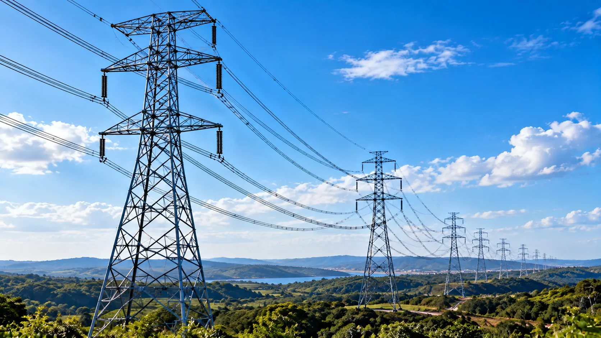
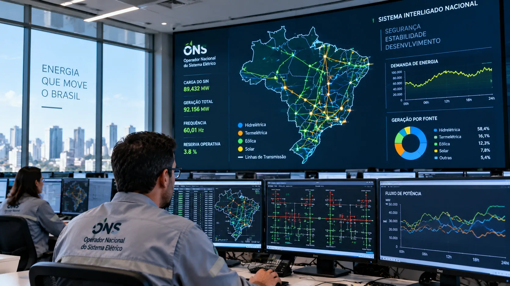
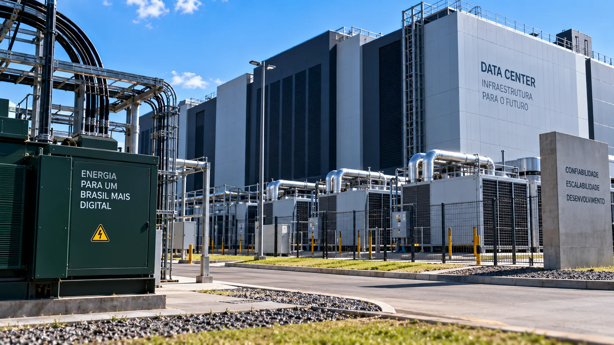

*O avanço da inteligência artificial começa a expor uma camada menos visível da corrida tecnológica brasileira: a infraestrutura elétrica necessária para manter os data centers funcionando. A EPE agora trata a antecipação e a coordenação entre energia, transmissão e novos projetos como parte central desse desafio.*

## A expansão da IA chegou à infraestrutura elétrica

A expansão da **inteligência artificial** no Brasil começa a criar uma demanda que vai além de chips, modelos e software: o país precisa garantir infraestrutura elétrica capaz de alimentar os **data centers** que sustentam essa computação.

### Data centers são grandes cargas

A **Empresa de Pesquisa Energética (EPE)** levou ao **TechGrid 2026** justamente essa discussão. Em 16 de setembro, no Maravalley, no Rio de Janeiro, o presidente da empresa, Thiago Prado, participou de um painel sobre energia, conectividade e data centers como base física da IA em escala.

Um data center concentra servidores, armazenamento, redes e sistemas de refrigeração. Em aplicações de IA de grande escala, essa concentração pode representar uma carga elétrica significativa em determinada região.

### O problema não é apenas gerar energia

A EPE afirma que conectar cargas eletrointensivas, como data centers de IA, pode exigir expansão da **malha de transmissão**. A questão passa, portanto, por saber não apenas quanta energia o país consegue produzir, mas onde ela estará disponível e como chegará aos novos empreendimentos.

O planejamento envolve linhas de transmissão, subestações e estudos técnicos, econômicos e socioambientais. Como essas obras levam tempo, a infraestrutura elétrica precisa ser considerada antes que a demanda efetivamente apareça.

## Por que os data centers pressionam a rede brasileira

*Data centers de IA concentram grandes cargas elétricas, tornando a conexão com a rede uma questão de planejamento regional.*

A **EPE** considera os data centers grandes cargas cuja demanda por potência impacta diretamente o planejamento da expansão da transmissão. Embora ainda representem uma parcela relativamente pequena do consumo agregado brasileiro, esses empreendimentos podem provocar aumentos relevantes de carga em regiões específicas.

### Uma carga concentrada muda o planejamento

A localização passa a ter peso porque um data center não precisa somente de energia disponível no país. Ele precisa de capacidade elétrica suficiente no ponto onde será instalado.

Esse fator ganha relevância à medida que o mercado brasileiro amplia sua infraestrutura digital. O crescimento já identificado pelo Notícia Tech na **[expansão dos data centers no Brasil](https://noticiatech.com.br/inteligencia-artificial/brasil-acelera-construcao-data-centers-explosao-ia/)** ajuda a entender por que a questão energética começa a ganhar espaço no planejamento.

### O tempo da rede pode ser diferente do tempo da tecnologia

A infraestrutura digital pode avançar rapidamente, enquanto uma nova linha de transmissão ou subestação depende de planejamento, licenciamento e implantação.

No **TechGrid 2026**, a EPE destacou justamente a necessidade de antecipar e coordenar esse processo. A empresa também considera a maturidade dos projetos ao analisar pedidos de conexão, já que nem toda intenção anunciada necessariamente se transforma em uma instalação operacional.

## EPE começa a olhar além dos pedidos de conexão

A **EPE** está tentando melhorar a qualidade das informações utilizadas no planejamento para diferenciar projetos concretos de expectativas ainda incertas do mercado.

### A empresa quer entender os projetos reais

A empresa mantém um **Portal de Coleta de Dados de Data Centers**, no qual empresas podem fornecer informações sobre seus projetos sob acordos de confidencialidade.

O objetivo é obter dados mais próximos da realidade sobre como esses empreendimentos serão instalados e qual será sua demanda efetiva.

Entre as informações relevantes estão necessidades de **computação** e **refrigeração**, componentes diretamente relacionados ao consumo e à potência necessária.

### A maturidade dos projetos importa

Nem todo projeto anunciado se transforma imediatamente em uma instalação operacional. Para o planejamento elétrico, essa diferença pode alterar significativamente as projeções futuras de demanda.

Por isso, a **EPE** afirma considerar o grau de maturidade dos projetos antes de incorporá-los aos estudos. A estratégia reduz o risco de preparar infraestrutura para uma demanda que pode demorar a se concretizar ou até mudar de localização.

## O Brasil já vinha preparando a rede para grandes cargas

*O planejamento da transmissão já considera projetos de grandes cargas em diferentes regiões brasileiras.*

O desafio energético dos data centers não começou com o **TechGrid 2026**. A **EPE** já vinha estudando como grandes cargas eletrointensivas poderiam ser conectadas ao sistema brasileiro.

### São Paulo e Nordeste entram no radar

Os estudos abrangem regiões como **São Paulo, Ceará, Piauí e Rio Grande do Norte**, onde a instalação de grandes cargas pode exigir reforços e ampliações na transmissão.

No Ceará e no Piauí, a EPE apresentou uma solução flexível e escalonável para possibilitar a conexão de até **4 GW** de cargas eletrointensivas a partir de 2032.

A movimentação mostra que o planejamento energético começa a acompanhar uma transformação que também aparece em outros eventos do setor, como o **TDC 2026 São Paulo**, que reuniu empresas de tecnologia para discutir **[agentes de IA e automação](https://noticiatech.com.br/inteligencia-artificial/tdc-2026-sao-paulo-agentes-ia-automacao/)**.

### A localização pode virar uma vantagem competitiva

A disponibilidade de infraestrutura elétrica pode se tornar mais um elemento nas decisões de localização de data centers, ao lado de conectividade, terrenos, telecomunicações e acesso a outros serviços de infraestrutura.

Isso não significa que determinada região será automaticamente escolhida pelos operadores. Mas indica que a capacidade de receber grandes cargas pode ganhar peso nas decisões de investimento.

A questão energética, portanto, começa a deixar de ser apenas um problema do setor elétrico e passa a fazer parte da estratégia de infraestrutura digital.

## O desafio também envolve custo e flexibilidade

Para os operadores de **data centers**, energia disponível não significa necessariamente energia disponível sem restrições. Capacidade de conexão, previsibilidade e custo também entram na equação.

### Energia disponível não significa energia sem restrições

A EPE aponta a oferta de energia prevista nos cenários do **Plano Nacional de Energia 2055** e a previsibilidade dos processos de acesso conduzidos pelo **ONS** como elementos importantes para a inserção dessas grandes cargas.

A consequência é uma relação cada vez mais direta entre planejamento energético e estratégia de expansão tecnológica.

### Baterias e geração local entram na discussão

Uma das alternativas apresentadas pela EPE é aumentar a flexibilidade dos empreendimentos. Entre as possibilidades estão geração **on-site**, utilização de baterias e participação em mecanismos de resposta à demanda.

A própria EPE estima potencial de **8,8 GW de resposta da demanda no Brasil**, segundo estudo publicado em setembro de 2026.

Essas alternativas não substituem a expansão da rede, mas podem oferecer instrumentos adicionais para administrar grandes cargas e reduzir determinadas restrições operacionais.

## O próximo gargalo da IA pode estar fora dos computadores

*À medida que a IA cresce, capacidade computacional e infraestrutura energética passam a ser planejadas como partes do mesmo ecossistema.*

A corrida brasileira pela **inteligência artificial** já envolve supercomputação, data centers, conectividade e investimentos em infraestrutura. Agora, a capacidade física de fornecer energia começa a aparecer como parte da mesma equação.

### A corrida pela IA começa a depender de infraestrutura física

O **Plano Decenal de Expansão de Energia 2035** orienta decisões de investimento e planejamento do setor energético. No planejamento da transmissão, os data centers já aparecem entre os fatores considerados para a evolução da carga.

Isso muda a pergunta estratégica. Em vez de simplesmente perguntar quanta infraestrutura digital o Brasil consegue construir, torna-se necessário perguntar quanta infraestrutura elétrica poderá estar disponível para sustentar essa expansão.

O desafio é antecipar onde e quando a demanda poderá surgir, evitando que a velocidade da tecnologia seja limitada pelo tempo necessário para ampliar a rede.

### O que observar daqui para frente

Para empresas de tecnologia, investidores e operadores de data centers, três indicadores ganham importância: **maturidade dos projetos**, **capacidade de conexão** e **evolução da infraestrutura de transmissão**.

A EPE já começou a estruturar esse acompanhamento por meio da coleta de dados e de estudos específicos. O próximo passo será observar quanto dessas projeções efetivamente se transforma em novos empreendimentos e qual infraestrutura será necessária para conectá-los.

A expansão da **IA no Brasil** ainda depende de chips, software, conectividade e capital. Mas a discussão apresentada no TechGrid 2026 acrescenta um componente que não aparece na tela do usuário: **sem uma infraestrutura elétrica capaz de acompanhar a concentração das cargas, a velocidade da expansão digital também passa a depender da velocidade com que o país consegue planejar e ampliar sua rede.**

---