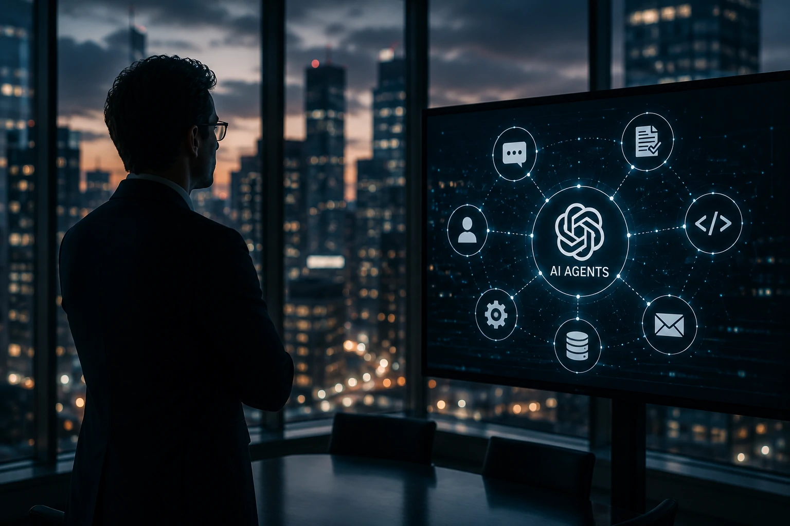
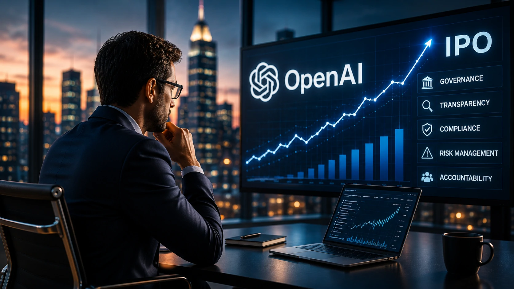

*Durante os últimos dois anos, a corrida da inteligência artificial foi dominada por lançamentos de modelos, investimentos bilionários e anúncios de agentes cada vez mais sofisticados. Agora, um novo elemento começa a ganhar protagonismo: a governança. A investigação envolvendo a **OpenAI** surge exatamente quando a empresa acelera sua preparação para uma possível abertura de capital e amplia sua ambição de transformar o **ChatGPT** em uma plataforma central para a próxima geração de software baseado em IA.*

## A investigação da OpenAI sinaliza que a era da supervisão regulatória da IA começou

*Reguladores começam a acompanhar de forma mais próxima o avanço das plataformas de inteligência artificial.*

A investigação contra a **OpenAI** representa um movimento que vai além de uma única empresa. O caso indica que reguladores passaram a observar com mais atenção como grandes modelos de IA lidam com dados, usuários e mecanismos de engajamento.

Segundo informações divulgadas nesta semana, procuradores estaduais dos Estados Unidos buscam compreender aspectos relacionados ao tratamento de dados, políticas internas e impacto dos sistemas de IA sobre os usuários.

O momento não poderia ser mais simbólico. A **OpenAI** tornou-se uma das organizações mais influentes da economia digital e ajuda a definir o ritmo de adoção da inteligência artificial em empresas, governos e consumidores.

### Por que reguladores estão aumentando a atenção?

A velocidade de adoção da IA superou praticamente todas as grandes ondas tecnológicas recentes.

Milhões de usuários passaram a depender de sistemas generativos para pesquisa, produtividade, programação e tomada de decisão. Quanto maior a influência dessas plataformas, maior tende a ser a pressão por mecanismos de supervisão.

### O debate vai além da privacidade

A discussão atual não envolve apenas dados pessoais.

Questões relacionadas à transparência dos modelos, riscos de automação, influência sobre usuários e responsabilidade corporativa começam a ocupar espaço crescente nas agendas regulatórias globais.

## O caso acontece justamente quando a OpenAI acelera sua transformação em plataforma de agentes

*O futuro da competição em IA pode ser definido menos pelos modelos e mais pelos agentes que executam tarefas.*

A estratégia atual da **OpenAI** vai muito além do chatbot tradicional.

Relatórios recentes indicam que a empresa trabalha para transformar o **ChatGPT** em uma espécie de superplataforma capaz de integrar agentes, automações, programação, criação de conteúdo e execução de tarefas em larga escala.

Essa mudança reforça uma tese que já apareceu em outras análises do Notícia Tech: a próxima disputa da IA não acontece apenas entre modelos, mas entre ecossistemas completos de agentes.

Nesse cenário, empresas como **OpenAI**, **Google**, **Microsoft**, **Anthropic** e **Meta** competem para se tornar a camada principal de interação digital.

### O ChatGPT está deixando de ser apenas um assistente

O objetivo estratégico parece ser transformar o produto em uma interface operacional para o trabalho digital.

Quanto mais tarefas forem executadas por agentes, maior será a dependência dos usuários em relação à plataforma que coordena essas ações.

### Por que isso interessa às empresas?

Empresas enxergam nos agentes uma oportunidade de reduzir custos, acelerar processos e ampliar produtividade.

Esse movimento já foi abordado em nossa análise sobre [AI Operations e governança dos agentes de IA nas empresas](https://noticiatech.com.br/inteligencia-artificial/ai-operations-governanca-agentes-ia-empresas/), que mostrou como o desafio deixa de ser apenas tecnológico e passa a envolver gestão, monitoramento e controle.

## O IPO da OpenAI pode transformar a governança em vantagem competitiva

*Mercados financeiros tendem a exigir transparência proporcional à influência das empresas de IA.*

A investigação surge poucos dias depois de notícias relacionadas ao avanço dos planos de IPO da **OpenAI**.

Historicamente, empresas que entram nos mercados públicos enfrentam exigências mais rigorosas de transparência, auditoria e gestão de riscos.

Isso cria um cenário interessante para o setor de IA.

Durante os últimos anos, a principal vantagem competitiva estava concentrada em infraestrutura computacional, qualidade dos modelos e acesso a dados. Agora, governança pode começar a ocupar a mesma posição estratégica.

### A nova corrida envolve confiança

Investidores institucionais costumam avaliar não apenas crescimento, mas também previsibilidade.

Empresas capazes de demonstrar controles robustos podem ganhar vantagem em um ambiente regulatório mais exigente.

### O que investidores observam nesse momento?

Os mercados acompanham:

- capacidade de crescimento sustentável;
- riscos regulatórios;
- governança corporativa;
- dependência de infraestrutura;
- capacidade de monetização dos agentes de IA.

A combinação desses fatores pode influenciar a próxima fase da economia da inteligência artificial.

## O maior impacto pode ser sentido por todo o mercado de agentes de IA

A principal consequência da investigação talvez não esteja dentro da **OpenAI**.

O efeito mais relevante pode ser a criação de novos padrões para toda a indústria.

À medida que agentes assumem funções mais complexas dentro das empresas, cresce a necessidade de auditoria, rastreabilidade e mecanismos claros de responsabilidade.

Esse movimento se conecta diretamente a tendências discutidas anteriormente pelo Notícia Tech em conteúdos como [MCP pode se tornar a infraestrutura invisível que conecta agentes de IA aos sistemas corporativos](https://noticiatech.com.br/inteligencia-artificial/mcp-infraestrutura-conecta-agentes-ia-sistemas-corporativos/) e também em nossa análise sobre [Context Engineering e a nova corrida silenciosa dos agentes corporativos](https://noticiatech.com.br/inteligencia-artificial/context-engineering-agentes-ia-empresas/).

A mensagem para o mercado é clara.

A próxima fase da inteligência artificial não será definida apenas por quem constrói os modelos mais avançados. Ela também será determinada por quem conseguir equilibrar inovação, governança, transparência e confiança em escala global.

---