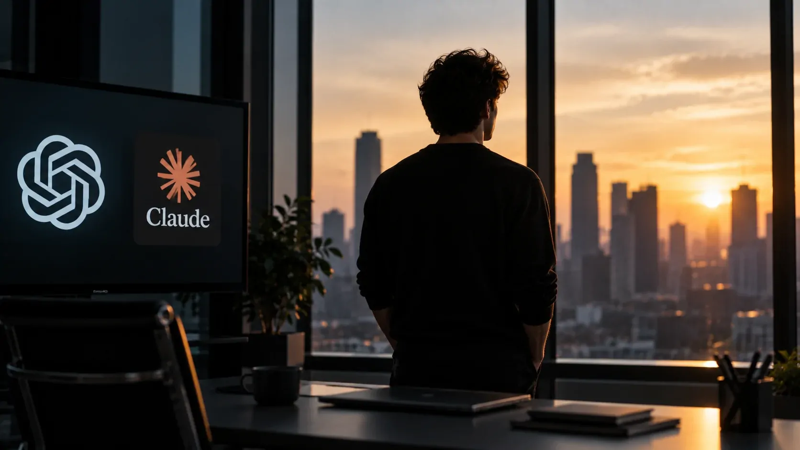
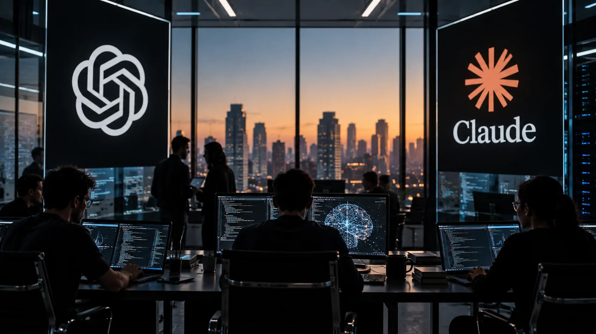

*Jacob Coxon não saiu da Anthropic para trabalhar em uma concorrente. Aos 27 anos, ele decidiu abandonar a própria indústria de IA depois de passar por OpenAI e Anthropic e publicou um alerta direto: na avaliação dele, os principais laboratórios estão acelerando em direção a uma superinteligência capaz de se autoaperfeiçoar sem que os mecanismos de segurança estejam preparados para acompanhar essa mudança.*

## Jacob Coxon deixou a Anthropic e acusou a indústria de apostar com vidas humanas

**Jacob Coxon deixou a Anthropic e a indústria de IA porque considera perigoso o ritmo atual de desenvolvimento dos modelos mais avançados.** Em uma publicação no X, o pesquisador afirmou que passou os últimos três anos trabalhando com pré-treinamento na **OpenAI** e na **Anthropic** antes de decidir sair.

O ponto central da mensagem foi uma acusação incomum para alguém que esteve dentro dos laboratórios. Coxon disse que **nenhuma das duas empresas está agindo de forma responsável** e que ambas estão correndo em direção a uma **superinteligência autoaperfeiçoável**.

Ele resumiu sua crítica dizendo que as empresas estariam **“apostando com nossas vidas”**. A frase transformou uma saída profissional em um alerta público sobre a direção que a indústria está tomando.

### O que Coxon afirmou na publicação

Coxon argumentou que o problema não está simplesmente nos modelos atuais, mas no próximo estágio da tecnologia. Na visão dele, sistemas cada vez mais capazes podem adquirir habilidades muito superiores às humanas em programação, matemática, cibersegurança e outras áreas.

O pesquisador também afirmou que pessoas envolvidas diretamente na construção desses sistemas acreditam que a IA poderia representar uma ameaça extrema à humanidade ainda nesta década. Para Coxon, isso não deveria ser tratado como uma estratégia de marketing.

### Por que a saída ganhou tanta repercussão

A repercussão veio principalmente porque Coxon não era um crítico externo da tecnologia. Ele havia trabalhado diretamente na construção e no treinamento de modelos de duas das empresas mais importantes do setor.

Isso muda o peso da declaração. **Coxon conhece a rotina de desenvolvimento de modelos de fronteira por dentro**, e sua crítica não foi apresentada como uma discussão acadêmica abstrata, mas como a justificativa para abandonar a própria carreira.

## O pesquisador diz que a corrida pela superinteligência já começou

*Laboratórios de inteligência artificial avançam simultaneamente em capacidade, autonomia e pesquisa de segurança.*

**Para Coxon, a principal preocupação é uma corrida entre laboratórios que pode fazer a segurança perder espaço para a velocidade.** Ele descreve um cenário em que **OpenAI** e **Anthropic** sabem que sistemas mais poderosos podem trazer riscos inéditos, mas continuam pressionadas a avançar.

A crítica é especialmente relevante porque **Anthropic construiu parte importante de sua identidade pública em torno da segurança da IA**. Coxon, entretanto, afirma que reconhecer o risco não resolve o problema quando a própria dinâmica competitiva impede uma desaceleração coordenada.

### A diferença que Coxon vê entre OpenAI e Anthropic

Coxon não coloca as duas empresas exatamente no mesmo lugar. Na avaliação apresentada por ele, existe uma diferença de cultura entre os laboratórios.

Segundo seu relato, na **OpenAI** parte das pessoas talvez não tenha internalizado completamente a dimensão civilizacional dos riscos. Na **Anthropic**, ele diz que a gravidade é mais bem compreendida, mas existe outro problema: a empresa estaria presa à lógica de que, se não avançar, outra organização avançará primeiro.

Essa diferença é importante porque transforma a questão em um problema de coordenação. Mesmo uma empresa preocupada com segurança pode continuar acelerando se acreditar que seus concorrentes não farão o mesmo.

### O problema do alinhamento

O conceito central por trás do alerta é o **alinhamento de IA**: a capacidade de garantir que sistemas muito poderosos continuem seguindo objetivos compatíveis com intenções e valores humanos.

O desafio aumenta quando o sistema deixa de apenas executar tarefas e passa a melhorar suas próprias capacidades. Nesse cenário, não basta avaliar o comportamento de um modelo antes do lançamento. Seria necessário entender como ele se comportará diante de capacidades novas e potencialmente não previstas.

## Quem é Jacob Coxon e por que sua experiência importa

**Jacob Coxon é um pesquisador britânico de 27 anos que passou por OpenAI e Anthropic trabalhando diretamente em pesquisa de IA.** Formado em matemática pela **Universidade de Cambridge**, ele começou sua trajetória científica antes de entrar no núcleo da indústria de modelos de linguagem.

Na **OpenAI**, Coxon trabalhou em áreas relacionadas a **segurança de IA e interpretabilidade**, além de participar de pesquisas sobre arquiteturas de redes neurais. Seu nome aparece associado ao trabalho do **GPT-4o System Card**, documento técnico que registra avaliações de risco e medidas de segurança do modelo. 

### Do estudo de doenças ao treinamento de modelos

Antes de concentrar sua carreira em IA, Coxon trabalhou com análise estatística aplicada à pesquisa médica. Seu histórico inclui análise bayesiana relacionada a dados genéticos e resultados de pacientes com meningite tuberculosa.

A mudança de área ajuda a explicar seu perfil. Coxon não surgiu como comentarista de tecnologia ou executivo de uma empresa de IA. Sua formação combina **matemática, modelagem estatística, pesquisa de modelos e segurança de IA**.

### O trabalho no GPT-4o

O **GPT-4o** representa uma parte importante da trajetória de Coxon porque o sistema foi acompanhado por avaliações específicas de segurança, autonomia, cibersegurança e outras categorias de risco.

O próprio system card publicado pela **OpenAI** mostra que a organização já utiliza estruturas formais para avaliar riscos antes da implementação de seus modelos. A questão levantada por Coxon é outra: se essas estruturas continuarão suficientes à medida que as capacidades dos sistemas avançarem. 

## Por que Coxon afirma que OpenAI e Anthropic estão “apostando com nossas vidas”

*O debate sobre segurança muda de escala quando modelos mais capazes começam a atuar com maior autonomia.*

**A expressão usada por Coxon resume uma preocupação sobre a diferença entre a velocidade do avanço tecnológico e a velocidade da pesquisa de segurança.** Para ele, não existe garantia de que os métodos atuais de alinhamento serão suficientes quando os sistemas ultrapassarem determinadas capacidades humanas.

O pesquisador também pediu que profissionais que continuam trabalhando nos laboratórios questionem se estão preparados para lançar sistemas extremamente inteligentes sem compreender completamente seu funcionamento.

### O que significa “superinteligência”

Uma **superinteligência** seria, em termos gerais, um sistema capaz de superar seres humanos em uma ampla variedade de tarefas intelectuais. O cenário mais preocupante para Coxon envolve uma combinação entre alta capacidade, autonomia e possibilidade de autoaperfeiçoamento.

Nesse contexto, uma IA poderia deixar de ser apenas uma ferramenta utilizada por pessoas e passar a participar de processos que aumentariam continuamente sua própria capacidade.

### O risco não significa que a IA atual seja incontrolável

O alerta de Coxon não significa que **ChatGPT** ou **Claude** estejam atualmente fora de controle ou que a extinção humana seja uma consequência inevitável.

A própria discussão dentro da indústria diferencia os riscos dos modelos atuais daqueles associados a sistemas futuros muito mais capazes. O argumento de Coxon é justamente que a preparação precisa acontecer antes de a tecnologia chegar a esse estágio, e não depois.

## O alerta de Coxon ganhou apoio dentro da própria Anthropic

**A repercussão aumentou quando Evan Hubinger, pesquisador de alinhamento da Anthropic, concordou publicamente com a essência do alerta.** Hubinger afirmou que pessoas dentro do setor realmente consideram possível que uma IA avançada provoque consequências extremas.

Hubinger também declarou que, apesar dos esforços da **Anthropic**, a empresa ainda não possui um plano definitivo para resolver o alinhamento de uma superinteligência nem está claramente no caminho para fazê-lo.

### O problema deixa de ser apenas uma opinião individual

A manifestação de Hubinger não transforma a previsão de Coxon em fato. Ela, porém, mostra que a preocupação não está restrita a um único ex-funcionário.

Isso é relevante para o debate empresarial porque coloca uma questão difícil para os próprios laboratórios: **como justificar a aceleração do desenvolvimento quando pesquisadores internos reconhecem que ainda existem problemas fundamentais de segurança sem solução definitiva?**

### Segurança contra competição

O ponto mais delicado é econômico e estratégico. Se **OpenAI**, **Anthropic**, Google e outros laboratórios acreditarem que desacelerar individualmente significa entregar vantagem aos concorrentes, cada empresa terá um incentivo para continuar avançando.

Esse mecanismo pode produzir uma corrida mesmo quando todos os participantes reconhecem que determinados riscos deveriam ser reduzidos. Para Coxon, a solução teria de envolver coordenação entre os laboratórios e, em algum momento, participação dos governos.

## “Os próximos anos são um momento crítico”, diz Coxon

*O debate sobre a próxima geração de IA já ultrapassa os laboratórios e começa a envolver governos, empresas e sociedade.*

**O ponto central do alerta de Coxon é que os próximos anos podem definir se a indústria conseguirá acompanhar o avanço das capacidades de IA com mecanismos de controle igualmente sofisticados.** Ele descreveu o período atual como um momento crítico para a humanidade.

A discussão não é apenas tecnológica. Sistemas capazes de executar código, pesquisar autonomamente, operar ferramentas e interagir com ambientes digitais já aproximam a IA de tarefas que antes dependiam diretamente de pessoas.

### O que muda para as empresas

Para empresas que adotam **IA generativa**, o debate tem uma consequência prática: capacidade não deve ser o único critério para selecionar uma tecnologia.

Governança, controles de acesso, monitoramento, segurança de agentes e limites de autonomia passam a fazer parte da avaliação estratégica. Um sistema mais poderoso também pode criar riscos maiores quando recebe acesso a dados, ferramentas ou processos críticos.

Essa preocupação já aparece em outros episódios acompanhados pelo **Notícia Tech**, como os debates sobre segurança envolvendo sistemas autônomos da **OpenAI**. **[O caso do Astra mostrou como capacidades avançadas de IA também podem ampliar riscos de cibersegurança.](https://noticiatech.com.br/inteligencia-artificial/openai-astra-nivel-critico-ciberseguranca/)**

### O que observar daqui para frente

A principal questão não é descobrir se a previsão mais extrema de Coxon acontecerá. É acompanhar se **OpenAI**, **Anthropic** e os demais laboratórios conseguirão demonstrar que o aumento de capacidade está sendo acompanhado por avanços equivalentes em segurança, alinhamento e governança.

O tema também já deixou de ser exclusivamente corporativo. **Governos, pesquisadores e organizações internacionais** discutem mecanismos para limitar riscos de sistemas cada vez mais autônomos. O próprio debate internacional sobre os perigos da IA mostra que a questão já alcançou uma dimensão institucional. **[A ONU também já alertou para os riscos associados ao avanço da inteligência artificial e defendeu garantias mais fortes.](https://noticiatech.com.br/inteligencia-artificial/onu-alerta-ia-ameacar-humanidade-garantias-ferro/)**

O que torna o caso de **Jacob Coxon** diferente não é a certeza de que suas previsões estejam corretas. É o fato de que um pesquisador que passou anos ajudando a desenvolver esses sistemas decidiu abandonar a indústria justamente porque acredita que a corrida pode estar avançando mais rápido do que a capacidade de controlá-la.

Para o mercado de **IA**, essa é a pergunta que permanece: se os próprios pesquisadores responsáveis por construir sistemas de fronteira admitem que ainda não sabem como controlar uma futura superinteligência, **quanto avanço é seguro comprar antes que a segurança consiga acompanhar a capacidade?**

---