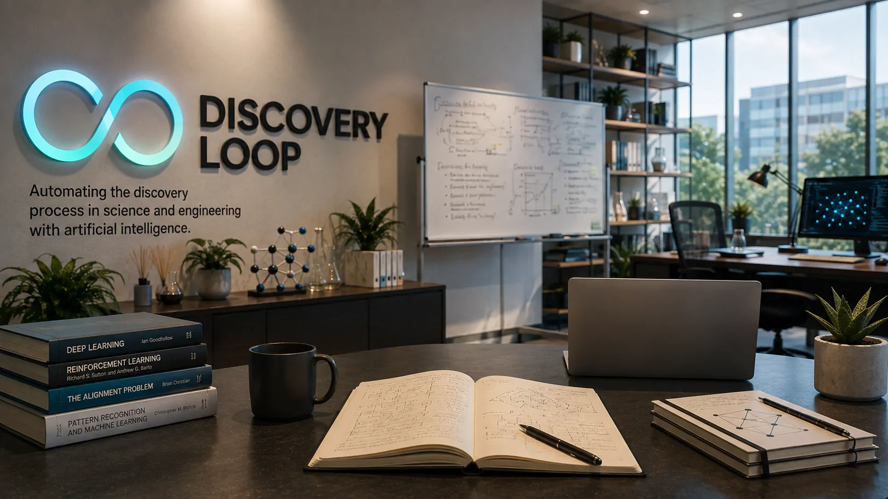
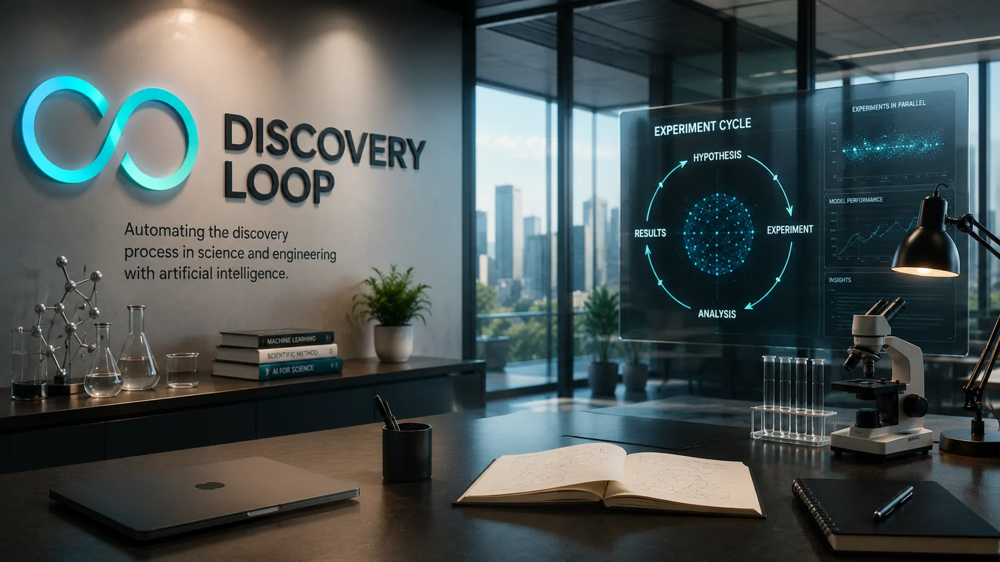

*Jeff Dean passou quase 27 anos ajudando a construir algumas das tecnologias mais importantes do Google. Agora, um dos principais nomes técnicos da empresa está apostando em uma ideia mais ambiciosa: usar inteligência artificial para automatizar o próprio processo de descoberta científica e tecnológica.*

## Jeff Dean deixa o Google após quase 27 anos

Jeff Dean deixou o Google depois de quase 27 anos para fundar a **Discovery Loop**, uma nova empresa dedicada ao uso de inteligência artificial para acelerar pesquisas em machine learning, ciência e engenharia.

Dean entrou no Google em 1999 e construiu uma das carreiras técnicas mais influentes da história da companhia. Ao longo desse período, participou do desenvolvimento de sistemas fundamentais da infraestrutura do Google, além de ter papel importante na evolução da pesquisa em inteligência artificial.

A saída ocorreu junto com a de **Sanjay Ghemawat**, colaborador de longa data de Dean, além de **Oriol Vinyals** e **Quoc Le**. Os quatro pesquisadores e engenheiros agora formam a equipe fundadora da Discovery Loop.

O movimento chama atenção não apenas pela saída de executivos e pesquisadores experientes, mas principalmente pelo destino escolhido.

Dean não está deixando o Google para criar mais uma empresa de IA voltada a chatbots ou ferramentas de produtividade. A proposta da nova companhia está em uma camada diferente: **automatizar o próprio processo utilizado para descobrir novas soluções**.

## A Discovery Loop quer automatizar o ciclo de descoberta

*Jeff Dean e os cofundadores da Discovery Loop querem usar inteligência artificial para automatizar etapas do processo experimental.*

A proposta central da **Discovery Loop** é automatizar o ciclo experimental usado em pesquisa e engenharia.

Em um processo tradicional, pesquisadores formulam uma hipótese, desenvolvem um experimento, executam os testes, analisam os resultados e utilizam essas informações para definir o próximo passo.

A empresa pretende colocar sistemas de IA dentro desse ciclo.

Na prática, isso significa utilizar inteligência artificial para ajudar a propor experimentos, executá-los, avaliar os resultados e decidir quais caminhos devem ser investigados posteriormente.

A Discovery Loop afirma que pretende trabalhar inicialmente com **machine learning**, mas sua visão inclui aplicações mais amplas em ciência e engenharia.

A empresa também pretende explorar a execução de grandes quantidades de experimentos em paralelo. A ideia é reduzir uma das principais limitações da pesquisa tradicional: a velocidade com que seres humanos conseguem formular, executar e avaliar novas hipóteses.

A proposta representa uma mudança importante no papel atribuído à IA.

Em vez de funcionar apenas como uma ferramenta utilizada por pesquisadores, o sistema passa a participar de uma sequência contínua de experimentação e aprendizado.

## O que muda quando a IA passa a testar suas próprias hipóteses

O principal diferencial dessa abordagem não está simplesmente em utilizar modelos mais avançados.

A mudança está em reduzir o intervalo entre **hipótese, experimento, resultado e nova hipótese**.

Em uma pesquisa tradicional, cada ciclo pode exigir pesquisadores, engenheiros, infraestrutura computacional e tempo para análise. Se parte desse processo puder ser automatizada, uma equipe poderá testar muito mais possibilidades antes de decidir quais caminhos merecem investimento humano adicional.

Isso também muda a discussão sobre autonomia dos sistemas de IA.

O Notícia Tech já analisou **[como agentes de IA podem criar novos problemas de responsabilidade para empresas quando passam a executar ações de forma autônoma](https://noticiatech.com.br/inteligencia-artificial/agentes-ia-responsabilidade-empresas-acoes-autonomas/)**. No caso da Discovery Loop, a autonomia aparece em outro contexto: sistemas capazes de executar e avaliar experimentos dentro de um processo de pesquisa.

A diferença é estratégica.

Em uma automação empresarial convencional, o objetivo costuma ser completar uma tarefa com maior velocidade ou menor custo. Na proposta da Discovery Loop, o objetivo é **produzir conhecimento novo** a partir de ciclos sucessivos de experimentação.

Ainda não existe evidência suficiente para afirmar que esse modelo funcionará em escala ou que produzirá descobertas científicas relevantes de forma autônoma.

Mas a direção é significativa.

Se a abordagem funcionar, a IA poderá deixar de ser apenas uma ferramenta para acelerar o trabalho dos pesquisadores e passar a atuar como uma infraestrutura para ampliar a quantidade de hipóteses que podem ser testadas.

## Google perde talentos mas continua ligado à nova empresa

*Jeff Dean deixou o Google, mas a Alphabet continua relacionada à nova empresa como investidora e parceira de infraestrutura.*

A saída de Dean também precisa ser analisada dentro da própria estratégia do Google.

Depois de quase três décadas na empresa, Dean acumulou conhecimento sobre infraestrutura, sistemas distribuídos, machine learning e pesquisa em inteligência artificial. Sua saída representa a transferência de uma experiência técnica construída durante uma das maiores transformações tecnológicas da história da companhia.

Ao mesmo tempo, a Alphabet não ficou completamente afastada da nova iniciativa.

A companhia aparece como **investidora fundadora da Discovery Loop**, enquanto o Google atua como parceiro de infraestrutura de computação.

Isso cria uma relação incomum.

O Google perde um de seus principais nomes técnicos, mas continua economicamente e tecnologicamente conectado à empresa que ele está construindo.

A situação também ocorre em um momento de mudanças na liderança de inteligência artificial do Google e de forte competição com empresas como OpenAI e Anthropic.

Por isso, o movimento não deve ser interpretado apenas como uma decisão individual de carreira.

Ele também mostra como pesquisadores de alto nível podem encontrar novas formas de trabalhar fora da estrutura tradicional de grandes laboratórios, enquanto continuam dependendo de infraestrutura e capital fornecidos pelas próprias empresas que ajudaram a construir.

## A aposta pode mudar o valor estratégico da pesquisa em IA

A Discovery Loop também introduz uma questão maior para o mercado: **quem controla a capacidade de descobrir e desenvolver novas tecnologias mais rapidamente pode obter uma vantagem competitiva tão importante quanto quem possui o melhor modelo de IA**.

Essa mudança ajuda a entender por que a inteligência artificial começa a alterar a própria percepção de valor das empresas de tecnologia. O Notícia Tech já analisou **[como a IA está mudando o valor das empresas de tecnologia](https://noticiatech.com.br/negocios/ia-muda-valor-empresas-tecnologia/)**, e a proposta da Discovery Loop adiciona uma nova dimensão a essa transformação.

Uma empresa capaz de automatizar partes importantes de pesquisa e desenvolvimento poderia reduzir o tempo necessário para testar novas arquiteturas, métodos e soluções.

Isso teria impacto direto em setores nos quais pesquisa e desenvolvimento representam uma parcela relevante da vantagem competitiva.

Empresas de tecnologia poderiam usar sistemas desse tipo para acelerar a evolução de seus próprios modelos. Fabricantes de chips poderiam testar novas arquiteturas. Empresas farmacêuticas poderiam explorar hipóteses em processos de descoberta de medicamentos. Laboratórios poderiam ampliar a quantidade de experimentos realizados em determinadas etapas da pesquisa.

Mas existe uma diferença entre automatizar experimentos e automatizar descobertas.

Um sistema pode executar milhares de testes e ainda produzir resultados pouco relevantes se não conseguir definir boas hipóteses, interpretar corretamente os resultados ou identificar quais caminhos realmente representam avanços.

É justamente essa diferença que determinará o potencial da Discovery Loop.

A empresa não está apenas tentando fazer experimentos mais rapidamente. Sua ambição é construir sistemas capazes de participar de um processo que transforma resultados experimentais em novos caminhos de investigação.

## Jeff Dean aposta em uma nova forma de fazer ciência

A saída de Jeff Dean encerra uma das trajetórias mais longas e influentes dentro do Google, mas o aspecto mais importante do movimento está na empresa que ele decidiu criar.

A Discovery Loop não nasce para competir simplesmente por usuários de um chatbot ou por participação em uma disputa tradicional de modelos de linguagem.

A aposta está em uma camada mais profunda da inteligência artificial: **automatizar o processo experimental que transforma hipóteses em resultados**.

Se essa abordagem funcionar, poderá aumentar significativamente a quantidade de experimentos que pesquisadores e engenheiros conseguem realizar em determinado período.

O impacto potencial também vai além da produtividade.

Uma capacidade maior de experimentação pode alterar a velocidade com que novas tecnologias são desenvolvidas, especialmente em áreas nas quais os ciclos de pesquisa são longos e dependem de grandes quantidades de testes.

Ainda existem questões importantes.

Será que os sistemas conseguirão formular experimentos realmente úteis? Conseguirão interpretar resultados complexos sem supervisão constante? Como serão identificados erros experimentais? E quem será responsável quando uma IA decidir qual experimento deve ser executado em seguida?

Essas perguntas serão fundamentais para determinar se a proposta da Discovery Loop representa apenas uma nova empresa criada por veteranos do Google ou o início de uma mudança mais ampla na organização da pesquisa científica.

O ponto mais importante é que Jeff Dean escolheu apostar justamente nessa fronteira.

Durante quase 27 anos, ele ajudou a construir sistemas que permitiram ao Google processar informações em uma escala inédita. Agora, sua nova empresa tenta aplicar uma lógica semelhante ao próprio processo de descoberta: **aumentar radicalmente a quantidade de possibilidades que podem ser exploradas e acelerar o caminho entre uma hipótese e aquilo que ela pode revelar**.

---