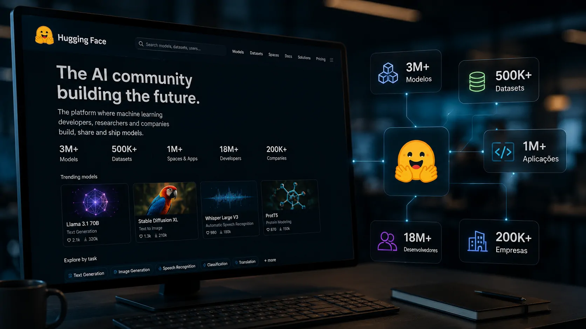
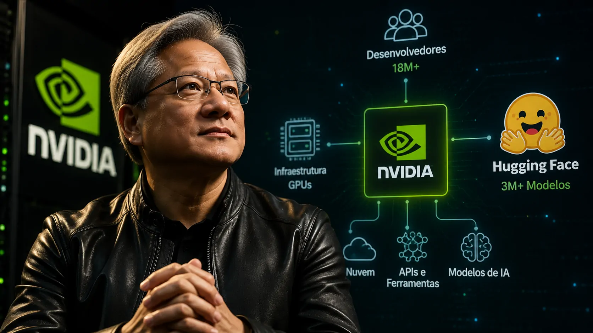
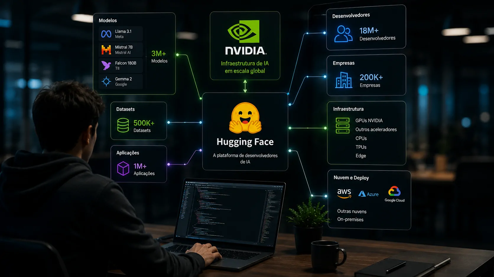

*Jensen Huang está colocando US$ 12,93 bilhões em uma empresa que, à primeira vista, parece distante do negócio tradicional da Nvidia. Mas a compra da Hugging Face revela uma estratégia maior: controlar não apenas a infraestrutura que executa a inteligência artificial, mas também uma das plataformas onde desenvolvedores encontram e trabalham com os modelos que alimentam essa nova economia.*

## Jensen Huang está comprando uma posição além dos chips

A Nvidia anunciou um acordo para adquirir a Hugging Face por **US$ 12,93 bilhões**, em uma operação que representa uma mudança importante na estratégia de Jensen Huang. A empresa continua sendo uma potência em chips e infraestrutura, mas a nova aquisição leva sua presença para uma camada diferente do mercado de IA.

A Hugging Face é uma plataforma conhecida principalmente entre desenvolvedores e pesquisadores. Ela concentra modelos, datasets e aplicações de inteligência artificial e se tornou um dos principais pontos de encontro para quem trabalha com modelos abertos e open-weight.

É justamente essa comunidade que torna a aquisição estratégica. A Nvidia já fornece parte importante da capacidade computacional necessária para treinar e executar IA. Com a Hugging Face, Huang passa a ter acesso a uma plataforma muito mais próxima de quem decide **quais modelos serão usados e como eles serão colocados em produção**.

### A estratégia de Huang vai além da venda de GPUs

Durante a explosão da inteligência artificial, a Nvidia se tornou uma das principais beneficiárias da demanda por capacidade computacional. Mas Jensen Huang está olhando para um mercado que pode ser muito maior do que a venda de aceleradores.

À medida que empresas adotam IA, elas precisam escolher modelos, testar alternativas, adaptar sistemas e colocá-los em funcionamento. Essa cadeia cria oportunidades em software, serviços, inferência e infraestrutura.

A Hugging Face está posicionada justamente nessa interseção. A aquisição permite que a Nvidia se aproxime de uma comunidade que influencia diretamente quais tecnologias serão utilizadas nos próximos sistemas de IA.

### O alvo é o ecossistema que cresce ao redor da IA

A Nvidia não precisa necessariamente transformar a Hugging Face em uma plataforma exclusiva para seus próprios produtos. O valor estratégico pode estar justamente em manter o ecossistema aberto e fazer com que a Nvidia seja uma infraestrutura cada vez mais presente nele.

Essa lógica é diferente da simples compra de uma empresa de software. Huang está tentando ampliar o alcance da Nvidia dentro da cadeia de valor da inteligência artificial.

O movimento também acontece em um momento em que grandes empresas de IA começam a desenvolver seus próprios chips e alternativas de infraestrutura. Isso torna ainda mais importante para a Nvidia manter um ecossistema amplo de desenvolvedores e modelos.

## O que Jensen Huang viu na Hugging Face

*A Hugging Face reúne modelos, datasets e aplicações e se tornou uma importante porta de entrada para desenvolvedores que trabalham com inteligência artificial.*

A escala da Hugging Face ajuda a explicar por que Huang aceitou pagar quase US$ 13 bilhões pela plataforma. Segundo os números divulgados pela Nvidia, o ecossistema reúne mais de **3 milhões de modelos**, **500 mil datasets** e **1 milhão de aplicações**.

A plataforma também é utilizada por mais de **18 milhões de desenvolvedores, pesquisadores e criadores**, além de mais de **200 mil empresas**. Esses números transformam a Hugging Face em algo maior do que um simples repositório de modelos.

Para a Nvidia, esse alcance representa uma conexão direta com uma comunidade que está ajudando a definir como a próxima geração de aplicações de IA será construída.

### A Nvidia já estava dentro desse ecossistema

A relação entre as duas empresas não começou com a aquisição. A Nvidia já contribuía com a Hugging Face e havia publicado centenas de modelos e datasets na plataforma.

Essa presença anterior é importante porque mostra que Huang não está entrando em um mercado completamente desconhecido. A Nvidia já vinha acompanhando a evolução dos modelos abertos e investindo na criação de seu próprio ecossistema.

A compra transforma essa participação em controle estratégico, caso o acordo seja concluído.

### Modelos abertos podem aumentar a demanda por computação

Existe uma relação direta entre a expansão dos modelos abertos e o negócio principal da Nvidia. Quanto mais modelos são criados, adaptados e implantados, maior pode ser a demanda por capacidade computacional.

Essa demanda não precisa estar concentrada em poucos grandes laboratórios. Empresas de diferentes tamanhos podem utilizar modelos abertos para criar aplicações específicas, automatizar processos e desenvolver sistemas próprios.

É nesse ponto que a aquisição ganha uma dimensão empresarial. Huang pode estar apostando que o futuro da IA será formado por **milhares ou milhões de aplicações especializadas**, e não apenas por alguns poucos modelos gigantes controlados por grandes laboratórios.

## A Nvidia quer controlar uma camada mais próxima dos desenvolvedores

A aquisição também precisa ser observada dentro de uma transformação maior do mercado. A competição em inteligência artificial está deixando de ser apenas uma disputa para criar o modelo mais poderoso.

Agora, empresas competem pelo modelo, pelo hardware, pela nuvem, pelas ferramentas de desenvolvimento e pelos ambientes onde essas tecnologias são implantadas.

Essa mudança favorece uma estratégia como a de Huang. A Nvidia já possui uma posição extremamente forte na infraestrutura. A Hugging Face adiciona uma ponte com desenvolvedores e organizações que estão escolhendo quais modelos utilizar.

### A batalha mudou de lugar

No início da corrida da IA generativa, a atenção estava concentrada em empresas como OpenAI, Google e Anthropic. O principal indicador de força era o desempenho dos modelos.

Agora, o mercado começa a se fragmentar em diferentes camadas. Existem modelos proprietários, modelos abertos, chips próprios, serviços de inferência, agentes de IA e plataformas de desenvolvimento.

A própria movimentação de grandes empresas em direção a chips próprios aumenta a pressão sobre a Nvidia. A resposta de Huang parece ser ampliar a quantidade de pontos estratégicos ocupados pela companhia.

Essa transformação também ajuda a explicar por que a arquitetura tecnológica se tornou tão importante para empresas que adotam IA. A integração entre modelos, APIs, agentes, dados e infraestrutura passou a ser parte central das decisões de tecnologia. O tema foi analisado pelo Notícia Tech em **[uma análise sobre arquitetura de IA empresarial](https://noticiatech.com.br/inteligencia-artificial/arquitetura-ia-empresarial-mcp-rag-apis-agentes-workflows-copilotos/)**.

### Huang não precisa transformar a Hugging Face em uma Nvidia

Um dos aspectos mais interessantes da estratégia é justamente o compromisso declarado de manter a plataforma aberta.

Jensen Huang afirmou que desenvolvedores continuarão podendo escolher os modelos, frameworks, provedores de nuvem, serviços de inferência e plataformas de computação que desejarem.

Isso significa que a Nvidia pode tentar capturar valor sem necessariamente fechar o ecossistema. Quanto maior a quantidade de modelos e desenvolvedores utilizando a plataforma, maior também pode ser a influência da Nvidia sobre a infraestrutura que sustenta esse mercado.

## A aposta de US$ 13 bilhões envolve um risco importante

*A compra amplia a influência potencial da Nvidia, mas também cria uma questão sobre a independência de uma plataforma utilizada por diferentes empresas e comunidades.*

O tamanho da operação torna inevitável uma pergunta: **quanto vale controlar uma das principais portas de entrada para modelos abertos de inteligência artificial?**

A Hugging Face havia sido avaliada em US$ 4,5 bilhões em sua última rodada conhecida de financiamento, em 2023. O novo valor representa uma diferença significativa e mostra quanto o mercado passou a atribuir às plataformas que ficam entre os modelos e seus usuários.

Para Huang, porém, o valor pode estar menos na receita atual da Hugging Face e mais na posição estratégica que ela ocupa no futuro da IA.

### A abertura será o principal teste

A Nvidia afirma que o hardware da empresa não será obrigatório para desenvolver ou implantar soluções através da Hugging Face. Essa promessa será importante para preservar a confiança da comunidade.

A plataforma reúne modelos de diferentes organizações e atende empresas com necessidades distintas. Uma mudança perceptível em direção a uma infraestrutura proprietária poderia gerar resistência entre desenvolvedores.

Por isso, manter a neutralidade pode ser economicamente interessante para a própria Nvidia. Uma plataforma aberta e amplamente utilizada pode ter mais valor estratégico do que uma plataforma restrita.

### A Nvidia está comprando uma opção para o futuro

O movimento também pode ser interpretado como uma proteção contra mudanças na indústria. Se os modelos abertos continuarem ganhando espaço, a Hugging Face poderá se tornar ainda mais importante para empresas que desejam evitar dependência de um único laboratório.

Nesse cenário, a Nvidia passa a controlar uma peça relevante desse ecossistema enquanto mantém seu negócio principal de infraestrutura.

A aquisição, portanto, não precisa gerar retorno apenas pela receita direta da Hugging Face. Seu valor pode aparecer na capacidade de manter a Nvidia relevante em diferentes camadas da cadeia de IA.

## O próximo capítulo da Nvidia pode ser definido pelos desenvolvedores

*A aquisição da Hugging Face coloca a comunidade de desenvolvedores no centro da próxima etapa da estratégia de Jensen Huang.*

A decisão de Jensen Huang mostra que a Nvidia não pretende depender exclusivamente da expansão do mercado de GPUs. A companhia está tentando construir uma posição mais ampla em um setor no qual hardware e software estão cada vez mais conectados.

A Hugging Face oferece exatamente essa ponte. De um lado estão os modelos e desenvolvedores. Do outro está a infraestrutura necessária para transformar esses modelos em aplicações reais.

Esse movimento ganha ainda mais relevância enquanto outras empresas tentam reduzir sua dependência dos chips da Nvidia. A expansão do ecossistema pode funcionar como uma forma de manter a companhia presente mesmo quando a composição da infraestrutura de IA começar a mudar.

### A grande aposta é quem controlará a próxima camada da IA

Se a primeira fase da corrida foi dominada por quem tinha mais capacidade de computação, a próxima pode ser definida por quem controla os ambientes onde modelos são escolhidos, adaptados e utilizados.

É nesse ponto que a compra da Hugging Face se torna maior do que seu valor financeiro.

Jensen Huang está colocando US$ 12,93 bilhões em uma plataforma que conecta milhões de desenvolvedores a milhões de ativos de inteligência artificial. A estratégia sugere que a Nvidia quer participar não apenas da infraestrutura que alimenta a IA, mas também das decisões que determinam **quais modelos serão usados e onde eles chegarão**.

A operação ainda depende das condições necessárias para seu fechamento. Mas, se for concluída nos termos anunciados, poderá marcar uma nova fase para a Nvidia: uma empresa que começou dominando a infraestrutura de computação e agora tenta ocupar uma posição estratégica cada vez mais próxima de quem constrói a inteligência artificial.

---