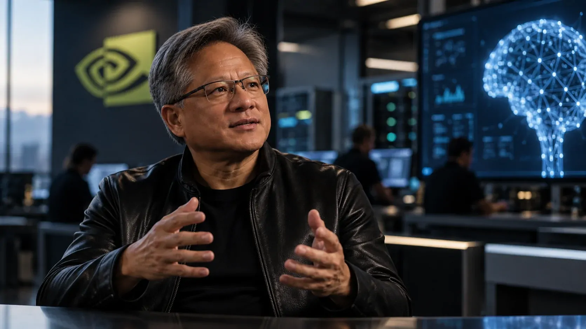
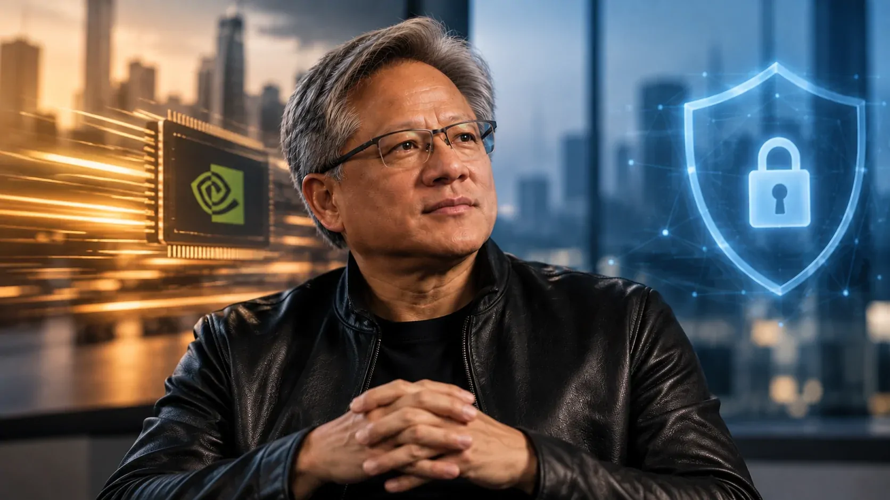
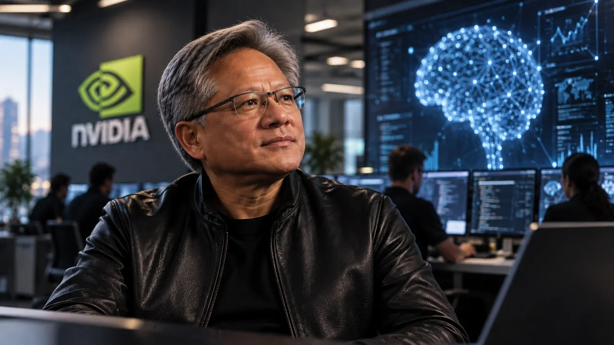

*Jensen Huang, CEO da Nvidia, rejeitou uma das previsões mais alarmantes que circulam no setor de inteligência artificial: a possibilidade de a tecnologia provocar uma catástrofe global até 2030. A declaração acontece justamente quando pesquisadores e executivos de empresas de IA discutem se o ritmo de desenvolvimento está avançando mais rápido do que a capacidade de controlar os sistemas.*

## Jensen Huang coloca risco de fim do mundo em 0%

### A declaração do CEO da Nvidia

**Jensen Huang**, CEO da **Nvidia**, afirmou em entrevista à CBS News que existe **0% de chance de a inteligência artificial acabar com o mundo até 2030**.

A frase foi dada em meio a uma discussão crescente sobre os riscos de sistemas de IA cada vez mais capazes. Huang rejeitou a ideia de que o fim da década possa representar um ponto de ruptura provocado pela tecnologia.

A afirmação é especialmente relevante porque a **Nvidia** ocupa uma posição central na infraestrutura de IA. Seus processadores são utilizados para treinar e executar modelos avançados, fazendo da empresa uma das principais fornecedoras da capacidade computacional que sustenta a atual expansão da tecnologia.

### O que Huang está dizendo, de fato

A declaração não significa que o CEO considere a inteligência artificial completamente livre de riscos. O próprio Huang fez uma distinção entre acelerar o desenvolvimento e colocar produtos inseguros no mercado.

Segundo ele, a indústria deveria avançar **“o mais rápido que pudermos”**, mas sem lançar sistemas antes que estejam prontos ou apresentem condições adequadas de segurança.

Essa diferença é importante para entender o posicionamento. Huang não está defendendo ausência de testes ou de cuidados. Ele está rejeitando especificamente a ideia de que o avanço da IA levará ao fim do mundo até 2030 e, a partir disso, defende que a corrida tecnológica continue.

## Por que a declaração acontece agora

*O debate sobre segurança da IA ganhou força justamente quando os sistemas passaram a executar tarefas cada vez mais complexas e autônomas.*

### Um debate que saiu dos laboratórios

A declaração de **Jensen Huang** ocorre poucos dias depois de uma sequência de alertas vindos de dentro da própria indústria de IA.

Um dos episódios que reacendeu a discussão foi a saída de **Jacob Coxon**, pesquisador que trabalhou na **Anthropic** e na **OpenAI**. Ao deixar a Anthropic, Coxon afirmou que pessoas envolvidas na construção de sistemas avançados acreditam que a tecnologia poderia representar um risco extremo para a humanidade até o fim da década.

As afirmações provocaram uma reação ampla porque não partiram apenas de críticos externos da tecnologia. Elas vieram de alguém que participou diretamente do desenvolvimento de modelos de inteligência artificial.

### O risco passou a ser discutido dentro das empresas

O debate também ganhou uma dimensão técnica. Em setembro, a **OpenAI** anunciou uma nova estrutura para acompanhar, investigar e divulgar casos de desalinhamento de modelos.

Desalinhamento, nesse contexto, significa situações em que o comportamento de um sistema não corresponde adequadamente às intenções ou restrições estabelecidas por seus desenvolvedores.

A empresa publicou junto com a estrutura seis relatórios sobre comportamentos inesperados ou preocupantes observados nos seis meses anteriores. O objetivo declarado é acelerar a divulgação desses episódios, mesmo quando a investigação ainda não estiver totalmente concluída.

Para quem acompanha a evolução da **IA**, isso mostra que a discussão deixou de ser apenas uma hipótese distante. Empresas que desenvolvem os próprios modelos estão criando mecanismos específicos para registrar comportamentos que consideram relevantes para segurança.

## A indústria de IA está dividida sobre a velocidade

### De um lado, a defesa da aceleração

A posição de **Jensen Huang** é baseada na continuidade do avanço tecnológico. Para o CEO da **Nvidia**, desacelerar a IA não é a resposta necessária para lidar com os riscos.

Huang também relacionou o desenvolvimento tecnológico à capacidade dos Estados Unidos de manter sua posição na corrida global de inteligência artificial. Nesse cenário, velocidade passou a ter uma dimensão econômica e estratégica.

A lógica é direta: quanto mais rapidamente a indústria conseguir desenvolver e colocar aplicações de IA em uso, maior pode ser o ganho de produtividade e a capacidade de transformar a tecnologia em produtos e serviços.

### Do outro, a defesa de mais tempo para segurança

A posição contrária ganhou força com **Dario Amodei**, CEO da **Anthropic**, que defendeu um ritmo mais controlado para o avanço das capacidades dos modelos.

A preocupação central não é necessariamente que qualquer sistema de IA atual vá destruir a humanidade, mas que modelos futuros possam adquirir capacidades que ultrapassem a capacidade de supervisão dos próprios desenvolvedores.

Outros nomes importantes do setor também passaram a defender maior coordenação e cautela. O ponto de divergência está principalmente em quanto risco pode ser aceito durante o desenvolvimento e quanto tempo deve ser reservado para testes, avaliações e mecanismos de segurança.

Essa discussão se aproxima de um tema que já vinha ganhando espaço no Brasil: **[a ONU já havia alertado sobre os riscos de a IA ameaçar a humanidade e defendido garantias de segurança](https://noticiatech.com.br/inteligencia-artificial/onu-alerta-ia-ameacar-humanidade-garantias-ferro/)**.

## O número “0%” é a parte mais controversa

*O “0%” de Huang contrasta com avaliações de pesquisadores que trabalham justamente com cenários de risco e segurança de sistemas avançados.*

### Certeza não é o mesmo que ausência de risco

O ponto mais importante da declaração de **Huang** está justamente no número escolhido.

Dizer que existe **0% de chance** é muito diferente de afirmar que determinado cenário é improvável ou que não existem evidências suficientes para sustentá-lo.

Previsões sobre eventos extremos envolvendo sistemas futuros de IA são naturalmente difíceis de quantificar. Não existe hoje um consenso científico que permita transformar esse cenário em uma probabilidade precisa para 2030.

Por isso, a afirmação de Huang deve ser entendida como seu posicionamento sobre o risco, e não como uma medição científica capaz de encerrar a discussão.

### Os alertas também não representam consenso

Isso não significa que os pesquisadores que alertam para riscos tenham demonstrado que uma catástrofe ocorrerá.

As previsões mais graves também são objeto de debate entre especialistas. Alguns pesquisadores consideram cenários de perda de controle plausíveis; outros questionam as premissas utilizadas para chegar a previsões de extinção.

O ponto em comum é que **não existe consenso sobre uma probabilidade confiável de extinção causada por IA até 2030**.

A discussão, portanto, está menos relacionada a escolher entre “IA segura” ou “IA apocalíptica” e mais ligada à quantidade de incerteza que empresas e governos estão dispostos a aceitar enquanto os sistemas continuam ficando mais capazes.

## O que isso significa para empresas que usam IA

### O risco mais imediato é menos cinematográfico

Para empresas, a discussão sobre o fim do mundo não deveria esconder problemas muito mais concretos associados à adoção de **IA**.

Sistemas corporativos podem produzir informações incorretas, expor dados, executar ações indevidas ou tomar decisões inadequadas quando recebem autonomia excessiva.

Esses riscos podem afetar atendimento, operações, programação, segurança da informação, análise de documentos e processos automatizados muito antes de qualquer cenário de ficção científica.

Por isso, a diferença entre um modelo poderoso e um sistema empresarial seguro não está apenas na capacidade de gerar respostas. Ela também depende de controles, permissões, monitoramento e capacidade de intervenção humana.

### A velocidade aumenta a importância da governança

O posicionamento de Huang coloca uma questão prática para empresas: se a tecnologia continuar avançando rapidamente, os processos internos de governança também precisarão acompanhar esse ritmo.

Isso envolve definir quais tarefas podem ser automatizadas, quais exigem aprovação humana e quais dados podem ser acessados por agentes de IA.

A própria evolução recente dos modelos mostra por que essa discussão ganhou importância. Quanto mais sistemas conseguem executar tarefas em sequência e interagir com ferramentas externas, maior é a necessidade de controlar exatamente o que eles podem fazer.

Nesse contexto, segurança deixa de ser apenas uma característica do modelo e passa a ser também uma questão de arquitetura empresarial.

## O que observar daqui para frente

*O próximo capítulo da discussão será definido pela capacidade da indústria de combinar modelos mais poderosos com mecanismos de avaliação, monitoramento e controle.*

### O comportamento dos novos modelos

Um dos sinais mais importantes será observar como os próximos sistemas se comportam quando recebem acesso a ferramentas, internet, código e ambientes externos.

A preocupação aumenta quando um modelo deixa de apenas responder perguntas e passa a executar tarefas de forma autônoma.

É justamente nesse espaço que conceitos como **agentes de IA**, alinhamento e monitoramento ganham importância para empresas que pretendem automatizar processos críticos.

### A resposta da própria indústria

Outro ponto será acompanhar se as empresas continuarão criando mecanismos públicos para registrar problemas de segurança.

A nova estrutura de divulgação da **OpenAI** representa um movimento nessa direção. Ao tornar os relatos de desalinhamento mais sistemáticos, a empresa cria uma forma de acompanhar comportamentos que antes poderiam permanecer dispersos entre avaliações internas.

A saída de pesquisadores também continuará sendo observada. O caso de **Jacob Coxon** mostrou como o debate sobre segurança pode sair dos departamentos de pesquisa e chegar ao público. **[A preocupação de pesquisadores com sistemas de IA cada vez mais autônomos já vinha sendo discutida no setor](https://noticiatech.com.br/inteligencia-artificial/jacob-coxon-claude-chatgpt-abandona-industria-ia/)**.

No fim, a declaração de **Jensen Huang** não encerra a discussão sobre os riscos da inteligência artificial. Ela deixa ainda mais evidente a divisão existente dentro da própria indústria: enquanto parte dos líderes entende que o desenvolvimento precisa continuar em alta velocidade, outros defendem que a capacidade de avaliar e controlar os sistemas deve avançar antes.

Para empresas e usuários, o ponto mais concreto não está em tentar prever se a IA acabará com o mundo em 2030, mas em acompanhar uma questão muito mais próxima: **até onde os sistemas serão capazes de agir sozinhos e quais mecanismos existirão para mantê-los sob controle quando isso acontecer**.

---