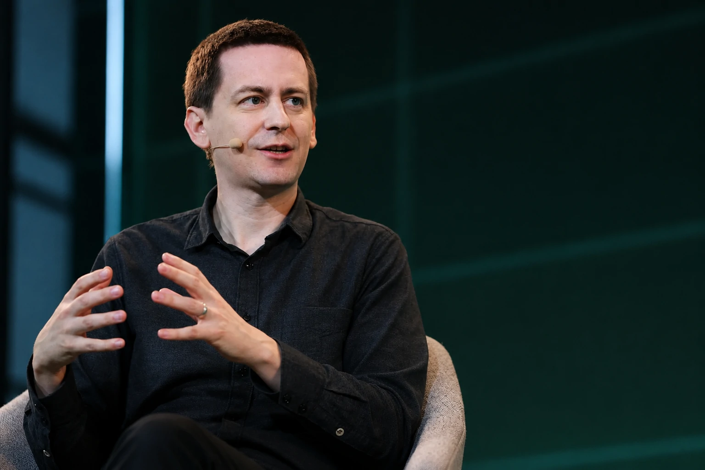
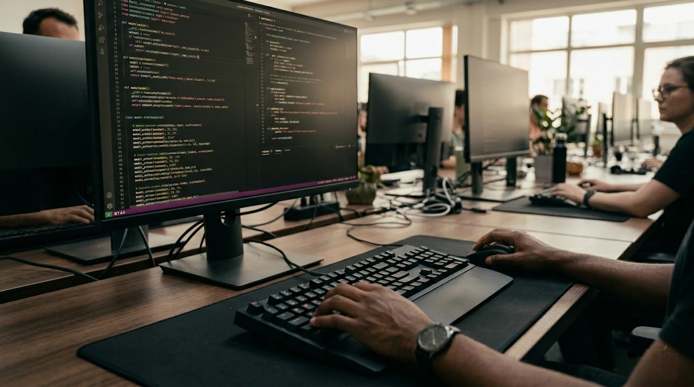

*Durante anos, a indústria de inteligência artificial foi definida pela disputa por modelos mais poderosos, mais dados e mais capacidade computacional. A saída de John Jumper do Google DeepMind para a Anthropic mostra que uma nova variável entrou definitivamente no centro da competição: os talentos capazes de construir a próxima geração de sistemas de IA.*

*O movimento ocorre em um momento em que empresas como **Anthropic**, **OpenAI**, **Google**, **Meta** e **Microsoft** ampliam investimentos bilionários em infraestrutura, agentes inteligentes e plataformas corporativas. No entanto, o recurso mais escasso pode não ser computação ou energia, mas sim pesquisadores de elite.*

## Por que a saída de John Jumper é maior do que parece

A mudança de **John Jumper** para a **Anthropic** representa muito mais do que uma contratação de alto nível. O episódio evidencia uma transformação estrutural na forma como a indústria avalia vantagem competitiva.

*Pesquisadores de elite se tornam ativos estratégicos na corrida global pela inteligência artificial.*

O cientista ficou conhecido mundialmente por liderar avanços no projeto **AlphaFold**, desenvolvido pelo **Google DeepMind**. O sistema revolucionou a previsão da estrutura de proteínas e abriu novos caminhos para pesquisas biomédicas.

### O valor estratégico dos pesquisadores de elite

Enquanto modelos podem ser copiados, aprimorados ou superados ao longo do tempo, pesquisadores excepcionais permanecem extremamente raros.

Empresas conseguem comprar servidores.

Empresas conseguem construir data centers.

Empresas conseguem captar investimentos.

Mas formar profissionais capazes de criar avanços científicos genuínos exige anos de experiência, pesquisa e conhecimento especializado.

### A escassez que redefine a competição

A indústria global de IA movimenta centenas de bilhões de dólares.

Mesmo assim, o número de pesquisadores capazes de liderar avanços fundamentais continua limitado.

Essa escassez faz com que cientistas de elite passem a ser vistos como ativos estratégicos comparáveis a infraestrutura crítica.

O movimento reforça tendências já observadas em iniciativas recentes da **Meta**, tema analisado pelo Notícia Tech em:

[Meta reorganiza sua estratégia de IA e mostra que a próxima batalha não será por modelos, mas por talentos e infraestrutura](https://noticiatech.com.br/inteligencia-artificial/meta-estrategia-ia-talentos-infraestrutura-scale-ai/)

## A guerra por talentos substitui a guerra por modelos

A disputa por talentos não elimina a corrida por modelos.

Na prática, ela amplia a competição.

*A indústria passa a disputar cientistas com a mesma intensidade utilizada para adquirir infraestrutura computacional.*

Empresas que desejam liderar a próxima geração da inteligência artificial precisam combinar três fatores:

- infraestrutura;
- capital;
- talento científico.

Durante os últimos anos, a narrativa predominante girou em torno dos modelos fundacionais.

Agora, investidores começam a perceber que os modelos são consequência direta das equipes responsáveis por criá-los.

### A nova lógica competitiva

A vantagem competitiva deixa de ser apenas tecnológica.

Ela passa a ser organizacional.

Os laboratórios mais bem posicionados serão aqueles capazes de atrair, reter e desenvolver pesquisadores capazes de gerar inovação contínua.

Essa mudança aproxima a indústria de IA de setores como biotecnologia e aeroespacial, onde equipes especializadas frequentemente determinam o sucesso de projetos bilionários.

### O efeito Anthropic

A **Anthropic** vem se consolidando como uma das principais forças do mercado.

Nos últimos meses, a empresa apareceu repetidamente em pautas relacionadas a expansão, infraestrutura e modelos avançados.

O Notícia Tech já analisou esse movimento em:

[Anthropic acelera expansão de US$ 35 bilhões e transforma infraestrutura de IA em nova fronteira estratégica](https://noticiatech.com.br/inteligencia-artificial/anthropic-expansao-35-bilhoes-infraestrutura-ia/)

A chegada de pesquisadores de alto impacto reforça a percepção de que a empresa busca competir não apenas em tecnologia, mas também em capacidade científica.

## Como Anthropic, OpenAI e Meta estão disputando pesquisadores

A competição atual vai além de salários elevados.

Empresas passaram a oferecer acesso privilegiado a recursos computacionais, equipes multidisciplinares e liberdade para conduzir pesquisas de longo prazo.

*Laboratórios de IA transformam recrutamento científico em vantagem competitiva estratégica.*

### O que os pesquisadores procuram

Os principais cientistas da área normalmente avaliam fatores como:

- acesso a infraestrutura;
- liberdade de pesquisa;
- capacidade de publicação;
- impacto potencial;
- qualidade das equipes.

Nesse cenário, a decisão de um pesquisador pode influenciar diretamente a direção tecnológica de um laboratório inteiro.

### A corrida invisível da inteligência artificial

Grande parte da cobertura do mercado acompanha lançamentos de produtos e modelos.

Entretanto, a disputa mais importante pode estar ocorrendo longe dos holofotes.

A movimentação de talentos determina quais organizações terão condições de construir os sistemas que dominarão os próximos ciclos tecnológicos.

## O novo gargalo da inteligência artificial não é computação

A principal mudança revelada pelo caso de **John Jumper** é que a indústria pode estar entrando em uma fase onde o maior gargalo não será infraestrutura.

O desafio passa a ser humano.

Durante os últimos anos, empresas investiram bilhões de dólares em GPUs, data centers e expansão computacional.

A lógica era simples: mais poder computacional significava modelos mais avançados.

Hoje, essa equação continua válida.

Porém, existe um fator cada vez mais difícil de escalar.

### Computação pode ser comprada

Empresas com acesso a capital conseguem adquirir infraestrutura.

Governos conseguem financiar data centers.

Investidores conseguem sustentar projetos de longo prazo.

O verdadeiro desafio é encontrar profissionais capazes de transformar essa infraestrutura em avanços científicos relevantes.

Sem pesquisadores de elite, a capacidade computacional perde parte do seu valor estratégico.

### O risco de concentração de talentos

Outro efeito importante é o risco de concentração.

Se um número reduzido de laboratórios atrair a maioria dos pesquisadores mais influentes, a capacidade de inovação pode ficar concentrada em poucas organizações.

Isso amplia discussões sobre:

- competição tecnológica;
- governança da IA;
- diversidade de pesquisa;
- equilíbrio do ecossistema global.

A questão se torna ainda mais relevante em um contexto no qual agentes inteligentes, modelos multimodais e sistemas autônomos avançam rapidamente.

O mesmo fenômeno já pode ser observado na evolução da governança de agentes analisada pelo Notícia Tech em:

[AI Operations: por que empresas estão criando novas camadas de governança para agentes de IA](https://noticiatech.com.br/inteligencia-artificial/ai-operations-governanca-agentes-ia-empresas/)

## O impacto para empresas e investidores

Para empresas usuárias de inteligência artificial, a mudança parece distante.

Na prática, não é.

As decisões tomadas pelos principais laboratórios hoje influenciam as tecnologias que chegarão ao mercado nos próximos anos.

### O que muda para empresas

Empresas devem observar com atenção a capacidade de execução dos fornecedores de IA.

Nem sempre o melhor modelo atual será o mais competitivo no futuro.

A qualidade das equipes de pesquisa passa a ser um indicador estratégico tão importante quanto:

- receita;
- infraestrutura;
- quantidade de usuários;
- participação de mercado.

Organizações que avaliam fornecedores de IA precisarão acompanhar cada vez mais a movimentação de talentos.

### O que muda para investidores

Investidores também começam a observar novas métricas.

A simples análise de produtos pode não ser suficiente para entender o potencial de longo prazo de um laboratório.

A composição das equipes passa a funcionar como indicador de capacidade futura de inovação.

Em outras palavras:

o capital continua importante.

A infraestrutura continua importante.

Mas a capacidade de atrair cientistas excepcionais passa a ser um dos principais sinais de liderança tecnológica.

### O que muda para profissionais de tecnologia

O movimento também envia uma mensagem clara ao mercado de trabalho.

A valorização de competências avançadas em inteligência artificial tende a crescer.

Áreas como:

- machine learning;
- engenharia de IA;
- sistemas multiagentes;
- infraestrutura de modelos;
- segurança de IA;
- pesquisa aplicada;

devem continuar entre as mais estratégicas da próxima década.

## O que essa mudança revela sobre a próxima fase da IA

A saída de **John Jumper** do **Google DeepMind** para a **Anthropic** dificilmente será lembrada apenas como uma troca de empregador.

Ela simboliza uma transformação mais ampla.

Durante a primeira fase da corrida da inteligência artificial, a disputa ocorreu em torno de dados, modelos e capacidade computacional.

Na segunda fase, a competição passou a envolver infraestrutura global, energia e expansão de data centers.

A próxima etapa parece estar centrada em pessoas.

Os laboratórios que conseguirem reunir os pesquisadores mais talentosos terão maior probabilidade de criar os avanços que definirão o futuro da tecnologia.

Para empresas, investidores e profissionais, a principal lição é clara.

A inteligência artificial continua sendo uma corrida tecnológica.

Mas, cada vez mais, ela também se torna uma corrida por capital humano.

Em um mercado onde bilhões de dólares podem comprar servidores, chips e data centers, o recurso verdadeiramente escasso continua sendo a capacidade de produzir conhecimento novo.

E é justamente essa escassez que começa a definir quem terá condições de liderar a próxima geração da inteligência artificial.

---