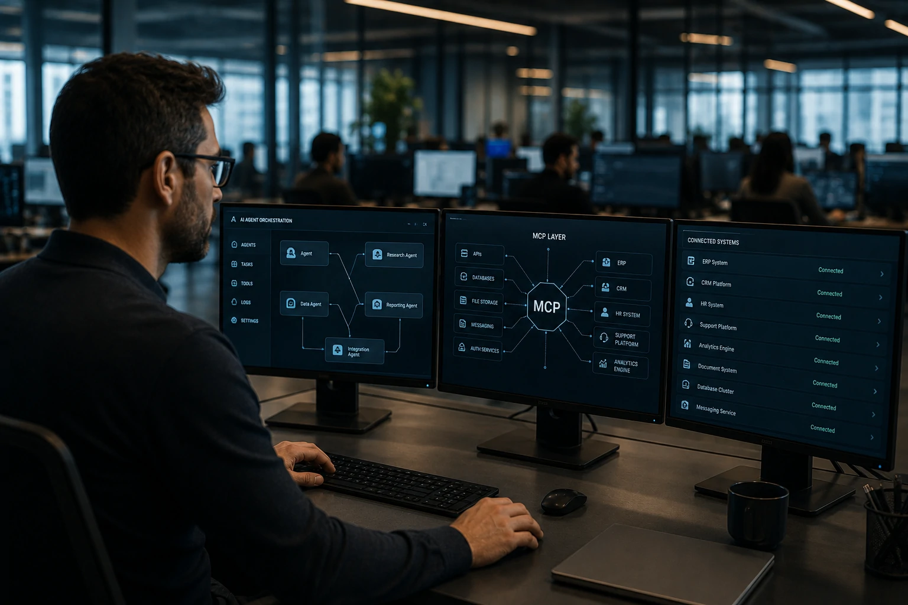

*Enquanto a disputa da inteligência artificial costuma ser apresentada como uma corrida entre modelos cada vez mais poderosos, uma transformação menos visível está acontecendo nos bastidores. Empresas descobriram que o verdadeiro desafio não é apenas criar agentes inteligentes, mas conectá-los de forma segura aos sistemas que movimentam o negócio.*

*É nesse contexto que o **Model Context Protocol (MCP)** começa a ganhar espaço. O protocolo está sendo visto por desenvolvedores, plataformas de IA e fornecedores corporativos como uma possível infraestrutura padrão para conectar agentes a ERPs, CRMs, bancos de dados, plataformas SaaS e sistemas internos.*

## O MCP surge como resposta ao principal gargalo dos agentes de IA

O **Model Context Protocol** é uma especificação criada para permitir que modelos de IA acessem ferramentas externas de forma padronizada.

Na prática, ele funciona como uma camada intermediária entre os agentes e os sistemas corporativos.

Hoje, muitas empresas precisam construir integrações específicas para cada aplicação utilizada por um agente.

Isso cria custos elevados, aumenta a complexidade operacional e dificulta a escalabilidade dos projetos.

### Por que o problema se tornou mais urgente?

A nova geração de agentes não apenas responde perguntas.

Eles executam tarefas.

Um agente pode consultar um CRM, acessar um ERP, atualizar um ticket de suporte, gerar relatórios financeiros e interagir com múltiplos sistemas simultaneamente.

Quanto maior o número de sistemas envolvidos, maior a complexidade das integrações.

### O crescimento dos agentes está acelerando a necessidade de padronização

O mercado já começou a perceber que a adoção em larga escala depende menos da qualidade do modelo e mais da capacidade de integração.

Por isso, a discussão sobre infraestrutura está ganhando relevância dentro das áreas de tecnologia corporativa.

O movimento lembra a evolução da internet corporativa, quando APIs se tornaram o padrão para comunicação entre aplicações.

## Empresas começam a tratar contexto como infraestrutura estratégica

O contexto está se tornando um dos ativos mais importantes da economia da inteligência artificial.

Sem acesso a informações atualizadas, mesmo os modelos mais avançados produzem respostas limitadas.

O MCP surge justamente para resolver esse desafio.

Ele cria uma forma estruturada para que agentes encontrem, consultem e utilizem informações corporativas em tempo real.

### O que muda na prática?

Empresas deixam de depender exclusivamente do conhecimento embutido no modelo.

Os agentes passam a operar utilizando dados corporativos atualizados.

Isso reduz alucinações, melhora precisão e amplia o valor de negócio das aplicações de IA.

### A relação entre MCP e Data Products

O avanço do MCP está diretamente ligado ao crescimento dos chamados Data Products.

Quanto mais organizados e governados forem os dados corporativos, maior será a eficiência dos agentes.

Esse movimento complementa tendências discutidas recentemente pelo mercado, como os [Data Products corporativos](https://noticiatech.com.br/negocios/ai-data-products-dados-corporativos-produtos-agentes-ia/) e os [Data Contracts para infraestrutura de IA](https://noticiatech.com.br/negocios/data-contracts-infraestrutura-dados-ia-empresas/).

## O mercado de software pode entrar em uma nova fase de padronização

O impacto potencial do MCP vai além da inteligência artificial.

Ele pode influenciar diretamente a arquitetura do software corporativo.

Historicamente, padrões tecnológicos criam ciclos de expansão de mercado.

APIs impulsionaram SaaS.

Containers aceleraram a computação em nuvem.

Agora, agentes inteligentes podem impulsionar uma nova camada de integração baseada em contexto.

### Oportunidade para fornecedores de software

Empresas que adaptarem suas plataformas para o novo ecossistema podem ganhar vantagem competitiva.

Aplicações preparadas para agentes tendem a oferecer integração mais rápida e experiências mais fluidas.

Isso vale para fornecedores de ERP, CRM, plataformas de colaboração e sistemas especializados.

### O nascimento da economia agentic

A chamada economia agentic depende da capacidade de agentes operarem sistemas reais.

Sem integração eficiente, os agentes permanecem limitados a tarefas superficiais.

O MCP surge justamente como uma tentativa de resolver esse gargalo estrutural.

## A próxima disputa da inteligência artificial pode acontecer na infraestrutura

A infraestrutura está se tornando tão importante quanto os modelos.

Empresas perceberam que não basta possuir agentes avançados.

É necessário garantir acesso seguro, governado e escalável ao conhecimento corporativo.

Por esse motivo, o debate sobre protocolos, integração e contexto está avançando rapidamente dentro do setor.

### Por que executivos devem acompanhar essa tendência?

O MCP ainda está em estágio inicial de adoção.

Mesmo assim, ele representa uma mudança importante na forma como empresas pensam a arquitetura da inteligência artificial.

Organizações que estão investindo em agentes autônomos precisam observar como esses padrões evoluem.

### O verdadeiro valor pode estar fora dos modelos

Nos próximos anos, a vantagem competitiva pode não vir apenas da escolha entre **OpenAI**, **Google**, **Anthropic** ou outros fornecedores.

A diferença poderá estar na capacidade de conectar esses modelos ao conhecimento interno da empresa.

Assim como APIs se tornaram invisíveis, mas indispensáveis para a economia digital, o **Model Context Protocol** pode seguir o mesmo caminho e se transformar na infraestrutura silenciosa que permitirá aos agentes de IA operar negócios inteiros.

---