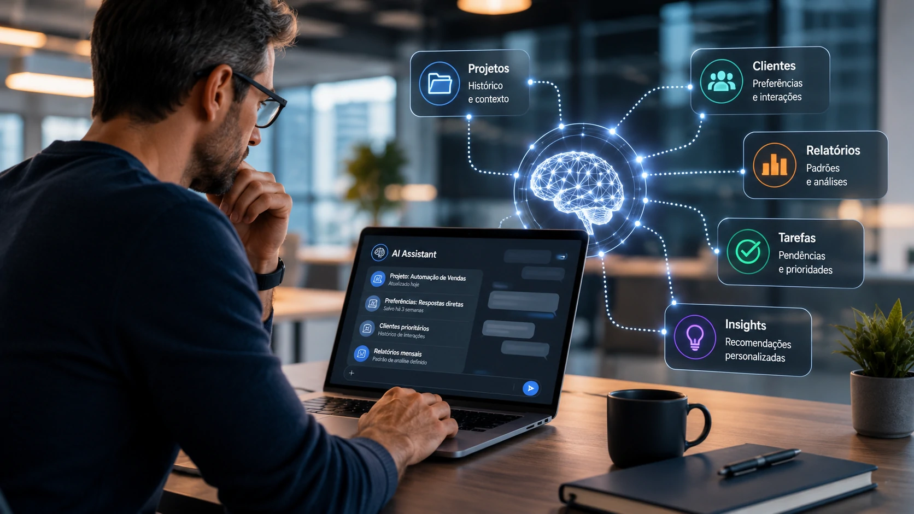
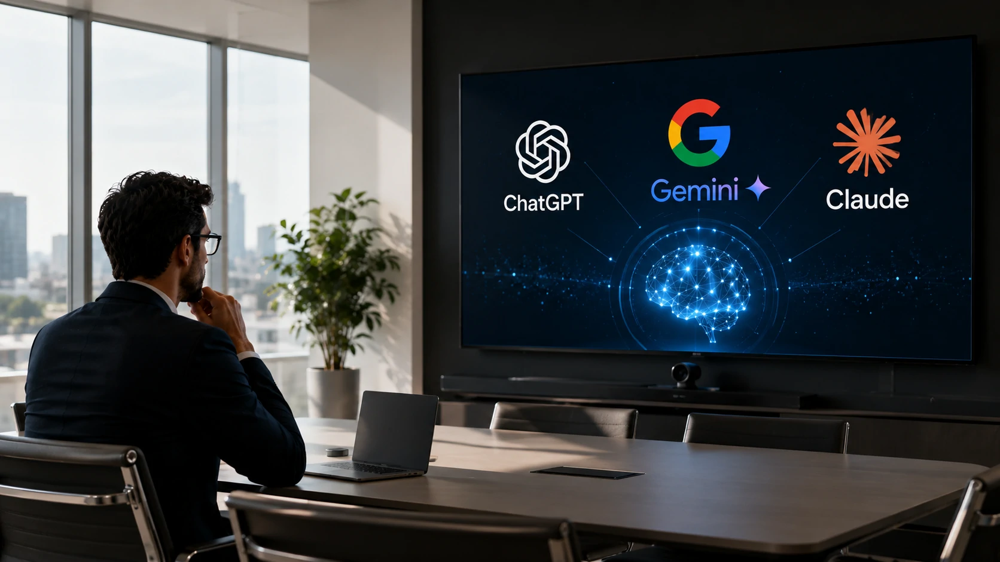

*Durante muito tempo, a corrida da inteligência artificial foi medida pela capacidade de responder perguntas com mais velocidade e precisão. Agora, uma nova disputa começa a ganhar protagonismo: qual plataforma consegue lembrar melhor do usuário e transformar esse conhecimento em produtividade para empresas.*

*Os avanços recentes de **ChatGPT**, **Gemini** e **Claude** mostram que a memória permanente deixou de ser apenas um recurso de conveniência. Ela começa a definir como agentes de IA trabalharão ao lado de profissionais, equipes e organizações nos próximos anos.*

## A memória permanente se tornou o novo diferencial competitivo da inteligência artificial

A disputa entre **OpenAI**, **Google** e **Anthropic** deixou de girar apenas em torno da qualidade dos modelos. A capacidade de construir relacionamento contínuo com o usuário passou a representar uma vantagem estratégica para todo o mercado.

Essa mudança aproxima os assistentes de IA do conceito de colaboradores digitais. Em vez de iniciar cada conversa do zero, eles conseguem recuperar informações relevantes sobre projetos, preferências e formas de trabalho, reduzindo o tempo gasto com explicações repetidas.

Para empresas, isso significa agentes capazes de oferecer respostas mais consistentes, automatizar tarefas com maior contexto e acelerar decisões operacionais sem depender exclusivamente da memória humana.

### Mais contexto significa mais produtividade

Quando uma IA conhece o histórico de um projeto, ela consegue produzir documentos, responder dúvidas e sugerir melhorias com muito menos intervenção do usuário.

Esse comportamento reforça a tendência apresentada no mercado de **AI Agents**, tema que o **Notícia Tech** já abordou em [Agentic AI Foundation: OpenAI, Anthropic e Block criam padrão para agentes de IA](https://noticiatech.com.br/inteligencia-artificial/agentic-ai-foundation-openai-anthropic-block-padrao-agentes-ia/).

### A disputa muda a forma de avaliar uma IA

Até pouco tempo, muitos usuários escolhiam uma plataforma apenas pela qualidade das respostas.

Agora entram novos critérios na decisão:

- capacidade de lembrar projetos;
- personalização contínua;
- adaptação ao usuário;
- integração com fluxos corporativos;
- aprendizado ao longo do tempo.

## Empresas passam a enxergar memória como investimento estratégico

*Memória persistente permite que agentes de IA acompanhem projetos e entreguem respostas cada vez mais contextualizadas.*

A memória permanente transforma a inteligência artificial em uma plataforma de conhecimento organizacional. Em vez de responder apenas perguntas isoladas, os modelos passam a compreender processos recorrentes e apoiar equipes durante meses ou anos.

Essa evolução pode reduzir custos operacionais, diminuir retrabalho e acelerar a implantação de agentes inteligentes em áreas como atendimento, marketing, vendas e desenvolvimento de software.

Além disso, empresas deixam de comparar apenas modelos de linguagem e começam a avaliar o ecossistema completo oferecido por cada fornecedor.

### O impacto vai além dos chats

A tendência é que a memória seja integrada a CRMs, plataformas de produtividade, ferramentas de automação e sistemas corporativos.

Isso fortalece uma tendência já discutida pelo **Notícia Tech** em [O que é AI Orchestration e por que ela está substituindo a disputa entre modelos de IA nas empresas](https://noticiatech.com.br/automacao/o-que-e-ai-orchestration-substitui-disputa-modelos-ia-empresas/).

### O desafio passa a ser confiança

Quanto mais informações uma IA armazena, maior também é a necessidade de governança.

Empresas precisarão definir quais dados podem ser memorizados, quem poderá acessá-los e como essas informações serão protegidas para atender requisitos de segurança, conformidade e privacidade.

## A próxima fase da corrida da IA será definida pela confiança e pela governança

*À medida que a memória permanente evolui, segurança, privacidade e governança passam a ser fatores decisivos para adoção corporativa.*

A evolução da memória permanente traz benefícios evidentes, mas também amplia a responsabilidade das empresas que desenvolvem modelos de inteligência artificial. Quanto mais informações uma plataforma consegue lembrar, maior é a necessidade de controles sobre armazenamento, acesso e exclusão desses dados.

Esse cenário coloca **OpenAI**, **Google** e **Anthropic** diante de um desafio que vai além da inovação tecnológica. A confiança dos clientes corporativos dependerá da transparência na utilização das informações e da capacidade de atender exigências regulatórias cada vez mais rigorosas.

Para organizações que trabalham com dados estratégicos, a escolha da plataforma deixará de considerar apenas qualidade das respostas ou preço da assinatura. Critérios como segurança, auditoria e governança passam a fazer parte do processo de decisão.

### Memória pode acelerar a adoção dos agentes de IA

A combinação entre memória persistente e agentes inteligentes cria um cenário no qual a IA deixa de executar tarefas isoladas para acompanhar processos completos.

Um agente capaz de lembrar políticas internas, clientes recorrentes e projetos em andamento pode atuar como um verdadeiro colaborador digital, reduzindo tempo de treinamento e aumentando a produtividade das equipes.

Essa transformação também fortalece o avanço dos **AI Employees**, tendência que deve ganhar ainda mais espaço nos próximos anos.

## A competição deixa de ser apenas entre modelos e passa a envolver ecossistemas completos

*A próxima geração da inteligência artificial será avaliada pela capacidade de compreender contexto, preservar conhecimento e apoiar decisões de negócios.*

O mercado começa a mostrar que responder perguntas rapidamente já não é suficiente para manter a liderança. O diferencial competitivo passa a ser a capacidade de construir relacionamentos contínuos com usuários e empresas.

Nesse contexto, recursos de memória permanente podem influenciar diretamente a adoção de plataformas corporativas, pois reduzem retrabalho, aumentam a personalização e tornam os agentes mais eficientes ao longo do tempo.

Embora cada empresa siga estratégias diferentes, todas caminham para um mesmo objetivo: transformar a inteligência artificial em uma plataforma capaz de compreender contexto, aprender continuamente e participar da rotina operacional das organizações.

Mais do que uma disputa entre **ChatGPT**, **Gemini** e **Claude**, essa nova fase indica uma mudança estrutural na indústria. O vencedor poderá não ser apenas quem possui o modelo mais poderoso, mas quem conseguir oferecer a combinação mais equilibrada entre inteligência, memória, segurança e confiança para o ambiente corporativo.

---