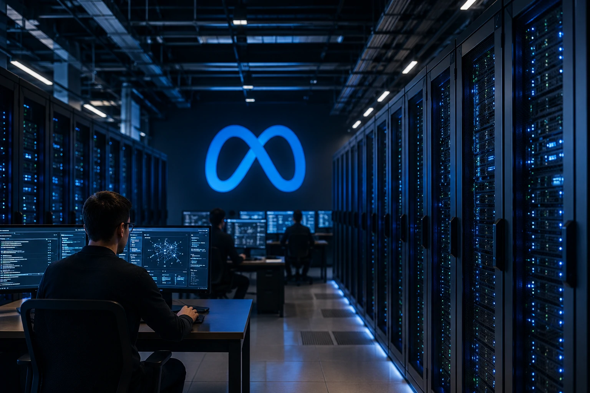
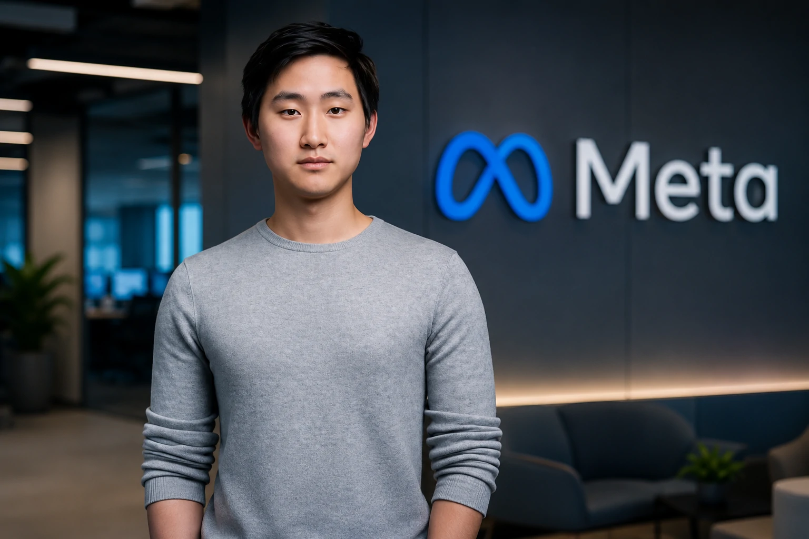
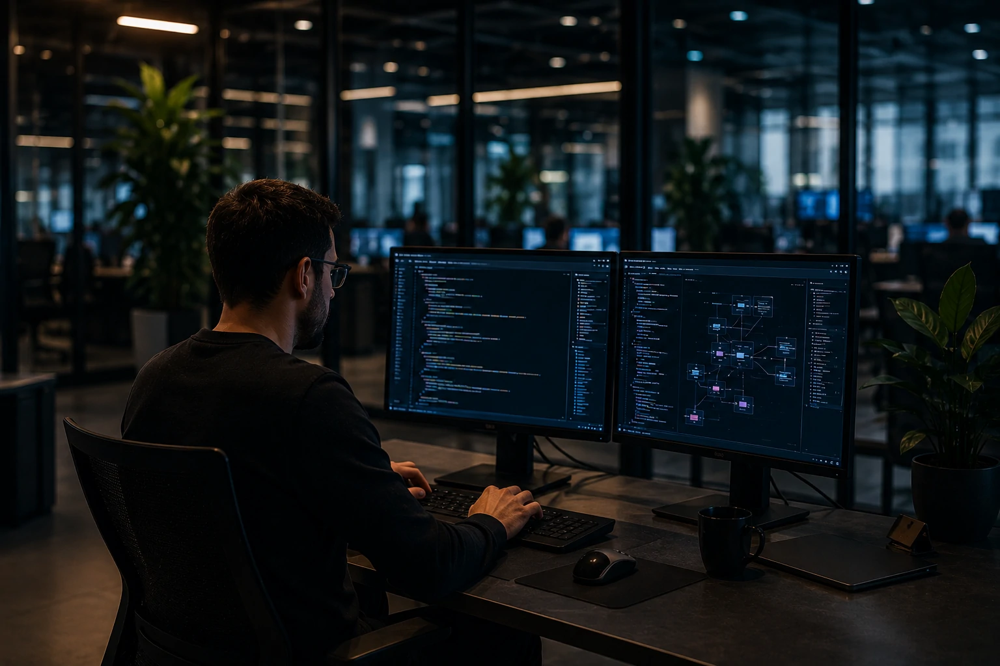

*O mercado de inteligência artificial entrou em uma nova fase. Depois de dois anos dominados pela disputa entre modelos de linguagem, as maiores empresas do setor começam a mostrar que a verdadeira vantagem competitiva pode estar em outro lugar: talentos, infraestrutura e capacidade operacional. Os movimentos recentes da **Meta** oferecem um retrato claro dessa transformação.*

## A nova estratégia da Meta vai além dos modelos de IA

A **Meta** está sinalizando que a próxima etapa da corrida pela inteligência artificial será definida pela capacidade de executar em escala, e não apenas pela qualidade dos modelos.

*Os investimentos em infraestrutura passaram a ser tão importantes quanto os próprios modelos de inteligência artificial.*

Nos últimos meses, a empresa liderada por **Mark Zuckerberg** acelerou investimentos em infraestrutura, reorganizou equipes internas e ampliou sua busca por especialistas em IA.

### O foco mudou da pesquisa para a execução

Durante a primeira onda da IA generativa, empresas como **OpenAI**, **Google** e **Anthropic** concentraram esforços em desenvolver modelos cada vez mais avançados.

Agora, a disputa começa a migrar para a capacidade de transformar esses modelos em plataformas amplamente utilizadas.

A mudança é estratégica porque modelos de linguagem estão se tornando mais acessíveis, enquanto dados, infraestrutura e talentos permanecem recursos escassos.

### O papel crescente da infraestrutura

Treinar e operar sistemas avançados exige investimentos bilionários.

Data centers, chips especializados, consumo energético e capacidade computacional passaram a representar barreiras de entrada cada vez maiores.

Essa tendência já foi observada em movimentos recentes da indústria, incluindo a expansão dos investimentos da **Anthropic** e a corrida global por novos centros de processamento de IA.

Para entender esse cenário, vale conferir a análise sobre a expansão da infraestrutura da Anthropic:

[Anthropic expande infraestrutura de IA com investimento bilionário](https://noticiatech.com.br/inteligencia-artificial/anthropic-expansao-35-bilhoes-infraestrutura-ia/)

## A contratação de Alexandr Wang revela a prioridade da Meta

A aproximação entre a **Meta** e **Alexandr Wang**, fundador da **Scale AI**, mostra que a disputa por talentos se tornou tão importante quanto a corrida tecnológica.

**Alexandr Wang** *é fundador e ex-CEO da Scale AI, empresa especializada em dados e infraestrutura para treinamento de modelos avançados de inteligência artificial. Considerado um dos empreendedores mais influentes da nova geração da IA, Wang ganhou destaque por transformar a Scale AI em uma peça estratégica para gigantes da tecnologia e projetos de inteligência artificial em larga escala. Sua aproximação com a Meta reforça a importância crescente de talentos, dados e infraestrutura na corrida pela próxima geração de sistemas de IA.*

A **Scale AI** construiu uma posição estratégica dentro do ecossistema de inteligência artificial ao atuar em avaliação, preparação de dados e suporte ao treinamento de modelos avançados.

### Por que talentos se tornaram ativos estratégicos

Historicamente, grandes empresas compravam tecnologia.

Agora, muitas delas estão buscando adquirir conhecimento, equipes e capacidade de execução.

Profissionais capazes de liderar projetos de IA em escala global tornaram-se recursos extremamente valiosos.

Essa mudança lembra movimentos anteriores observados na indústria de software, mas em uma escala muito maior.

### O valor dos dados continua crescendo

Mesmo com o avanço dos modelos, a qualidade dos dados permanece fundamental.

A capacidade de avaliar resultados, criar benchmarks e melhorar processos de treinamento se tornou um diferencial competitivo relevante.

Por isso, empresas ligadas à infraestrutura de dados passaram a ocupar posição estratégica dentro da cadeia de valor da IA.

## O impacto para empresas que utilizam inteligência artificial

A reorganização da **Meta** não afeta apenas concorrentes diretos. Ela também influencia empresas que estão adotando IA em suas operações.

*Empresas aceleram a adoção de agentes inteligentes para automação e produtividade.*

A competição entre gigantes da tecnologia tende a acelerar a chegada de novas soluções corporativas.

### Mais agentes de IA no ambiente empresarial

A tendência mais clara é a expansão dos agentes inteligentes.

Esses sistemas deixam de atuar apenas como assistentes conversacionais e passam a executar tarefas, integrar sistemas e automatizar processos.

Esse movimento já aparece em diferentes iniciativas do mercado.

Um exemplo é o crescimento do uso de protocolos como MCP para conectar agentes a ferramentas corporativas:

[Como funciona o MCP e por que ele está se tornando essencial para agentes de IA](https://noticiatech.com.br/inteligencia-artificial/como-funciona-mcp-guia-completo-agentes-ia/)

### A automação entra em uma nova fase

A primeira onda da IA ajudou profissionais a produzir conteúdo, resumir documentos e gerar informações.

A próxima fase busca automatizar fluxos completos.

Isso inclui atendimento, operações internas, análise de dados, vendas e suporte corporativo.

Para empresas brasileiras, essa mudança pode representar ganhos relevantes de produtividade nos próximos anos.

## O que essa disputa revela sobre o futuro da inteligência artificial

A principal mensagem deixada pelos movimentos recentes da **Meta** é que a corrida da IA está amadurecendo.

A discussão deixou de ser apenas sobre qual modelo responde melhor perguntas.

### A vantagem competitiva ficou mais complexa

O sucesso agora depende da combinação de diversos fatores:

- infraestrutura computacional;
- disponibilidade energética;
- talentos especializados;
- dados de qualidade;
- integração corporativa;
- capacidade de distribuição.

Empresas que dominarem apenas um desses elementos podem encontrar dificuldades para competir.

### A era da superinteligência exige escala

A busca por sistemas mais avançados está elevando os custos da indústria.

Ao mesmo tempo, cria oportunidades para empresas que conseguem fornecer componentes estratégicos da cadeia de valor.

Por isso, investidores, executivos e líderes de tecnologia passaram a acompanhar não apenas os lançamentos de modelos, mas também aquisições, contratações e investimentos em infraestrutura.

A reorganização da **Meta** mostra que a próxima fase da inteligência artificial poderá ser menos sobre algoritmos isolados e mais sobre a construção de ecossistemas completos. Quem conseguir combinar talentos, infraestrutura, dados e capacidade de execução terá mais chances de liderar uma indústria que se tornou um dos mercados mais estratégicos da economia digital.

---