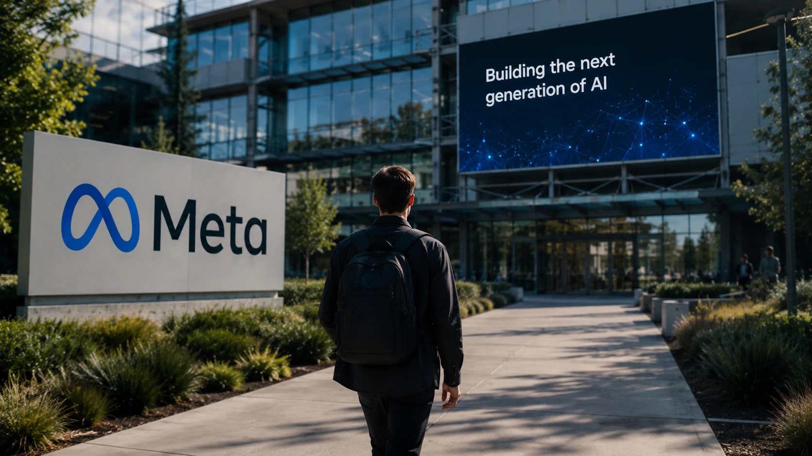
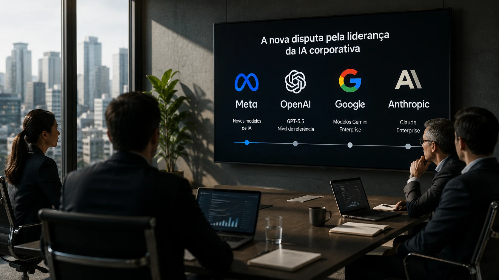
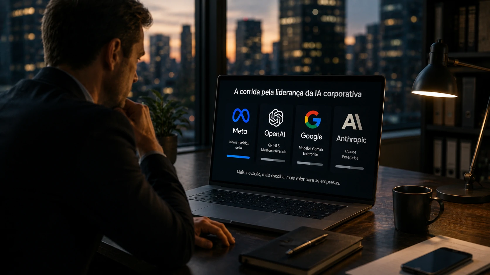

*Poucos meses atrás, a liderança da **OpenAI** parecia praticamente consolidada no mercado de inteligência artificial generativa. Agora, uma nova declaração da **Meta** sugere que essa vantagem pode estar diminuindo rapidamente. Mais do que uma disputa técnica, o movimento representa uma mudança estratégica que pode alterar investimentos, escolhas tecnológicas e o futuro da IA corporativa.*

## A Meta quer disputar a liderança da IA corporativa

A **Meta** deixou claro que seu objetivo deixou de ser apenas acompanhar a evolução da inteligência artificial. A empresa agora busca ocupar uma posição de liderança ao afirmar internamente que seus próximos modelos alcançaram um desempenho equivalente ao **GPT-5.5** em diversos testes.

*Meta acelera investimentos em infraestrutura e desenvolvimento de modelos para disputar a liderança da IA.*

Essa declaração ganha importância porque ocorre após uma série de investimentos bilionários em infraestrutura computacional, contratação de pesquisadores e expansão dos laboratórios dedicados à IA.

Em vez de competir apenas em redes sociais, a empresa pretende transformar seus modelos em uma plataforma para aplicações empresariais, desenvolvimento de agentes inteligentes e integração com produtos utilizados diariamente por milhões de pessoas.

### A estratégia mudou

Durante anos, a **Meta** apostou principalmente em modelos abertos.

Agora, o foco passa a incluir desempenho de ponta, capacidade de programação, raciocínio complexo e aplicações corporativas.

### O objetivo vai além dos benchmarks

Mais importante do que superar concorrentes em testes técnicos é conquistar empresas que buscam plataformas estáveis para desenvolver produtos baseados em IA.

Esse movimento aproxima a estratégia da Meta daquela seguida por **OpenAI**, **Google** e **Anthropic**.

## O investimento bilionário mostra que a disputa está apenas começando

A corrida atual deixou de ser apenas uma competição entre modelos de linguagem. Ela passou a envolver infraestrutura, chips, data centers, talentos e capacidade financeira.

Empresas que liderarem esses investimentos terão vantagem para lançar modelos mais rápidos, eficientes e especializados.

Isso explica por que praticamente todas as grandes empresas de tecnologia anunciaram expansão de capacidade computacional nos últimos meses.

Nesse cenário, a Meta busca recuperar o tempo perdido utilizando sua enorme capacidade financeira para acelerar o desenvolvimento de novos modelos.

O movimento também reforça uma tendência observada recentemente por outros participantes do mercado, como a **Mistral AI**, que passou a investir em uma estratégia de infraestrutura completa para competir em aplicações corporativas.

Para entender essa mudança de posicionamento, vale conferir a análise sobre a estratégia da empresa publicada anteriormente pelo Notícia Tech:

https://noticiatech.com.br/inteligencia-artificial/mistral-ai-estrategia-full-stack-infraestrutura-agentes-ia/

### Infraestrutura virou diferencial competitivo

Modelos cada vez maiores exigem poder computacional crescente.

Isso faz com que a disputa deixe de ser apenas algorítmica e passe também pela capacidade de construir data centers e adquirir GPUs de última geração.

### O mercado enterprise virou prioridade

Hoje, a maior parte da receita potencial está nas empresas.

É justamente nesse segmento que **Meta**, **OpenAI**, **Google** e **Anthropic** concentram seus principais investimentos.

## A concorrência entre Meta, OpenAI e Google beneficia as empresas

O fortalecimento da **Meta** amplia as opções para organizações que pretendem investir em **inteligência artificial**. Quanto mais empresas disputam a liderança, maior tende a ser o ritmo de inovação, a oferta de recursos e a redução do custo das soluções.

*O aumento da concorrência entre as grandes empresas acelera a inovação no mercado de IA corporativa.*

Esse cenário é especialmente relevante para empresas que ainda estão definindo qual plataforma utilizar em seus projetos de transformação digital.

Hoje, a decisão já não envolve apenas escolher entre um chatbot ou outro. Ela passa por aspectos como integração com sistemas internos, segurança dos dados, criação de agentes autônomos, custos de operação e disponibilidade de modelos especializados.

### A escolha da plataforma ficou mais estratégica

Nos próximos anos, muitas organizações deverão padronizar seus processos sobre uma ou duas plataformas de IA.

Essa decisão poderá impactar produtividade, custos operacionais e velocidade de inovação durante muitos anos.

Por isso, acompanhar a evolução dos principais fornecedores tornou-se parte da estratégia tecnológica das empresas.

### O mercado caminha para um novo equilíbrio

Até recentemente, a **OpenAI** aparecia como referência praticamente isolada em modelos de ponta.

Agora, **Meta**, **Google**, **Anthropic** e outras empresas começam a reduzir essa diferença, tornando o mercado mais competitivo e menos dependente de um único fornecedor.

Para quem está avaliando diferentes plataformas, o comparativo produzido pelo Notícia Tech ajuda a entender as principais diferenças entre as soluções disponíveis:

https://noticiatech.com.br/ferramentas/chatgpt-gemini-claude-comparativo-melhor-ia-2026/

## O que esperar da próxima fase da corrida pela IA

A disputa pela liderança da **inteligência artificial** deve se intensificar ainda mais nos próximos meses. O mercado caminha para uma fase em que velocidade de inovação, infraestrutura computacional e capacidade de entregar soluções empresariais serão fatores tão importantes quanto a qualidade dos modelos.

*A nova fase da corrida pela IA será definida por infraestrutura, agentes inteligentes e aplicações empresariais.*

Ao mesmo tempo, cresce a importância de aplicações voltadas para **agentes de IA**, automação empresarial, desenvolvimento de software e integração com sistemas corporativos.

Nesse contexto, declarações como a da **Meta** têm impacto que vai além do marketing institucional. Elas influenciam expectativas de investidores, decisões de tecnologia e estratégias de adoção por empresas de diversos setores.

### A liderança ainda não está definida

Embora a Meta afirme ter alcançado um nível comparável ao **GPT-5.5**, o mercado continuará acompanhando benchmarks independentes, adoção corporativa e resultados práticos antes de considerar qualquer mudança definitiva de liderança.

O desempenho em testes é apenas um dos fatores analisados pelas empresas.

### A corrida beneficia todo o ecossistema

Independentemente de qual empresa lidere o próximo ciclo da IA, o aumento da concorrência tende a acelerar a evolução tecnológica.

Mais investimentos significam modelos mais eficientes, ferramentas mais completas e maior oferta de soluções para organizações que desejam incorporar inteligência artificial aos seus processos.

Para gestores e profissionais de tecnologia, o principal aprendizado é que a competição deixou de ser apenas entre modelos de linguagem. Ela passou a envolver plataformas completas, infraestrutura global e ecossistemas capazes de sustentar a próxima geração de aplicações corporativas com IA.

---