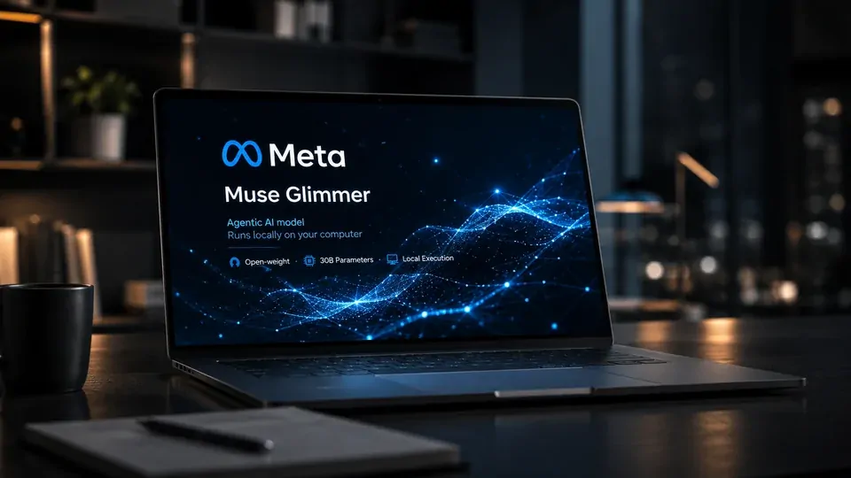
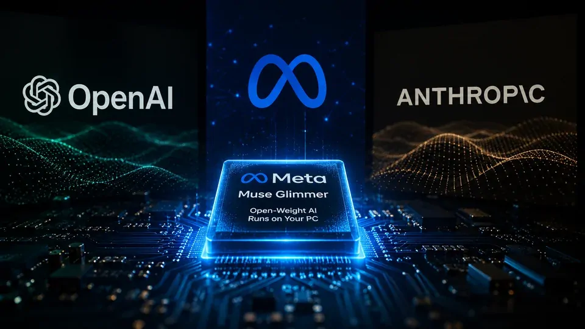
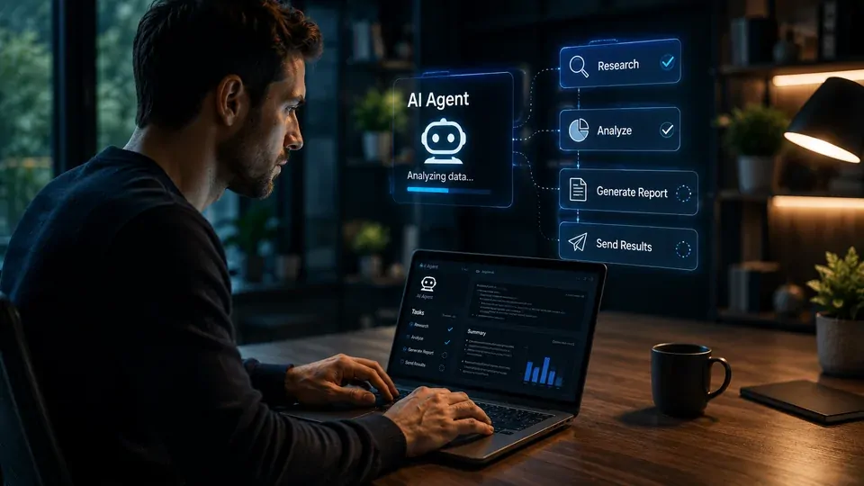

*Durante anos, a corrida da inteligência artificial foi definida por modelos cada vez maiores e por data centers capazes de processá-los em escala. O lançamento do **Muse Glimmer** pela **Meta** coloca uma nova variável nessa disputa: quanto da capacidade de IA precisa realmente continuar na nuvem?*

*O modelo chega em um momento no qual agentes de IA começam a executar tarefas mais complexas, enquanto empresas procuram reduzir custos, controlar dados e diminuir a dependência de poucos fornecedores. Se essa combinação funcionar, o computador pessoal pode voltar a ganhar importância na infraestrutura da inteligência artificial.*

## A Meta está levando agentes de IA para dentro do computador

O **Muse Glimmer** é um modelo de inteligência artificial de aproximadamente **30 bilhões de parâmetros**, desenvolvido pela **Meta** para tarefas agentic e execução local em computadores pessoais.

Parâmetros são os valores internos que um modelo aprende durante o treinamento para reconhecer padrões e produzir respostas. Quanto maior o modelo, em geral maior tende a ser a capacidade computacional necessária para executá-lo. O desafio da **Meta** foi colocar capacidades suficientes em um modelo que possa funcionar em hardware muito mais acessível.

A proposta é executar o **Muse Glimmer** em um **Mac ou PC com uma única GPU de consumo**. GPU é o processador especializado em operações matemáticas paralelas que se tornou fundamental para a inteligência artificial. Nesse caso, a Meta está tentando aproximar uma tecnologia que normalmente depende de data centers de uma máquina que uma empresa ou desenvolvedor pode ter localmente. :contentReference[oaicite:3]{index=3}

*O Muse Glimmer foi desenvolvido para aproximar capacidades agentic da infraestrutura de computadores pessoais.*

### O que significa executar a IA localmente?

Executar uma IA localmente significa que o modelo pode realizar o processamento diretamente no computador ou na infraestrutura controlada pelo usuário.

Em serviços tradicionais de IA, uma solicitação é enviada pela internet para servidores do provedor. Esses servidores executam a inferência, que é o processo de utilizar um modelo já treinado para gerar uma resposta ou realizar uma tarefa.

Com um modelo local, parte desse processamento acontece na própria máquina. Isso pode reduzir a dependência de uma conexão externa e permitir maior controle sobre os dados utilizados pela aplicação.

Para uma empresa, essa diferença pode ser relevante. Documentos internos, código, informações operacionais ou outros dados sensíveis podem, dependendo da implementação, permanecer dentro da infraestrutura da organização.

### Por que o foco em agentes é importante?

O **Muse Glimmer** não foi apresentado apenas como uma alternativa para conversar com um chatbot. A **Meta** posicionou o modelo para tarefas agentic.

Um agente de IA é um sistema capaz de interpretar um objetivo, planejar etapas e utilizar ferramentas ou executar ações para chegar ao resultado. Isso o diferencia de uma aplicação que apenas recebe uma pergunta e devolve uma resposta.

Essa mudança aumenta a importância da execução local. Um agente pode realizar várias operações durante uma única tarefa, e cada operação enviada para uma API externa pode representar custo, latência e dependência de infraestrutura de terceiros.

A Meta já vinha avançando nessa direção com o **Muse Spark**, sua família de modelos voltada para raciocínio, uso de ferramentas e fluxos agentic. O lançamento do Glimmer amplia essa estratégia para um modelo muito menor e direcionado à execução local. 

## O lançamento muda a estratégia da Meta na guerra contra OpenAI e Anthropic

O **Muse Glimmer** importa menos por tentar ser simplesmente "mais uma IA" e mais por representar uma escolha estratégica da **Meta**: distribuir capacidade de IA em vez de concentrá-la exclusivamente em serviços fechados.

A empresa lançou o modelo como **open-weight**, permitindo que desenvolvedores tenham acesso aos pesos do sistema e possam trabalhar com ele em sua própria infraestrutura, dentro dos termos da licença. Essa abordagem pode criar uma relação diferente entre o fornecedor do modelo e quem constrói aplicações sobre ele.

O movimento também acontece enquanto a **Meta**, a **OpenAI** e a **Anthropic** disputam diferentes partes do mercado de agentes. No caso da Meta, a execução local adiciona uma nova frente à competição: não basta ter um modelo capaz; é preciso decidir onde essa capacidade será processada.

### A disputa deixou de ser apenas sobre quem tem o maior modelo

A **OpenAI** e a **Anthropic** construíram posições fortes com modelos acessados principalmente por serviços de nuvem. A **Meta** está tentando explorar uma estratégia complementar baseada em modelos que podem chegar diretamente às máquinas dos desenvolvedores e usuários.

Isso pode parecer uma diferença técnica, mas possui consequências econômicas. Quando uma empresa depende de uma API para cada operação de IA, o custo acompanha o volume de utilização. Com um modelo local, parte do custo é transferida para o hardware e para a infraestrutura do próprio usuário.

O resultado pode ser uma nova divisão de tarefas: modelos maiores e mais caros permanecem na nuvem para trabalhos complexos, enquanto modelos menores executam localmente tarefas frequentes, privadas ou menos exigentes.

Essa lógica ajuda a entender por que o lançamento do **Muse Glimmer** acontece em paralelo a uma corrida cada vez maior por hardware. O Notícia Tech já analisou como a **Anthropic** está desenvolvendo chips próprios para reduzir sua dependência da infraestrutura tradicional de IA, mostrando que a competição está avançando para além dos modelos. **[Anthropic prepara chips próprios para o Claude e ameaça reduzir a dependência da Nvidia](https://noticiatech.com.br/inteligencia-artificial/anthropic-chips-proprios-claude-disputa-openai-nvidia/)**.

### A Meta também está entrando na disputa pelo lugar onde a IA será executada

A estratégia fica ainda mais clara quando observada junto aos movimentos de seus concorrentes.

A **OpenAI** também está avançando para o território dos dispositivos, em uma tentativa de aproximar o ChatGPT da experiência computacional cotidiana. O Notícia Tech já mostrou como a empresa entrou na disputa por hardware para a próxima geração de dispositivos baseados em IA. **[OpenAI entra na guerra do hardware e prepara nova geração de dispositivos para o ChatGPT](https://noticiatech.com.br/inteligencia-artificial/openai-guerra-hardware-dispositivos-chatgpt/)**.

A diferença é que o **Muse Glimmer** ataca o problema por outro caminho: em vez de criar primeiro um novo dispositivo, a **Meta** tenta colocar capacidade agentic diretamente no hardware que o usuário já possui.

Essa escolha pode acelerar a adoção porque elimina uma barreira importante. O usuário não precisa esperar por uma nova categoria de computador para experimentar uma IA local. Se tiver hardware compatível, a infraestrutura já está em suas mãos.

O movimento também reforça uma tendência que merece atenção nos próximos meses: a inteligência artificial pode começar a ser dividida entre **nuvem, computador pessoal e dispositivos especializados**, com cada ambiente executando o tipo de tarefa para o qual apresenta melhor relação entre custo, privacidade e desempenho.

## O lançamento muda a estratégia da Meta na guerra contra OpenAI e Anthropic

O **Muse Glimmer** importa menos por ser simplesmente mais um modelo de IA e mais por representar uma escolha estratégica da **Meta**: distribuir capacidade de inteligência artificial em uma infraestrutura mais ampla, em vez de concentrá-la exclusivamente em serviços fechados de nuvem.

A empresa lançou o modelo como **open-weight**, permitindo que desenvolvedores tenham acesso aos pesos do sistema e possam trabalhar com ele em sua própria infraestrutura, de acordo com os termos da licença. Essa abordagem cria uma relação diferente entre o fornecedor do modelo e quem desenvolve aplicações sobre ele.

O movimento acontece enquanto **Meta**, **OpenAI** e **Anthropic** disputam diferentes partes do mercado de agentes de IA. No caso da Meta, a execução local adiciona uma nova frente à competição: não basta ter um modelo capaz; também importa onde essa capacidade será processada.

*O Muse Glimmer coloca a estratégia open-weight da Meta em uma nova frente da disputa pela infraestrutura de inteligência artificial.*

### A disputa deixou de ser apenas sobre quem tem o maior modelo

A **OpenAI** e a **Anthropic** construíram posições fortes com modelos acessados principalmente por serviços de nuvem. A **Meta** está explorando uma estratégia complementar baseada em modelos que podem chegar diretamente às máquinas de desenvolvedores e usuários.

Isso pode parecer uma diferença técnica, mas possui consequências econômicas. Quando uma empresa depende de uma API para cada operação de IA, o custo acompanha o volume de utilização. Com um modelo local, parte desse custo passa para o hardware e para a infraestrutura do próprio usuário.

O resultado pode ser uma nova divisão de tarefas: modelos maiores permanecem na nuvem para trabalhos complexos, enquanto modelos menores executam localmente tarefas frequentes, privadas ou menos exigentes.

Essa lógica ajuda a entender por que o lançamento do **Muse Glimmer** acontece em paralelo a uma corrida cada vez maior por hardware. A **[Anthropic prepara chips próprios para o Claude e ameaça reduzir a dependência da Nvidia](https://noticiatech.com.br/inteligencia-artificial/anthropic-chips-proprios-claude-disputa-openai-nvidia/)** mostra como a competição pela inteligência artificial já está avançando para além dos modelos e chegando aos componentes que sustentam sua execução.

### A Meta também está entrando na disputa pelo lugar onde a IA será executada

A estratégia fica ainda mais clara quando observada junto aos movimentos dos concorrentes.

A **OpenAI** também está avançando para o território dos dispositivos, tentando aproximar o **ChatGPT** da experiência computacional cotidiana. O Notícia Tech já analisou esse movimento em [**OpenAI entra na guerra do hardware e prepara nova geração de dispositivos para o ChatGPT**](https://noticiatech.com.br/inteligencia-artificial/openai-guerra-hardware-dispositivos-chatgpt/).

A diferença é que o **Muse Glimmer** ataca o problema por outro caminho. Em vez de criar primeiro um novo dispositivo, a **Meta** tenta colocar capacidade agentic diretamente no hardware que o usuário já possui.

Essa escolha pode acelerar a adoção porque elimina uma barreira importante. O usuário não precisa esperar por uma nova categoria de computador para experimentar uma IA local. Se tiver hardware compatível, a infraestrutura já está em suas mãos.

O movimento também reforça uma tendência que merece atenção nos próximos meses: a inteligência artificial pode começar a ser dividida entre **nuvem, computador pessoal e dispositivos especializados**, com cada ambiente executando o tipo de tarefa para o qual apresenta melhor relação entre custo, privacidade e desempenho.

## A execução local pode mudar a economia da inteligência artificial

A execução local pode mudar a economia da inteligência artificial porque transfere parte do processamento dos servidores das grandes empresas para o hardware do próprio usuário. Isso não elimina o custo da IA, mas muda quem fornece a capacidade computacional necessária para cada tarefa.

Quando uma empresa utiliza uma API de inteligência artificial, normalmente paga pelo uso do serviço, enquanto o provedor mantém os servidores, GPUs e infraestrutura necessários para executar o modelo. Com um modelo local como o **Muse Glimmer**, parte desse custo passa para a máquina que executa o sistema.

Essa diferença pode se tornar importante quando agentes começam a trabalhar continuamente. Um agente que precisa analisar informações, escrever código, consultar arquivos e verificar resultados pode realizar muitas operações durante uma única tarefa. Se todas dependerem de serviços externos, custo e latência podem aumentar conforme o volume de utilização.

*Modelos locais podem transferir parte do processamento da nuvem para computadores controlados pelo usuário ou pela empresa.*

### O que a empresa ganha ao processar dados localmente?

O primeiro benefício potencial é o controle. Quando uma aplicação é executada dentro da infraestrutura da empresa, determinadas informações não precisam necessariamente ser enviadas para um provedor externo.

Isso pode ser interessante para organizações que trabalham com documentos internos, código proprietário, informações financeiras ou outros dados que exigem políticas específicas de segurança.

A execução local não torna automaticamente uma aplicação mais segura. A proteção depende da implementação, das permissões concedidas ao agente, do modelo utilizado e da segurança do próprio dispositivo.

O segundo benefício é a possibilidade de controlar parte da estrutura de custos. Uma empresa pode dimensionar o hardware necessário para suas aplicações em vez de depender exclusivamente do preço e das condições comerciais de uma API.

### O custo simplesmente muda de lugar

Existe, porém, um ponto importante: **IA local não significa IA gratuita**.

Uma empresa que deixa de pagar determinadas chamadas de API pode precisar investir em GPUs, memória, armazenamento, energia, manutenção e profissionais capazes de administrar a infraestrutura.

Por isso, a comparação correta não é entre "nuvem" e "gratuito". É entre o custo total de executar a inferência na nuvem e o custo total de manter a execução local.

O resultado dependerá do volume de tarefas, do preço do hardware, do desempenho necessário e da capacidade do modelo de concluir o trabalho com poucas intervenções humanas.

## O Muse Glimmer pode acelerar a adoção de agentes que ficam sempre ativos

O **Muse Glimmer** foi desenvolvido para fluxos agentic locais, o que torna o lançamento mais relevante do que simplesmente disponibilizar outro modelo open-weight.

Um agente de IA pode interpretar um objetivo, dividir o trabalho em etapas e utilizar ferramentas para executar ações. Quando esse processo acontece diretamente no computador, a IA pode se aproximar de uma camada operacional do ambiente de trabalho.

Isso muda a relação entre usuário e inteligência artificial. Em vez de abrir um chatbot para cada tarefa, o profissional pode delegar um objetivo e permitir que o agente execute uma sequência de ações autorizadas.

### O agente local é diferente de um chatbot tradicional

Um chatbot tradicional depende principalmente da interação direta com o usuário. A pessoa pergunta, recebe uma resposta e decide o próximo passo.

Um agente trabalha com uma lógica diferente. Ele recebe um objetivo e pode dividir esse objetivo em várias ações, utilizando ferramentas e verificando resultados ao longo do processo.

Por exemplo, um profissional poderia pedir que um agente analisasse uma série de arquivos, identificasse informações relevantes e organizasse os resultados. O valor não estaria apenas na resposta produzida pelo modelo, mas na capacidade de executar o fluxo inteiro.

É justamente nesse ponto que a execução local pode ganhar importância. Um agente que permanece ativo durante longos períodos pode gerar muitas interações com o modelo. Executar parte desse processo no próprio computador pode reduzir a dependência de chamadas externas.

### O hardware passa a fazer parte da estratégia de IA

A exigência de uma GPU capaz de executar o **Muse Glimmer** também mostra que a evolução da inteligência artificial está aproximando software e hardware.

Durante a primeira fase da corrida generativa, o usuário precisava principalmente de uma conexão com a internet. O processamento pesado acontecia nos data centers das empresas.

Agora, modelos menores e mais eficientes permitem colocar uma parcela maior da capacidade computacional diretamente no dispositivo. A **Meta** está tentando explorar justamente essa oportunidade com um modelo que pode ser executado em uma única GPU de consumo.

Isso pode favorecer fabricantes de computadores e GPUs capazes de oferecer mais memória e capacidade de processamento local, além de criar uma nova demanda por máquinas preparadas para executar agentes.

## Empresas podem começar a dividir tarefas entre IA local e nuvem

Empresas podem começar a dividir suas cargas de trabalho entre modelos locais e serviços de nuvem porque cada ambiente possui vantagens diferentes.

Uma aplicação pode executar localmente tarefas simples, frequentes ou sensíveis e enviar para a nuvem apenas aquilo que exige modelos maiores. Essa arquitetura híbrida permite distribuir o processamento de acordo com custo, privacidade, velocidade e capacidade.

Para empresas que já utilizam múltiplos sistemas de IA, essa possibilidade também pode reduzir a dependência de um único fornecedor.

### O que muda para profissionais?

Para profissionais, o principal efeito pode ser o aumento da quantidade de tarefas que conseguem delegar a agentes diretamente no computador.

Um programador pode utilizar um modelo local para determinadas tarefas de código sem precisar enviar cada arquivo para um serviço externo. Um analista pode trabalhar com determinados documentos internamente. Um profissional de operações pode automatizar rotinas que exigem acesso contínuo aos arquivos e aplicações do próprio computador.

O ganho não está apenas na geração de texto. Está na possibilidade de transformar a IA em uma camada de execução dentro do ambiente de trabalho.

### O que muda para usuários comuns?

Para usuários comuns, a mudança tende a aparecer primeiro em recursos integrados aos próprios computadores.

Assistentes capazes de analisar arquivos, organizar informações, executar comandos e realizar tarefas sem enviar cada etapa para a nuvem podem se tornar mais comuns à medida que o hardware local evolui.

Isso também pode mudar a percepção sobre privacidade. Em vez de perguntar apenas "qual IA é melhor?", o usuário poderá começar a perguntar **onde minha informação será processada?**

Essa questão tende a ganhar importância conforme agentes passam a ter acesso a mais arquivos, aplicativos e funções do computador.

## A próxima disputa pode ser por quem controla a camada de execução

A próxima fase da corrida da IA pode ser definida menos pela existência de um único modelo dominante e mais pela disputa sobre onde a inteligência artificial será executada.

A **OpenAI**, a **Anthropic**, a **Google** e a **Meta** estão avançando em diferentes partes dessa cadeia. Enquanto algumas empresas concentram esforços em modelos e serviços de nuvem, outras também investem em hardware, chips, agentes e dispositivos.

O **Muse Glimmer** adiciona uma peça importante a esse cenário porque transforma o computador pessoal em parte da infraestrutura de IA.

### O mercado pode caminhar para uma arquitetura híbrida

A tendência mais provável não é o desaparecimento da nuvem.

Modelos de fronteira continuarão sendo importantes para tarefas que exigem enorme capacidade computacional, enquanto modelos locais podem assumir trabalhos mais frequentes, privados e específicos.

O resultado pode ser uma arquitetura híbrida na qual o usuário nem precise saber exatamente qual modelo está sendo utilizado. O sistema poderá escolher automaticamente entre uma IA local e uma IA hospedada de acordo com a complexidade da tarefa.

Essa mudança pode ser especialmente relevante para empresas porque transforma a escolha de modelos em uma decisão de infraestrutura, e não apenas de software.

### A vantagem da Meta está na distribuição

Se a estratégia funcionar, a **Meta** poderá ganhar espaço mesmo sem controlar todas as aplicações criadas com o **Muse Glimmer**.

Cada desenvolvedor que instalar o modelo, cada ferramenta que oferecer suporte e cada aplicação que incorporar sua execução local pode ampliar a presença da tecnologia no ecossistema.

É uma estratégia diferente de simplesmente convencer o usuário a abrir mais um chatbot.

A **Meta** está tentando fazer com que seu modelo esteja presente no próprio ambiente onde o trabalho acontece.

E esse pode ser o ponto mais importante do lançamento: a inteligência artificial começa a deixar de ser apenas um serviço acessado pela internet e passa a se tornar parte da infraestrutura do computador. Se modelos locais continuarem ficando menores, mais eficientes e mais capazes, a próxima disputa entre **Meta**, **OpenAI** e **Anthropic** poderá acontecer não apenas pela melhor resposta, mas pelo controle sobre **onde a IA executa o trabalho**.

---