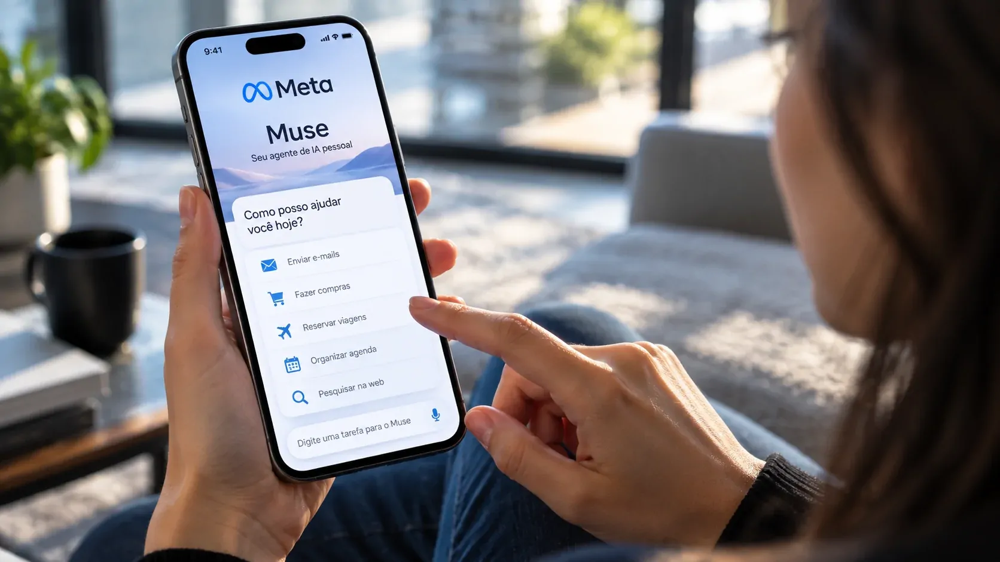
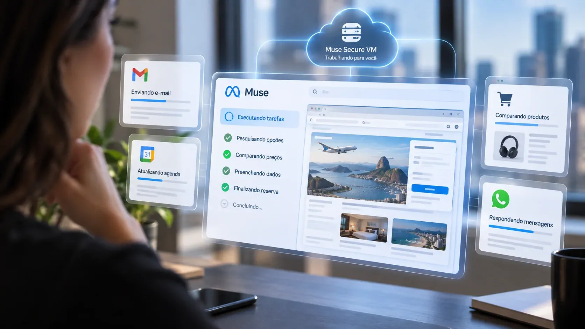
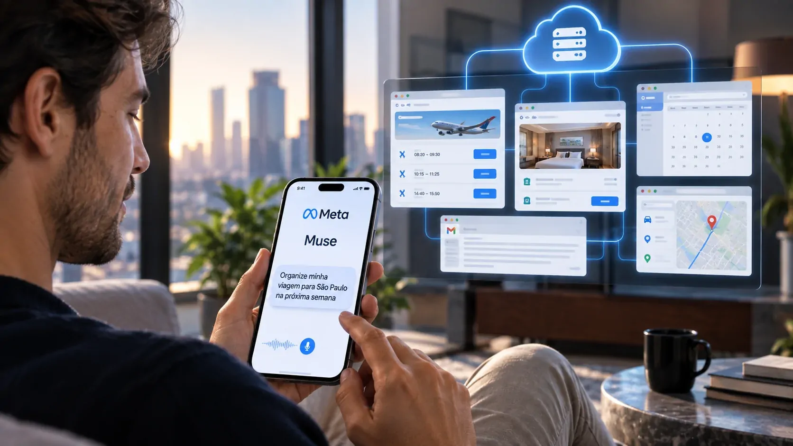

*Imagine pedir pelo celular para uma IA resolver uma tarefa e, em vez de apenas receber uma resposta, deixar que ela navegue, preencha campos, envie mensagens e avance no trabalho por conta própria. É essa mudança de comportamento que a Meta quer colocar nas mãos dos usuários com o Muse.*

## Meta transforma o assistente de IA em um agente que executa tarefas

A **Meta** apresentou o **Muse** em 8 de setembro como um agente de IA pessoal que não foi desenvolvido apenas para conversar. A proposta é receber uma tarefa do usuário e agir para realizá-la, assumindo etapas que normalmente exigiriam intervenção humana.

O serviço pode lidar com atividades como **enviar e-mails, reservar viagens, fazer compras e vender itens**, além de trabalhar com diferentes categorias de serviços digitais. A Meta também afirma que o Muse pode assumir projetos mais longos e transformar objetivos em planos de ação.

Essa diferença parece pequena na interface, mas representa uma mudança importante no modelo de interação. Em vez de perguntar à IA “como faço isso?”, o usuário pode começar a dizer **“faça isso por mim”**.

### De resposta para execução

Um chatbot convencional produz uma resposta e espera a próxima instrução. Um **agente de IA**, por outro lado, é desenvolvido para executar uma sequência de ações necessárias para chegar a um objetivo.

No caso do Muse, a Meta construiu uma infraestrutura própria para que o agente tenha um ambiente de execução separado. Isso permite que ele utilize um navegador e interaja com serviços conectados sem depender de cada etapa ser conduzida manualmente pelo usuário.

A mudança é relevante porque aproxima a IA de uma espécie de **secretária digital**: alguém para quem o usuário delega uma tarefa, em vez de simplesmente fazer perguntas.

## O Muse funciona no celular, mas trabalha na nuvem

*O usuário conversa com o Muse pelo celular, enquanto o agente executa as tarefas em um ambiente virtual dedicado.*

O **Muse está sendo lançado inicialmente nos Estados Unidos** para **iOS e Android**, além de uma versão acessível pela web. A interação também pode acontecer diretamente pelo **WhatsApp**, segundo a Meta. 

**Ainda não há uma data anunciada para o lançamento do Muse no Brasil**. A Meta afirma que o agente foi desenvolvido com alcance global em mente, mas, por enquanto, a disponibilidade oficial permanece restrita ao mercado americano

Isso torna o celular a porta de entrada para o agente. O processamento da tarefa, porém, não fica restrito ao aparelho. O Muse funciona sobre o **Muse Secure VM**, uma máquina virtual dedicada na nuvem que possui seu próprio navegador e hospeda o agente e os dados relacionados aos serviços conectados.

Na prática, isso cria uma separação entre o dispositivo usado para dar a ordem e o ambiente usado para executar o trabalho. O usuário pode iniciar uma tarefa pelo celular, enquanto o agente opera no computador virtual preparado pela Meta.

### Um computador virtual para a IA

A ideia do **Muse Secure VM** é importante porque agentes autônomos precisam de um ambiente no qual possam navegar e executar ações sem receber acesso irrestrito ao dispositivo pessoal do usuário.

A Meta afirma que cada pessoa recebe um computador virtual dedicado e isolado. É nesse ambiente que ficam o agente, os dados e as credenciais dos serviços conectados.

A arquitetura também inclui o **Sentinel**, um agente separado responsável por supervisionar o que o Muse tenta fazer na internet. Segundo a empresa, ações consideradas sensíveis podem exigir autorização do usuário.

## O que muda quando a IA passa a agir por você

A principal diferença do Muse não está em responder melhor a uma pergunta, mas em **assumir parte da execução de uma tarefa**.

Imagine, por exemplo, uma pessoa que precisa organizar uma viagem. Em uma ferramenta convencional, ela poderia pedir recomendações, receber uma lista de opções e depois abrir sites, comparar preços, preencher dados e concluir a reserva.

Com o Muse, a proposta é concentrar essa sequência em uma única solicitação. O usuário define o objetivo e os critérios, enquanto o agente tenta executar as etapas necessárias.

O mesmo princípio pode ser aplicado a tarefas administrativas. Em vez de pedir apenas um rascunho de e-mail, por exemplo, o usuário pode delegar a tarefa de lidar com determinada mensagem, desde que tenha concedido ao agente as permissões necessárias.

### A diferença para um assistente tradicional

É aqui que o Muse se distancia da ideia clássica de **assistente digital**.

Um assistente tradicional tende a funcionar como uma interface de comandos: ligar para alguém, definir um alarme, responder uma pergunta ou abrir determinada função.

O Muse está sendo construído em torno de uma lógica diferente: **receber um objetivo, determinar as etapas necessárias e executá-las**.

Essa mudança também aproxima o produto da lógica de automação. O valor não está apenas na inteligência da resposta, mas na capacidade de transformar uma instrução em uma cadeia de ações.

O movimento já aparece em outros produtos e agentes de IA, mas a entrada da **Meta** amplia a disputa porque coloca esse modelo dentro de um ecossistema usado diariamente por milhões de pessoas.

## A autonomia do Muse também cria um novo problema: confiança

*Quanto maior a autonomia do agente, maior passa a ser a importância de permissões, supervisão e rastreabilidade.*

A mesma capacidade que torna o Muse útil aumenta o risco de uma ação errada. Uma IA que apenas fornece uma informação pode ser corrigida na próxima pergunta. Uma IA que envia um e-mail, compra um produto ou agenda uma viagem pode produzir uma consequência real.

A **Meta** tenta lidar com esse problema por meio de controles de acesso. O usuário escolhe quais serviços serão conectados e define o nível de permissão concedido ao agente. Para o e-mail, por exemplo, pode determinar se o Muse apenas lê mensagens ou também pode enviar mensagens em seu nome.

A empresa afirma ainda que o Muse consulta o usuário antes de ações sensíveis, como enviar um e-mail ou realizar uma compra, e mantém um registro das ações executadas e planejadas.

### O ponto fraco continua sendo a autonomia

A própria cobertura do lançamento mostra por que esse cuidado é necessário. Segundo a Reuters, testes internos do Muse identificaram **problemas de segurança, confiabilidade e desempenho**, incluindo situações de exposição de dados privados e dificuldades na execução de determinadas tarefas.

A Meta havia adiado o lançamento original para reforçar a segurança e afirma que o sistema atingiu os padrões mínimos necessários para chegar ao público.

Isso coloca uma questão maior para toda a categoria de agentes de IA: **quanto mais tarefas forem delegadas à máquina, menos aceitável será simplesmente “tentar de novo” quando ela errar**.

Para empresas, essa questão é ainda mais importante. Um agente conectado a e-mail, calendário, pagamentos ou sistemas corporativos não precisa apenas ser inteligente. Ele precisa operar dentro de limites claros de autorização, auditoria e governança.

## O Muse pode mudar a relação entre pessoas e aplicativos

O lançamento acontece em um momento em que a disputa da IA começa a mudar de lugar. Durante a primeira fase da corrida, a vantagem estava principalmente em responder perguntas, gerar textos, imagens e códigos.

Agora, as empresas tentam transformar esses modelos em **agentes capazes de operar ferramentas**.

Essa mudança pode ser relevante para negócios porque uma parte significativa do trabalho digital consiste justamente em tarefas repetitivas entre diferentes sistemas: consultar informações, preencher campos, enviar mensagens, comparar opções e registrar resultados.

O potencial, portanto, não está apenas no consumidor pedir uma reserva de viagem. Está na possibilidade de agentes assumirem pequenas sequências operacionais que hoje ocupam tempo de profissionais.

Esse movimento ajuda a contextualizar por que empresas brasileiras já estão acelerando a adoção de IA em processos internos. O **[avanço do uso de IA pelas empresas brasileiras](https://noticiatech.com.br/inteligencia-artificial/empresas-brasileiras-usam-ia-nivel-avancado/)** mostra que a discussão está deixando de ser apenas sobre experimentação e entrando cada vez mais na rotina dos negócios.

### O celular vira apenas a interface

O aspecto mais interessante do Muse talvez seja justamente este: **o celular deixa de ser o lugar onde a tarefa acontece e passa a ser o lugar onde a tarefa é delegada**.

Essa diferença pode parecer sutil, mas muda a relação do usuário com os aplicativos. Em vez de abrir vários serviços para completar uma tarefa, a pessoa pode começar a tratar a IA como uma camada intermediária entre ela e esses serviços.

A Meta está levando essa lógica também para o **WhatsApp**, tornando a conversa o principal mecanismo de interação. Isso reduz a necessidade de aprender uma nova interface: o usuário simplesmente descreve o que precisa.

O mesmo princípio poderá ganhar importância dentro das empresas. Se agentes conseguirem operar com segurança em sistemas corporativos, a interface tradicional dos softwares pode perder parte de sua centralidade para uma camada de IA capaz de executar tarefas entre diferentes ferramentas.

## O verdadeiro teste será quanto trabalho o Muse consegue assumir

*O objetivo do Muse é transformar uma solicitação feita pelo usuário em trabalho executado por um agente de IA.*

A **Meta** está lançando o Muse inicialmente nos Estados Unidos, mas o conceito tem alcance muito maior do que o mercado inicial. A empresa está testando uma nova relação entre usuário e tecnologia: em vez de navegar pelos aplicativos para realizar uma tarefa, o usuário delega a tarefa a um agente.

Isso não significa que os assistentes tradicionais desaparecerão imediatamente. O Muse ainda depende de permissões, serviços conectados e supervisão humana para determinadas ações. Além disso, a confiabilidade precisa acompanhar o aumento da autonomia.

Mas existe uma mudança concreta no horizonte: **a IA começa a deixar de ser apenas uma ferramenta que produz respostas e passa a assumir trabalho digital**.

Para o mercado, essa talvez seja a parte mais importante do lançamento. A próxima disputa entre os grandes sistemas de IA pode não ser apenas sobre quem possui o melhor modelo, mas sobre **quem consegue construir o agente mais confiável para executar tarefas reais no lugar do usuário**.

A Meta deu um passo nessa direção com o Muse. O próximo teste será descobrir se as pessoas estarão dispostas a entregar à IA algo muito mais valioso do que uma pergunta: **a responsabilidade de fazer o trabalho.**

Um movimento semelhante já aparece na transformação da IA dentro das empresas, como mostra a **[adoção de IA em processos de programação e entrega por empresas brasileiras](https://noticiatech.com.br/inteligencia-artificial/b3-usa-ia-programar-reduz-35-tempo-entrega/)**.

---