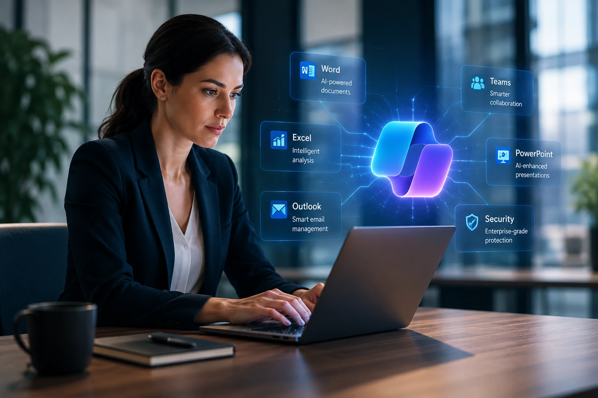
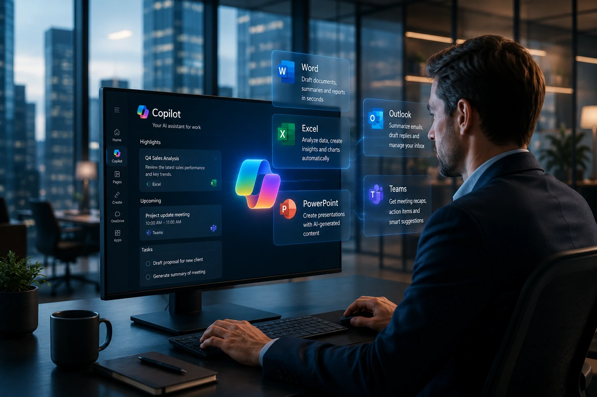
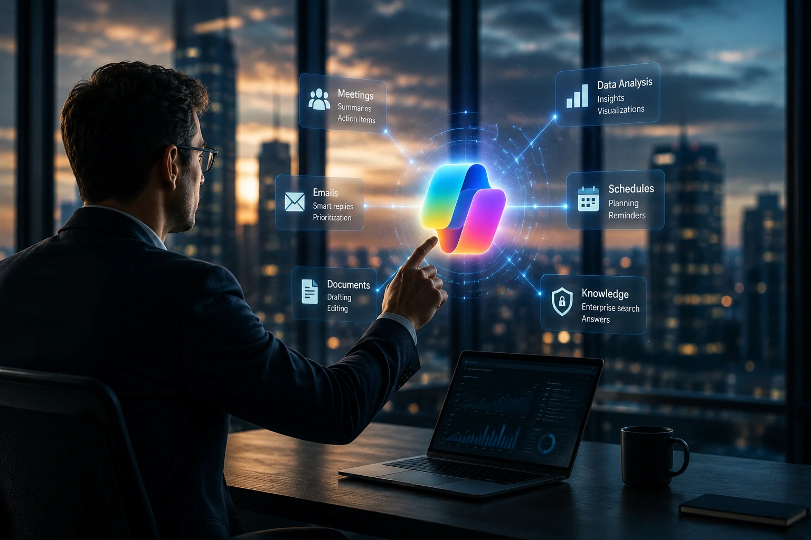

*Enquanto muitas empresas continuam anunciando modelos cada vez maiores, a **Microsoft** escolheu outro caminho: transformar a inteligência artificial em uma ferramenta invisível dentro do ambiente de trabalho. A adoção do **GPT-5.6** como modelo padrão do **Microsoft 365 Copilot** reforça uma disputa que já não acontece apenas entre laboratórios de IA, mas entre ecossistemas completos de produtividade.*

## Microsoft transforma o Copilot em uma plataforma ainda mais estratégica

*O GPT-5.6 amplia o papel do Copilot como interface principal para produtividade baseada em IA.*

A decisão da **Microsoft** representa mais do que uma atualização técnica. Ela reforça uma estratégia iniciada ainda com a parceria entre a empresa e a **OpenAI**, que busca incorporar inteligência artificial diretamente às ferramentas utilizadas diariamente por milhões de profissionais.

Ao utilizar o **GPT-5.6** como principal motor do **Microsoft 365 Copilot**, a companhia aumenta sua capacidade de entregar respostas mais consistentes, compreender contextos complexos e executar tarefas corporativas de forma integrada.

### O foco deixa de ser apenas o modelo

Durante os últimos anos, a indústria concentrou atenção na corrida pelos modelos mais poderosos. Agora, o diferencial competitivo passa a ser a experiência completa oferecida ao usuário.

### IA integrada ao fluxo de trabalho

Em vez de exigir que colaboradores utilizem aplicações separadas, a Microsoft aposta na IA incorporada ao **Word**, **Excel**, **PowerPoint**, **Outlook** e **Teams**, reduzindo atritos na adoção corporativa.

Esse movimento complementa a estratégia observada em outras iniciativas recentes envolvendo agentes inteligentes e produtividade empresarial, tema já explorado pelo Notícia Tech em:

[Por que o ChatGPT Work marca o início da era dos agentes de IA na produtividade corporativa](https://noticiatech.com.br/inteligencia-artificial/por-que-o-chatgpt-work-marca-o-inicio-da-era-dos-agentes-de-ia-na-produtividade-corporativa/).

## A disputa pela IA corporativa entra em uma nova fase

A atualização também muda a dinâmica da competição entre **Microsoft**, **Google**, **OpenAI** e **Anthropic**.

Até pouco tempo, o principal argumento comercial era anunciar modelos maiores, mais rápidos ou com melhores benchmarks. Agora, o mercado começa a avaliar quem consegue transformar esses avanços em ganhos reais de produtividade.

### Ecossistema vale mais que benchmark

Uma empresa dificilmente troca todo seu ambiente tecnológico apenas porque outro modelo apresenta desempenho ligeiramente superior em testes.

Por isso, integrar IA ao ambiente de trabalho tende a gerar muito mais valor do que lançar modelos isolados.

### O verdadeiro diferencial competitivo

A vantagem passa a estar na capacidade de conectar documentos, reuniões, e-mails, calendários e bases de conhecimento em uma única experiência inteligente.

Nesse cenário, plataformas completas tendem a ganhar espaço sobre soluções fragmentadas.

## A integração pode redefinir o mercado de software empresarial

*O Copilot deixa de ser apenas um assistente e passa a ocupar posição estratégica dentro da operação das empresas.*

A evolução do **Microsoft 365 Copilot** reforça uma tendência importante do mercado: a inteligência artificial está deixando de ser uma funcionalidade complementar para se tornar parte da infraestrutura de software corporativo.

À medida que modelos mais avançados são incorporados aos produtos existentes, empresas passam a depender menos de ferramentas isoladas e mais de plataformas capazes de conectar informações distribuídas em diferentes aplicações.

### Mais automação dentro do Microsoft 365

A utilização do **GPT-5.6** tende a ampliar tarefas que antes exigiam intervenção humana constante.

Entre elas estão:

- elaboração de relatórios;
- criação de apresentações;
- análise de planilhas;
- organização de reuniões;
- respostas a e-mails;
- geração de resumos executivos.

O resultado esperado é uma redução do tempo gasto em atividades operacionais e maior foco em decisões estratégicas.

### A competição deixa de ser tecnológica e passa a ser de produtividade

Empresas não escolhem apenas o modelo de IA mais avançado.

Elas escolhem qual plataforma entrega maior retorno operacional, melhor governança, segurança, integração e facilidade de implantação.

Essa mudança explica por que gigantes da tecnologia estão investindo cada vez mais em agentes inteligentes e automação de processos. Um exemplo é a análise publicada pelo Notícia Tech em 
[O que é AI Orchestration? Por que ela substitui a disputa entre modelos de IA nas empresas](https://noticiatech.com.br/automacao/o-que-e-ai-orchestration-substitui-disputa-modelos-ia-empresas/).

## O que esperar da próxima fase da corrida pela inteligência artificial

*O mercado caminha para uma competição baseada em plataformas completas, agentes inteligentes e integração entre sistemas.*

A adoção do **GPT-5.6** pelo **Microsoft 365 Copilot** indica que a próxima etapa da corrida da inteligência artificial será menos focada em anúncios de novos modelos e mais concentrada na entrega de soluções capazes de gerar resultados concretos dentro das empresas.

### Agentes inteligentes ganham protagonismo

O avanço dos modelos cria condições para que agentes de IA executem processos completos, utilizem múltiplas aplicações e tomem decisões assistidas por contexto.

Isso aproxima o mercado da chamada computação orientada por agentes, tendência que vem sendo acelerada por praticamente todos os grandes laboratórios de IA.

### O impacto vai além da Microsoft

**Google**, **OpenAI**, **Anthropic**, **Meta** e outros concorrentes também caminham para integrar modelos cada vez mais avançados aos seus próprios ecossistemas.

A disputa deixa de acontecer apenas entre modelos de linguagem e passa a envolver produtividade, infraestrutura, integração, segurança e experiência do usuário.

Nesse cenário, organizações que conseguirem incorporar inteligência artificial aos processos de negócio com maior velocidade terão vantagens competitivas importantes nos próximos anos.

O movimento da **Microsoft** mostra que o futuro da IA corporativa não será definido apenas por quem desenvolve os modelos mais sofisticados, mas principalmente por quem consegue transformar esses modelos em ferramentas úteis, integradas e capazes de aumentar a produtividade em larga escala. Essa tendência deve intensificar a competição entre os grandes ecossistemas de tecnologia e acelerar a adoção de agentes inteligentes como parte da rotina das empresas.

---