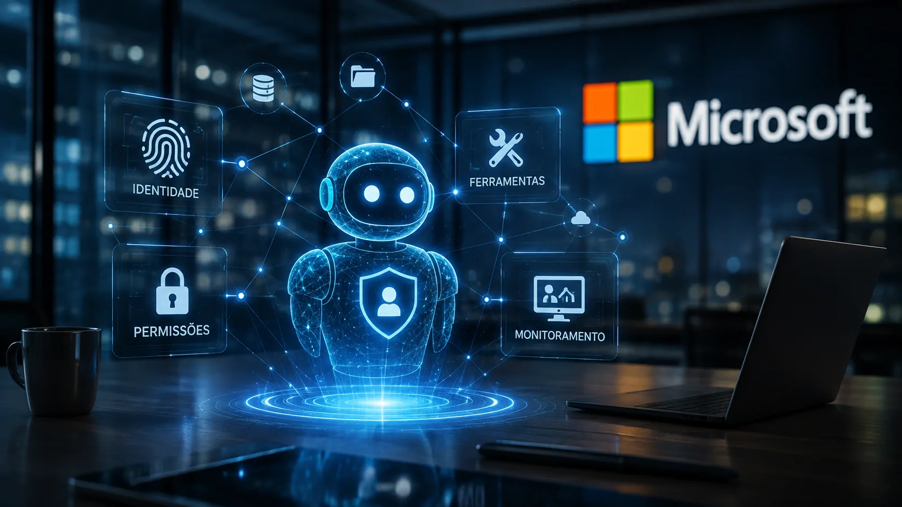
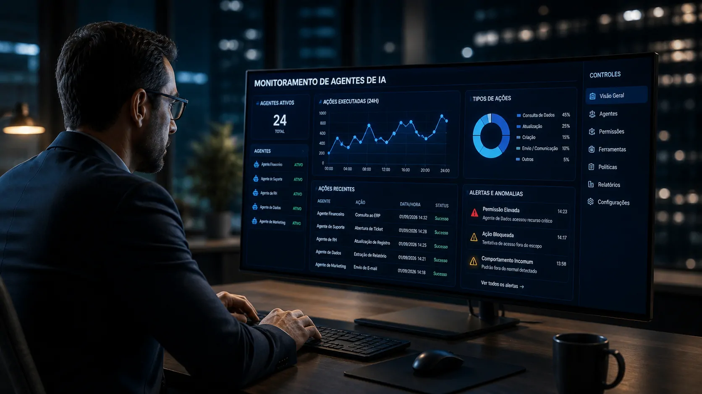
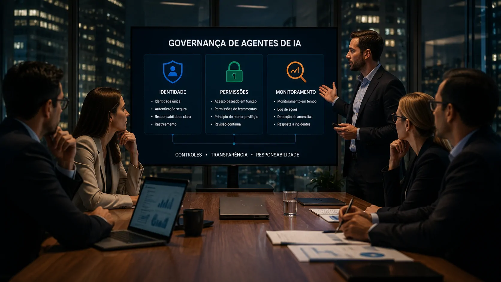

*O novo relatório de IA responsável da Microsoft mostra que a discussão sobre governança está mudando de nível: quando a inteligência artificial passa a acessar dados, utilizar ferramentas e executar tarefas, controlar apenas o modelo deixa de ser suficiente.*

## Microsoft identifica uma mudança no problema de governança

A **Microsoft** publicou em 1º de setembro seu **Responsible AI Transparency Report 2026**, documento que apresenta a evolução de suas práticas para desenvolvimento e implantação responsável de inteligência artificial. Entre os pontos destacados está a expansão das capacidades de **IA agentiva**, acompanhada por uma mudança na forma de tratar riscos e controles.

### Da resposta à execução

Um modelo tradicional de IA pode receber uma solicitação e produzir uma resposta. Um **agente de IA**, por outro lado, pode coordenar várias etapas para atingir um objetivo, utilizando ferramentas, consultando informações e interagindo com sistemas.

Essa diferença altera o problema de governança. O risco deixa de estar concentrado apenas na qualidade da resposta produzida pelo modelo e passa a envolver também aquilo que o sistema consegue acessar e fazer.

### O novo perímetro da IA empresarial

A própria **Microsoft** afirma que sistemas mais capazes podem manter memória, utilizar ferramentas, acessar dados e executar ações em nome dos usuários. Por isso, a empresa diz que a governança precisa considerar as interações entre modelos, agentes, aplicações, ferramentas, dados e pessoas.

Essa é a principal mudança revelada pelo relatório: **governar IA passa a significar governar também a capacidade de ação do sistema**.

## Identidade passa a ser parte da governança dos agentes

*À medida que agentes ganham autonomia, saber qual sistema está executando uma ação passa a ser parte do controle corporativo.*

A discussão sobre identidade ganha importância porque um agente que atua dentro de uma empresa não deveria ser tratado simplesmente como uma extensão indistinta do usuário. Ele pode executar processos, consultar informações e interagir com diferentes sistemas.

### Por que a identidade do agente importa

A **identidade do agente** cria uma referência para determinar quem ou qual sistema está realizando determinada operação. Isso pode ajudar empresas a estabelecer responsabilidades e diferenciar ações executadas por pessoas, aplicações e agentes.

Esse modelo também complementa uma tendência que o próprio ecossistema empresarial de IA já vinha apresentando. O Notícia Tech já analisou anteriormente **como a identidade dos agentes de IA pode funcionar dentro das empresas**, mostrando que a autonomia cria novas exigências para controle de acesso e rastreabilidade: **[entenda o papel da identidade dos agentes de IA nas empresas](https://noticiatech.com.br/inteligencia-artificial/ai-agent-identity-identidade-agentes-ia-empresas/)**.

### Identidade não significa autonomia ilimitada

Dar uma identidade a um agente não significa conceder liberdade para executar qualquer tarefa. Pelo contrário: a identificação precisa estar associada a regras que estabeleçam quais recursos podem ser utilizados e em quais circunstâncias.

Na prática, isso aproxima a governança de agentes de conceitos já conhecidos em segurança corporativa, como autenticação, autorização, controle de acesso e rastreabilidade. A diferença é que agora esses mecanismos precisam acompanhar sistemas capazes de tomar ações em múltiplas etapas.

## Permissões de ferramentas se tornam uma camada crítica

O segundo elemento destacado pela **Microsoft** é o controle das ferramentas que os agentes podem utilizar. Essa questão é especialmente importante em ambientes corporativos porque uma ferramenta pode dar ao agente capacidade de produzir efeitos reais fora da própria interface de IA.

### Acesso precisa seguir o objetivo

Um agente responsável por organizar informações não necessariamente precisa ter permissão para alterar registros financeiros. Da mesma forma, um sistema encarregado de preparar relatórios pode não precisar enviar mensagens externas ou modificar dados em sistemas críticos.

A governança, portanto, precisa estabelecer uma relação entre **objetivo, ferramenta e permissão**. Quanto maior a capacidade de ação concedida ao agente, maior tende a ser a importância de controles proporcionais ao risco.

### O problema deixa de ser apenas o modelo

Essa mudança ajuda a explicar por que avaliar apenas o modelo de IA não é suficiente. Mesmo um modelo que apresente comportamento adequado pode fazer parte de uma aplicação com permissões excessivas ou integrações mal configuradas.

É uma questão semelhante à que aparece na adoção de agentes para produtividade. O avanço de sistemas capazes de executar tarefas já está transformando a relação entre IA e trabalho, como mostra a expansão de ferramentas voltadas à execução de atividades corporativas. **[Veja como a era dos agentes está mudando a produtividade empresarial](https://noticiatech.com.br/inteligencia-artificial/chatgpt-work-era-agentes-ia-produtividade-corporativa/)**.

## Monitoramento passa a acompanhar as ações executadas

*O controle de agentes não termina quando eles são implantados: o comportamento durante a operação passa a fazer parte da governança.*

A terceira camada é o **monitoramento das ações**. Para a Microsoft, a evolução dos sistemas agentivos exige mecanismos capazes de acompanhar o que acontece depois que a tecnologia começa a operar em situações reais.

### Governança depois do lançamento

Em modelos tradicionais de desenvolvimento, boa parte da atenção está concentrada em treinamento, testes e avaliação antes da disponibilização. Em sistemas agentivos, o comportamento em produção ganha peso porque o agente pode interagir com ambientes que mudam continuamente.

A empresa descreve uma abordagem de governança que inclui avaliação de riscos, implantação com controles e acompanhamento posterior para identificar problemas, responder a incidentes e melhorar continuamente os sistemas.

### O histórico das ações ganha valor

Monitorar ações também cria uma camada de rastreabilidade. Se um agente alterar informações, acessar determinado recurso ou executar uma sequência inesperada, a empresa precisa ter meios de compreender o que ocorreu.

Isso transforma registros de atividade em parte importante da governança. O objetivo não é impedir toda autonomia, mas criar condições para que a autonomia possa ser acompanhada, limitada e corrigida quando necessário.

## A governança começa a acompanhar toda a arquitetura de IA

O relatório da **Microsoft** também mostra uma mudança mais ampla: a governança não está sendo tratada apenas como uma política aplicada ao modelo. A empresa afirma ter reestruturado seu **Responsible AI Standard** para considerar diferentes camadas da arquitetura de IA.

### Modelo, plataforma e aplicação

Agentes podem existir em diferentes pontos da pilha tecnológica. Eles podem depender de modelos, operar por meio de plataformas e aparecer dentro de aplicações utilizadas diretamente pelos funcionários.

Por isso, controles precisam acompanhar essa arquitetura. Uma empresa que adota um agente corporativo não está necessariamente administrando apenas um modelo de linguagem, mas um conjunto de componentes conectados.

### O deployer também entra na equação

Outro ponto relevante é a separação entre responsabilidades de desenvolvedores e de quem implanta sistemas de IA. Essa distinção importa porque uma empresa pode utilizar uma aplicação de IA criada por terceiros e ainda assim assumir responsabilidades relacionadas à implantação.

O problema deixa de ser simplesmente "o fornecedor construiu a IA corretamente?" e passa a incluir "a empresa está utilizando essa IA de maneira adequada dentro do próprio ambiente?".

## O que muda para as empresas que adotam agentes de IA

*Para empresas, a expansão dos agentes transforma governança em uma questão operacional que envolve tecnologia, segurança e responsabilidade.*

A mensagem mais importante do relatório não é que os agentes devam ser evitados. O movimento apontado pela **Microsoft** é justamente o contrário: a tecnologia está avançando para sistemas mais capazes, e os mecanismos de controle precisam acompanhar essa evolução.

### Governança deixa de ser apenas política

Uma política corporativa dizendo que a IA deve ser utilizada de forma responsável é insuficiente se não houver mecanismos técnicos para aplicar essa regra.

Identidade, permissões e monitoramento transformam princípios abstratos em controles operacionais. Eles permitem definir quem pode agir, o que pode ser acessado e como as atividades podem ser acompanhadas.

### O próximo desafio será administrar autonomia

Isso cria uma nova agenda para gestores de tecnologia. A questão não será apenas escolher qual modelo oferece melhor desempenho, mas definir **quanto de autonomia cada agente deve receber**, quais sistemas ele pode acessar e quais ações precisam de aprovação humana.

A tendência é especialmente relevante porque a corrida pelos agentes já envolve grandes empresas de tecnologia. O avanço de plataformas capazes de executar tarefas está criando uma nova camada de competição no mercado corporativo, enquanto empresas começam a avaliar como incorporar esses sistemas aos próprios processos.

A **Microsoft** está sinalizando que essa adoção terá uma consequência inevitável: quanto mais a IA deixar de apenas responder e passar a **agir**, mais a governança precisará acompanhar cada etapa dessa ação.

Para as empresas, esse pode ser o ponto central da próxima fase da adoção de IA. O desafio não será simplesmente colocar agentes para trabalhar, mas construir uma infraestrutura na qual **autonomia, acesso, responsabilidade e supervisão** possam coexistir sem transformar a automação em uma nova fonte de risco operacional.

---