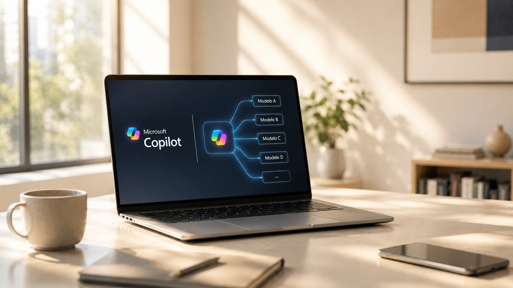
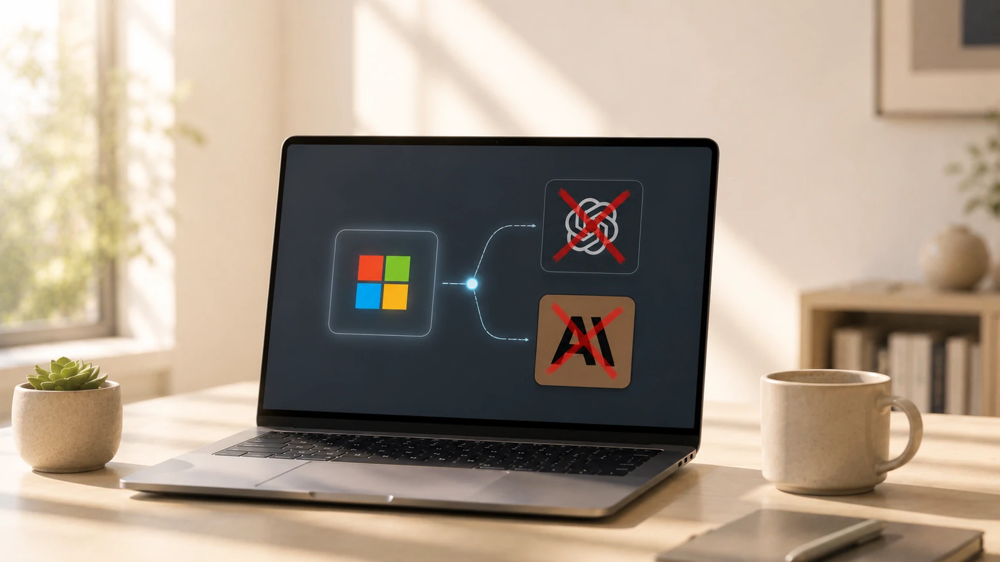
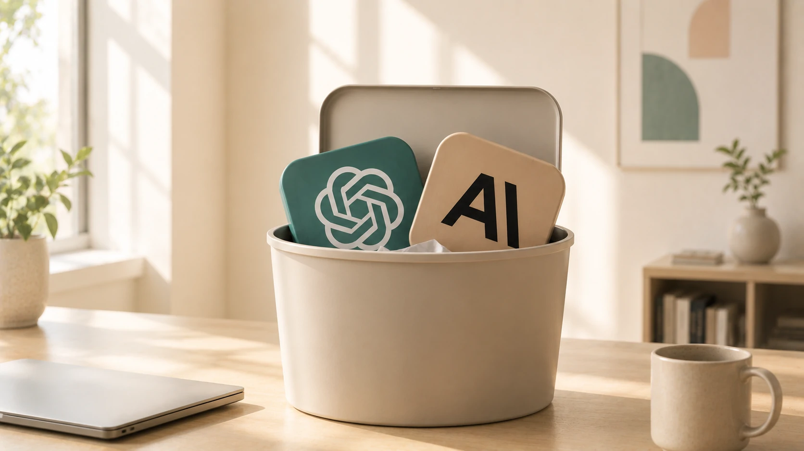

*O mercado de inteligência artificial entrou em uma nova fase. Em vez de apostar exclusivamente em um único modelo de linguagem, grandes empresas começam a construir plataformas capazes de alternar diferentes IAs conforme custo, desempenho e necessidade do cliente. A possível mudança da Microsoft no Copilot representa exatamente essa transformação e pode influenciar milhares de empresas que utilizam IA diariamente.*

# Microsoft avalia reduzir dependência de ChatGPT e Claude no Copilot: o que muda para as empresas

## A estratégia da Microsoft vai além da troca de um modelo de IA

A possível adoção de um modelo chinês no **Microsoft Copilot** não significa simplesmente substituir o **ChatGPT** ou o **Claude**. O movimento revela uma mudança muito mais profunda: transformar o Copilot em uma plataforma capaz de operar com diferentes modelos de **Inteligência Artificial** conforme a necessidade do negócio.

*Possibilitar múltiplos modelos de IA pode tornar o Copilot uma plataforma muito mais flexível para empresas de diferentes portes.*

Hoje, a vantagem competitiva deixou de ser possuir apenas o melhor modelo de linguagem. O diferencial passa a ser escolher qual IA entrega a melhor combinação entre desempenho, custo, segurança e velocidade para cada tarefa.

### O que motivaria essa mudança?

Entre os fatores apontados por analistas do mercado estão:

- redução do custo operacional por consulta;
- menor dependência de um único fornecedor;
- maior poder de negociação com parceiros;
- adaptação a diferentes mercados e regulamentações;
- evolução mais rápida dos serviços baseados em IA.

Essa estratégia também reduz riscos caso um fornecedor altere preços, políticas comerciais ou disponibilidade de seus modelos.

### Por que isso interessa às empresas?

Para organizações que utilizam o **Microsoft 365 Copilot**, a mudança pode significar acesso a soluções mais eficientes para determinadas atividades, sem que o usuário perceba qual modelo está sendo executado nos bastidores.

Na prática, o foco deixa de ser "qual IA está sendo utilizada" e passa a ser "qual IA resolve melhor este problema".

Esse movimento acompanha uma tendência já observada em diversas plataformas corporativas, nas quais múltiplos modelos convivem dentro da mesma infraestrutura.

## O Copilot pode inaugurar uma nova arquitetura de IA corporativa

As empresas estão caminhando para plataformas multimodelo. Em vez de depender exclusivamente de um único fornecedor, a tendência é utilizar diferentes modelos especializados para cada tipo de tarefa.

*Empresas começam a priorizar plataformas capazes de selecionar automaticamente o modelo de IA mais adequado para cada atividade.*

Essa arquitetura permite combinar desempenho, custo e segurança de forma muito mais eficiente do que uma estratégia baseada em apenas um grande modelo de linguagem.

### A era do fornecedor único pode estar chegando ao fim

Nos últimos dois anos, muitas empresas estruturaram seus projetos em torno de um único fornecedor de IA.

Agora, esse modelo começa a mudar.

Organizações buscam reduzir riscos tecnológicos distribuindo suas aplicações entre diferentes modelos, evitando dependência excessiva de apenas uma empresa.

Esse movimento também favorece inovação contínua, já que novos modelos podem ser incorporados conforme apresentam melhor desempenho.

### Como isso afeta o mercado corporativo

Caso a **Microsoft** confirme essa estratégia, outras plataformas empresariais poderão seguir o mesmo caminho.

A tendência é que soluções corporativas deixem de destacar apenas o nome do modelo utilizado e passem a enfatizar resultados, produtividade e governança.

Esse cenário também fortalece a competição global entre empresas de **Inteligência Artificial**, incentivando ganhos de eficiência, redução de custos e maior liberdade de escolha para clientes corporativos.

Para entender como arquiteturas abertas estão sendo adotadas pelas empresas, leia também:

- [Como implementar MCP nas empresas: arquitetura, integração e agentes de IA](https://noticiatech.com.br/inteligencia-artificial/como-implementar-mcp-empresas-arquitetura-integracao-agentes-ia/)

Outro conteúdo relacionado mostra por que a governança ganhou importância à medida que múltiplos agentes passaram a atuar dentro das organizações:

- [Governança de agentes de IA: por que empresas começam a abandonar projetos de Agentic AI](https://noticiatech.com.br/inteligencia-artificial/governanca-agentes-ia-empresas-abandonar-agentic-ai-2026/)

## A decisão da Microsoft pode acelerar a competição global em IA

A estratégia da **Microsoft** também aumenta a pressão sobre empresas como **OpenAI**, **Anthropic**, **Google**, **Meta**, **Mistral AI** e desenvolvedores chineses. O mercado deixa de disputar apenas quem possui o melhor modelo de linguagem e passa a competir por eficiência, custo operacional e capacidade de integração com ambientes corporativos.

*Grandes empresas de tecnologia caminham para ecossistemas capazes de integrar múltiplos modelos de IA conforme cada necessidade de negócio.*

Essa mudança representa uma evolução natural do mercado. Assim como empresas utilizam diferentes provedores de nuvem, bancos de dados e soluções de segurança, a tendência é que também utilizem diferentes modelos de **Inteligência Artificial** dentro da mesma plataforma.

### Empresas passarão a escolher desempenho, não apenas marca

Para gestores de tecnologia, a principal mudança será a liberdade para selecionar o modelo mais adequado para cada processo corporativo.

Algumas tarefas exigirão maior capacidade de raciocínio.

Outras priorizarão velocidade de resposta, menor custo por consulta ou requisitos específicos de conformidade regulatória.

Nesse cenário, a escolha deixa de ser baseada apenas na reputação da empresa desenvolvedora e passa a considerar métricas objetivas de produtividade, eficiência operacional e retorno sobre investimento.

### O impacto pode chegar rapidamente ao mercado brasileiro

Embora muitas dessas mudanças aconteçam inicialmente em mercados como Estados Unidos e Ásia, plataformas como o **Microsoft 365 Copilot** são utilizadas globalmente.

Isso significa que empresas brasileiras também poderão se beneficiar de melhorias em desempenho, redução de custos e novas funcionalidades conforme essa arquitetura multimodelo evoluir.

Ao mesmo tempo, departamentos de tecnologia precisarão reforçar políticas de governança, segurança, auditoria e conformidade para administrar ambientes cada vez mais complexos.

Como mostra o artigo do Notícia Tech sobre **AI Governance**, a expansão da IA corporativa depende cada vez mais de regras claras de gestão e controle.

## O futuro da IA corporativa será definido pela capacidade de integrar diferentes modelos

A principal mensagem enviada pela **Microsoft** é que a próxima fase da inteligência artificial empresarial não será vencida apenas pela empresa que desenvolver o modelo mais poderoso.

A vantagem competitiva estará na capacidade de construir plataformas capazes de combinar diferentes modelos de IA de forma transparente, segura e eficiente.

### O que empresas devem acompanhar nos próximos meses?

Executivos e líderes de tecnologia devem observar principalmente:

- evolução da estratégia do **Microsoft Copilot**;
- integração de novos modelos de IA corporativos;
- mudanças nos custos de utilização;
- requisitos de segurança e governança;
- impactos sobre produtividade e automação empresarial.

Esses fatores podem influenciar diretamente decisões de investimento em tecnologia durante os próximos anos.

### A disputa deixa de ser entre modelos e passa a ser entre plataformas

A inteligência artificial está entrando em uma nova etapa de maturidade.

Em vez de uma competição centrada apenas em **ChatGPT**, **Claude** ou qualquer outro modelo individual, o mercado passa a valorizar plataformas capazes de selecionar automaticamente a melhor IA para cada contexto de negócio.

Essa mudança também fortalece empresas que investem em arquiteturas abertas, interoperabilidade e integração entre diferentes fornecedores de IA.

Se essa estratégia se consolidar, a vantagem competitiva deixará de estar apenas na qualidade do modelo e passará para quem conseguir oferecer o ecossistema mais eficiente, flexível e preparado para atender às necessidades das empresas.

Mais do que uma possível substituição do **ChatGPT** ou do **Claude**, a movimentação da **Microsoft** sinaliza uma transformação estrutural no mercado. A IA corporativa caminha para um cenário em que produtividade, liberdade de escolha e capacidade de integração serão fatores muito mais importantes do que a exclusividade de um único modelo.

### A Microsoft vai abandonar o ChatGPT no Copilot?

Não. Até o momento, não existe confirmação oficial de que o ChatGPT será removido do Copilot. O que está sendo discutido é a possibilidade de ampliar o número de modelos utilizados pela plataforma.

### Por que utilizar vários modelos de IA?

Cada modelo apresenta vantagens específicas. Uma arquitetura multimodelo permite escolher automaticamente a IA mais eficiente para cada tarefa, equilibrando desempenho, custo, segurança e velocidade.

### Empresas brasileiras serão afetadas?

Sim. Como o **Microsoft 365 Copilot** é utilizado mundialmente, qualquer mudança importante na arquitetura da plataforma poderá beneficiar empresas brasileiras com novos recursos e maior eficiência operacional.

### O ChatGPT deixará de fazer parte do Copilot?

O cenário mais provável é que diferentes modelos convivam dentro da mesma plataforma, oferecendo mais flexibilidade para clientes corporativos.

### Qual é a principal tendência para os próximos anos?

A tendência é que plataformas corporativas passem a integrar diversos modelos de inteligência artificial, permitindo que empresas utilizem automaticamente a solução mais adequada para cada processo de negócio.

---