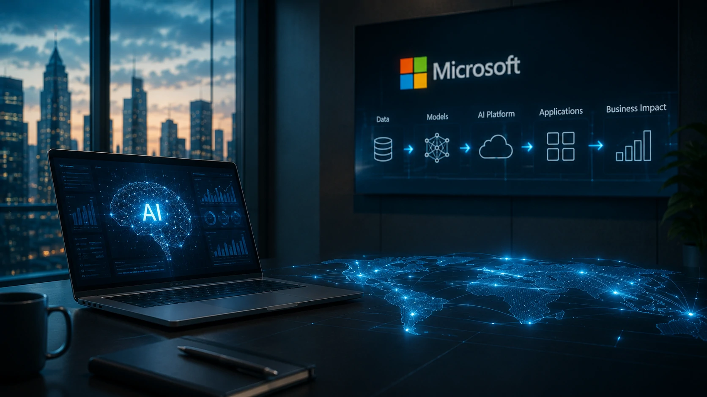
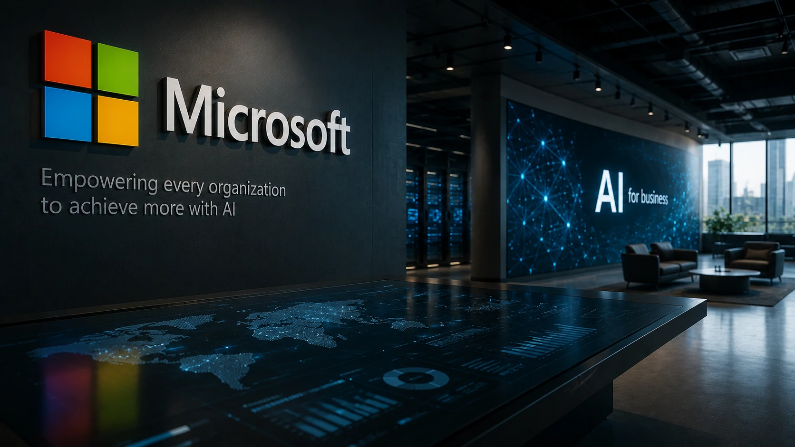
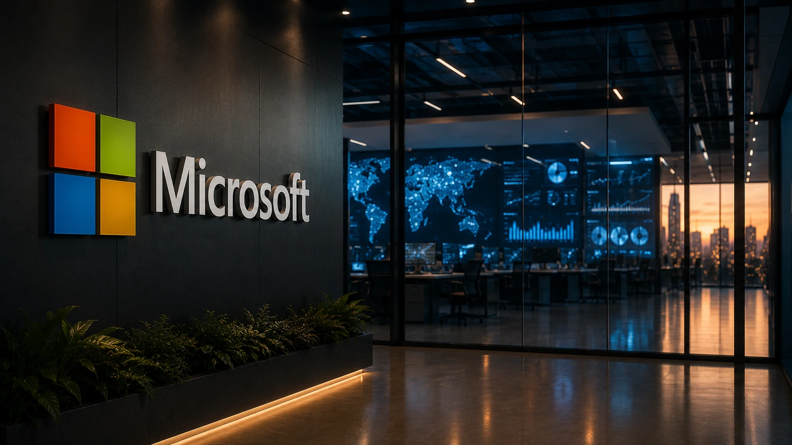

*Nos últimos dois anos, a corrida da inteligência artificial foi marcada pela disputa entre modelos como **ChatGPT**, **Claude** e **Gemini**. Agora, o mercado começa a mudar de direção. O novo diferencial competitivo passa a ser a capacidade de transformar esses modelos em soluções reais para empresas. É exatamente nesse movimento que a **Microsoft** pretende assumir uma posição de liderança.*

A criação de uma nova empresa dedicada exclusivamente à implementação de projetos de **inteligência artificial corporativa**, apoiada por um investimento estimado em **US$ 2,5 bilhões**, representa uma mudança importante na estratégia da gigante de tecnologia. Em vez de disputar apenas quem possui o melhor modelo de IA, a empresa passa a competir pela liderança na transformação digital baseada em inteligência artificial.

Essa mudança reforça uma tendência observada ao longo de 2026: o mercado corporativo está migrando do entusiasmo com modelos generativos para uma fase em que execução, integração e retorno financeiro passam a ser os fatores decisivos.

## A Microsoft quer liderar a implementação de IA nas empresas, não apenas desenvolver modelos

*Nova estrutura da Microsoft busca acelerar projetos corporativos de inteligência artificial com foco em implementação, integração e geração de valor para empresas.*

A nova iniciativa demonstra que a **Microsoft** pretende ocupar um espaço diferente dentro do ecossistema da inteligência artificial. Em vez de atuar apenas como fornecedora de infraestrutura em **Azure** ou como parceira da **OpenAI**, a empresa passa a oferecer um modelo mais abrangente para acelerar a adoção da tecnologia.

Essa abordagem aproxima a Microsoft do papel tradicional de grandes consultorias de tecnologia, mas com uma vantagem competitiva importante: acesso direto às plataformas, infraestrutura em nuvem, ferramentas de produtividade e modelos de IA que já fazem parte do ambiente corporativo.

### O foco deixa de ser apenas o modelo de IA

Durante a primeira onda da IA generativa, a maior parte da atenção esteve concentrada na evolução dos modelos de linguagem. Entretanto, muitas empresas descobriram que possuir acesso ao melhor modelo não garante resultados concretos.

Os principais desafios passaram a envolver integração com sistemas internos, segurança dos dados, governança, treinamento das equipes e adaptação dos processos de negócio.

Esse cenário reforça conceitos discutidos anteriormente pelo Notícia Tech sobre a importância da **[AI Fluency](https://noticiatech.com.br/inteligencia-artificial/o-que-e-ai-fluency-habilidade-profissionais-empresas/)** para organizações que desejam extrair valor real da inteligência artificial.

### Implementação passa a valer mais que experimentação

A nova estratégia mostra que a próxima etapa da inteligência artificial será definida pela capacidade de transformar projetos piloto em operações permanentes.

Empresas que conseguirem integrar IA aos processos internos deverão conquistar ganhos relevantes de produtividade, enquanto organizações que permanecerem apenas em testes tendem a perder competitividade.

## O mercado entra definitivamente na era da IA corporativa

A inteligência artificial deixa de ser vista apenas como uma ferramenta de produtividade individual e passa a ocupar um papel estratégico dentro das empresas.

*Grandes empresas passam a tratar inteligência artificial como parte da infraestrutura estratégica de negócios, integrando diferentes modelos e plataformas.*

Esse movimento acontece praticamente ao mesmo tempo em que outras gigantes do setor ampliam suas estratégias corporativas. A **OpenAI** acelera sua expansão empresarial, a **Anthropic** fortalece sua presença em grandes provedores de nuvem e empresas como **Google**, **Amazon** e **Oracle** ampliam investimentos em infraestrutura especializada para IA.

Em vez de escolher um único modelo, muitas organizações começam a adotar arquiteturas chamadas de **multi-modelo**, combinando diferentes soluções conforme o tipo de aplicação.

### A dependência de um único fornecedor perde força

Uma das mudanças mais relevantes observadas em 2026 é a redução da dependência exclusiva de um único modelo de inteligência artificial.

Dependendo do projeto, uma empresa pode utilizar **ChatGPT** para atendimento, **Claude** para análise documental e modelos menores para automação de processos internos, reduzindo custos e aumentando flexibilidade.

Esse cenário complementa tendências já analisadas pelo Notícia Tech sobre a evolução da **[AI Process Automation](https://noticiatech.com.br/automacao/o-que-e-ai-process-automation-automacao-processos-inteligencia-artificial/)**, na qual diferentes tecnologias trabalham em conjunto para automatizar operações empresariais.

## A Microsoft inaugura uma disputa baseada em serviços e não apenas em modelos

*O diferencial competitivo da próxima geração da inteligência artificial será a capacidade de integrar tecnologia, dados e processos de negócio em uma única estratégia corporativa.*

A nova estrutura criada pela **Microsoft** evidencia uma transformação importante no mercado: a inteligência artificial passa a ser tratada como um serviço estratégico de negócios, e não apenas como uma tecnologia disponível por assinatura.

Na prática, isso significa que empresas precisarão definir arquitetura, governança, integração com sistemas legados, segurança da informação e indicadores claros de retorno sobre investimento. O modelo de IA utilizado continua sendo importante, mas deixa de ser o único fator decisivo.

### Pequenas e médias empresas também serão impactadas

Embora a iniciativa tenha como foco inicial grandes organizações, seus efeitos tendem a alcançar empresas de todos os portes.

Historicamente, soluções corporativas desenvolvidas pela **Microsoft** acabam sendo incorporadas ao ecossistema do **Microsoft 365**, **Copilot** e **Azure**, reduzindo gradualmente o custo de adoção para pequenas e médias empresas.

Esse movimento pode acelerar a democratização da inteligência artificial corporativa, permitindo que negócios menores utilizem recursos antes restritos às grandes companhias.

### O próximo desafio será transformar IA em vantagem competitiva

A adoção de inteligência artificial entra em uma fase mais madura.

Nos próximos anos, o diferencial competitivo não será simplesmente possuir acesso ao **ChatGPT**, **Claude**, **Gemini** ou qualquer outro modelo avançado. O verdadeiro desafio será transformar essas tecnologias em processos eficientes, integrados e alinhados aos objetivos do negócio.

Empresas que estruturarem uma estratégia consistente de IA tendem a ganhar produtividade, reduzir custos operacionais e aumentar sua capacidade de inovação.

## O que muda para empresas brasileiras a partir dessa nova estratégia

A principal consequência para o mercado brasileiro é que projetos de inteligência artificial passam a exigir planejamento estratégico semelhante ao de grandes iniciativas de transformação digital.

Não basta contratar uma ferramenta de IA. Será cada vez mais importante definir políticas de governança, qualidade dos dados, integração entre plataformas e treinamento contínuo das equipes.

### A competição deixa de ser tecnológica e passa a ser operacional

Até pouco tempo atrás, o mercado discutia qual empresa possuía o modelo mais inteligente.

Agora, a pergunta muda para: qual organização consegue implementar inteligência artificial com maior velocidade, segurança e geração de resultados?

Essa mudança favorece fornecedores capazes de entregar uma solução completa, reunindo infraestrutura, consultoria, integração e operação contínua.

### O futuro da IA será decidido dentro das empresas

A corrida da inteligência artificial está entrando em uma nova fase.

Os avanços dos modelos continuarão importantes, mas o crescimento do mercado dependerá principalmente da capacidade das empresas de incorporar essas tecnologias ao dia a dia de suas operações.

A decisão da **Microsoft** reforça que a próxima disputa não será vencida apenas por quem desenvolver o modelo mais avançado, mas por quem conseguir transformar inteligência artificial em produtividade, inovação e vantagem competitiva para milhões de organizações ao redor do mundo.

---