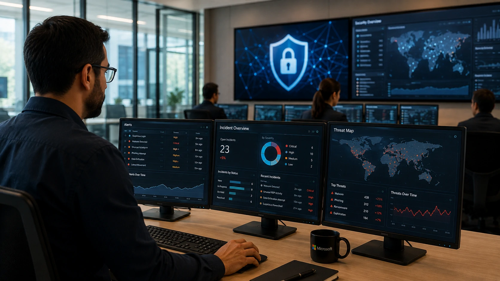
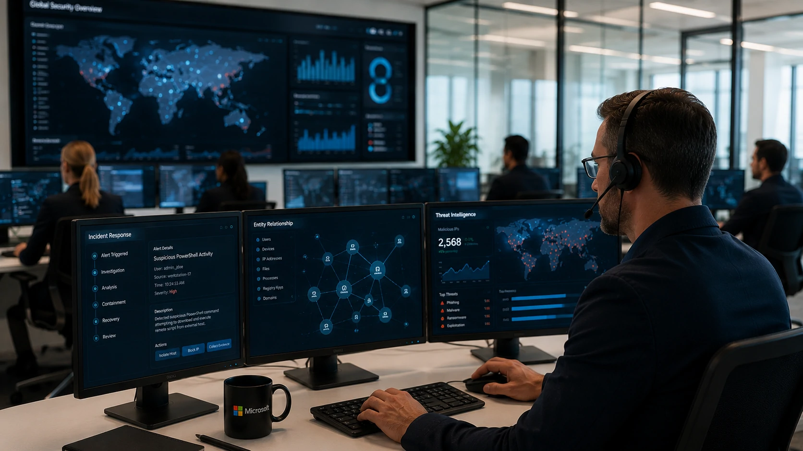
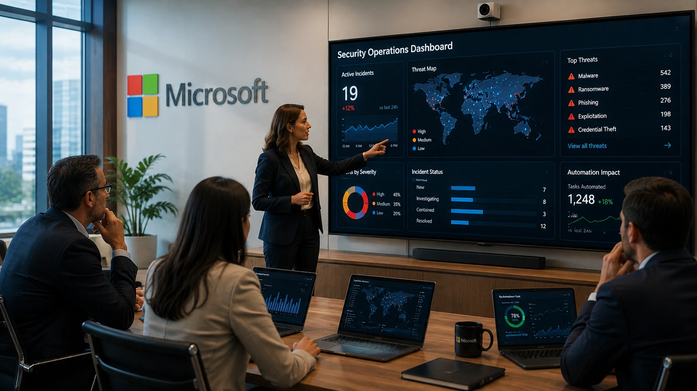

*A corrida pela Inteligência Artificial deixou de ser apenas uma disputa entre modelos generativos. Agora, o foco passa a ser a proteção dos ambientes corporativos. Ao lançar uma nova plataforma de segurança baseada em agentes de IA, a **Microsoft** sinaliza que o futuro da cibersegurança será cada vez mais autônomo, inteligente e integrado aos processos das empresas.*

## A Microsoft quer transformar agentes de IA em analistas de segurança digitais

Empresas enfrentam um crescimento contínuo no número de ataques cibernéticos, enquanto o volume de alertas gerados diariamente supera a capacidade das equipes de segurança. A resposta da **Microsoft** é utilizar agentes especializados capazes de assumir parte desse trabalho operacional.

*Agentes inteligentes analisam eventos de segurança continuamente para reduzir o tempo de resposta a incidentes.*

Esses agentes foram projetados para interpretar grandes volumes de eventos, identificar padrões suspeitos e iniciar investigações automaticamente antes mesmo que um analista humano intervenha.

### IA deixa de apenas detectar para começar a agir

A principal mudança não está apenas na análise dos dados.

Os agentes conseguem correlacionar informações provenientes de diferentes sistemas, priorizar alertas críticos e sugerir ações de contenção com muito mais rapidez do que fluxos tradicionais.

### O SOC passa por uma transformação

Os chamados **Security Operations Centers (SOC)** deixam de atuar apenas como equipes reativas.

Com agentes inteligentes trabalhando continuamente, os profissionais passam a concentrar esforços em decisões estratégicas, análise de riscos complexos e resposta a incidentes de maior impacto.

Essa evolução acompanha uma tendência discutida recentemente pelo **Notícia Tech** sobre a importância da segurança na nova geração da IA empresarial.

**[O que é Segurança de IA e por que ela será prioridade para empresas nos próximos anos](https://noticiatech.com.br/inteligencia-artificial/o-que-e-seguranca-ia-prioridade-empresas/)**

## A automação passa a ser o principal diferencial competitivo

Empresas não conseguem mais escalar operações de segurança apenas contratando mais especialistas. A automação inteligente tornou-se uma necessidade operacional.

Empresas que conseguem reduzir o tempo entre a identificação e a resposta a um ataque normalmente diminuem perdas financeiras, impactos operacionais e riscos regulatórios.

*Os agentes de IA assumem tarefas repetitivas enquanto especialistas concentram esforços em decisões estratégicas.*

A plataforma apresentada pela **Microsoft** segue exatamente essa direção ao combinar automação, inteligência de ameaças e análise contextual.

### Menos alertas, mais inteligência

Um dos maiores desafios dos SOCs modernos é o chamado *alert fatigue*.

Milhares de notificações chegam diariamente, mas apenas uma pequena parcela representa riscos reais.

Os agentes utilizam IA para agrupar eventos relacionados, eliminar falsos positivos e apresentar somente incidentes relevantes para investigação.

### Segurança passa a acompanhar a velocidade da IA

À medida que empresas adotam copilotos, agentes autônomos e fluxos inteligentes, a superfície de ataque também aumenta.

Isso reforça a importância de arquiteturas capazes de proteger ambientes cada vez mais distribuídos, tema abordado pelo **Notícia Tech** no guia sobre arquitetura de IA empresarial.

**[Arquitetura de IA Empresarial: como MCP, RAG, APIs, Agentes, Workflows e Copilotos funcionam juntos](https://noticiatech.com.br/inteligencia-artificial/arquitetura-ia-empresarial-mcp-rag-apis-agentes-workflows-copilotos/)**

## A disputa pela liderança da IA também chegou à segurança digital

A segurança baseada em agentes torna-se rapidamente um novo campo de competição entre as grandes empresas de tecnologia.

*A próxima fase da competição em IA envolve plataformas capazes de proteger ambientes corporativos utilizando agentes inteligentes.*

Além da **Microsoft**, companhias como **Google**, **Cisco**, **CrowdStrike**, **Palo Alto Networks** e diversos fornecedores especializados vêm incorporando inteligência artificial aos seus produtos.

### O diferencial passa a ser o ecossistema

A vantagem competitiva não depende apenas da qualidade dos modelos de IA.

Empresas que oferecem integração entre identidade digital, dispositivos, nuvem, monitoramento e agentes inteligentes tendem a entregar maior eficiência operacional.

É justamente nesse ponto que a estratégia da **Microsoft** ganha força ao conectar sua plataforma de segurança ao ecossistema corporativo já utilizado por milhões de organizações.

### O mercado caminha para agentes especializados

Em vez de um único modelo executando todas as tarefas, a tendência é a existência de múltiplos agentes especializados trabalhando em conjunto.

Esse conceito se aproxima da evolução da **AI Orchestration**, na qual diferentes agentes colaboram para resolver problemas complexos.

O assunto foi detalhado pelo **Notícia Tech** em:

**[O que é AI Orchestration e por que ela será indispensável para empresas que usam agentes de IA](https://noticiatech.com.br/automacao/o-que-e-ai-orchestration-agentes-ia-empresas/)**

## O lançamento indica como será a próxima geração da cibersegurança

A segurança baseada em agentes representa uma mudança estrutural na forma como empresas enfrentarão ameaças digitais.

Mais do que automatizar processos, essas plataformas passam a compreender contexto, correlacionar informações e acelerar investigações praticamente em tempo real.

Embora especialistas continuem responsáveis pelas decisões críticas, a IA tende a assumir uma parcela crescente das atividades operacionais dos SOCs.

Para empresas que ampliam investimentos em **Inteligência Artificial**, computação em nuvem e automação, iniciativas como a da **Microsoft** mostram que proteger modelos, dados e agentes inteligentes será tão estratégico quanto desenvolver novas aplicações. A próxima disputa do mercado de IA não acontecerá apenas pela capacidade dos modelos, mas pela confiança que eles conseguem oferecer aos ambientes corporativos.

---