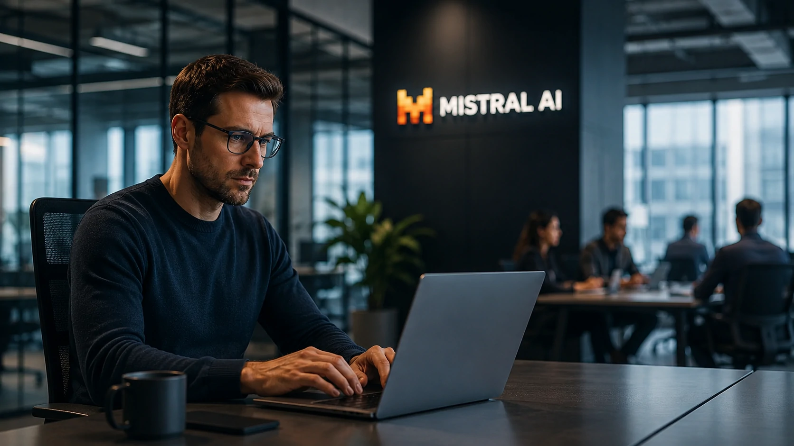
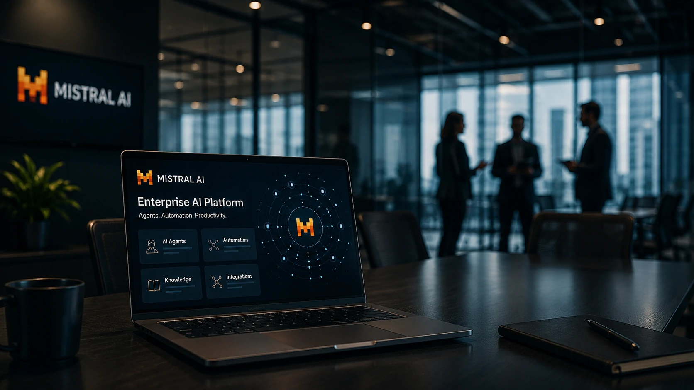
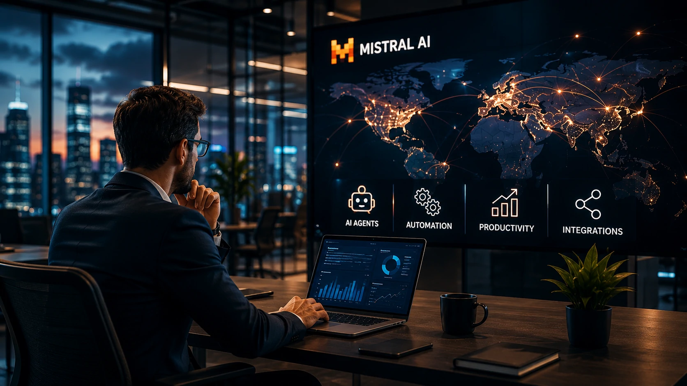

*A corrida pela liderança da inteligência artificial entra em uma nova fase. Depois de ganhar reconhecimento pelos seus modelos de linguagem abertos e eficientes, a **Mistral AI** acelera sua estratégia para empresas ao ampliar sua plataforma de produtividade, agentes de IA e automação. O movimento reforça uma mudança importante no mercado: a competição agora acontece entre ecossistemas completos de inteligência artificial, e não apenas entre chatbots.*

A **Mistral AI** anunciou uma evolução significativa de sua plataforma corporativa, ampliando recursos voltados para produtividade, agentes inteligentes e colaboração empresarial. A estratégia coloca a empresa francesa em uma posição ainda mais competitiva diante de **OpenAI**, **Anthropic** e **Google**, que disputam espaço no segmento de IA empresarial.

Mais do que lançar novos modelos, a companhia demonstra que pretende oferecer uma plataforma integrada capaz de atender organizações que buscam incorporar inteligência artificial em processos internos, atendimento, desenvolvimento de software e automação de tarefas.

Essa movimentação confirma uma tendência que vem ganhando força ao longo de 2026: empresas não procuram apenas um modelo de IA mais poderoso, mas soluções completas que possam ser integradas ao ambiente corporativo.

## A estratégia da Mistral AI vai além dos modelos de linguagem

A **Mistral AI** deixa claro que sua ambição é construir um ecossistema corporativo completo de inteligência artificial.

*Expansão da plataforma enterprise da Mistral AI amplia sua presença no mercado corporativo.*

Enquanto os primeiros anos da IA generativa foram marcados pela disputa entre grandes modelos de linguagem (LLMs), o mercado começa a migrar para uma nova etapa, na qual plataformas integradas oferecem muito mais valor para as empresas.

### O foco passa a ser produtividade empresarial

Em vez de competir apenas em benchmarks técnicos, a **Mistral AI** amplia funcionalidades voltadas para o uso diário dentro das organizações.

Entre elas estão:

- criação de agentes especializados;
- colaboração entre equipes;
- integração com ambientes corporativos;
- automação de fluxos de trabalho;
- apoio à tomada de decisão.

Essa abordagem aproxima a empresa do que hoje representa o posicionamento estratégico da **OpenAI** com o ChatGPT Enterprise e da **Microsoft** com o Copilot.

### O mercado passa a valorizar plataformas completas

A evolução demonstra que o diferencial competitivo não será apenas possuir o modelo mais inteligente.

Empresas procuram ambientes capazes de conectar IA, documentos, sistemas internos, bases de conhecimento e ferramentas de produtividade em um único ecossistema.

Essa tendência também reforça a importância de padrões de integração como o **MCP**, tema aprofundado pelo Notícia Tech no artigo:

https://noticiatech.com.br/inteligencia-artificial/como-implementar-mcp-empresas-arquitetura-integracao-agentes-ia/

---

## A disputa entre OpenAI, Anthropic e Mistral muda de patamar

A concorrência entre as principais empresas de inteligência artificial passa por uma transformação estrutural.

*Competição entre plataformas corporativas redefine a próxima fase da inteligência artificial.*

Durante 2023 e 2024, a atenção estava concentrada na qualidade dos modelos de linguagem.

Em 2026, entretanto, a vantagem competitiva depende cada vez mais da capacidade de entregar soluções completas para empresas.

### O novo diferencial está na experiência corporativa

Organizações querem reduzir custos operacionais, acelerar processos e aumentar produtividade.

Para isso, procuram plataformas que ofereçam:

- segurança;
- governança;
- integração;
- agentes inteligentes;
- facilidade de implantação.

Quanto menor a complexidade para implementar IA, maior tende a ser sua adoção pelas empresas.

### A Europa busca reduzir dependência tecnológica

Outro aspecto relevante da estratégia da **Mistral AI** é fortalecer uma alternativa europeia às grandes empresas americanas.

Esse posicionamento ganha importância principalmente para organizações preocupadas com soberania digital, privacidade de dados e conformidade regulatória.

O crescimento recente da empresa mostra que ainda existe espaço para novos concorrentes relevantes em um mercado tradicionalmente dominado por gigantes da tecnologia.

## A expansão da Mistral AI confirma uma mudança na estratégia das empresas

A evolução da **Mistral AI** demonstra que o mercado corporativo está priorizando plataformas capazes de integrar inteligência artificial aos processos do dia a dia.

*Empresas passam a buscar plataformas completas de IA capazes de integrar agentes, automação e produtividade.*

Não basta mais oferecer um chatbot eficiente.

As organizações procuram soluções que possam atuar em atendimento, desenvolvimento de software, análise de documentos, criação de agentes especializados e automação de processos.

### A integração passa a ser um diferencial competitivo

A próxima fase da inteligência artificial será definida pela capacidade de conectar diferentes sistemas corporativos.

Nesse cenário, recursos como integração com aplicações internas, ambientes seguros e protocolos de comunicação entre agentes tornam-se fatores decisivos para grandes empresas.

Essa tendência acompanha o crescimento de arquiteturas baseadas em agentes inteligentes, tema aprofundado pelo Notícia Tech em:

https://noticiatech.com.br/inteligencia-artificial/o-que-e-agentic-ai-guia-completo-agentes-ia/

Ao mesmo tempo, empresas que desejam implantar esses recursos também precisam estruturar processos de integração e governança para garantir escalabilidade.

### A concorrência deve acelerar a inovação

O fortalecimento da **Mistral AI** aumenta a pressão competitiva sobre **OpenAI**, **Anthropic**, **Google** e outras empresas do setor.

Esse cenário tende a beneficiar clientes corporativos, que passam a contar com mais opções de fornecedores, maior diversidade tecnológica e ritmo mais acelerado de inovação.

Além disso, a competição deixa de ocorrer apenas entre modelos proprietários e passa a envolver estratégias de ecossistema, produtividade e experiência empresarial.

## O que essa estratégia representa para o futuro da inteligência artificial

A expansão da **Mistral AI** indica que a inteligência artificial corporativa entrou em uma nova fase de maturidade.

As empresas já compreendem que o verdadeiro valor da IA não está apenas em gerar textos ou responder perguntas, mas em transformar processos completos de negócio.

### Plataformas substituirão ferramentas isoladas

Nos próximos anos, a tendência é que organizações adotem plataformas capazes de centralizar:

- agentes inteligentes;
- automação de processos;
- gestão de conhecimento;
- análise de documentos;
- produtividade das equipes;
- integração entre sistemas.

Essa consolidação reduz custos operacionais, melhora a governança e acelera a adoção da inteligência artificial em diferentes departamentos.

### A disputa será definida pela capacidade de gerar valor para as empresas

Os avanços anunciados pela **Mistral AI** mostram que a próxima batalha do mercado não será apenas por desempenho em benchmarks técnicos.

Os vencedores serão aqueles capazes de entregar soluções completas, seguras e facilmente integráveis ao ambiente corporativo.

A inteligência artificial caminha rapidamente para se tornar uma camada estratégica da infraestrutura digital das empresas, e movimentos como esse reforçam que a competição global continuará sendo impulsionada pela capacidade de transformar tecnologia em resultados concretos para os negócios.

---