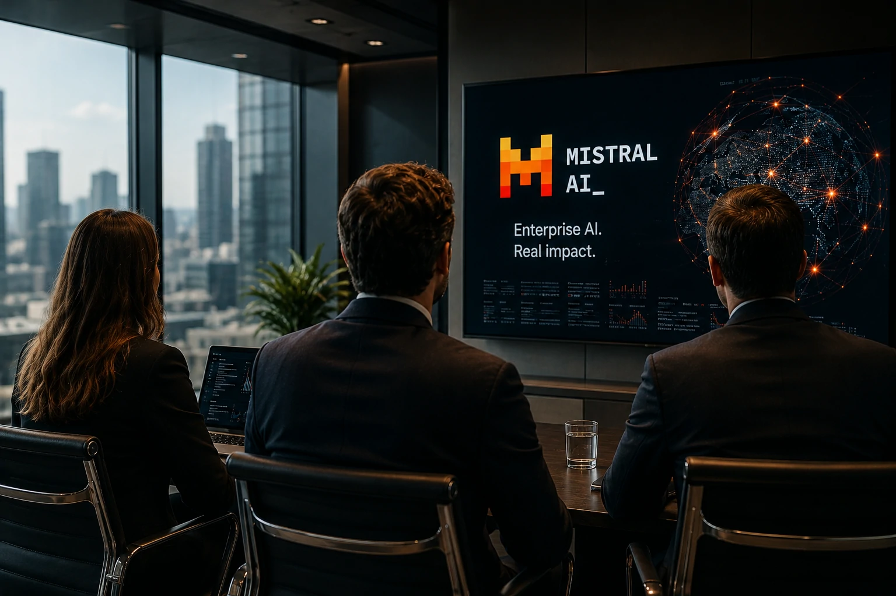
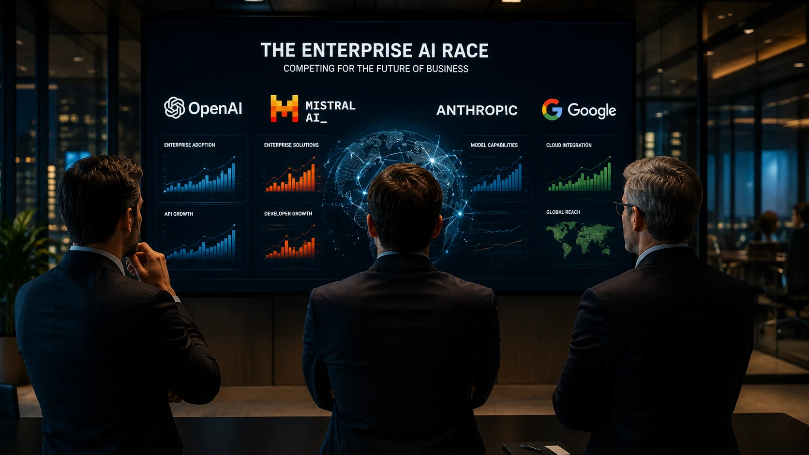
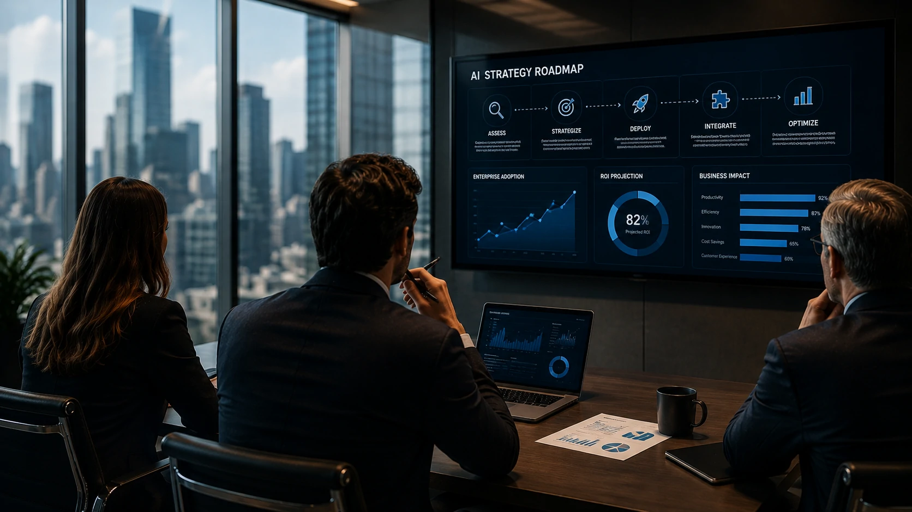

*A corrida pela liderança da inteligência artificial entrou em uma nova fase. Enquanto **OpenAI**, **Google** e **Anthropic** dominavam os holofotes, a francesa **Mistral AI** acelerou sua estratégia para empresas e passou a disputar espaço em um dos segmentos mais lucrativos do setor. O movimento pode alterar a dinâmica competitiva da IA corporativa nos próximos meses.*

## A Mistral AI deixou de ser uma promessa e passou a disputar grandes contratos corporativos

*Executivos da Mistral AI reforçam a estratégia voltada ao mercado empresarial.*

A **Mistral AI** ampliou significativamente sua presença no mercado empresarial ao anunciar novos recursos voltados para produtividade, implantação corporativa e integração com ambientes privados.

A estratégia mostra que a empresa francesa não pretende competir apenas em qualidade de modelos de linguagem. O foco agora está em oferecer uma plataforma completa para organizações que desejam adotar **Inteligência Artificial** em escala.

Esse posicionamento aproxima a empresa da estratégia adotada pela **OpenAI** com o **ChatGPT Work**, mas com uma proposta que privilegia maior flexibilidade de implantação e modelos adaptáveis às necessidades das empresas.

### O foco mudou da corrida por modelos para a disputa por clientes

Nos últimos meses, a competição deixou de girar exclusivamente em torno de benchmarks.

Hoje, o diferencial está na capacidade de entregar soluções prontas para ambientes corporativos, com governança, integração e produtividade.

### Empresas querem mais do que modelos de IA

Executivos passaram a avaliar fatores como:

- segurança dos dados;
- custo operacional;
- facilidade de integração;
- implantação em ambientes privados;
- controle sobre informações estratégicas.

Esses fatores favorecem empresas que conseguem oferecer um ecossistema completo.

Um movimento semelhante já pode ser observado na expansão dos **agentes de IA**, tema abordado no Notícia Tech em:

**[OpenAI muda o mercado com ChatGPT Work: por que empresas estão abandonando softwares tradicionais](https://noticiatech.com.br/inteligencia-artificial/chatgpt-work-empresas-abandonam-softwares-tradicionais/)**

## A estratégia da Mistral aumenta a pressão sobre OpenAI, Google e Anthropic

A entrada mais agressiva da **Mistral AI** no segmento corporativo aumenta a pressão sobre os principais desenvolvedores de IA.

Embora a **OpenAI** continue liderando diversos mercados, a concorrência deixou de acontecer apenas entre modelos de linguagem e passou para a disputa por plataformas completas.

Essa mudança pode acelerar o ritmo de inovação em todo o setor.

### Como a disputa pela IA corporativa deve evoluir

A competição entre **Mistral AI**, **OpenAI**, **Google**, **Anthropic** e outros desenvolvedores tende a beneficiar principalmente as empresas que estão iniciando sua jornada em Inteligência Artificial.

Quanto maior a concorrência, maior será a pressão por inovação, redução de custos e criação de soluções voltadas para casos de uso reais.

Nesse cenário, a capacidade de entregar plataformas completas pode ser mais importante do que lançar o modelo de linguagem mais avançado.

*O mercado corporativo tornou-se o principal campo de batalha entre as empresas de inteligência artificial.*

### IA corporativa passa a ser prioridade estratégica

Organizações deixaram de avaliar apenas qualidade de respostas.

Agora entram na conta fatores como:

- integração com sistemas internos;
- governança dos dados;
- conformidade regulatória;
- custos operacionais;
- facilidade de implantação.

Esse movimento acompanha a evolução da arquitetura moderna de IA, que combina **RAG**, **MCP**, agentes inteligentes e automação empresarial.

Para entender esse cenário, vale conferir o guia publicado pelo Notícia Tech:

**[Arquitetura de IA Empresarial: como MCP, RAG, APIs, Agentes, Workflows e Copilotos funcionam juntos](https://noticiatech.com.br/inteligencia-artificial/arquitetura-ia-empresarial-mcp-rag-apis-agentes-workflows-copilotos/)**

### A Europa pode ganhar protagonismo na corrida da IA

A ascensão da **Mistral AI** também representa um fortalecimento do ecossistema europeu de inteligência artificial.

Enquanto grande parte das líderes do setor está concentrada nos Estados Unidos, a empresa francesa demonstra que ainda existe espaço para novos protagonistas capazes de competir globalmente.

Esse fator pode estimular novos investimentos, acelerar pesquisas e ampliar a diversidade tecnológica do mercado.

## O que empresas devem observar antes de escolher uma plataforma de IA

A escolha de uma plataforma de **Inteligência Artificial** deixou de depender apenas da popularidade de um modelo.

Empresas precisam avaliar qual solução oferece melhor equilíbrio entre desempenho, segurança, custo e integração.

*Escolher uma plataforma de IA exige analisar estratégia de longo prazo, integração e governança.*

### O menor custo nem sempre representa o maior valor

Projetos corporativos normalmente permanecem ativos durante vários anos.

Por isso, decisões tomadas apenas pelo preço inicial podem gerar custos elevados de migração, adaptação ou limitação tecnológica no futuro.

Avaliar a estratégia do fornecedor tornou-se tão importante quanto analisar o desempenho do modelo.

### A tendência aponta para um mercado mais competitivo

Nos próximos meses, especialistas esperam novas disputas envolvendo:

- agentes de IA;
- plataformas corporativas;
- modelos open weight;
- infraestrutura empresarial;
- produtividade baseada em IA.

A consequência direta é um ambiente mais favorável para empresas que desejam acelerar sua transformação digital.

Enquanto **OpenAI** continua liderando diversos segmentos, a movimentação da **Mistral AI** demonstra que a disputa pela inteligência artificial corporativa está longe de terminar. O mercado caminha para uma fase em que a vantagem competitiva será construída menos pela capacidade de lançar novos modelos e mais pela habilidade de resolver problemas reais das empresas com plataformas completas, seguras e integradas. Para gestores e profissionais de tecnologia, acompanhar essa evolução será essencial para tomar decisões estratégicas nos próximos anos.

---