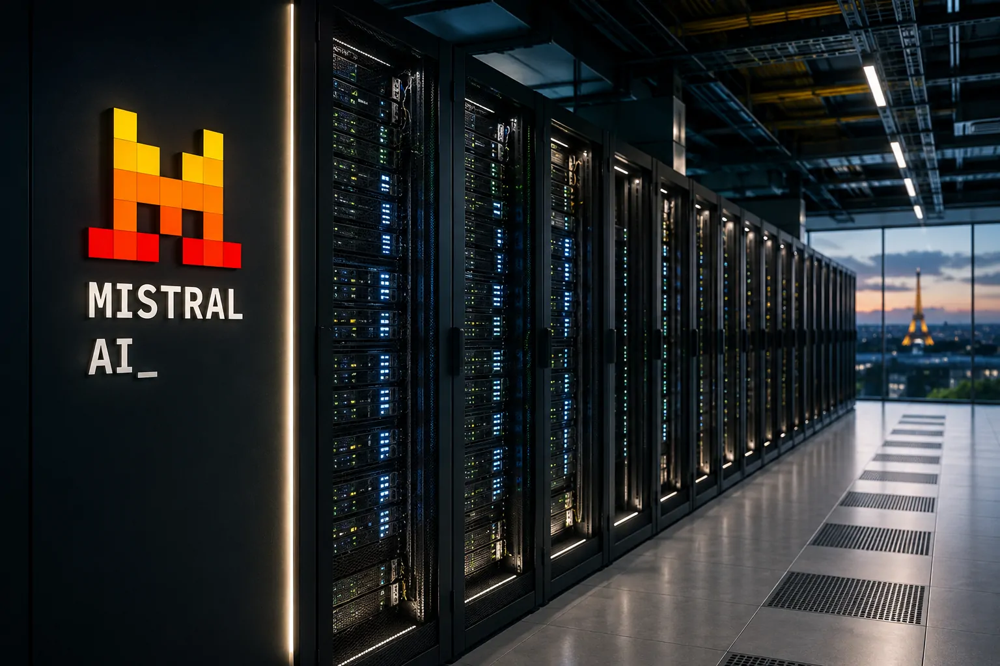
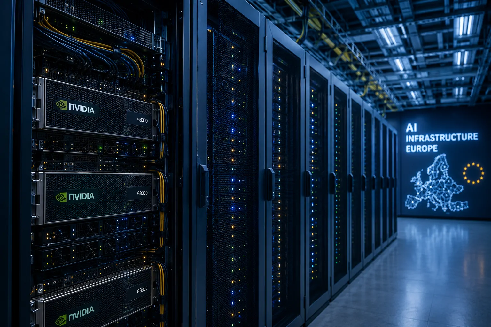
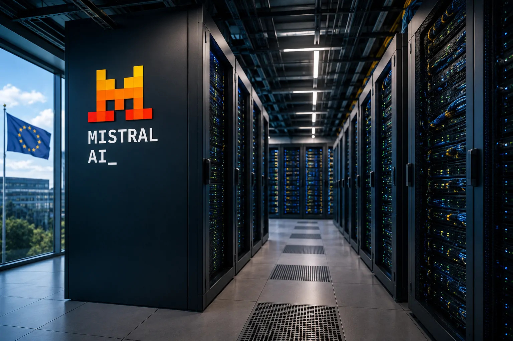

*Durante anos, a disputa pela inteligência artificial foi apresentada como uma corrida por modelos cada vez mais avançados. Agora, a infraestrutura que permite treinar e executar esses modelos está se tornando tão estratégica quanto a própria tecnologia. É nesse ponto que a Mistral AI está tentando mudar sua posição na Europa.*

## A Mistral AI está transformando infraestrutura em parte central de sua estratégia

*Infraestrutura de computação para IA está se tornando uma peça estratégica da disputa tecnológica europeia.*

### A infraestrutura passa a fazer parte da estratégia

**A Mistral AI está transformando infraestrutura de computação em uma parte central de sua estratégia de crescimento na Europa.** A empresa francesa está ampliando sua infraestrutura de computação no continente e estabeleceu como objetivo chegar a **1 GW de capacidade de computação até 2030**.

A meta coloca a empresa em uma disputa que vai muito além dos modelos de IA: a corrida por energia, GPUs, data centers e capacidade de processamento.

### O que existe por trás de um modelo de IA

Para entender a importância desse movimento, é preciso separar o modelo de IA da infraestrutura que o executa. Um modelo como os utilizados em assistentes de IA precisa de milhares de processadores especializados para aprender durante o treinamento e, depois, responder às solicitações dos usuários durante a chamada inferência.

Esses processadores são principalmente **GPUs**, chips capazes de executar muitas operações matemáticas em paralelo. Quanto mais avançado é o modelo e maior é a quantidade de usuários, maior tende a ser a necessidade de computação.

A **Mistral AI** já opera nessa direção com o **Mistral Compute**, sua infraestrutura de GPU voltada a treinamento e inferência em escala. A empresa informa uma capacidade soberana de **200 MW na União Europeia até 2027**, mostrando que a meta de 1 GW não começa do zero.

## Por que 1 GW pode ser tão importante para a inteligência artificial europeia?

### Uma escala muito maior de computação

**1 GW representa uma escala gigantesca de infraestrutura de computação para IA**, porque envolve não apenas servidores, mas também energia, refrigeração, redes de alta velocidade, sistemas de armazenamento e instalações capazes de manter milhares de GPUs funcionando continuamente.

A diferença para um data center convencional está na densidade computacional. Os grandes sistemas de IA concentram enormes quantidades de processamento em espaços relativamente compactos, o que aumenta a demanda por energia e sistemas avançados de refrigeração.

### Por que os data centers precisam mudar

A própria **Mistral AI** argumenta que a Europa precisa de infraestrutura construída especificamente para IA. Em seu plano para a soberania tecnológica europeia, a empresa destaca que data centers tradicionais não foram projetados para as cargas extremamente densas dos modelos de fronteira.

Isso explica por que a discussão sobre **1 GW** não deve ser interpretada apenas como uma quantidade de eletricidade. Na prática, a meta representa a tentativa de construir uma base computacional capaz de sustentar treinamento, inferência e serviços empresariais de IA em grande escala.

## A Europa quer reduzir a dependência de infraestrutura estrangeira

### A questão da soberania tecnológica

**A principal razão estratégica para essa expansão é reduzir a dependência europeia de infraestrutura controlada por empresas estrangeiras.** A Europa possui universidades, pesquisadores, empresas e um enorme mercado consumidor, mas uma parte relevante da computação avançada utilizada por aplicações de IA está ligada a grandes provedores de tecnologia dos Estados Unidos.

Esse problema ficou mais evidente à medida que a IA passou de uma tecnologia experimental para uma infraestrutura econômica. Bancos, indústrias, empresas de software, governos e organizações de defesa passaram a depender de modelos capazes de processar grandes volumes de dados.

### O risco de depender de capacidade externa

Nesse cenário, depender exclusivamente de infraestrutura externa pode criar riscos de custo, disponibilidade, governança de dados e até de continuidade operacional.

A estratégia da **Mistral AI** também precisa ser entendida dentro de uma mudança maior no mercado. Empresas de IA estão tentando controlar mais partes da cadeia tecnológica, desde os modelos até a infraestrutura necessária para executá-los.

O movimento aparece em diferentes formatos. Enquanto a Mistral amplia sua capacidade computacional, outras empresas estão aumentando investimentos em data centers e chips. A corrida deixou de ser apenas sobre quem possui o melhor modelo e passou a envolver quem consegue garantir computação suficiente para sustentar milhões ou bilhões de operações.

Esse contexto ajuda a explicar por que a Mistral já vinha adotando uma estratégia mais ampla de infraestrutura e serviços corporativos, movimento analisado anteriormente pelo **Notícia Tech** em sua cobertura sobre a estratégia full-stack da empresa: **[a Mistral AI está tentando controlar mais partes da infraestrutura necessária para agentes e aplicações de IA](https://noticiatech.com.br/inteligencia-artificial/mistral-ai-estrategia-full-stack-infraestrutura-agentes-ia/)**.

## A corrida por infraestrutura pode ser tão importante quanto a corrida pelos modelos

### Computação virou ativo estratégico

**A grande mudança é que computação passou a ser um ativo estratégico da indústria de IA.** Ter um modelo competitivo não basta se a empresa não consegue disponibilizar esse modelo com velocidade, escala e custo controlado.

Para empresas que utilizam IA, isso tem uma consequência direta: a qualidade de um serviço de inteligência artificial passa a depender também da infraestrutura que existe por trás dele.

Uma companhia pode escolher um modelo excelente, mas ainda precisa considerar onde ele será executado, quanto custa cada operação, qual é a disponibilidade da capacidade computacional e quais regras se aplicam aos dados processados.

### O impacto ultrapassa a Mistral AI

É por isso que a expansão da **Mistral AI** interessa ao mercado corporativo mesmo para empresas que nunca utilizaram seus modelos. Se houver mais capacidade de computação competitiva na Europa, empresas europeias podem ganhar novas alternativas para executar cargas de IA sem depender exclusivamente dos mesmos provedores globais.

O efeito também pode chegar ao mercado de data centers. A expansão de IA aumenta a demanda por terrenos, energia, redes elétricas, refrigeração e componentes especializados. A infraestrutura digital começa, assim, a disputar espaço diretamente com outras prioridades industriais e energéticas.

O movimento da **Amazon**, por exemplo, mostra como a escala energética já se tornou parte da estratégia de IA das grandes empresas. A construção de infraestrutura para alimentar data centers deixou de ser uma questão secundária e passou a fazer parte da própria corrida tecnológica. **[A expansão da infraestrutura energética da Amazon mostra por que energia está se tornando um dos principais gargalos da IA](https://noticiatech.com.br/inteligencia-artificial/amazon-usina-765-gw-alimentar-ia-data-centers/)**.

## O que muda para empresas e usuários nos próximos anos

### Mais opções para empresas europeias

**Para empresas, a consequência mais importante pode ser o aumento das opções de infraestrutura para IA dentro da própria Europa.** Isso pode ser relevante para organizações que precisam combinar desempenho, localização dos dados, requisitos regulatórios e continuidade operacional.

Para profissionais de tecnologia, a mudança significa que conhecimentos sobre modelos de IA serão cada vez mais acompanhados por decisões relacionadas a **GPU, nuvem, data centers, inferência e arquitetura de computação**.

### O impacto para quem usa IA

Para usuários finais, o impacto será menos visível, mas pode aparecer na forma de serviços de IA mais disponíveis, novos provedores regionais e maior competição entre plataformas.

O ponto central é que a infraestrutura tende a deixar de ser uma camada invisível. À medida que os modelos ficam maiores e os agentes de IA executam mais tarefas continuamente, a capacidade de computação passa a determinar quanto uma empresa consegue oferecer, a que velocidade e por qual preço.

A Mistral AI está apostando que essa mudança abrirá espaço para uma alternativa europeia. A questão agora é saber se a empresa conseguirá transformar a meta de **1 GW até 2030** em infraestrutura efetivamente construída, conectada à rede elétrica e ocupada por cargas de IA suficientes para sustentar o investimento.

## A meta de 1 GW também revela o novo problema da IA: energia

*Clusters de GPUs para IA exigem grande capacidade energética, refrigeração e redes de alta velocidade.*

### Energia passa a limitar a expansão

**A expansão da Mistral AI mostra que a próxima etapa da corrida por inteligência artificial será limitada não apenas por chips, mas também pela capacidade de fornecer energia e operar data centers adequados para IA.**

Isso ajuda a colocar a meta de **1 GW até 2030** em perspectiva.

Não se trata simplesmente de instalar mais computadores. Um cluster de IA precisa receber energia de forma estável, dissipar o enorme calor produzido pelos processadores, conectar milhares de GPUs por redes de alta velocidade e manter tudo funcionando continuamente.

### A infraestrutura exige capital e escala

A **Mistral AI** já está avançando nessa direção. Em junho de 2026, a empresa anunciou uma parceria com o **Campus AI**, na França, para garantir inicialmente 96 MW e chegar a até **200 MW de capacidade de computação**. A infraestrutura deverá atender tanto ao treinamento dos modelos da Mistral quanto aos serviços de inferência para clientes.

A empresa também revelou um data center próximo de Paris com **13.800 GPUs NVIDIA GB300**, associado a uma capacidade energética de 44 MW. O projeto foi financiado por meio de uma operação de dívida de US$ 830 milhões.

Isso mostra a dimensão financeira do problema.

Construir infraestrutura para IA exige investimentos muito antes de existir receita suficiente para recuperar o capital. Por isso, a expansão da Mistral não é apenas uma decisão tecnológica. É também uma aposta financeira de longo prazo sobre o crescimento da demanda por computação de IA.

## A Mistral não está tentando fabricar tudo sozinha

### Soberania não significa independência completa

**Soberania de IA não significa que a Europa precise fabricar todos os chips utilizados nos servidores.** Esse é um ponto importante para entender o movimento.

A infraestrutura da **Mistral AI** utiliza GPUs da **NVIDIA**, empresa americana que domina boa parte do mercado de aceleradores utilizados no treinamento e na inferência de modelos avançados. A própria plataforma Mistral Compute oferece acesso a GPUs como **GB200, GB300 e B300**, além de CPUs Grace e x86.

Isso cria uma aparente contradição: como uma infraestrutura pode ser chamada de soberana se parte fundamental de seu hardware vem dos Estados Unidos?

A resposta está no significado de soberania utilizado nesse contexto.

### O que a Europa realmente quer controlar

A intenção é aumentar o controle europeu sobre a **infraestrutura, os dados, a operação e a disponibilidade dos serviços**, e não necessariamente eliminar todos os fornecedores estrangeiros da cadeia.

Essa distinção será importante nos próximos anos. Uma Europa capaz de hospedar seus próprios modelos e dados terá mais autonomia do que uma Europa totalmente dependente de infraestrutura estrangeira. Mas isso ainda não significa independência completa.

A cadeia continua envolvendo fabricantes de GPUs, equipamentos de rede, memória, sistemas de armazenamento, componentes elétricos e tecnologias de fabricação que estão distribuídos globalmente.

## Microsoft entra na equação e mostra o tamanho da oportunidade

### Infraestrutura europeia e plataformas globais podem coexistir

**A expansão da Mistral também chamou a atenção da Microsoft, que fechou em julho de 2026 um acordo multibilionário para apoiar a expansão da infraestrutura europeia da empresa francesa.** O acordo permite que clientes do Azure utilizem a capacidade computacional da Mistral na França, enquanto os modelos da empresa passam a ter integração mais ampla com ferramentas da Microsoft.

Isso é relevante porque demonstra que a chamada **IA soberana** não precisa significar isolamento tecnológico.

Uma empresa europeia pode controlar uma parte crítica da infraestrutura e, ao mesmo tempo, trabalhar com uma gigante americana para ampliar distribuição e acesso empresarial.

### O que a parceria representa para o mercado

Para a **Microsoft**, a vantagem é ter mais capacidade computacional localizada na Europa e uma alternativa para clientes de setores regulados.

Para a **Mistral**, a parceria amplia o mercado potencial para sua infraestrutura e seus modelos.

Para empresas europeias, surge uma terceira possibilidade: utilizar tecnologias globais sem necessariamente concentrar toda a infraestrutura em provedores estrangeiros.

Essa combinação pode ser particularmente importante para bancos, governos, indústria, defesa e outras organizações que precisam lidar com requisitos específicos de localização e governança de dados.

## O verdadeiro teste será transformar capacidade em demanda

### Construir infraestrutura não garante retorno

**Construir 1 GW de capacidade é apenas metade do desafio; a outra metade será encontrar demanda suficiente para utilizar essa infraestrutura de forma economicamente sustentável.**

Esse talvez seja o ponto mais importante para acompanhar na estratégia da Mistral.

Uma infraestrutura gigantesca só faz sentido se houver empresas, governos e desenvolvedores dispostos a pagar pela computação.

O mercado de IA está crescendo rapidamente, mas também existe uma corrida global para construir data centers. Isso significa que a Mistral precisará competir não apenas com outras empresas de IA, mas também com grandes provedores de nuvem que possuem enorme capacidade financeira.

### Onde a Mistral pode encontrar vantagem

A vantagem europeia pode estar justamente em outro lugar.

Empresas que precisam manter dados dentro da Europa, governos que buscam maior controle tecnológico e setores regulados que não querem depender exclusivamente de infraestrutura estrangeira podem representar um mercado específico para a Mistral.

Nesse cenário, a empresa não precisa necessariamente vencer **OpenAI, Google ou Anthropic em todos os segmentos** para tornar sua estratégia relevante.

Ela precisa construir uma posição suficientemente forte em **IA empresarial, infraestrutura soberana e serviços para organizações que valorizam controle e localização**.

É uma estratégia diferente da simples disputa por qual chatbot tem mais usuários.

## O que pode acontecer nos próximos meses

### A execução será mais importante que os anúncios

**Nos próximos meses, o principal indicador não será apenas o anúncio de novos modelos da Mistral, mas a velocidade com que sua capacidade computacional será colocada em operação e contratada por clientes.**

A empresa já apresenta uma trajetória concreta: sua plataforma Mistral Compute informa que começou a desenvolver a infraestrutura em 2025, colocou os primeiros racks GB200 em operação, avançou para GB300 e iniciou operações de produção em 2026. A meta anunciada é chegar a **200 MW de capacidade soberana na União Europeia até 2027**.

Se essa expansão continuar, a Mistral poderá se tornar mais do que uma fabricante de modelos.

### De empresa de IA a infraestrutura de IA

Ela poderá funcionar como uma das principais camadas europeias de **compute para inteligência artificial**, fornecendo a infraestrutura necessária para que outras empresas também desenvolvam e executem aplicações de IA.

Esse efeito pode ser maior do que parece.

Quanto mais empresas utilizarem a infraestrutura, maior será a justificativa econômica para novos investimentos. Mais capacidade pode atrair mais clientes, que por sua vez ajudam a financiar novas instalações.

É um ciclo parecido com o que aconteceu com a infraestrutura de nuvem, mas agora com uma diferença fundamental: a demanda por IA exige uma concentração de energia e processamento muito maior.

## A Europa está tentando construir uma alternativa antes que a dependência fique maior

### A expansão da Mistral acontece junto com uma estratégia europeia

**O movimento da Mistral acontece em um momento em que a própria União Europeia está aumentando seus investimentos em infraestrutura de IA.** Em agosto de 2026, o bloco anunciou um plano de cerca de €10 bilhões para apoiar sete grandes "AI gigafactories", com expectativa de atrair outros €20 bilhões em investimento privado.

Isso muda a interpretação da estratégia da Mistral.

A empresa não está construindo infraestrutura em um continente parado. Ela está tentando se posicionar dentro de uma transformação mais ampla da política industrial europeia.

A questão deixou de ser apenas **"qual empresa europeia criará o melhor modelo?"**.

### A disputa agora envolve a infraestrutura

Agora também envolve perguntas como:

**Quem fornecerá a computação?**

**Quem controlará os data centers?**

**Onde os dados serão processados?**

**Quem terá acesso aos chips?**

**Quem pagará pela energia necessária para executar tudo isso?**

E, principalmente, **quanto da cadeia econômica da inteligência artificial permanecerá dentro da Europa?**

Essa mudança de perspectiva é fundamental para empresas e profissionais.

A inteligência artificial está deixando de ser apenas um software que pode ser acessado por uma API. Ela está se tornando uma infraestrutura física, energética e econômica.

A Mistral está apostando que, se a Europa quiser ter influência real nessa nova economia, precisará construir essa infraestrutura dentro de suas próprias fronteiras.

## O próximo capítulo da disputa será decidido nos data centers

*Data centers especializados podem se tornar uma das principais bases da soberania tecnológica europeia na inteligência artificial.*

### A disputa deixou de ser apenas sobre modelos

**A meta de 1 GW coloca a Mistral AI em uma disputa muito maior do que a competição entre modelos de linguagem.** Ela está tentando garantir uma posição na camada física que sustenta toda a economia de IA.

Isso não elimina a dependência de fornecedores estrangeiros, não garante que a empresa alcançará sua meta e também não significa que a Europa já tenha conquistado soberania tecnológica.

Mas muda o jogo porque transforma a infraestrutura em uma prioridade estratégica.

### O que pode mudar para o mercado

Se a Mistral conseguir executar sua expansão, a Europa poderá ter uma capacidade muito maior de desenvolver, treinar e executar sistemas de IA sob controle europeu. Se outros projetos acompanharem esse movimento, o continente poderá criar uma camada própria de computação capaz de sustentar empresas, governos e aplicações críticas.

E esse pode ser o verdadeiro significado da corrida por **1 GW**: não apenas construir mais servidores, mas tentar garantir que a próxima fase da inteligência artificial não seja desenvolvida exclusivamente sobre uma infraestrutura controlada por outros países.

Para a **Mistral AI**, os próximos anos serão o teste de uma aposta ambiciosa: transformar uma empresa europeia de modelos de IA em uma peça relevante da infraestrutura computacional que sustentará a própria indústria europeia.

Para o mercado, a mensagem é ainda maior. **Na nova corrida da IA, quem controla a computação pode ter quase tanta importância quanto quem controla os modelos.**

---