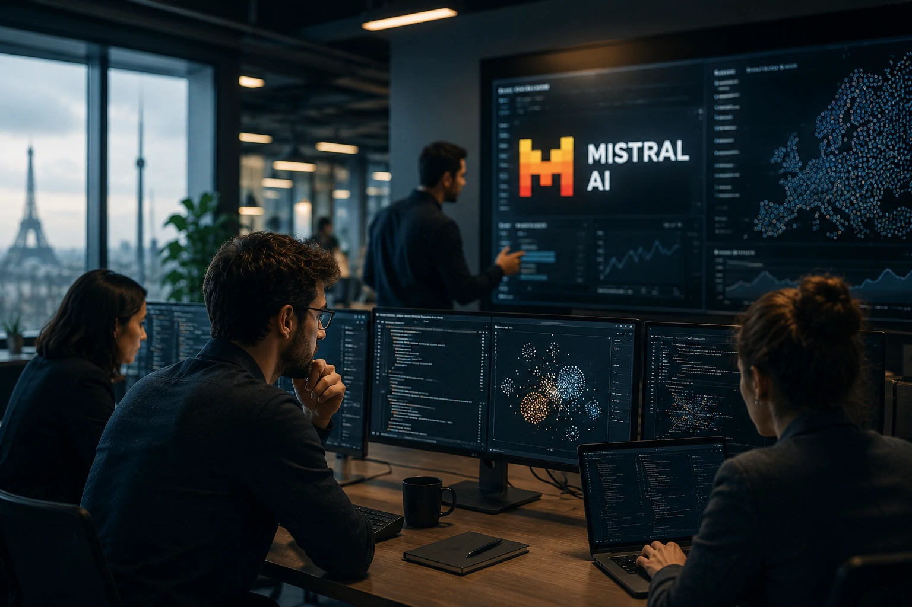
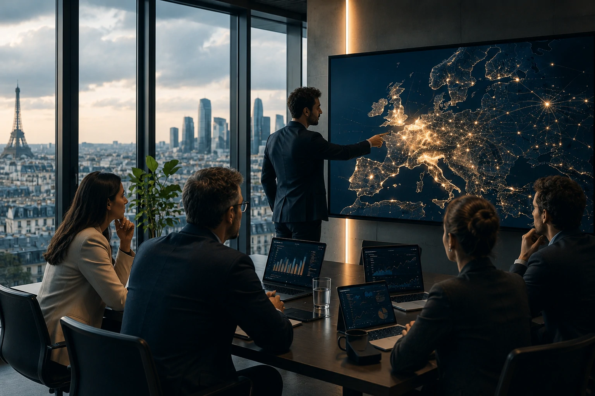
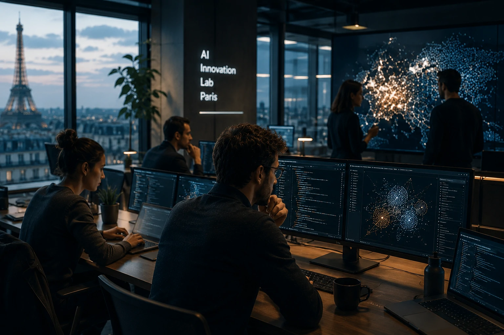

*A corrida pela liderança em **inteligência artificial** deixou de ser apenas uma disputa por modelos mais avançados. Agora, empresas avaliam controle tecnológico, independência estratégica e novos fornecedores capazes de competir em escala global.*

*Nesse cenário, a **Mistral AI** surge como uma das principais apostas europeias para desafiar gigantes como **OpenAI**, **Google** e **Anthropic**, criando uma nova fase da competição pela infraestrutura da IA.*

## Mistral AI ganha força em meio à busca por alternativas à OpenAI

A **Mistral AI** representa uma mudança importante no mercado de **inteligência artificial generativa**: empresas começam a buscar mais opções além dos grandes fornecedores tradicionais.

*Empresas avaliam novos modelos de IA para reduzir dependência de poucos fornecedores globais.*

Durante os primeiros anos da popularização da IA generativa, grande parte da atenção ficou concentrada na **OpenAI**, principalmente após o avanço do **ChatGPT**.

A empresa acelerou a adoção mundial da tecnologia e colocou os modelos de linguagem no centro das estratégias corporativas.

Porém, conforme a IA passou de experimento para infraestrutura essencial, organizações começaram a avaliar um novo risco: depender de apenas uma plataforma.

### A estratégia diferente da Mistral AI

A **Mistral AI** cresceu apostando em modelos eficientes, soluções empresariais e uma abordagem que conversa diretamente com empresas preocupadas com controle tecnológico.

Diferente de uma fase inicial marcada apenas pela busca do modelo mais poderoso, o mercado começa a valorizar fatores como:

- flexibilidade;
- custo operacional;
- privacidade;
- integração corporativa;
- independência estratégica.

Esse movimento mostra que a próxima etapa da IA pode não ser definida por uma única vencedora.

### Por que a competição entre modelos de IA está mudando

A disputa atual envolve algo maior do que chatbots.

Os modelos de IA estão se tornando uma camada estratégica de software usada para automatizar processos, analisar dados e criar novos produtos digitais.

Esse movimento acompanha a evolução de tecnologias como os **agentes de IA**, que ampliam a capacidade das empresas de transformar inteligência artificial em sistemas autônomos.

Leia também: [O que é Agentic AI? Guia completo sobre agentes de inteligência artificial](https://noticiatech.com.br/inteligencia-artificial/o-que-e-agentic-ai-guia-completo-agentes-ia/)

## A busca por IA soberana aumenta a importância da Mistral AI

A ascensão da **Mistral AI** também está conectada ao crescimento do debate sobre **soberania de inteligência artificial**.

*Controle tecnológico se tornou um fator estratégico na adoção corporativa de inteligência artificial.*

Governos e empresas começaram a questionar quem controla os principais modelos, onde os dados são processados e quais fornecedores terão influência sobre a próxima geração da computação.

Essa preocupação ganhou força porque a IA deixou de ser apenas uma ferramenta.

Ela começa a funcionar como uma infraestrutura digital comparável à computação em nuvem.

### Europa busca espaço próprio na corrida da inteligência artificial

A Europa tenta construir uma posição mais forte dentro do mercado global de IA.

Historicamente, grande parte das plataformas digitais ficou concentrada em empresas dos Estados Unidos.

Com a inteligência artificial, existe uma tentativa de evitar repetir essa dependência.

Nesse contexto, a **Mistral AI** se tornou uma das empresas mais observadas por representar uma alternativa europeia em um setor dominado por gigantes americanas.

### Modelos abertos entram na estratégia das empresas

Outro ponto importante da disputa envolve o avanço dos modelos mais flexíveis.

Algumas organizações querem maior capacidade de personalização e controle sobre como a IA será aplicada internamente.

Essa tendência se conecta ao crescimento de arquiteturas empresariais mais complexas, incluindo automação, agentes inteligentes e integração entre sistemas.

## Como a disputa entre Mistral AI e grandes empresas muda o mercado

A competição envolvendo **Mistral AI**, **OpenAI**, **Google** e outros laboratórios mostra que a próxima fase da inteligência artificial será definida pelo ecossistema, não apenas pelo modelo mais avançado.

*A nova fase da inteligência artificial envolve plataformas, infraestrutura e estratégia empresarial.*

Empresas não estão escolhendo IA apenas pela capacidade técnica.

A decisão começa a envolver questões estratégicas como governança, segurança, integração e dependência tecnológica.

Assim como ocorreu com a computação em nuvem, muitas organizações podem adotar uma estratégia com múltiplos fornecedores.

### O futuro pode ser multi-modelo

Durante anos, empresas construíram suas operações digitais usando diferentes provedores de tecnologia.

A mesma lógica começa a aparecer na inteligência artificial.

Uma organização pode utilizar diferentes modelos para diferentes tarefas:

- atendimento ao cliente;
- análise de documentos;
- desenvolvimento de software;
- automação interna;
- pesquisa corporativa.

Essa abordagem reduz riscos e permite escolher a melhor tecnologia para cada necessidade.

### O impacto para OpenAI e outras líderes de IA

O crescimento de empresas como a **Mistral AI** não significa necessariamente uma substituição da **OpenAI**.

O cenário mais provável é uma disputa por diferentes segmentos do mercado.

Enquanto alguns clientes priorizam desempenho máximo, outros buscam controle, personalização ou integração com ambientes específicos.

Essa fragmentação cria espaço para diferentes estratégias dentro da economia da inteligência artificial.

A disputa também acontece enquanto grandes empresas aumentam investimentos em infraestrutura, talentos e novos produtos.

Leia também: [John Jumper deixa Google DeepMind para Anthropic e reforça guerra por talentos de IA](https://noticiatech.com.br/inteligencia-artificial/john-jumper-google-deepmind-anthropic-guerra-talentos-ia/)

## Por que a ascensão da Mistral AI indica uma nova fase da inteligência artificial

O crescimento da **Mistral AI** mostra que a inteligência artificial entrou em uma etapa mais madura, onde empresas analisam tecnologia como decisão estratégica de longo prazo.

Não basta apenas ter acesso ao modelo mais popular.

Organizações querem entender quem controla a infraestrutura, quais custos existirão no futuro e como proteger seus próprios dados.

### Inteligência artificial vira infraestrutura empresarial

A IA começa a ocupar uma posição parecida com sistemas essenciais dentro das empresas.

Ela deixa de ser apenas uma ferramenta adicional e passa a participar diretamente de processos críticos.

Isso aumenta a importância de decisões sobre fornecedores, arquitetura tecnológica e governança.

Empresas que tratam IA como infraestrutura tendem a avaliar diferentes alternativas antes de criar dependência profunda de uma única plataforma.

### A próxima disputa será pela confiança das empresas

A corrida da inteligência artificial não será definida somente por velocidade ou tamanho dos modelos.

A próxima etapa será determinada pela capacidade das empresas de IA em oferecer:

- segurança;
- confiabilidade;
- controle;
- integração;
- retorno real para negócios.

A ascensão da **Mistral AI** representa exatamente essa mudança.

A inteligência artificial está deixando uma fase dominada pela descoberta da tecnologia e entrando em um período onde estratégia, independência e confiança terão peso cada vez maior nas decisões corporativas.

---