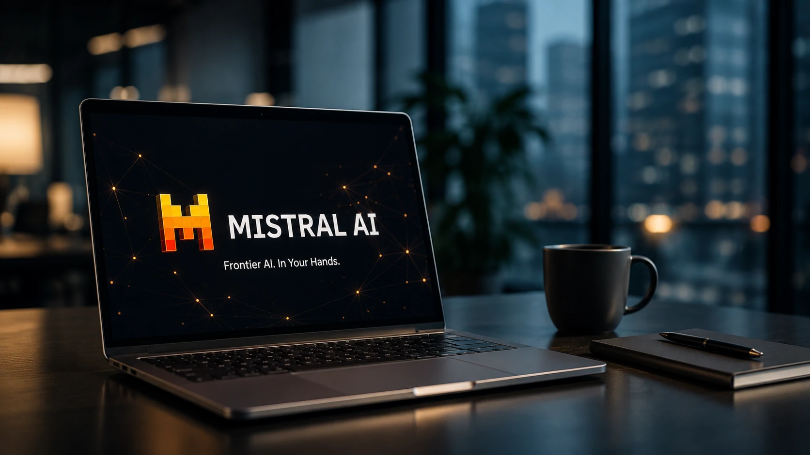
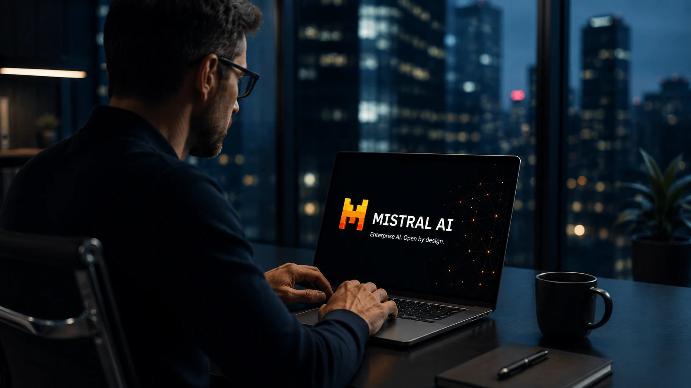
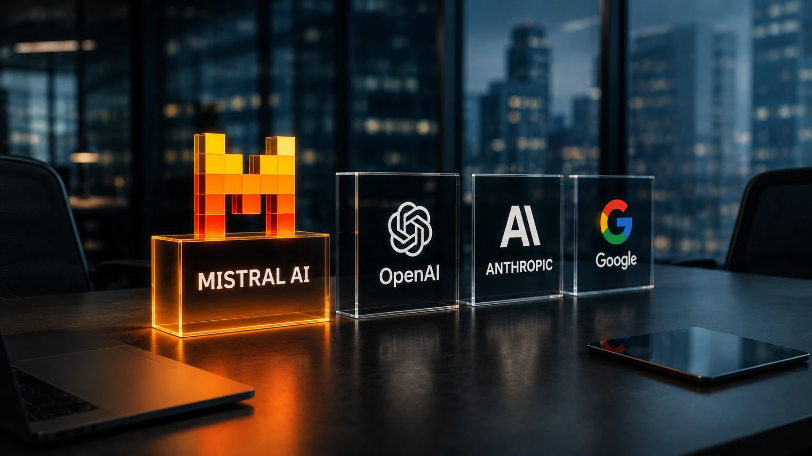

*Enquanto boa parte da atenção do mercado continua concentrada em **OpenAI**, **Anthropic** e **Google**, uma empresa europeia vem acelerando silenciosamente sua expansão. O crescimento recente da **Mistral AI** nas buscas mostra que organizações e profissionais passaram a enxergar a companhia francesa como uma das principais alternativas na corrida pela inteligência artificial corporativa.*

## A Mistral AI deixou de ser uma promessa e passou a disputar espaço entre as gigantes da IA

Empresas passaram a observar a **Mistral AI** como uma concorrente relevante porque ela reúne características que ganharam importância no mercado corporativo: modelos eficientes, maior flexibilidade de implantação e uma estratégia voltada para clientes empresariais.

*O crescimento da empresa francesa chama a atenção de organizações que buscam alternativas aos grandes fornecedores de inteligência artificial.*

Durante boa parte de 2024 e 2025, o debate sobre inteligência artificial ficou concentrado entre **OpenAI**, **Google** e **Anthropic**. Em 2026, porém, a dinâmica começou a mudar.

A **Mistral AI** aparece entre as empresas com maior crescimento de interesse do mercado, indicando que gestores, desenvolvedores e empresas passaram a pesquisar com mais frequência suas soluções, APIs e modelos corporativos.

### O crescimento vai além da curiosidade

O aumento das buscas não significa apenas maior visibilidade.

Ele costuma indicar que empresas estão avaliando fornecedores, comparando tecnologias e estudando alternativas antes de iniciar novos projetos de inteligência artificial.

Esse comportamento costuma anteceder movimentos de adoção em larga escala.

### O mercado procura reduzir dependência

Outro fator importante é a busca por maior diversificação.

Muitas organizações não querem depender exclusivamente de um único fornecedor de IA para aplicações críticas.

Isso cria espaço para empresas como a **Mistral AI**, que oferecem novas opções para desenvolvimento de agentes inteligentes, copilotos corporativos e aplicações baseadas em modelos de linguagem.

A tendência também dialoga com movimentos recentes observados na indústria, como a ampliação da concorrência entre plataformas empresariais de IA e o fortalecimento de arquiteturas abertas.

Para entender como esse mercado vem evoluindo, vale conferir também a análise publicada pelo Notícia Tech sobre [Mistral AI acelera estratégia enterprise e amplia disputa contra OpenAI no mercado corporativo](https://noticiatech.com.br/inteligencia-artificial/mistral-ai-estrategia-enterprise-disputa-openai/).

## A estratégia da Mistral AI é diferente das gigantes americanas

A principal diferença da **Mistral AI** está no posicionamento.

*A companhia aposta em flexibilidade, modelos eficientes e maior liberdade para integração corporativa.*

Enquanto empresas como **OpenAI** e **Google** concentram grande parte do ecossistema em plataformas próprias, a companhia francesa investe em um modelo mais aberto para adoção empresarial.

Essa estratégia atrai organizações que desejam maior controle sobre infraestrutura, custos e governança dos modelos utilizados.

### Foco em modelos open weight

Grande parte da reputação da empresa foi construída sobre modelos disponibilizados com maior abertura para customizações.

Isso permite que organizações adaptem soluções para necessidades específicas sem depender integralmente da infraestrutura de terceiros.

Esse diferencial é especialmente valorizado por empresas dos setores financeiro, industrial, saúde e governo.

### Forte presença no mercado enterprise

Outro aspecto relevante é o foco comercial.

A empresa concentra esforços em APIs, contratos corporativos e integração com plataformas empresariais, em vez de competir apenas por usuários finais.

Essa estratégia aproxima a companhia do segmento que concentra os maiores investimentos em inteligência artificial.

Esse movimento acompanha uma tendência maior do setor, na qual arquiteturas como o **MCP** passam a facilitar integrações entre diferentes modelos e aplicações empresariais, tema aprofundado no artigo do Notícia Tech sobre [como implementar MCP em empresas](https://noticiatech.com.br/inteligencia-artificial/como-implementar-mcp-empresas-arquitetura-integracao-agentes-ia/).

## A ascensão da Mistral AI aumenta a competição e acelera a inovação no mercado corporativo

A expansão da **Mistral AI** representa mais do que o crescimento de uma empresa. Ela evidencia que o mercado de **inteligência artificial corporativa** está deixando de ser dominado por poucos fornecedores e entrando em uma fase de concorrência mais intensa.

*O avanço da Mistral AI amplia a competição entre fornecedores de modelos de linguagem voltados ao mercado empresarial.*

Esse cenário beneficia principalmente as empresas que pretendem investir em IA nos próximos anos. Quanto maior a concorrência entre fornecedores, maior tende a ser a evolução dos modelos, das integrações, da qualidade dos serviços e da relação entre desempenho e custo.

### Empresas ganham mais opções estratégicas

Até pouco tempo, muitas organizações avaliavam apenas soluções da **OpenAI**, da **Anthropic** ou do **Google**.

Com o crescimento da **Mistral AI**, os departamentos de tecnologia passam a considerar um número maior de alternativas antes de definir a arquitetura de seus projetos.

Essa mudança reduz o risco de dependência tecnológica e amplia o poder de negociação das empresas durante processos de contratação.

### O mercado passa a valorizar flexibilidade

Outro fator importante é a capacidade de adaptar modelos de IA às necessidades específicas de cada negócio.

Empresas que lidam com dados sensíveis, exigências regulatórias ou infraestrutura própria costumam buscar soluções que permitam maior controle sobre implantação, segurança e personalização.

Nesse contexto, fornecedores capazes de oferecer diferentes formas de implementação tendem a ganhar espaço na estratégia de transformação digital das organizações.

## O crescimento da Mistral AI reforça uma tendência que deve continuar nos próximos anos

A rápida evolução da **Mistral AI** mostra que a corrida pela inteligência artificial está longe de ser definida.

Enquanto **OpenAI**, **Anthropic** e **Google** continuam ampliando seus ecossistemas, novas empresas passam a disputar contratos corporativos, desenvolver modelos especializados e conquistar espaço em aplicações empresariais cada vez mais complexas.

Mais do que identificar quem lidera hoje, gestores precisam acompanhar quais empresas conseguem inovar de forma consistente, entregar desempenho competitivo e atender às necessidades específicas do mercado corporativo.

Nesse cenário, a **Mistral AI** deixou de ocupar apenas o papel de alternativa e passou a integrar o grupo de organizações que influenciam diretamente os rumos da inteligência artificial empresarial.

Para empresas que planejam investir em agentes inteligentes, automação e modelos de linguagem ao longo de 2026, acompanhar a evolução dessa disputa pode fazer diferença na escolha das tecnologias que sustentarão seus próximos projetos.

---