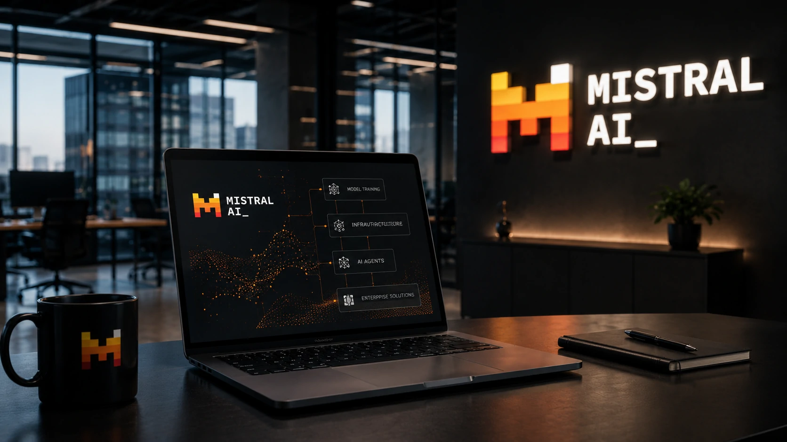
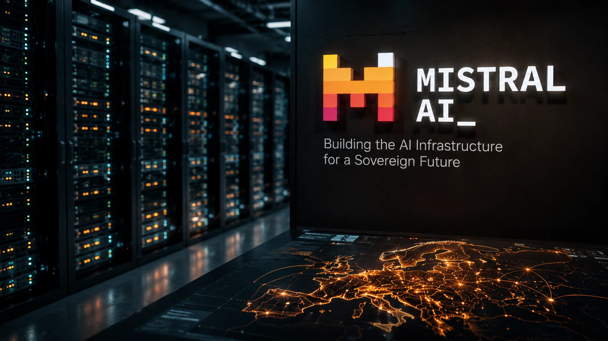
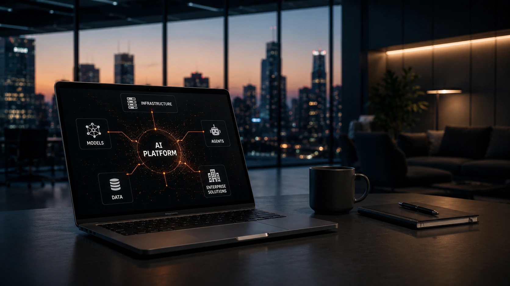

*Enquanto boa parte do mercado acompanha apenas a corrida por modelos cada vez mais poderosos, uma mudança mais profunda começa a redesenhar o setor. A **Mistral AI** sinaliza que pretende disputar não apenas a inteligência dos modelos, mas toda a infraestrutura que sustenta a próxima geração da inteligência artificial corporativa.*

## A estratégia da Mistral AI vai muito além de novos modelos

A **Mistral AI** está deixando claro que sua ambição não é apenas lançar modelos competitivos contra **OpenAI**, **Anthropic** ou **Google**. O objetivo passa a ser construir um ecossistema completo capaz de atender empresas em praticamente todas as camadas da inteligência artificial.

*Nova estratégia coloca a empresa francesa como candidata a disputar toda a cadeia de valor da inteligência artificial.*

Esse movimento aproxima a companhia do conceito conhecido como **full-stack AI**, no qual uma única organização oferece infraestrutura computacional, modelos de linguagem, APIs, agentes inteligentes e ferramentas para implantação em ambientes corporativos.

A mudança representa uma evolução importante para a empresa francesa, que ganhou notoriedade inicialmente pela qualidade técnica de seus modelos de linguagem e pela defesa de uma maior independência tecnológica da Europa em relação às gigantes americanas.

### Muito além dos LLMs

Nos últimos meses, o mercado percebeu que apenas possuir um modelo competitivo deixou de ser suficiente.

Empresas passaram a exigir plataformas completas, capazes de integrar segurança, escalabilidade, governança e implantação em larga escala.

### O mercado enterprise mudou as regras

A adoção corporativa exige muito mais do que desempenho em benchmarks.

Organizações procuram fornecedores capazes de entregar soluções prontas para produção, integração com sistemas internos, agentes especializados e infraestrutura confiável, fatores que elevam significativamente a barreira competitiva.

Esse cenário ajuda a explicar por que a **Mistral AI** amplia seu posicionamento estratégico.

## A disputa deixa de ser apenas por modelos e passa para toda a infraestrutura

A nova fase da inteligência artificial pode ser resumida em uma mudança simples: quem controlar toda a cadeia tecnológica terá vantagens competitivas mais duradouras.

*Infraestrutura, plataformas e agentes inteligentes tornam-se ativos estratégicos na nova fase da inteligência artificial.*

Isso significa investir simultaneamente em capacidade computacional, plataformas de desenvolvimento, APIs, integração empresarial e agentes capazes de executar tarefas complexas de maneira autônoma.

Empresas que conseguirem oferecer esse conjunto tendem a capturar contratos maiores e estabelecer relacionamentos mais duradouros com clientes corporativos.

### Infraestrutura passa a ser diferencial competitivo

Treinar modelos é apenas uma parte do desafio.

Executar aplicações empresariais em larga escala exige data centers, redes de inferência, gerenciamento de custos e arquitetura preparada para operar continuamente.

Essa realidade aproxima a competição entre empresas de IA da lógica tradicional da computação em nuvem.

### Agentes inteligentes ganham protagonismo

Outra prioridade evidente é o avanço dos **agentes de IA**, capazes de executar fluxos completos de trabalho.

Esse movimento dialoga diretamente com a crescente adoção de arquiteturas baseadas em **MCP**, tema explorado pelo Notícia Tech em:

https://noticiatech.com.br/inteligencia-artificial/como-implementar-mcp-empresas-arquitetura-integracao-agentes-ia/

Também se conecta ao crescimento dos **AI SDRs**, que demonstram como agentes autônomos começam a assumir funções comerciais:

https://noticiatech.com.br/automacao/o-que-e-ai-sdr-agentes-ia-vendas-b2b/

## A estratégia da Mistral AI pode redefinir a concorrência no mercado corporativo

A expansão da **Mistral AI** representa uma mudança importante na dinâmica competitiva da inteligência artificial empresarial. Em vez de disputar apenas qualidade de modelos, a empresa busca oferecer uma plataforma integrada para atender organizações que desejam implantar IA em escala.

*Empresas passam a avaliar plataformas completas de inteligência artificial, e não apenas modelos de linguagem.*

Esse movimento acompanha uma tendência observada em todo o setor: clientes corporativos priorizam fornecedores capazes de entregar infraestrutura, segurança, integração e governança em um único ecossistema.

### A competição deixa de ser apenas tecnológica

Nos primeiros anos da IA generativa, a disputa era centrada em desempenho de modelos.

Agora, critérios como custo operacional, facilidade de integração, privacidade de dados e velocidade de implantação passaram a ter peso semelhante na decisão das empresas.

Para organizações que desenvolvem aplicações críticas, uma plataforma completa costuma gerar mais valor do que simplesmente utilizar o modelo com maior pontuação em benchmarks.

### A Europa busca reduzir sua dependência tecnológica

Outro aspecto estratégico da nova postura da **Mistral AI** é o fortalecimento da indústria europeia de inteligência artificial.

Historicamente, grande parte da infraestrutura utilizada por empresas do continente depende de fornecedores norte-americanos.

Ao ampliar seu portfólio, a startup francesa tenta oferecer uma alternativa regional para organizações preocupadas com soberania digital, conformidade regulatória e localização de dados.

Esse posicionamento pode ganhar relevância à medida que legislações sobre inteligência artificial evoluem em diferentes mercados.

## O que essa mudança significa para empresas que investem em IA

Empresas interessadas em projetos de inteligência artificial passam a contar com um mercado mais competitivo e diversificado.

Quanto maior o número de fornecedores capazes de oferecer soluções completas, maior tende a ser a pressão por inovação, redução de custos e melhoria dos serviços.

### Mais opções para projetos corporativos

Negócios que desenvolvem agentes inteligentes, assistentes internos, automação de processos ou plataformas próprias deixam de depender exclusivamente de poucos fornecedores globais.

Essa concorrência amplia as possibilidades de escolha conforme requisitos técnicos, orçamento e políticas de governança.

Também fortalece estratégias de múltiplos fornecedores, reduzindo riscos associados à concentração tecnológica.

### O mercado continuará acelerando

A tendência é que outras empresas sigam caminho semelhante.

Modelos de linguagem tendem a se tornar apenas um dos componentes da arquitetura de IA, enquanto plataformas completas passam a concentrar a maior parte do valor agregado.

Esse cenário também reforça temas já abordados pelo Notícia Tech sobre **AI Governance**, fundamentais para organizações que desejam escalar projetos de forma segura:

https://noticiatech.com.br/inteligencia-artificial/o-que-e-ai-governance-guia-completo-empresas-inteligencia-artificial/

Da mesma forma, a crescente adoção de modelos próprios e arquiteturas baseadas em **RAG** tende a ganhar importância à medida que empresas buscam maior controle sobre seus dados:

https://noticiatech.com.br/inteligencia-artificial/rag-modelos-proprios-dados-corporativos-empresas/

A estratégia adotada pela **Mistral AI** mostra que a próxima fase da inteligência artificial corporativa será disputada muito além da qualidade dos modelos de linguagem. Infraestrutura, plataformas, agentes inteligentes e governança passam a formar um conjunto inseparável para empresas que desejam transformar IA em vantagem competitiva. Nesse contexto, organizações capazes de entregar soluções completas tendem a ocupar posições cada vez mais relevantes em um mercado que continua evoluindo em ritmo acelerado.

---