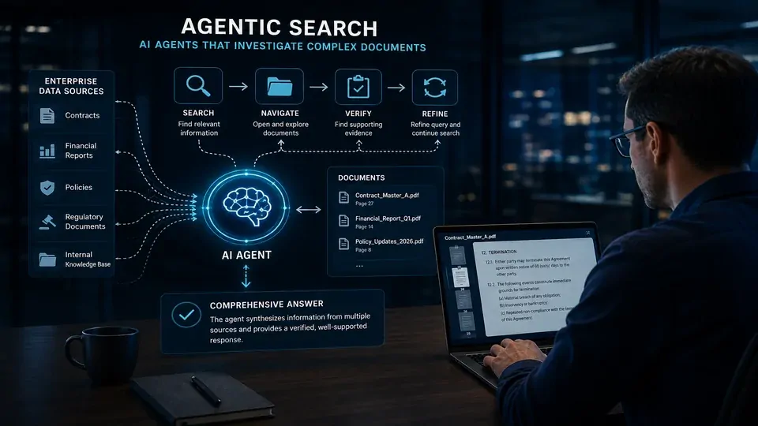
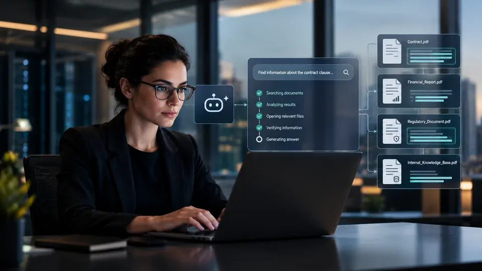
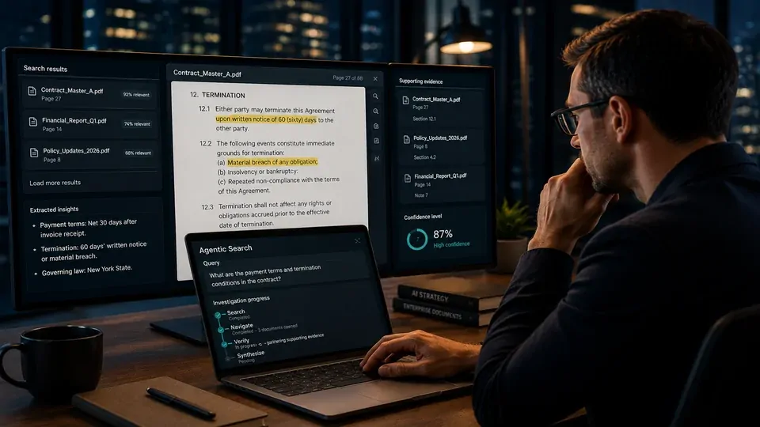

*A Mistral está levando a disputa pela IA empresarial para uma camada menos visível, mas decisiva: a capacidade de encontrar e verificar conhecimento dentro de documentos complexos. Com o Agentic Search, a empresa aposta que agentes de IA precisam fazer mais do que recuperar um trecho relevante antes de responder.*

## Mistral transforma a busca em uma etapa de investigação

A **Mistral** lançou o **Agentic Search** para permitir que agentes de IA pesquisem, naveguem e verifiquem informações dentro de documentos complexos. A proposta amplia o modelo tradicional de recuperação ao permitir que o agente faça novas buscas quando os primeiros resultados não são suficientes.

### A busca deixa de ser uma etapa única

Em uma arquitetura convencional de **RAG**, o sistema procura informações relevantes em uma base de conhecimento e entrega os trechos recuperados ao modelo. O modelo utiliza esse contexto para gerar a resposta.

O **Agentic Search** acrescenta uma camada de investigação. O agente pode realizar uma pesquisa, abrir um resultado, navegar pelo documento, procurar termos específicos e voltar à busca quando identifica que ainda precisa de informações.

### O objetivo é encontrar evidências melhores

A diferença é importante porque documentos empresariais nem sempre concentram a resposta em um único parágrafo. Uma informação financeira pode depender de uma tabela e de uma nota explicativa. Um contrato pode apresentar uma regra em uma seção e uma exceção em outra.

Nesse cenário, recuperar apenas o trecho mais parecido semanticamente com a pergunta pode não ser suficiente. A busca agentiva tenta fazer com que o próprio agente continue investigando a fonte.

## Documentos complexos se tornaram um gargalo da IA empresarial

*Documentos empresariais podem exigir que agentes encontrem informações distribuídas em diferentes trechos antes de formular uma resposta.*

### O problema não está apenas no modelo

Empresas estão colocando **IA** em processos que dependem de contratos, relatórios, documentos regulatórios e bases internas. Nesses ambientes, um modelo mais poderoso não resolve sozinho o problema se o contexto entregue ao sistema estiver incompleto.

A qualidade da resposta depende também da qualidade da informação recuperada. Se um agente não encontrar uma exceção relevante ou ignorar uma parte importante do documento, seu raciocínio poderá partir de uma premissa errada.

### A Mistral apresenta ganhos em seus testes

A **Mistral** afirma que o Agentic Search apresentou melhorias em avaliações envolvendo documentos financeiros e tarefas de perguntas e respostas sobre documentos. No FinanceBench, a empresa relata uma evolução de cerca de 27% para 86% de precisão em sua avaliação.

O número deve ser interpretado como resultado divulgado pela própria Mistral, e não como uma garantia de desempenho em qualquer ambiente corporativo. Ainda assim, ele demonstra a tese do produto: em determinadas tarefas, melhorar a recuperação pode produzir um efeito significativo sobre a resposta final.

## A mudança coloca o RAG dentro de uma arquitetura mais inteligente

A busca agentiva não elimina o **RAG**. Ela adiciona uma camada de orquestração capaz de decidir como pesquisar e quando continuar investigando uma fonte.

### Recuperação semântica continua importante

Sistemas corporativos ainda podem utilizar busca por palavras-chave, recuperação semântica ou estratégias híbridas. Essas técnicas continuam responsáveis por localizar candidatos relevantes dentro das bases de conhecimento.

O diferencial está no que acontece depois. Em vez de assumir que os primeiros resultados são suficientes, o agente pode utilizar as informações recuperadas para definir sua próxima ação.

### O agente ganha capacidade de verificar o contexto

Essa mudança aproxima a recuperação documental do próprio processo de raciocínio do agente. A pergunta deixa de ser apenas "qual trecho parece relevante?" e passa a incluir "o que ainda preciso encontrar para responder corretamente?".

Para aplicações corporativas, isso pode reduzir situações em que uma resposta parece plausível, mas foi construída com contexto incompleto. A recuperação passa a participar diretamente da qualidade da decisão do agente.

## Mistral amplia sua aposta na infraestrutura de IA para empresas

*A estratégia da Mistral coloca modelos, ferramentas e recuperação de conhecimento dentro de uma arquitetura integrada para aplicações empresariais.*

### A empresa não está disputando apenas modelos

O lançamento reforça uma estratégia mais ampla da **Mistral** no mercado corporativo. A empresa vem construindo uma oferta que envolve modelos de IA, ferramentas para desenvolvedores e infraestrutura para aplicações empresariais.

O **Agentic Search** amplia esse posicionamento porque funciona como uma capacidade que pode ser incorporada aos agentes, em vez de depender de uma interface específica de chatbot.

### Recuperação passa a ser infraestrutura

A consequência estratégica é que empresas precisam olhar para mais componentes da arquitetura de IA. O modelo continua sendo importante, mas ele é apenas uma parte de um sistema que também precisa lidar com documentos, bases de conhecimento, ferramentas, permissões e integrações.

Esse movimento também se relaciona ao avanço de protocolos e ferramentas destinados a conectar agentes a sistemas externos. O objetivo deixa de ser apenas responder perguntas e passa a ser permitir que o agente encontre informações e execute tarefas dentro do ambiente corporativo.

## O lançamento se conecta ao problema de transformar documentos em conhecimento

A busca agentiva resolve apenas uma parte do problema. Antes de pesquisar uma informação, a empresa precisa garantir que seus documentos possam ser processados e utilizados corretamente pelos sistemas de IA.

### OCR é uma camada anterior

Esse desafio já aparece em iniciativas da própria **Mistral** voltadas ao processamento documental. A empresa desenvolveu tecnologias de OCR para transformar documentos complexos em informação que possa ser utilizada por modelos e aplicações de IA.

O **Mistral OCR 4.1**, por exemplo, está relacionado a essa etapa anterior da cadeia. O processamento transforma o conteúdo dos documentos em uma estrutura que pode posteriormente ser indexada e recuperada. Para entender melhor esse gargalo, o Notícia Tech já analisou como o Mistral OCR 4.1 tenta melhorar o uso de documentos por sistemas de IA nas empresas: **[Mistral OCR 4.1 e o gargalo da IA nas empresas](https://noticiatech.com.br/inteligencia-artificial/mistral-ocr-41-gargalo-ia-empresas/)**.

O lançamento do Agentic Search mostra a evolução seguinte: depois de tornar o documento acessível para a IA, o sistema precisa conseguir encontrar e verificar a informação correta.

### O conhecimento corporativo precisa de contexto

Isso aumenta a importância da arquitetura de conhecimento dentro das empresas. Não basta armazenar milhares de documentos e conectá-los a um chatbot.

É necessário estabelecer quais fontes podem ser consultadas, como elas são atualizadas, quais usuários possuem acesso e como o agente deve lidar com informações conflitantes ou incompletas.

Esse problema será cada vez mais importante à medida que empresas avançarem na adoção de **agentes de IA** capazes de atuar sobre processos reais.

## O próximo desafio será provar o valor em ambientes corporativos

*A capacidade de verificar informações em múltiplas etapas pode se tornar importante para agentes utilizados em processos empresariais críticos.*

### Benchmarks não substituem a operação real

Os resultados apresentados pela **Mistral** ajudam a explicar a proposta, mas a adoção empresarial dependerá de fatores que benchmarks não conseguem representar completamente.

Custo, latência, segurança, qualidade dos documentos, integração com sistemas existentes e controle de acesso serão determinantes para definir se a busca agentiva realmente entrega vantagem operacional.

### A recuperação pode se tornar um diferencial estratégico

O movimento da **Mistral** aponta para uma mudança importante na arquitetura da IA empresarial. À medida que os agentes passam a trabalhar com documentos reais, a capacidade de recuperar informação corretamente deixa de ser uma função auxiliar e passa a influenciar diretamente a qualidade das respostas e decisões.

Esse cenário também aumenta a importância de arquiteturas capazes de combinar modelos, dados e ferramentas. O debate sobre **arquitetura de IA empresarial** deixa, portanto, de se concentrar exclusivamente no modelo utilizado e passa a envolver a forma como o sistema acessa o conhecimento da organização. Para aprofundar essa relação entre **RAG, agentes, MCP e arquitetura empresarial**, o Notícia Tech já publicou um guia específico sobre **[arquitetura de IA empresarial com RAG, MCP e agentes](https://noticiatech.com.br/inteligencia-artificial/arquitetura-ia-empresarial-mcp-rag-agentes-workflows-copilotos-apis/)**.

O Agentic Search é uma aposta concreta nessa direção. Se a abordagem ganhar escala, a próxima disputa da IA empresarial poderá acontecer menos na capacidade de gerar uma resposta e mais na capacidade de encontrar, verificar e contextualizar a informação que sustenta essa resposta.