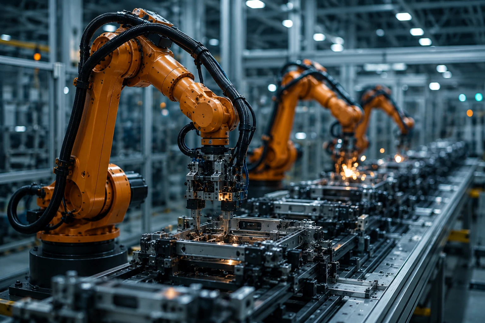
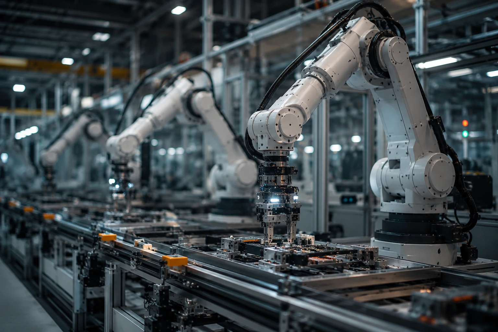
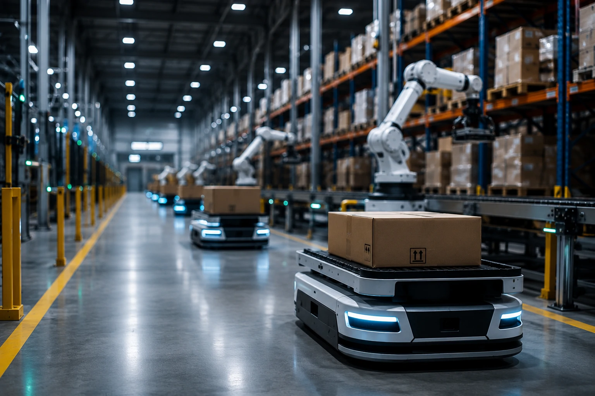

*Durante os últimos anos, a disputa entre empresas de inteligência artificial ficou concentrada em chatbots e modelos de linguagem. Agora, um novo movimento mostra que a próxima fronteira está nas fábricas, centros logísticos e robôs capazes de executar tarefas no mundo real.*

## A Mistral leva sua inteligência artificial para a robótica industrial

*Robôs inteligentes passam a representar uma nova etapa da competição entre empresas de IA.*

A **Mistral AI** anunciou seu primeiro modelo dedicado à robótica, sinalizando uma mudança estratégica importante para a empresa francesa. Até então conhecida por desenvolver grandes modelos de linguagem para competir com **OpenAI**, **Anthropic** e **Google**, a companhia agora amplia seu foco para aplicações físicas da inteligência artificial.

O lançamento acontece após a aquisição da startup **Emmi AI**, especializada em modelos para controle de robôs e sistemas industriais. Com isso, a empresa passa a atuar em um segmento conhecido como **Physical AI**, que busca integrar inteligência artificial diretamente em máquinas capazes de interagir com o ambiente.

Essa mudança representa mais do que um novo produto. Ela indica que a próxima fase da corrida pela inteligência artificial poderá acontecer dentro de fábricas, centros de distribuição e linhas de produção, onde robôs inteligentes assumem atividades cada vez mais complexas.

### Da IA generativa para a IA física

Enquanto os modelos tradicionais produzem textos, imagens e códigos, os sistemas de **Physical AI** interpretam sensores, câmeras e movimentos para executar tarefas no mundo real.

### Um mercado em rápida expansão

Especialistas apontam que a robótica inteligente deve se tornar um dos segmentos mais relevantes da IA corporativa ao longo desta década, impulsionada pela necessidade de aumentar produtividade e reduzir custos operacionais.

## A disputa pela automação industrial entra em uma nova fase

*Automação inteligente passa a combinar modelos generativos com robôs industriais.*

A entrada da **Mistral** fortalece um movimento observado nos últimos meses: as principais empresas de inteligência artificial estão deixando de competir apenas por modelos de linguagem para investir em plataformas completas de automação.

Esse cenário aproxima a empresa de iniciativas desenvolvidas por organizações como **NVIDIA**, que investe em infraestrutura para robótica, e também amplia a competição indireta com **OpenAI** e **Google**, que vêm explorando agentes capazes de executar tarefas complexas.

Na prática, a tendência mostra que o valor da IA deixa de estar apenas na geração de conteúdo e passa a incluir a execução de processos físicos, aproximando softwares inteligentes de equipamentos industriais.

Empresas que acompanham essa transformação também podem entender melhor como a infraestrutura vem evoluindo no artigo sobre a estratégia full stack da **Mistral**:

https://noticiatech.com.br/inteligencia-artificial/mistral-ai-estrategia-full-stack-infraestrutura-agentes-ia/

Além disso, a evolução dos agentes inteligentes ajuda a explicar por que modelos capazes de tomar decisões estão ganhando importância nas operações empresariais:

https://noticiatech.com.br/inteligencia-artificial/agentic-ai-foundation-openai-anthropic-block-padrao-agentes-ia/

## Como a robótica com IA pode transformar as empresas

*Robôs inteligentes prometem aumentar eficiência, reduzir desperdícios e operar ao lado de trabalhadores humanos.*

A **robótica com inteligência artificial** promete transformar operações industriais ao combinar percepção, tomada de decisão e automação em uma única plataforma. Diferentemente dos robôs programados para repetir movimentos fixos, os novos sistemas conseguem interpretar mudanças no ambiente e adaptar seu comportamento.

Essa capacidade torna a tecnologia especialmente relevante para setores como manufatura, logística, mineração, energia e agronegócio, onde processos variam constantemente e exigem decisões em tempo real.

Ao integrar modelos de IA diretamente aos robôs, empresas poderão reduzir o tempo necessário para configurar novas tarefas, melhorar a qualidade das operações e aumentar a flexibilidade da produção.

### Aplicações que já começam a surgir

Entre os principais casos de uso estão:

- inspeção automatizada de equipamentos;
- separação inteligente de produtos em centros logísticos;
- montagem industrial assistida por IA;
- movimentação autônoma de materiais;
- controle de qualidade por visão computacional.

Essas aplicações mostram que a IA deixa de ser apenas uma ferramenta de apoio administrativo para atuar diretamente na execução das operações.

### O desafio deixa de ser apenas criar modelos melhores

Nos próximos anos, a vantagem competitiva poderá estar na capacidade de integrar inteligência artificial, sensores, robôs e infraestrutura computacional em uma plataforma única, reduzindo o tempo entre análise e execução.

## O mercado de IA entra definitivamente na era da automação física

A chegada da **Mistral** ao segmento de robótica reforça que a competição entre empresas de inteligência artificial está mudando de patamar. Em vez de disputar apenas quem possui o chatbot mais avançado, as empresas passam a competir pela capacidade de automatizar processos completos no mundo físico.

Esse movimento também amplia o conceito de agentes inteligentes. Se hoje eles já executam tarefas digitais, como produzir documentos ou analisar dados, o próximo passo será controlar equipamentos capazes de agir no ambiente real.

Para organizações que acompanham a evolução da inteligência artificial, isso representa uma mudança estratégica. A escolha da plataforma de IA deixará de considerar apenas qualidade do modelo ou custo da assinatura e passará a incluir integração com infraestrutura industrial, automação operacional e capacidade de conectar softwares a máquinas.

A tendência indica que a próxima fase da transformação digital será marcada pela convergência entre **inteligência artificial**, **robótica** e **automação industrial**. Empresas que iniciarem essa preparação desde agora poderão reduzir barreiras de adoção e aproveitar com mais rapidez as oportunidades criadas pela nova geração de sistemas inteligentes.

---