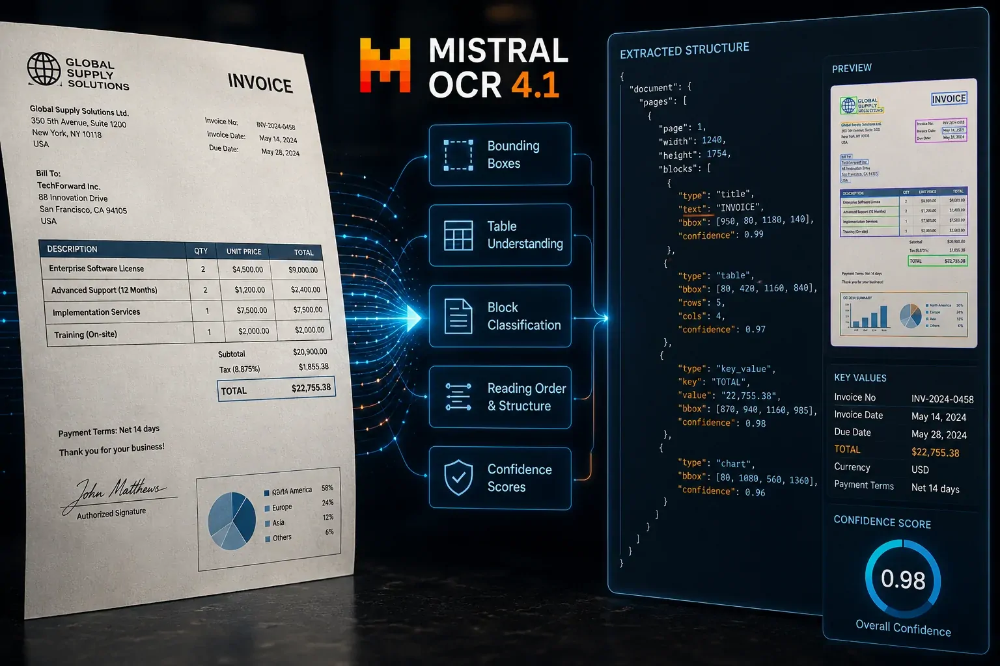
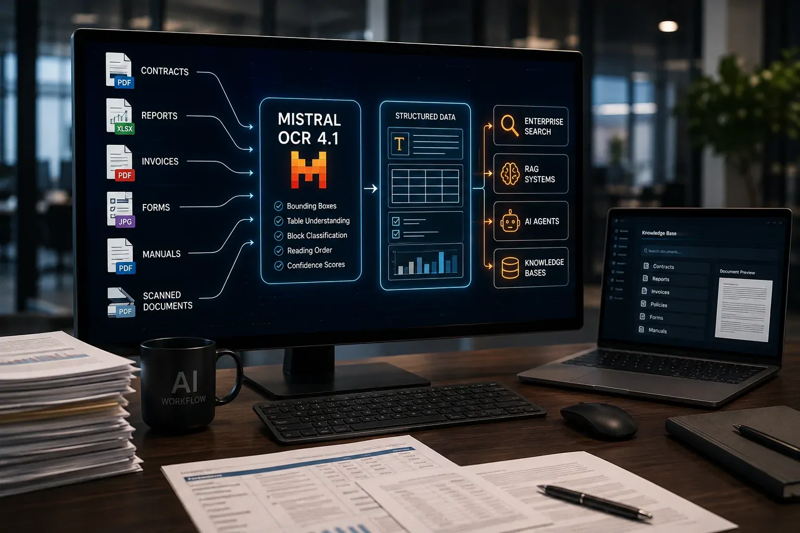
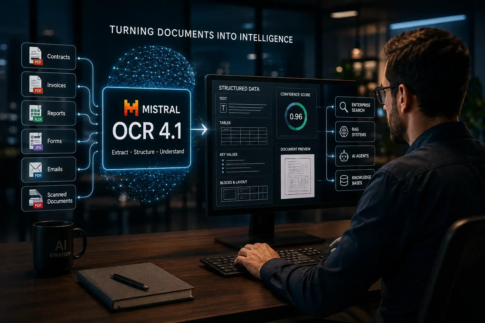

*Durante a corrida para colocar agentes e modelos de linguagem dentro das empresas, existe uma etapa menos visível que pode decidir se esses sistemas realmente funcionam: transformar documentos do mundo real em dados que a IA consiga compreender. É nesse ponto que a **Mistral AI** acaba de mexer novamente no mercado.*

## Mistral OCR 4.1 ataca um problema que aparece antes da resposta da IA

O **Mistral OCR 4.1** é uma atualização do OCR 4 lançada pela **Mistral AI** em 13 de agosto de 2026 para melhorar a compreensão de páginas complexas, especialmente documentos carregados de anotações, referências, tabelas e diferentes elementos visuais.

OCR significa reconhecimento óptico de caracteres. Em termos simples, é a tecnologia responsável por transformar aquilo que está em uma imagem ou documento digitalizado em informação que um computador consegue interpretar.

O problema é que a IA empresarial não trabalha apenas com textos limpos. Contratos, relatórios financeiros, notas fiscais, formulários, documentos técnicos e arquivos digitalizados podem misturar texto, tabelas, imagens, assinaturas, referências e elementos posicionados de maneiras diferentes na mesma página.

### O problema não é apenas ler as palavras

Uma aplicação corporativa precisa saber mais do que simplesmente identificar que determinada palavra apareceu em um documento.

Ela precisa entender **onde aquela informação está**, a qual bloco pertence, se faz parte de uma tabela, de uma referência, de um título ou de outro elemento estrutural. Essa diferença parece pequena, mas pode determinar se uma informação será recuperada corretamente por uma aplicação de IA.

O OCR 4 já havia avançado nessa direção ao fornecer **bounding boxes**, classificação estrutural de blocos e níveis de confiança. Uma bounding box é uma área delimitada por coordenadas que indica a posição de determinado elemento dentro da página.

A atualização 4.1 concentra esforços justamente nesse tipo de precisão. Segundo a Mistral, as caixas passam a se alinhar melhor aos elementos em páginas complexas, sem o deslocamento observado anteriormente e sem estruturas de imagens aninhadas que poderiam complicar o processamento posterior.

### Por que isso importa para uma empresa?

Imagine uma companhia que possui milhares de contratos digitalizados. Um sistema de IA pode até conseguir extrair o texto desses arquivos, mas isso não significa que a informação esteja pronta para alimentar uma busca corporativa ou um agente.

Se uma tabela for interpretada de maneira incorreta, uma referência estiver associada ao bloco errado ou uma informação localizada em uma anotação desaparecer durante a extração, o problema será propagado para as etapas seguintes.

É por isso que o avanço do **Mistral OCR 4.1** é mais relevante do que parece. A Mistral está tentando melhorar uma camada que fica antes do modelo de linguagem: a transformação do conteúdo bruto em informação estruturada.

Esse movimento também ajuda a explicar por que a empresa vem tratando processamento documental como parte da infraestrutura da IA empresarial, e não simplesmente como uma função secundária de reconhecimento de texto.

## O OCR 4.1 melhora justamente onde documentos reais costumam falhar

O **Mistral OCR 4.1** foi projetado para reduzir erros estruturais em documentos complexos, preservando melhor a relação entre os diferentes elementos existentes em uma página.

*O Mistral OCR 4.1 busca preservar a estrutura de documentos complexos para que sistemas de IA consigam utilizar as informações com maior precisão.*

O lançamento não representa uma ruptura completa em relação ao OCR 4. A estratégia é mais específica: corrigir pontos que aparecem quando o modelo precisa lidar com páginas visualmente carregadas e manter a evolução da tecnologia voltada para aplicações de **Document AI**, busca e automação empresarial.

### Referências, blocos e caixas de seleção entram no foco

Entre as melhorias anunciadas estão mudanças na forma como páginas de referências são estruturadas. Em vez de tratar uma lista inteira como um único bloco, o sistema passa a preservar melhor os elementos individuais de cada referência.

O modelo também passa a perder menos blocos em páginas complexas. Isso é relevante porque um documento empresarial pode conter informações distribuídas entre diferentes regiões, e a ausência de apenas uma parte pode comprometer uma extração posterior.

Outro avanço está no reconhecimento de diferentes estilos de **checkboxes**, recurso especialmente útil em formulários, processos administrativos e documentos que utilizam campos marcados visualmente.

A Mistral também afirma ter melhorado a interpretação de tabelas com leitura da direita para a esquerda. Esse tipo de capacidade é importante para documentos multilíngues e para organizações que trabalham com mercados em diferentes regiões.

### A mudança mais importante acontece depois do OCR

O ponto estratégico é que o valor de um OCR moderno não termina quando o texto é extraído.

Esse conteúdo pode ser enviado para um sistema **RAG**, tecnologia que combina um modelo de linguagem com uma camada de busca em documentos externos. Em uma empresa, isso permite que uma IA responda utilizando contratos, políticas internas, manuais, relatórios ou outros documentos como fonte.

Para entender melhor essa arquitetura, o Notícia Tech já publicou um conteúdo específico sobre **[RAG e arquitetura de IA empresarial](https://noticiatech.com.br/inteligencia-artificial/arquitetura-ia-empresarial-rag-mcp-agentes-automacao-copilotos/)**, incluindo a relação entre recuperação de informações, agentes e automação.

O próprio **Mistral OCR 4** foi apresentado pela empresa como componente de ingestão para busca empresarial, RAG e fluxos com agentes. O modelo também passou a fornecer classificação de blocos, caixas de delimitação e níveis de confiança, justamente para tornar o conteúdo mais útil às etapas seguintes do pipeline de IA.

Essa arquitetura muda a forma de enxergar o problema: **uma IA pode ter um modelo excelente e ainda assim entregar respostas ruins se a informação que chega até ela estiver incompleta ou mal estruturada**.

## A disputa pela IA empresarial começa cada vez mais antes do modelo

A principal consequência do lançamento é que a competição em **IA empresarial** está avançando para uma camada menos visível: a qualidade da informação que alimenta os modelos.

Durante muito tempo, a atenção do mercado ficou concentrada em quem tinha o melhor modelo de linguagem, maior contexto ou menor custo de inferência. Agora, conforme as empresas conectam IA aos próprios documentos, a capacidade de transformar dados não estruturados em informação utilizável passa a ter peso semelhante.

### Documentos são o combustível de muitos projetos corporativos

Uma empresa pode ter um modelo de linguagem sofisticado, mas grande parte do conhecimento necessário para responder às perguntas dos funcionários ou executar processos ainda pode estar espalhada em PDFs, contratos, planilhas, apresentações, formulários e documentos digitalizados.

Esse conteúdo precisa passar por uma etapa de ingestão antes de chegar ao sistema de busca ou ao agente. Se essa etapa produzir dados incompletos, o erro pode aparecer mais tarde como uma resposta aparentemente convincente, mas baseada em informação defeituosa.

Por isso, a evolução do OCR se conecta diretamente à qualidade do **RAG**, da busca corporativa e dos agentes de IA.

O movimento da **Mistral AI** também ganha contexto diante da estratégia mais ampla da empresa para infraestrutura de IA na Europa. O **Notícia Tech** já mostrou como a Mistral vem ampliando sua aposta em infraestrutura própria e capacidade computacional para sustentar a expansão de seus serviços de IA.

### O verdadeiro gargalo pode estar na entrada dos dados

Esse cenário cria uma mudança importante para gestores. Ao avaliar um projeto de IA, não basta perguntar qual modelo será utilizado.

Também é necessário perguntar **como os documentos serão processados, quanto dessa informação será preservada, como tabelas e estruturas serão interpretadas e como os dados chegarão ao sistema de busca ou ao agente**.

O OCR 4.1 mostra justamente essa mudança de perspectiva. A inteligência artificial empresarial não é formada apenas pelo modelo que produz a resposta. Existe uma cadeia anterior de captura, extração, estruturação, indexação e recuperação.

Nos próximos meses, essa camada tende a ganhar ainda mais importância à medida que empresas deixarem de experimentar chatbots isolados e começarem a conectar **agentes de IA** aos documentos e processos que sustentam suas operações.

## O lançamento coloca pressão sobre a camada de dados da IA empresarial

O avanço do Mistral OCR 4.1 acontece em um momento em que as empresas estão tentando transformar seus próprios documentos em fontes de conhecimento para sistemas de inteligência artificial.

Isso muda a importância do OCR. Ele deixa de ser apenas uma ferramenta para digitalizar documentos e passa a funcionar como uma espécie de porta de entrada para aplicações de IA.

Quando um contrato, relatório ou formulário é convertido corretamente, o conteúdo pode seguir para mecanismos de busca, bancos de dados, sistemas RAG e agentes. Quando a estrutura é perdida nessa etapa, os problemas podem aparecer mais adiante, inclusive em respostas geradas por modelos de linguagem.

A atualização da Mistral reforça justamente essa disputa pela qualidade da ingestão documental.

### RAG depende da qualidade do que consegue recuperar

RAG é uma arquitetura na qual o modelo de IA consulta informações externas antes de formular uma resposta. Em uma empresa, essas fontes podem ser documentos internos, políticas, contratos ou bases de conhecimento.

O processo parece simples, mas depende de várias etapas. Primeiro, os documentos precisam ser processados. Depois, o conteúdo precisa ser estruturado e indexado. Só então o sistema consegue localizar os trechos relevantes para uma determinada pergunta.

Isso significa que melhorar o OCR pode produzir efeitos muito além da própria leitura do documento.

Se uma tabela é preservada corretamente, por exemplo, a aplicação tem melhores condições de entender a relação entre seus valores e respectivos cabeçalhos. Se referências são separadas corretamente, torna-se mais fácil recuperar exatamente o trecho necessário.

O OCR 4.1 não resolve sozinho todos os problemas de um sistema RAG, mas atua em uma etapa que pode determinar a qualidade das etapas seguintes.

## Empresas podem ganhar uma nova camada para automatizar documentos

O impacto potencial fica mais claro quando se observa onde documentos aparecem nos processos corporativos.

*Documentos corporativos podem alimentar sistemas de busca, RAG e agentes depois de passarem por uma camada de extração e estruturação.*

Uma empresa pode receber centenas ou milhares de documentos todos os meses. Parte deles chega em formatos digitais, enquanto outra parte pode ser digitalizada, conter tabelas complexas ou apresentar estruturas que não foram projetadas originalmente para serem interpretadas por máquinas.

Até agora, muitas iniciativas de automação precisavam combinar diferentes ferramentas para lidar com esse problema.

Um OCR identifica o texto. Outro componente tenta reconstruir a estrutura. Depois, uma aplicação precisa organizar os dados para que possam ser pesquisados ou enviados a um modelo de linguagem.

Quanto mais etapas existirem, maior pode ser a possibilidade de perda de informação.

### Onde o ganho pode aparecer na prática

Em departamentos financeiros, a tecnologia pode ajudar a transformar documentos contábeis e relatórios em dados mais estruturados.

Em áreas jurídicas, pode facilitar a ingestão de contratos e documentos com grande quantidade de referências.

Em operações, pode contribuir para processar formulários, manuais e registros internos.

Em atendimento e suporte, documentos processados podem alimentar uma base de conhecimento utilizada por sistemas de busca ou agentes.

Isso não significa que o OCR 4.1 vá automatizar sozinho esses processos. A tecnologia é uma peça de uma arquitetura maior.

O ganho potencial está em tornar essa primeira etapa mais confiável para que outras ferramentas possam trabalhar sobre uma representação mais próxima do documento original.

## O que muda para quem está construindo IA dentro das empresas

O lançamento também traz uma consequência estratégica para profissionais de tecnologia.

Projetos de IA corporativa costumam começar pela escolha do modelo. A empresa compara desempenho, contexto, custo e capacidade de raciocínio e então decide qual LLM utilizar.

Mas, quando o sistema depende de documentos internos, essa escolha representa apenas uma parte da arquitetura.

O caminho completo pode envolver armazenamento, OCR, classificação, indexação, recuperação, modelo de linguagem, ferramentas externas e, cada vez mais, agentes capazes de executar ações.

Nesse cenário, um modelo excelente não consegue compensar indefinidamente uma camada de dados ruim.

### A avaliação precisa sair do modelo e chegar ao pipeline

O Mistral OCR 4.1 reforça uma tendência que deve ganhar importância: empresas precisarão avaliar a cadeia completa de processamento.

Isso significa medir não apenas a qualidade da resposta final, mas também questões como:

- quanto conteúdo foi extraído corretamente;
- se tabelas mantiveram sua estrutura;
- se referências continuam associadas aos elementos corretos;
- se informações importantes foram perdidas;
- se a posição dos elementos pode ser rastreada;
- e se os dados extraídos podem ser utilizados com segurança pela aplicação.

Essa mudança é especialmente importante em setores nos quais um erro documental pode produzir consequências financeiras, jurídicas ou operacionais.

O OCR, portanto, passa a fazer parte da discussão de **governança de IA**. Governança significa estabelecer controles para garantir que sistemas de inteligência artificial sejam utilizados de maneira segura, rastreável e compatível com as regras da organização.

## A Mistral transforma uma melhoria de OCR em uma disputa maior

O lançamento do OCR 4.1 também mostra como a competição entre empresas de IA está se expandindo.

A disputa não acontece somente entre modelos que conversam com usuários. Ela também envolve componentes especializados que ficam escondidos dentro das aplicações.

OCR, embeddings, bancos vetoriais, mecanismos de recuperação e ferramentas de agentes são exemplos de camadas que podem determinar a qualidade de uma solução empresarial mesmo quando o usuário final nunca interage diretamente com elas.

A estratégia da Mistral é particularmente relevante porque a empresa vem posicionando suas tecnologias documentais como componentes para aplicações empresariais, e não apenas como ferramentas isoladas de reconhecimento de texto.

O próprio ecossistema de nuvem já trata modelos de OCR da Mistral como componentes de processamento de imagem e PDF para aplicações corporativas.

### O preço continua sendo parte da decisão

Existe, porém, uma questão que empresas precisarão analisar além da precisão.

Processar grandes volumes de documentos custa dinheiro. Em aplicações corporativas, o custo de OCR precisa ser considerado junto com armazenamento, embeddings, busca, inferência do modelo e infraestrutura.

Isso significa que uma melhoria de precisão não torna automaticamente uma tecnologia a melhor escolha para todos os projetos.

O cálculo real será determinado pelo equilíbrio entre **qualidade, custo, velocidade, privacidade e capacidade de implantação**.

Esse ponto é importante porque a própria comunidade de usuários da Mistral registrou que os preços da API de OCR foram elevados anteriormente em 2026, enquanto o OCR 3 continuou disponível por um preço menor.

Para uma pequena empresa que processa poucos documentos, essa diferença pode ter pouco peso. Para uma organização que precisa processar milhões de páginas, o custo por mil páginas pode alterar completamente a decisão de arquitetura.

## O próximo gargalo da IA pode ser aquilo que os modelos ainda não conseguem ler direito

O Mistral OCR 4.1 chega com uma mensagem que vai além da atualização técnica: **a qualidade da inteligência artificial depende cada vez mais da qualidade dos dados que chegam até ela**.

*À medida que agentes passam a operar sobre documentos corporativos, a qualidade da camada de ingestão se torna parte importante da confiabilidade do sistema.*

Essa tendência deve ganhar força nos próximos meses.

Empresas que hoje experimentam chatbots podem avançar para sistemas capazes de consultar documentos internos. Depois, esses sistemas podem evoluir para agentes que não apenas encontram informações, mas executam tarefas com base nelas.

Quanto maior essa autonomia, maior será o impacto de um erro cometido na etapa inicial.

Se um chatbot responde incorretamente sobre um documento, o usuário pode perceber e corrigir. Se um agente interpreta incorretamente uma cláusula, um valor financeiro ou uma informação operacional e depois executa uma ação automaticamente, o problema pode assumir outra dimensão.

Por isso, o avanço do OCR acompanha uma transformação maior na arquitetura empresarial de IA.

A próxima geração de aplicações não dependerá apenas de modelos capazes de raciocinar. Ela dependerá de sistemas capazes de **ler, estruturar, recuperar, verificar e utilizar informações do mundo real**.

É nesse ponto que o Mistral OCR 4.1 se torna relevante.

A atualização não elimina o gargalo documental, nem significa que documentos empresariais passaram a ser perfeitamente compreendidos por máquinas. O que muda é a tentativa de reduzir uma das fontes de perda de informação que aparecem antes da IA propriamente dita.

Para empresas, a consequência é direta: projetos de IA precisam olhar cada vez menos para o modelo isoladamente e cada vez mais para o caminho completo percorrido pelos dados.

A corrida pela IA empresarial pode, portanto, estar entrando em uma fase em que **quem conseguir transformar documentos complexos em informação confiável terá uma vantagem tão importante quanto quem possui o modelo mais poderoso**.

---