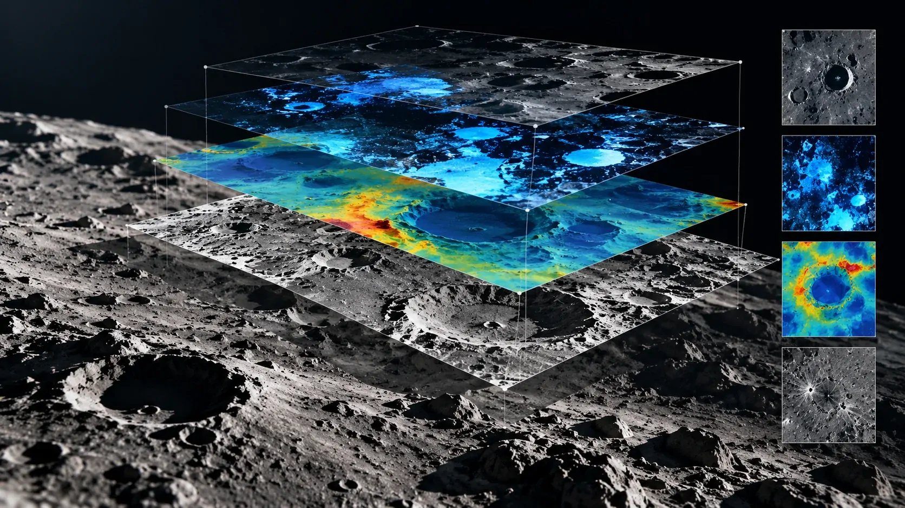
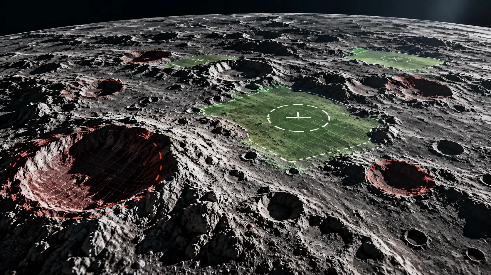
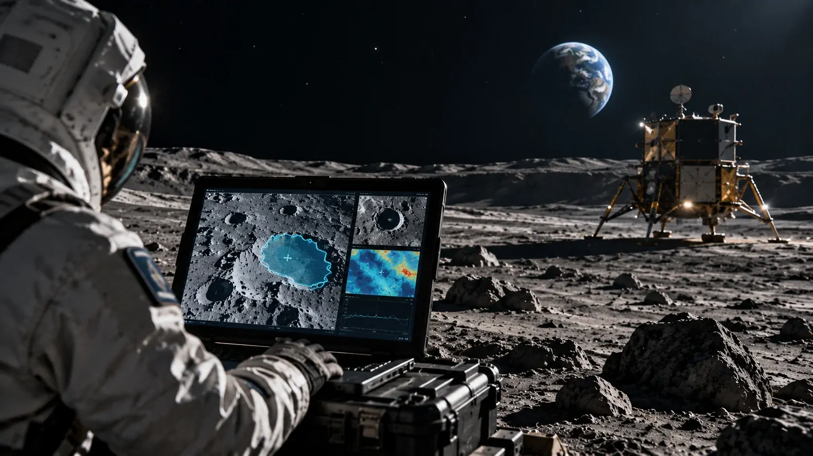

*Uma nova IA criada por NASA e IBM está transformando diferentes conjuntos de observações lunares em uma ferramenta capaz de localizar possíveis áreas com gelo, mapear crateras e analisar características importantes para futuras missões.*

# NASA e IBM criam IA capaz de encontrar gelo e identificar locais de pouso na Lua

A **NASA** e a **IBM** lançaram um modelo aberto de inteligência artificial criado para analisar grandes volumes de dados científicos da Lua. Chamado **NASA-IBM Lunar Foundation Model**, o sistema consegue combinar informações de diferentes instrumentos para identificar características do terreno, incluindo possíveis depósitos de gelo, crateras e formações vulcânicas.

A novidade resolve um problema que vai além de simplesmente produzir novas imagens da Lua. O satélite já foi observado durante décadas por diferentes missões, mas esses dados possuem formatos, escalas e resoluções distintas. A IA foi desenvolvida para transformar esse material heterogêneo em uma representação que possa ser reutilizada em diferentes tarefas científicas.

Nos testes divulgados pela **NASA** e pela **IBM**, o modelo apresentou ganhos de desempenho de até **23%** em determinadas tarefas de mapeamento. Entre as aplicações está a identificação de regiões com potencial para conter gelo e o mapeamento de crateras que podem ser relevantes para o planejamento de futuras missões.

## O que a nova IA da NASA e IBM consegue fazer

O **NASA-IBM Lunar Foundation Model** é um modelo de base que pode ser adaptado para diferentes tarefas de análise científica da Lua. Em vez de criar uma inteligência artificial independente para cada problema, pesquisadores podem partir de uma mesma representação dos dados lunares.

### Uma IA preparada para diferentes tarefas

O modelo foi desenvolvido para compreender relações entre diferentes tipos de observação da superfície lunar. Isso permite que uma mesma infraestrutura seja utilizada em investigações com objetivos distintos.

Entre as primeiras aplicações estão o mapeamento de crateras, a identificação de formações vulcânicas e a análise de regiões com características compatíveis com a presença de gelo.

### O diferencial está na combinação de dados

Uma região lunar pode ser observada por diferentes instrumentos e apresentar informações sobre relevo, temperatura, composição ou propriedades geofísicas.

Ao combinar essas informações, o modelo consegue trabalhar com uma visão mais ampla do terreno. A vantagem não está apenas em reconhecer objetos em imagens, mas em relacionar diferentes evidências sobre uma mesma área.

Esse princípio também aparece em aplicações terrestres. Um exemplo publicado pelo **Notícia Tech** mostra como **[IA brasileira usa dados de satélites para prever secas rápidas](https://noticiatech.com.br/inteligencia-artificial/ia-brasileira-satelites-prever-secas-rapidas/)**, demonstrando como modelos de IA podem transformar grandes volumes de dados de sensoriamento remoto em informação utilizável.

## Como a IA consegue analisar tantos dados da Lua

*O modelo combina dados de diferentes instrumentos para criar uma representação integrada do terreno lunar.*

A capacidade do modelo depende de uma base de dados construída para colocar diferentes observações lunares em uma estrutura comum. O projeto reuniu mais de **30 camadas de dados espacialmente alinhadas**, provenientes de **nove instrumentos e quatro missões**.

### Mais de 30 camadas de informações

O conjunto utilizado pela **NASA** e pela **IBM** inclui dados de missões como o **Lunar Reconnaissance Orbiter (LRO)**, o **GRAIL** e a missão japonesa **SELENE/Kaguya**.

A combinação permite observar a mesma região lunar por perspectivas diferentes. Uma camada pode representar características topográficas, enquanto outra acrescenta informações sobre propriedades geofísicas ou condições da superfície.

### O desafio das diferentes resoluções

Os instrumentos não observam a Lua necessariamente na mesma escala. O **LRO**, por exemplo, produz imagens capazes de revelar detalhes muito menores do que conjuntos de dados utilizados para análises de escala mais ampla.

Para treinar o modelo, foram utilizados aproximadamente **2 milhões de blocos de imagens**, incluindo mais de 1 milhão de imagens de câmera em alta resolução e quase 964 mil imagens multiespectrais.

O resultado é uma infraestrutura de IA capaz de aprender relações entre dados que tradicionalmente precisariam ser processados por sistemas diferentes.

## Por que encontrar gelo na Lua é tão importante

Encontrar gelo na Lua é importante porque depósitos de água podem se transformar em um recurso estratégico para futuras operações humanas no satélite. O modelo tenta ajudar justamente na identificação das regiões onde essas condições podem ser mais favoráveis.

### Onde o gelo pode permanecer preservado

As regiões próximas aos polos lunares possuem áreas permanentemente sombreadas. Sem receber luz solar direta, algumas dessas áreas permanecem extremamente frias durante longos períodos.

Essas condições tornam determinadas regiões candidatas à preservação de gelo. O problema é que os mesmos ambientes também estão entre os mais difíceis de observar e estudar.

A IA pode cruzar diferentes características do terreno para indicar regiões que merecem investigação científica mais detalhada.

### Água pode se transformar em recurso estratégico

O interesse pelo gelo não está restrito ao abastecimento. A água pode ser separada em hidrogênio e oxigênio, criando possibilidades para futuras operações espaciais.

O oxigênio poderia ter utilização relacionada à sustentação de operações humanas, enquanto o hidrogênio e o oxigênio também podem ser considerados em estratégias de produção de propelente.

Isso significa que um mapa mais preciso de possíveis depósitos de gelo pode ter importância para o planejamento de longo prazo da exploração lunar.

## Como a IA pode ajudar a encontrar locais de pouso

*O mapeamento automatizado de crateras fornece uma camada adicional de informação para a avaliação do terreno lunar.*

A IA pode ajudar na identificação de locais de pouso ao mapear crateras e outras características do terreno que precisam ser consideradas antes de uma missão. O modelo não escolhe sozinho onde uma nave deve pousar, mas pode acelerar a análise das áreas candidatas.

### Crateras ajudam a avaliar o terreno

As crateras são uma das características mais comuns da superfície lunar. Além de serem importantes para compreender a história geológica do satélite, elas também precisam ser consideradas no planejamento de operações.

Uma área com grande concentração de crateras ou mudanças acentuadas no relevo pode apresentar desafios adicionais para uma missão.

Nos testes divulgados, o modelo conseguiu realizar tarefas de mapeamento de crateras em diferentes escalas e apresentou vantagem de aproximadamente **19%** sobre o modelo de referência em uma das avaliações.

### O papel da IA no planejamento de missão

O resultado não significa que a **NASA** esteja delegando à IA a decisão sobre onde pousar uma nave.

A contribuição está na capacidade de transformar rapidamente grandes conjuntos de observações em mapas e informações estruturadas. Esses resultados podem então ser utilizados por cientistas e engenheiros em análises mais amplas.

Quanto mais rapidamente uma equipe consegue identificar características relevantes do terreno, maior pode ser o número de regiões avaliadas antes de uma missão.

## O modelo também ajuda a entender a história da Lua

O projeto não se limita à procura de recursos. O mesmo modelo pode ser utilizado para estudar características geológicas e reconstruir aspectos da evolução da superfície lunar.

### Formações vulcânicas entram na análise

Entre os objetos analisados estão as chamadas **irregular mare patches**, formações associadas à atividade vulcânica lunar.

Essas estruturas são importantes para pesquisadores que tentam compreender como a Lua evoluiu ao longo de sua história.

Nos testes, o modelo conseguiu identificar essas formações mesmo trabalhando com conjuntos de dados que apresentavam rótulos imperfeitos.

### Uma mesma infraestrutura para diferentes pesquisas

A possibilidade de adaptar o modelo para tarefas diferentes é uma das características mais importantes do projeto.

Em vez de desenvolver uma IA completamente nova para cada investigação, pesquisadores podem utilizar a representação criada pelo modelo e ajustá-la para um novo problema.

Esse conceito aproxima a exploração espacial de uma tendência mais ampla da inteligência artificial: modelos de base começam a funcionar como infraestrutura reutilizável para diferentes aplicações.

A mesma lógica aparece em outras áreas da ciência. O **Google**, por exemplo, também vem utilizando IA para trabalhar com conjuntos científicos complexos, como mostra a análise sobre como **[Google usa IA para mapear os efeitos de 9 bilhões de mudanças no DNA](https://noticiatech.com.br/inteligencia-artificial/google-ia-mapa-prever-efeitos-9-bilhoes-mudancas-dna/)**.

## O que a IA lunar revela sobre a próxima fase da exploração espacial

*A inteligência artificial pode funcionar como uma camada de análise entre os dados coletados por missões lunares e as decisões científicas das próximas etapas da exploração.*

A principal consequência do projeto está na capacidade de transformar um enorme acervo de observações em uma ferramenta reutilizável para novas perguntas científicas.

### O gargalo passa a ser interpretar os dados

A **NASA** já acumulou uma quantidade gigantesca de informações sobre a Lua. Com novas missões previstas e novos instrumentos produzindo dados, a capacidade de interpretar esse material passa a ser tão importante quanto a própria coleta.

O modelo desenvolvido com a **IBM** tenta reduzir esse gargalo ao permitir que diferentes tipos de observação sejam analisados dentro de uma mesma estrutura.

Isso cria uma mudança importante na pesquisa espacial: a IA passa a atuar não apenas como ferramenta para uma tarefa específica, mas como infraestrutura para diferentes investigações.

### A Lua pode virar um laboratório para IA científica

O projeto também mostra como a inteligência artificial está avançando para além de aplicações em texto, imagens comerciais e programação.

Modelos de base podem ser treinados para compreender dados científicos complexos e depois adaptados para diferentes problemas.

Na exploração lunar, isso pode significar análises mais rápidas de crateras, identificação de regiões promissoras para investigação e novas formas de estudar a evolução geológica do satélite.

O **NASA-IBM Lunar Foundation Model** ainda não escolhe sozinho onde uma nave deve pousar e tampouco confirma automaticamente a existência de um depósito de gelo explorável. Seu papel é mais específico e, ao mesmo tempo, estratégico: transformar décadas de dados lunares em uma ferramenta que permite encontrar padrões e regiões de interesse com maior velocidade.

Para as próximas etapas da exploração espacial, essa capacidade pode reduzir o tempo entre a coleta de dados, a descoberta científica e a preparação de novas missões.

---